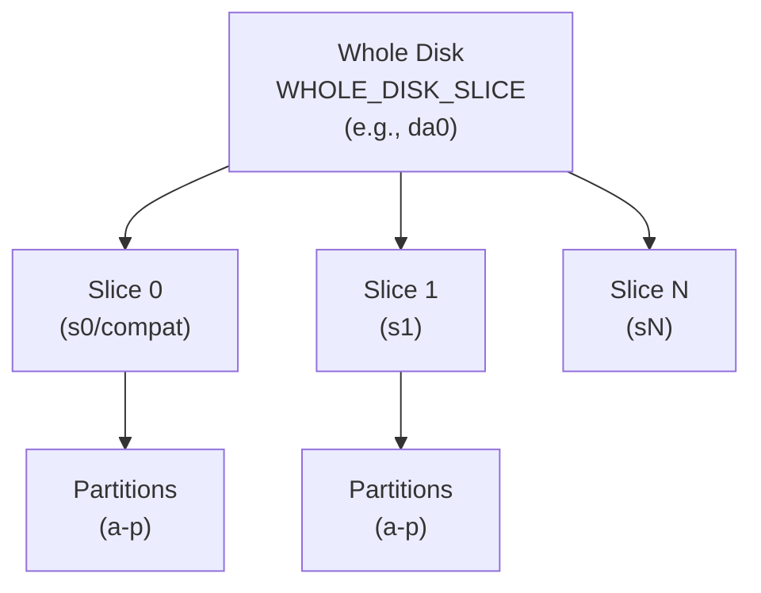

# Disk Subsystem

The disk subsystem provides a unified framework for managing block storage
devices, including disk registration, slice/partition handling, and I/O
routing. It bridges device drivers with the filesystem layer through a
multi-level abstraction: whole disk, slices (MBR/GPT partitions), and
BSD partitions (within slices).

**Source files:**
- `sys/kern/subr_disk.c` - Core disk management (~1,600 lines)
- `sys/kern/subr_diskslice.c` - Slice management (~900 lines)
- `sys/kern/subr_diskmbr.c` - MBR parsing (~560 lines)
- `sys/kern/subr_diskgpt.c` - GPT parsing (~240 lines)
- `sys/kern/subr_disklabel32.c` - BSD 32-bit disklabel (~660 lines)
- `sys/kern/subr_disklabel64.c` - BSD 64-bit disklabel (~540 lines)

**Header files:**
- `sys/sys/disk.h` - Disk structures
- `sys/sys/diskslice.h` - Slice structures and helpers

---

## Architecture Overview

The disk subsystem implements a three-level hierarchy:



### Device Naming

Disk devices follow a hierarchical naming scheme:

| Device      | Description                           |
|-------------|---------------------------------------|
| `da0`       | Whole disk (raw, no interpretation)   |
| `da0s0`     | Compatibility slice (MBR) or GPT s0   |
| `da0s1`     | First slice (MBR partition 1)         |
| `da0s1a`    | Partition 'a' within slice 1          |
| `da0s1c`    | Raw slice 1 (whole slice)             |

### Minor Number Encoding

Minor numbers encode unit, slice, and partition:

```c
/* sys/sys/diskslice.h:240-256 */
static __inline u_int32_t
dkmakeminor(u_int32_t unit, u_int32_t slice, u_int32_t part)
{
    u_int32_t val;
    val = ((unit & 0x001f) << 3) | ((unit & 0x01e0) << 16) |
          ((slice & 0x000f) << 16) | ((slice & 0x0070) << 25) |
          (part & 0x0007) | ((part & 0x0008) << 17) |
          ((part & 0x00F0) << 21);
    return(val);
}
```

**Bit layout (32 bits):**
```
| SL2 | PART3 |UNIT_2 |P| SLICE |  MAJOR?  |  UNIT   |PART |
```

---

## Core Data Structures

### struct disk

The primary structure representing a disk device:

```c
/* sys/sys/disk.h:132-148 */
struct disk {
    struct dev_ops      *d_dev_ops;     /* disk layer dev ops */
    struct dev_ops      *d_raw_ops;     /* raw device driver ops */
    u_int               d_flags;
    int                 d_opencount;    /* current open count */
    cdev_t              d_rawdev;       /* backing raw device */
    cdev_t              d_cdev;         /* whole-disk device */
    struct diskslices   *d_slice;       /* slice table */
    struct disk_info    d_info;         /* media parameters */
    const char          *d_disktype;    /* disk type string */
    LIST_ENTRY(disk)    d_list;         /* global disk list */
    kdmsg_iocom_t       d_iocom;        /* cluster import/export */
    int                 d_refs;         /* destruction interlock */
};
```

**Flags:**
- `DISKFLAG_LOCK` - Disk operations locked
- `DISKFLAG_WANTED` - Someone waiting for lock
- `DISKFLAG_MARKER` - Enumeration marker (not a real disk)

### struct disk_info

Media parameters provided by the device driver:

```c
/* sys/sys/disk.h:70-99 */
struct disk_info {
    u_int64_t   d_media_size;       /* media size in bytes */
    u_int64_t   d_media_blocks;     /* media size in sectors */
    int         d_media_blksize;    /* sector size (bytes) */
    u_int       d_dsflags;          /* management flags */
    
    /* Optional geometry (legacy CHS) */
    u_int       d_type;             /* DTYPE_xxx */
    u_int       d_nheads;
    u_int       d_ncylinders;
    u_int       d_secpertrack;
    u_int       d_secpercyl;
    u_int       d_trimflag;
    char        *d_serialno;        /* serial number string */
};
```

**DSO flags (`d_dsflags`):**

| Flag               | Value  | Description                          |
|--------------------|--------|--------------------------------------|
| `DSO_NOLABELS`     | 0x0001 | Don't probe for labels               |
| `DSO_ONESLICE`     | 0x0002 | Single slice only                    |
| `DSO_COMPATLABEL`  | 0x0004 | Create compatibility label if none   |
| `DSO_COMPATPARTA`  | 0x0008 | Create partition 'a' in compat label |
| `DSO_RAWEXTENSIONS`| 0x0020 | Allow raw partition extensions       |
| `DSO_MBRQUIET`     | 0x0040 | Silent MBR probe failures            |
| `DSO_DEVICEMAPPER` | 0x0080 | Device mapper (use "." separator)    |
| `DSO_RAWPSIZE`     | 0x0100 | Use raw device psize on failure      |

### struct diskslices

Container for all slices on a disk:

```c
/* sys/sys/diskslice.h:167-177 */
struct diskslices {
    struct cdevsw   *dss_cdevsw;        /* containing device switch */
    int             dss_first_bsd_slice; /* COMPATIBILITY_SLICE mapped here */
    u_int           dss_nslices;        /* actual number of slices */
    u_int           dss_oflags;         /* flags for first open */
    int             dss_secmult;        /* block-to-sector multiplier */
    int             dss_secshift;       /* block-to-sector shift (-1 if N/A) */
    int             dss_secsize;        /* sector size */
    struct diskslice dss_slices[MAX_SLICES];
};
```

### struct diskslice

Individual slice (MBR partition or GPT entry):

```c
/* sys/sys/diskslice.h:142-163 */
struct diskslice {
    cdev_t          ds_dev;             /* device for this slice */
    u_int64_t       ds_offset;          /* starting sector */
    u_int64_t       ds_size;            /* number of sectors */
    u_int32_t       ds_reserved;        /* reserved sectors (label area) */
    struct uuid     ds_type_uuid;       /* slice type UUID (GPT) */
    struct uuid     ds_stor_uuid;       /* storage UUID (GPT) */
    int             ds_type;            /* MBR partition type */
    int             ds_flags;           /* DSF_ flags */
    disklabel_t     ds_label;           /* BSD label (if present) */
    struct disklabel_ops *ds_ops;       /* label operations */
    void            *ds_devs[MAXPARTITIONS];
    u_int32_t       ds_openmask[DKMAXPARTITIONS/32];
    u_char          ds_wlabel;          /* label writable flag */
    int             ds_ttlopens;        /* total opens */
};
```

**Special slices:**

| Constant               | Value | Description               |
|------------------------|-------|---------------------------|
| `COMPATIBILITY_SLICE`  | 0     | Compatibility (s0)        |
| `WHOLE_DISK_SLICE`     | 1     | Entire disk               |
| `BASE_SLICE`           | 2     | First real slice (s1)     |
| `WHOLE_SLICE_PART`     | 255   | Entire slice partition    |

---

## Disk Registration and Lifecycle

### Creating a Disk

Device drivers register disks using `disk_create()`:

```c
/* sys/kern/subr_disk.c:664-765 */
cdev_t
disk_create(int unit, struct disk *dp, struct dev_ops *raw_ops)
{
    return _disk_create_named(NULL, unit, dp, raw_ops, 0);
}

static cdev_t
_disk_create_named(const char *name, int unit, struct disk *dp,
                   struct dev_ops *raw_ops, int clone)
{
    cdev_t rawdev;
    struct dev_ops *dops;

    /* Create raw device (no slice/partition interpretation) */
    if (name) {
        rawdev = make_only_dev(raw_ops, dkmakewholedisk(unit),
                               UID_ROOT, GID_OPERATOR, 0640, "%s", name);
    } else {
        rawdev = make_only_dev(raw_ops, dkmakewholedisk(unit),
                               UID_ROOT, GID_OPERATOR, 0640,
                               "%s%d", raw_ops->head.name, unit);
    }

    bzero(dp, sizeof(*dp));

    /* Select disk ops based on D_NOEMERGPGR flag */
    dops = (raw_ops->head.flags & D_NOEMERGPGR) ? &disk2_ops : &disk1_ops;

    dp->d_rawdev = rawdev;
    dp->d_raw_ops = raw_ops;
    dp->d_dev_ops = dops;

    /* Create covering device for slice/partition management */
    if (clone) {
        dp->d_cdev = make_only_dev_covering(...);
    } else {
        dp->d_cdev = make_dev_covering(...);
    }

    dp->d_cdev->si_disk = dp;

    /* Initialize I/O scheduling */
    dsched_disk_create(dp, name, unit);

    /* Add to global disk list */
    lwkt_gettoken(&disklist_token);
    LIST_INSERT_HEAD(&disklist, dp, d_list);
    lwkt_reltoken(&disklist_token);

    /* Initialize cluster support */
    disk_iocom_init(dp);

    return dp->d_rawdev;
}
```

### Setting Disk Information

After creating the disk, drivers provide media parameters:

```c
/* sys/kern/subr_disk.c:853-869 */
void
disk_setdiskinfo(struct disk *disk, struct disk_info *info)
{
    _setdiskinfo(disk, info);
    disk_msg_send(DISK_DISK_PROBE, disk, NULL);
}

static void
_setdiskinfo(struct disk *disk, struct disk_info *info)
{
    /* Copy info, duplicate serial number */
    bcopy(info, &disk->d_info, sizeof(disk->d_info));
    
    if (info->d_serialno && info->d_serialno[0]) {
        info->d_serialno = kstrdup(info->d_serialno, M_TEMP);
        disk_cleanserial(info->d_serialno);
        make_dev_alias(disk->d_cdev, "serno/%s", info->d_serialno);
    }
    
    /* Calculate size from blocks or vice versa */
    if (info->d_media_size == 0 && info->d_media_blocks) {
        info->d_media_size = (u_int64_t)info->d_media_blocks *
                             info->d_media_blksize;
    }
    
    dsched_disk_update(disk, info);
}
```

### Disk Message Thread

A dedicated kernel thread processes disk operations asynchronously:

```c
/* sys/kern/subr_disk.c:500-601 */
static void
disk_msg_core(void *arg)
{
    struct disk *dp;
    struct diskslice *sp;
    disk_msg_t msg;

    lwkt_initport_thread(&disk_msg_port, curthread);

    while (run) {
        msg = (disk_msg_t)lwkt_waitport(&disk_msg_port, 0);

        switch (msg->hdr.u.ms_result) {
        case DISK_DISK_PROBE:
            dp = (struct disk *)msg->load;
            disk_iocom_update(dp);
            disk_probe(dp, 0);
            break;
            
        case DISK_DISK_DESTROY:
            dp = (struct disk *)msg->load;
            disk_iocom_uninit(dp);
            
            /* Wait for references to drain */
            while (dp->d_refs)
                tsleep(&dp->d_refs, 0, "diskdel", hz / 10);
            LIST_REMOVE(dp, d_list);
            
            dsched_disk_destroy(dp);
            devfs_destroy_related(dp->d_cdev);
            destroy_dev(dp->d_cdev);
            destroy_only_dev(dp->d_rawdev);
            break;
            
        case DISK_SLICE_REPROBE:
            dp = (struct disk *)msg->load;
            sp = (struct diskslice *)msg->load2;
            disk_probe_slice(dp, sp->ds_dev, dkslice(sp->ds_dev), 1);
            break;
            
        case DISK_DISK_REPROBE:
            dp = (struct disk *)msg->load;
            disk_probe(dp, 1);
            break;
        }
        lwkt_replymsg(&msg->hdr, 0);
    }
}
```

**Message types:**

| Message               | Description                         |
|-----------------------|-------------------------------------|
| `DISK_DISK_PROBE`     | Initial disk probe (parse MBR/GPT)  |
| `DISK_DISK_DESTROY`   | Disk removal                        |
| `DISK_SLICE_REPROBE`  | Re-probe single slice               |
| `DISK_DISK_REPROBE`   | Re-probe entire disk                |
| `DISK_UNPROBE`        | Remove slice devices                |
| `DISK_SYNC`           | Synchronization barrier             |

---

## Slice and Partition Probing

### MBR Parsing

MBR (Master Boot Record) parsing handles traditional PC partition tables:

```c
/* sys/kern/subr_diskmbr.c:89-322 */
int
mbrinit(cdev_t dev, struct disk_info *info, struct diskslices **sspp)
{
    struct buf *bp;
    struct dos_partition *dp;
    struct dos_partition dpcopy[NDOSPART];

    /* Read sector 0 */
    bp = getpbuf_mem(NULL);
    bp->b_bio1.bio_offset = (off_t)mbr_offset * info->d_media_blksize;
    bp->b_bcount = info->d_media_blksize;
    bp->b_cmd = BUF_CMD_READ;
    dev_dstrategy(wdev, &bp->b_bio1);
    
    if (biowait(&bp->b_bio1, "mbrrd") != 0)
        return EIO;

    /* Verify magic number */
    cp = bp->b_data;
    if (cp[0x1FE] != 0x55 || cp[0x1FF] != 0xAA)
        return EINVAL;

    /* Copy partition table */
    memcpy(&dpcopy[0], cp + DOSPARTOFF, sizeof(dpcopy));

    /* Check for GPT (PMBR) */
    for (dospart = 0, dp = dp0; dospart < NDOSPART; dospart++, dp++) {
        if (dospart == 0 && dp->dp_typ == DOSPTYP_PMBR) {
            return gptinit(dev, info, sspp);  /* Switch to GPT */
        }
        if (dp->dp_typ == DOSPTYP_ONTRACK) {
            /* Ontrack Disk Manager - retry at sector 63 */
            mbr_offset = 63;
            goto reread_mbr;
        }
    }

    /* Create slice structures */
    ssp = dsmakeslicestruct(MAX_SLICES, info);
    *sspp = ssp;

    /* Initialize slices from MBR entries */
    sp = &ssp->dss_slices[BASE_SLICE];
    for (dospart = 0; dospart < NDOSPART; dospart++, dp++, sp++) {
        mbr_setslice(sname, info, sp, dp, mbr_offset);
    }
    ssp->dss_nslices = BASE_SLICE + NDOSPART;

    /* Handle extended partitions (recursive) */
    for (dospart = 0; dospart < NDOSPART; dospart++) {
        if (sp->ds_type == DOSPTYP_EXT || sp->ds_type == DOSPTYP_EXTLBA) {
            mbr_extended(wdev, info, ssp, sp->ds_offset, sp->ds_size,
                         sp->ds_offset, max_nsectors, max_ntracks,
                         mbr_offset, 1);
        }
    }

    return 0;
}
```

### GPT Parsing

GPT (GUID Partition Table) provides modern partition support:

```c
/* sys/kern/subr_diskgpt.c:62-229 */
int
gptinit(cdev_t dev, struct disk_info *info, struct diskslices **sspp)
{
    struct gpt_hdr *gpt;
    struct gpt_ent *ent;
    
    /* Read GPT header at LBA 1 */
    bp1->b_bio1.bio_offset = info->d_media_blksize;
    bp1->b_bcount = info->d_media_blksize;
    bp1->b_cmd = BUF_CMD_READ;
    dev_dstrategy(wdev, &bp1->b_bio1);

    gpt = (void *)bp1->b_data;
    
    /* Validate header */
    len = le32toh(gpt->hdr_size);
    if (len < GPT_MIN_HDR_SIZE || len > info->d_media_blksize)
        return EINVAL;

    /* Verify CRC32 */
    crc = le32toh(gpt->hdr_crc_self);
    gpt->hdr_crc_self = 0;
    if (crc32(gpt, len) != crc)
        return EINVAL;

    /* Read partition entries */
    entries = le32toh(gpt->hdr_entries);
    entsz = le32toh(gpt->hdr_entsz);
    table_lba = le32toh(gpt->hdr_lba_table);

    bp2->b_bio1.bio_offset = (off_t)table_lba * info->d_media_blksize;
    bp2->b_bcount = table_blocks * info->d_media_blksize;
    dev_dstrategy(wdev, &bp2->b_bio1);

    /* Create slice structure for up to 128 partitions */
    ssp = dsmakeslicestruct(BASE_SLICE + 128, info);
    *sspp = ssp;

    /* Process each GPT entry */
    for (i = 0; i < entries && i < 128; ++i) {
        ent = (void *)((char *)bp2->b_data + i * entsz);
        
        /* Convert from little-endian */
        le_uuid_dec(&ent->ent_type, &sent.ent_type);
        le_uuid_dec(&ent->ent_uuid, &sent.ent_uuid);
        sent.ent_lba_start = le64toh(ent->ent_lba_start);
        sent.ent_lba_end = le64toh(ent->ent_lba_end);

        if (kuuid_is_nil(&sent.ent_type))
            continue;

        /* GPT entry 0 -> COMPATIBILITY_SLICE, others -> BASE_SLICE+i-1 */
        if (i == 0)
            sp = &ssp->dss_slices[COMPATIBILITY_SLICE];
        else
            sp = &ssp->dss_slices[BASE_SLICE + i - 1];

        gpt_setslice(sname, info, sp, &sent);
    }

    return 0;
}
```

### Disklabel Probing

BSD disklabels are probed within slices:

```c
/* sys/kern/subr_disk.c:184-340 */
static int
disk_probe_slice(struct disk *dp, cdev_t dev, int slice, int reprobe)
{
    struct disk_info *info = &dp->d_info;
    struct diskslice *sp = &dp->d_slice->dss_slices[slice];
    disklabel_ops_t ops;
    const char *msg;

    /* Try 32-bit disklabel first */
    ops = &disklabel32_ops;
    msg = ops->op_readdisklabel(dev, sp, &sp->ds_label, info);
    
    /* If not found, try 64-bit disklabel */
    if (msg && !strcmp(msg, "no disk label")) {
        ops = &disklabel64_ops;
        msg = ops->op_readdisklabel(dev, sp, &sp->ds_label, info);
    }

    if (msg == NULL) {
        /* Label found - create partition devices */
        sp->ds_ops = ops;
        for (i = 0; i < ops->op_getnumparts(sp->ds_label); i++) {
            ops->op_loadpartinfo(sp->ds_label, i, &part);
            if (part.fstype) {
                ndev = make_dev_covering(dops, dp->d_rawdev->si_ops,
                        dkmakeminor(dkunit(dp->d_cdev), slice, i),
                        UID_ROOT, GID_OPERATOR, 0640,
                        "%s%c", dev->si_name, 'a' + i);
                ndev->si_disk = dp;
                
                /* Create UUID alias if available */
                if (!kuuid_is_nil(&part.storage_uuid)) {
                    snprintf_uuid(uuid_buf, sizeof(uuid_buf),
                                  &part.storage_uuid);
                    make_dev_alias(ndev, "part-by-uuid/%s", uuid_buf);
                }
            }
        }
    } else if (info->d_dsflags & DSO_COMPATLABEL) {
        /* Create compatibility label */
        sp->ds_label = ops->op_clone_label(info, sp);
    }

    return (msg ? EINVAL : 0);
}
```

---

## Disklabel Operations

### Disklabel Operations Structure

Both 32-bit and 64-bit disklabels use a common operations interface:

```c
/* sys/sys/disklabel.h (conceptual) */
struct disklabel_ops {
    int labelsize;
    
    const char *(*op_readdisklabel)(cdev_t dev, struct diskslice *sp,
                                    disklabel_t *lpp, struct disk_info *info);
    int (*op_setdisklabel)(disklabel_t olp, disklabel_t nlp,
                           struct diskslices *ssp, struct diskslice *sp,
                           u_int32_t *openmask);
    int (*op_writedisklabel)(cdev_t dev, struct diskslices *ssp,
                             struct diskslice *sp, disklabel_t lp);
    disklabel_t (*op_clone_label)(struct disk_info *info, struct diskslice *sp);
    void (*op_adjust_label_reserved)(struct diskslices *ssp, int slice,
                                     struct diskslice *sp);
    int (*op_getpartbounds)(struct diskslices *ssp, disklabel_t lp,
                            u_int32_t part, u_int64_t *start, u_int64_t *blocks);
    void (*op_loadpartinfo)(disklabel_t lp, u_int32_t part,
                            struct partinfo *dpart);
    u_int32_t (*op_getnumparts)(disklabel_t lp);
    void (*op_makevirginlabel)(disklabel_t lp, struct diskslices *ssp,
                               struct diskslice *sp, struct disk_info *info);
    int (*op_getpackname)(disklabel_t lp, char *buf, size_t bytes);
    void (*op_freedisklabel)(disklabel_t *lpp);
};
```

### 32-bit Disklabel

Traditional BSD disklabel format (up to 2TB):

```c
/* sys/kern/subr_disklabel32.c:647-660 */
struct disklabel_ops disklabel32_ops = {
    .labelsize = sizeof(struct disklabel32),
    .op_readdisklabel = l32_readdisklabel,
    .op_setdisklabel = l32_setdisklabel,
    .op_writedisklabel = l32_writedisklabel,
    .op_clone_label = l32_clone_label,
    .op_adjust_label_reserved = l32_adjust_label_reserved,
    .op_getpartbounds = l32_getpartbounds,
    .op_loadpartinfo = l32_loadpartinfo,
    .op_getnumparts = l32_getnumparts,
    .op_makevirginlabel = l32_makevirginlabel,
    .op_getpackname = l32_getpackname,
    .op_freedisklabel = l32_freedisklabel
};
```

**32-bit label location:** Sector 1 (`LABELSECTOR32`)

**Key features:**
- Up to 16 partitions (a-p)
- 32-bit sector addresses (2TB limit)
- CHS geometry stored
- Checksum-based integrity

### 64-bit Disklabel

DragonFly's native 64-bit disklabel format:

```c
/* sys/kern/subr_disklabel64.c:529-542 */
struct disklabel_ops disklabel64_ops = {
    .labelsize = sizeof(struct disklabel64),
    .op_readdisklabel = l64_readdisklabel,
    .op_setdisklabel = l64_setdisklabel,
    .op_writedisklabel = l64_writedisklabel,
    .op_clone_label = l64_clone_label,
    .op_adjust_label_reserved = l64_adjust_label_reserved,
    .op_getpartbounds = l64_getpartbounds,
    .op_loadpartinfo = l64_loadpartinfo,
    .op_getnumparts = l64_getnumparts,
    .op_makevirginlabel = l64_makevirginlabel,
    .op_getpackname = l64_getpackname,
    .op_freedisklabel = l64_freedisklabel
};
```

**64-bit label location:** Offset 0 (sector-agnostic)

**Key features:**
- Up to 16 partitions
- 64-bit byte offsets (no practical size limit)
- UUID-based partition identification
- CRC32 integrity check
- 1MB-aligned partitions by default
- Reserved boot area (32KB)

```c
/* sys/kern/subr_disklabel64.c:437-509 */
static void
l64_makevirginlabel(disklabel_t lpx, struct diskslices *ssp,
                    struct diskslice *sp, struct disk_info *info)
{
    struct disklabel64 *lp = lpx.lab64;

    /* Use 4KB minimum block size for alignment calculations */
    if ((blksize = info->d_media_blksize) < 4096)
        blksize = 4096;

    lp->d_magic = DISKMAGIC64;
    lp->d_align = blksize;
    lp->d_npartitions = MAXPARTITIONS64;
    kern_uuidgen(&lp->d_stor_uuid, 1);

    /* Reserve space for label (rounded to block size) */
    ressize = offsetof(struct disklabel64, d_partitions[RESPARTITIONS64]);
    ressize = (ressize + blkmask) & ~blkmask;

    lp->d_bbase = ressize;                          /* boot area start */
    lp->d_pbase = lp->d_bbase + BOOT2SIZE64;        /* partition area start */
    lp->d_abase = lp->d_total_size - ressize;       /* backup label */

    /* Align partition boundaries to 1MB (physical alignment) */
    lp->d_pbase = ((doffset + lp->d_pbase + PALIGN_MASK) &
                   ~(uint64_t)PALIGN_MASK) - doffset;
    lp->d_pstop = ((lp->d_abase - lp->d_pbase) &
                   ~(uint64_t)PALIGN_MASK) + lp->d_pbase;
}
```

---

## I/O Path

### Disk Device Operations

The disk layer interposes its own device operations:

```c
/* sys/kern/subr_disk.c:136-159 */
static struct dev_ops disk1_ops = {
    { "disk", 0, D_DISK | D_MPSAFE | D_TRACKCLOSE | D_KVABIO },
    .d_open = diskopen,
    .d_close = diskclose,
    .d_read = physread,
    .d_write = physwrite,
    .d_ioctl = diskioctl,
    .d_strategy = diskstrategy,
    .d_dump = diskdump,
    .d_psize = diskpsize,
};

/* Variant without emergency pager */
static struct dev_ops disk2_ops = {
    { "disk", 0, D_DISK | D_MPSAFE | D_TRACKCLOSE | D_KVABIO | D_NOEMERGPGR },
    /* ... same operations ... */
};
```

### Strategy Routine

The disk strategy routine translates slice-relative offsets:

```c
/* sys/kern/subr_disk.c:1221-1253 */
static int
diskstrategy(struct dev_strategy_args *ap)
{
    cdev_t dev = ap->a_head.a_dev;
    struct bio *bio = ap->a_bio;
    struct bio *nbio;
    struct disk *dp;

    dp = dev->si_disk;
    if (dp == NULL) {
        bio->bio_buf->b_error = ENXIO;
        bio->bio_buf->b_flags |= B_ERROR;
        biodone(bio);
        return 0;
    }

    /*
     * dscheck() transforms slice-relative offset to absolute offset.
     * Returns NULL if I/O should not proceed (EOF, error, etc.)
     */
    if ((nbio = dscheck(dev, bio, dp->d_slice)) != NULL) {
        dev_dstrategy(dp->d_rawdev, nbio);
    } else {
        biodone(bio);
    }
    return 0;
}
```

### Slice Checking and Translation

`dscheck()` validates and translates I/O requests:

```c
/* sys/kern/subr_diskslice.c:90-310 */
struct bio *
dscheck(cdev_t dev, struct bio *bio, struct diskslices *ssp)
{
    struct buf *bp = bio->bio_buf;
    struct diskslice *sp;
    u_int64_t secno, endsecno, slicerel_secno;

    slice = dkslice(dev);
    part = dkpart(dev);
    sp = &ssp->dss_slices[slice];

    /* Calculate sector number from byte offset */
    if (ssp->dss_secshift != -1) {
        secno = bio->bio_offset >> (DEV_BSHIFT + ssp->dss_secshift);
        nsec = bp->b_bcount >> (DEV_BSHIFT + ssp->dss_secshift);
    } else {
        secno = bio->bio_offset / ssp->dss_secsize;
        nsec = bp->b_bcount / ssp->dss_secsize;
    }

    /* Handle WHOLE_DISK_SLICE - no label interpretation */
    if (slice == WHOLE_DISK_SLICE) {
        if (part >= 128 && part != WHOLE_SLICE_PART) {
            /* Encode partition in high bits for raw pass-through */
            nbio = push_bio(bio);
            nbio->bio_offset = bio->bio_offset | (u_int64_t)part << 56;
            return nbio;
        }
        endsecno = sp->ds_size;
        slicerel_secno = secno;
    }
    /* Handle whole-slice partition */
    else if (part == WHOLE_SLICE_PART) {
        endsecno = sp->ds_size;
        slicerel_secno = secno;
    }
    /* Handle labeled partition */
    else if ((lp = sp->ds_label).opaque != NULL) {
        ops = sp->ds_ops;
        if (ops->op_getpartbounds(ssp, lp, part, &slicerel_secno, &endsecno))
            goto bad;
        slicerel_secno += secno;
    }
    else {
        /* No label - can't access partition */
        goto bad;
    }

    /* Check reserved area (label protection) */
    if (slicerel_secno < sp->ds_reserved && nsec &&
        bp->b_cmd == BUF_CMD_WRITE) {
        if (sp->ds_wlabel == 0) {
            bp->b_error = EROFS;
            goto error;
        }
        sp->ds_flags |= DSF_REPROBE;
    }

    /* Handle EOF */
    if (secno + nsec > endsecno) {
        if (secno >= endsecno) {
            bp->b_resid = bp->b_bcount;
            bp->b_flags |= B_INVAL;
            return NULL;
        }
        /* Truncate to fit */
        nsec = endsecno - secno;
        bp->b_bcount = nsec * ssp->dss_secsize;
    }

    /* Translate to absolute offset */
    nbio = push_bio(bio);
    nbio->bio_offset = (off_t)(sp->ds_offset + slicerel_secno) *
                       ssp->dss_secsize;
    return nbio;
}
```

---

## I/O Ordering

### BIO Queue Management

The disk layer provides I/O ordering for drive zone cache optimization:

```c
/* sys/kern/subr_disk.c:1353-1409 */
void
bioqdisksort(struct bio_queue_head *bioq, struct bio *bio)
{
    switch (bio->bio_buf->b_cmd) {
    case BUF_CMD_READ:
        if (bioq->transition) {
            /*
             * Insert reads before the first write to prioritize reads.
             * Periodically bleed writes through to prevent starvation.
             */
            TAILQ_INSERT_BEFORE(bioq->transition, bio, bio_act);
            ++bioq->reorder;
            
            /* Minor interval: trickle small writes */
            if (bioq->reorder % bioq_reorder_minor_interval == 0) {
                bioqwritereorder(bioq);
                if (bioq->reorder >= bioq_reorder_burst_interval) {
                    bioq->reorder = 0;
                }
            }
        } else {
            /* No writes queued, append to tail */
            TAILQ_INSERT_TAIL(&bioq->queue, bio, bio_act);
        }
        break;
        
    case BUF_CMD_WRITE:
        /* Writes always append; track transition point */
        TAILQ_INSERT_TAIL(&bioq->queue, bio, bio_act);
        if (bioq->transition == NULL)
            bioq->transition = bio;
        break;
        
    default:
        /* Other requests force ordering */
        bioq_insert_tail(bioq, bio);
        break;
    }
}
```

**Reorder tuning parameters:**

| Sysctl                              | Default | Description                  |
|-------------------------------------|---------|------------------------------|
| `kern.bioq_reorder_burst_interval`  | 60      | Burst interval (reads)       |
| `kern.bioq_reorder_minor_interval`  | 5       | Minor bleed interval         |
| `kern.bioq_reorder_burst_bytes`     | 3000000 | Bytes per burst              |
| `kern.bioq_reorder_minor_bytes`     | 262144  | Bytes per minor bleed        |

---

## Disk Enumeration

Enumerate all registered disks safely:

```c
/* sys/kern/subr_disk.c:967-1008 */
struct disk *
disk_enumerate(struct disk *marker, struct disk *dp)
{
    lwkt_gettoken(&disklist_token);
    
    if (dp) {
        --dp->d_refs;
        dp = LIST_NEXT(marker, d_list);
        LIST_REMOVE(marker, d_list);
    } else {
        bzero(marker, sizeof(*marker));
        marker->d_flags = DISKFLAG_MARKER;
        dp = LIST_FIRST(&disklist);
    }
    
    /* Skip markers */
    while (dp) {
        if ((dp->d_flags & DISKFLAG_MARKER) == 0)
            break;
        dp = LIST_NEXT(dp, d_list);
    }
    
    if (dp) {
        ++dp->d_refs;
        LIST_INSERT_AFTER(dp, marker, d_list);
    }
    
    lwkt_reltoken(&disklist_token);
    return dp;
}

void
disk_enumerate_stop(struct disk *marker, struct disk *dp)
{
    lwkt_gettoken(&disklist_token);
    LIST_REMOVE(marker, d_list);
    if (dp)
        --dp->d_refs;
    lwkt_reltoken(&disklist_token);
}
```

**Usage pattern:**
```c
struct disk marker;
struct disk *dp = NULL;

while ((dp = disk_enumerate(&marker, dp)) != NULL) {
    /* Process disk */
    if (some_condition) {
        disk_enumerate_stop(&marker, dp);
        break;
    }
}
```

---

## Ioctls

### Disk/Slice Ioctls

```c
/* sys/kern/subr_diskslice.c:365-688 */
int
dsioctl(cdev_t dev, u_long cmd, caddr_t data, int flags,
        struct diskslices **sspp, struct disk_info *info)
{
    switch (cmd) {
    case DIOCGDVIRGIN32:
    case DIOCGDVIRGIN64:
        /* Get virgin (default) disklabel */
        ops->op_makevirginlabel(lp, ssp, sp, info);
        return 0;

    case DIOCGDINFO32:
    case DIOCGDINFO64:
        /* Read disklabel from disk */
        if (sp->ds_label.opaque == NULL)
            error = dsreadandsetlabel(dev, info->d_dsflags, ssp, sp, info);
        if (error == 0)
            bcopy(sp->ds_label.opaque, data, ops->labelsize);
        return error;

    case DIOCGMEDIASIZE:
        /* Get media size in bytes */
        *(off_t *)data = (u_int64_t)sp->ds_size * info->d_media_blksize;
        return 0;

    case DIOCGSECTORSIZE:
        /* Get sector size */
        *(u_int *)data = info->d_media_blksize;
        return 0;

    case DIOCGPART:
        /* Get partition info */
        dpart->media_offset = (u_int64_t)sp->ds_offset * info->d_media_blksize;
        dpart->media_size = (u_int64_t)sp->ds_size * info->d_media_blksize;
        dpart->media_blocks = sp->ds_size;
        dpart->media_blksize = info->d_media_blksize;
        return 0;

    case DIOCGSLICEINFO:
        /* Get all slice info */
        bcopy(ssp, data, ...);
        return 0;

    case DIOCSDINFO32:
    case DIOCSDINFO64:
        /* Set disklabel in memory */
        error = ops->op_setdisklabel(lp, lptmp, ssp, sp, openmask);
        return error;

    case DIOCWDINFO32:
    case DIOCWDINFO64:
        /* Write disklabel to disk */
        error = ops->op_writedisklabel(dev, ssp, sp, sp->ds_label);
        return error;

    case DIOCSYNCSLICEINFO:
        /* Reprobe entire disk */
        disk_msg_send_sync(DISK_DISK_REPROBE, dev->si_disk, NULL);
        devfs_config();
        return 0;

    case DIOCWLABEL:
        /* Enable/disable label writes */
        set_ds_wlabel(ssp, slice, *(int *)data != 0);
        return 0;
    }
}
```

---

## Kernel Dumps

### Dump Configuration

```c
/* sys/kern/subr_disk.c:915-940 */
int
disk_dumpconf(cdev_t dev, u_int onoff)
{
    struct dumperinfo di;
    u_int64_t size, blkno;
    u_int32_t secsize;

    if (!onoff)
        return set_dumper(NULL);

    error = disk_dumpcheck(dev, &size, &blkno, &secsize);
    if (error)
        return ENXIO;

    bzero(&di, sizeof(di));
    di.dumper = diskdump;
    di.priv = dev;
    di.blocksize = secsize;
    di.maxiosize = dev->si_iosize_max;
    di.mediaoffset = blkno * DEV_BSIZE;
    di.mediasize = size * DEV_BSIZE;

    return set_dumper(&di);
}
```

---

## Device Aliases

The disk layer creates convenient device aliases:

| Alias Pattern            | Example                  | Description              |
|--------------------------|--------------------------|--------------------------|
| `serno/<serial>`         | `serno/WD-12345`         | By serial number         |
| `serno/<serial>.sN`      | `serno/WD-12345.s1`      | Slice by serial          |
| `serno/<serial>.sNX`     | `serno/WD-12345.s1a`     | Partition by serial      |
| `slice-by-uuid/<uuid>`   | `slice-by-uuid/abc...`   | GPT slice by UUID        |
| `part-by-uuid/<uuid>`    | `part-by-uuid/def...`    | Partition by UUID        |
| `by-label/<packname>`    | `by-label/root`          | By disklabel pack name   |
| `part-by-label/<>.X`     | `part-by-label/root.a`   | Partition by label name  |

---

## Initialization

```c
/* sys/kern/subr_disk.c:1540-1564 */
static void
disk_init(void)
{
    struct thread *td_core;

    /* Create object cache for disk messages */
    disk_msg_cache = objcache_create("disk-msg-cache", 0, 0,
                                     NULL, NULL, NULL,
                                     objcache_malloc_alloc,
                                     objcache_malloc_free,
                                     &disk_msg_malloc_args);

    /* Initialize tokens */
    lwkt_token_init(&disklist_token, "disks");
    lwkt_token_init(&ds_token, "ds");

    /* Initialize message drain port */
    lwkt_initport_replyonly(&disk_dispose_port, disk_msg_autofree_reply);

    /* Create disk message processing thread */
    lwkt_gettoken(&disklist_token);
    lwkt_create(disk_msg_core, NULL, &td_core, NULL, 0, -1, "disk_msg_core");
    tsleep(td_core, 0, "diskcore", 0);
    lwkt_reltoken(&disklist_token);
}

SYSINIT(disk_register, SI_SUB_PRE_DRIVERS, SI_ORDER_FIRST, disk_init, NULL);
```

---

## I/O Scheduling (dsched)

The disk subsystem includes stub entry points for I/O scheduling (`dsched`):

```c
/* sys/kern/kern_dsched.c - stubs only */
void dsched_disk_create(struct disk *dp, const char *head_name, int unit) { }
void dsched_disk_update(struct disk *dp, struct disk_info *info) { }
void dsched_disk_destroy(struct disk *dp) { }
```

These functions are called from `disk_create()`, `disk_setdiskinfo()`, and
`disk_destroy()` but do nothing. The original dsched framework was removed
in November 2015 (commit `3573cf7bf6`) with this explanation:

> After consultation, remove dsched from the kernel. The original idea is
> still valid but the current implementation has had lingering bugs for
> several years now and we've determined that it's just got its fingers
> into too many structures.
>
> Also, the implementation was designed before SSDs, and doesn't play well
> with SSDs.
>
> Leave various empty entry points in so we can revisit at some future date.

The removal deleted ~5,800 lines of code including three I/O schedulers:
- **BFQ** (Budget Fair Queueing) - ~2,100 lines
- **FQ** (Fair Queueing) - ~900 lines  
- **AS** (Anticipatory Scheduler) - ~290 lines

The stub entry points remain to allow potential future reimplementation.

---

## Sysctl Interface

| Sysctl                   | Type   | Description                        |
|--------------------------|--------|------------------------------------|
| `kern.disks`             | string | Space-separated list of disk names |
| `kern.disk_debug`        | int    | Enable disk subsystem debugging    |
| `debug.sizeof.disk`      | int    | Size of struct disk                |
| `debug.sizeof.diskslices`| int    | Size of struct diskslices          |

---

## See Also

- [Devices](devices.md) - Device framework
- [Buffer Cache](../vfs/buffer-cache.md) - Block I/O buffering
- [VFS Operations](../vfs/vfs-operations.md) - Filesystem integration
