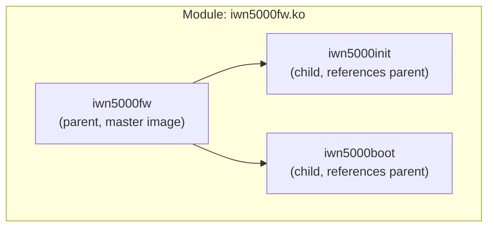

# Firmware Loading

The firmware subsystem provides an interface for loading firmware images into
the kernel and making them available to device drivers. Firmware images are
typically embedded in kernel modules and can be loaded on-demand or pre-loaded.

**Source files:**
- `sys/kern/subr_firmware.c` - Firmware management (~540 lines)

**Header files:**
- `sys/sys/firmware.h` - Public API

---

## Overview

The firmware framework solves a common driver problem: many hardware devices
require proprietary microcode or configuration data to operate. This subsystem:

1. Provides a registry for firmware images with reference counting
2. Supports automatic loading of firmware modules on demand
3. Handles parent/child relationships for multi-image modules
4. Manages unloading of unreferenced firmware

---

## Data Structures

### struct firmware

The user-visible firmware image descriptor:

```c
/* sys/sys/firmware.h:51-56 */
struct firmware {
    const char      *name;      /* system-wide name */
    const uint8_t   *data;      /* location of image */
    size_t          datasize;   /* size of image in bytes */
    unsigned int    version;    /* version of the image */
};
```

### struct priv_fw

Internal firmware registry entry:

```c
/* sys/kern/subr_firmware.c:81-109 */
struct priv_fw {
    int             refcnt;     /* reference count */
    struct priv_fw  *parent;    /* parent image for subimages */
    int             flags;      /* FW_UNLOAD flag */
    linker_file_t   file;       /* module file (if autoloaded) */
    struct firmware fw;         /* externally visible information */
};
```

**State transitions:**
```
firmware_register()    -->  fw.name = image_name
(autoloaded image)     -->  file = module reference
firmware_unregister()  -->  fw.name = NULL
(unload complete)      -->  file = NULL
```

---

## Registry

The firmware registry uses a static array:

```c
/* sys/kern/subr_firmware.c:124-125 */
#define FIRMWARE_MAX    30
static struct priv_fw firmware_table[FIRMWARE_MAX];
```

A slot is in use if either `file != NULL` or `fw.name != NULL`:

```c
#define FW_INUSE(p)     ((p)->file != NULL || (p)->fw.name != NULL)
```

---

## Public API

### firmware_register()

Register a firmware image with the kernel:

```c
/* sys/kern/subr_firmware.c:172-209 */
const struct firmware *
firmware_register(const char *imagename, const void *data, size_t datasize,
    unsigned int version, const struct firmware *parent)
{
    struct priv_fw *match, *frp;

    lockmgr(&firmware_lock, LK_EXCLUSIVE);
    
    /* Check name is unique and find free slot */
    match = lookup(imagename, &frp);
    if (match != NULL) {
        lockmgr(&firmware_lock, LK_RELEASE);
        kprintf("%s: image %s already registered!\n", __func__, imagename);
        return NULL;
    }
    if (frp == NULL) {
        lockmgr(&firmware_lock, LK_RELEASE);
        kprintf("%s: cannot register image %s, firmware table full!\n",
            __func__, imagename);
        return NULL;
    }
    
    bzero(frp, sizeof(*frp));
    frp->fw.name = imagename;
    frp->fw.data = data;
    frp->fw.datasize = datasize;
    frp->fw.version = version;
    
    /* Link to parent if specified */
    if (parent != NULL) {
        frp->parent = PRIV_FW(parent);
        frp->parent->refcnt++;
    }
    
    lockmgr(&firmware_lock, LK_RELEASE);
    return &frp->fw;
}
```

**Parameters:**
- `imagename` - Unique name for the firmware
- `data` - Pointer to firmware data
- `datasize` - Size in bytes
- `version` - Version number
- `parent` - Parent firmware (for multi-image modules)

### firmware_get()

Look up and optionally load firmware:

```c
/* sys/kern/subr_firmware.c:304-347 */
const struct firmware *
firmware_get(const char *imagename)
{
    struct task fwload_task;
    struct priv_fw *fp;

    lockmgr(&firmware_lock, LK_EXCLUSIVE);
    fp = lookup(imagename, NULL);
    if (fp != NULL)
        goto found;
        
    /*
     * Image not present, try to load the module holding it.
     */
    if (caps_priv_check_self(SYSCAP_NOKLD) != 0 || securelevel > 0) {
        lockmgr(&firmware_lock, LK_RELEASE);
        kprintf("%s: insufficient privileges to "
            "load firmware image %s\n", __func__, imagename);
        return NULL;
    }
    
    /*
     * Defer load to a thread with known context.  linker_reference_module
     * may do filesystem i/o which requires root & current dirs, etc.
     */
    if (!cold) {
        TASK_INIT(&fwload_task, 0, loadimage, __DECONST(void *, imagename));
        taskqueue_enqueue(firmware_tq, &fwload_task);
        lksleep(__DECONST(void *, imagename), &firmware_lock, 0, "fwload", 0);
    }
    
    /* After load attempt, check if image registered */
    fp = lookup(imagename, NULL);
    if (fp == NULL) {
        lockmgr(&firmware_lock, LK_RELEASE);
        return NULL;
    }
    
found:
    fp->refcnt++;
    lockmgr(&firmware_lock, LK_RELEASE);
    return &fp->fw;
}
```

**Auto-loading:**

1. If firmware not in registry, attempt to load kernel module
2. Module loading delegated to taskqueue thread (needs filesystem context)
3. Module calls `firmware_register()` during initialization
4. Caller blocks until load completes or fails

### firmware_put()

Release a firmware reference:

```c
/* sys/kern/subr_firmware.c:358-372 */
void
firmware_put(const struct firmware *p, int flags)
{
    struct priv_fw *fp = PRIV_FW(p);

    lockmgr(&firmware_lock, LK_EXCLUSIVE);
    fp->refcnt--;
    if (fp->refcnt == 0) {
        if (flags & FIRMWARE_UNLOAD)
            fp->flags |= FW_UNLOAD;
        if (fp->file)
            taskqueue_enqueue(firmware_tq, &firmware_unload_task);
    }
    lockmgr(&firmware_lock, LK_RELEASE);
}
```

**Flags:**
- `FIRMWARE_UNLOAD` (0x0001) - Request unload when refcount reaches zero

### firmware_unregister()

Remove a firmware image from the registry:

```c
/* sys/kern/subr_firmware.c:216-250 */
int
firmware_unregister(const char *imagename)
{
    struct priv_fw *fp;
    int err;

    lockmgr(&firmware_lock, LK_EXCLUSIVE);
    fp = lookup(imagename, NULL);
    
    if (fp == NULL) {
        /* OK - happens on module unload after firmware_put() */
        err = 0;
    } else if (fp->refcnt != 0) {
        err = EBUSY;  /* still in use */
    } else {
        linker_file_t x = fp->file;  /* preserve for unload */
        
        if (fp->parent != NULL)
            fp->parent->refcnt--;
            
        bzero(fp, sizeof(struct priv_fw));
        fp->file = x;  /* restore for unload completion */
        err = 0;
    }
    
    lockmgr(&firmware_lock, LK_RELEASE);
    return err;
}
```

---

## Module Loading

### Load Task

Firmware loading is performed by a dedicated taskqueue thread:

```c
/* sys/kern/subr_firmware.c:252-295 */
static void
loadimage(void *arg, int npending)
{
    char *imagename = arg;
    struct priv_fw *fp;
    linker_file_t result;
    int error;

    /* synchronize with the thread that dispatched us */
    lockmgr(&firmware_lock, LK_EXCLUSIVE);
    lockmgr(&firmware_lock, LK_RELEASE);

    error = linker_reference_module(imagename, NULL, &result);
    if (error != 0) {
        kprintf("%s: could not load firmware image, error %d\n",
            imagename, error);
        goto done;
    }

    lockmgr(&firmware_lock, LK_EXCLUSIVE);
    fp = lookup(imagename, NULL);
    if (fp == NULL || fp->file != NULL) {
        lockmgr(&firmware_lock, LK_RELEASE);
        if (fp == NULL)
            kprintf("%s: firmware image loaded, "
                "but did not register\n", imagename);
        (void) linker_release_module(imagename, NULL, NULL);
        goto done;
    }
    fp->file = result;  /* record module identity */
    lockmgr(&firmware_lock, LK_RELEASE);
    
done:
    wakeup_one(imagename);  /* wake waiting caller */
}
```

### Unload Task

Unreferenced autoloaded modules are unloaded by a background task:

```c
/* sys/kern/subr_firmware.c:427-475 */
static void
unloadentry(void *unused1, int unused2)
{
    int limit = FIRMWARE_MAX;
    int i;

    lockmgr(&firmware_lock, LK_EXCLUSIVE);
    
    /* Scan table, may need multiple passes for cross-linked images */
    for (i = 0; i < limit; i++) {
        struct priv_fw *fp;
        int err;

        fp = &firmware_table[i % FIRMWARE_MAX];
        if (fp->fw.name == NULL || fp->file == NULL ||
            fp->refcnt != 0 || (fp->flags & FW_UNLOAD) == 0)
            continue;

        /* Found entry to unload */
        limit = i + FIRMWARE_MAX;   /* another full round */
        fp->flags &= ~FW_UNLOAD;    /* don't retry */

        lockmgr(&firmware_lock, LK_RELEASE);
        err = linker_release_module(NULL, NULL, fp->file);
        lockmgr(&firmware_lock, LK_EXCLUSIVE);

        if (err == 0)
            fp->file = NULL;
    }
    
    lockmgr(&firmware_lock, LK_RELEASE);
}
```

---

## Parent/Child Relationships

Modules can contain multiple firmware images. One image (typically named
after the module) is the parent; others are children:



**Behavior:**
- Children increment parent's refcount on registration
- Children decrement parent's refcount on unregistration
- Module cannot unload until all children are released
- Auto-loading uses parent name (module name) to find the module

---

## Usage Example

**Driver requesting firmware:**

```c
static int
mydriver_attach(device_t dev)
{
    const struct firmware *fw;
    
    fw = firmware_get("mydevice_fw");
    if (fw == NULL) {
        device_printf(dev, "could not load firmware\n");
        return ENXIO;
    }
    
    /* Use fw->data and fw->datasize */
    error = load_microcode(dev, fw->data, fw->datasize);
    
    /* Release when done (or keep reference if needed later) */
    firmware_put(fw, FIRMWARE_UNLOAD);
    
    return error;
}
```

**Firmware module:**

```c
/* In the firmware module */
static const uint8_t mydevice_fw_data[] = {
    /* firmware binary data */
};

static int
mydevice_fw_modevent(module_t mod, int type, void *unused)
{
    switch (type) {
    case MOD_LOAD:
        return firmware_register("mydevice_fw",
            mydevice_fw_data, sizeof(mydevice_fw_data),
            1, NULL) == NULL ? ENOMEM : 0;
    case MOD_UNLOAD:
        return firmware_unregister("mydevice_fw");
    }
    return EINVAL;
}
```

---

## Initialization

```c
/* sys/kern/subr_firmware.c:480-504 */
static int
firmware_modevent(module_t mod, int type, void *unused)
{
    switch (type) {
    case MOD_LOAD:
        TASK_INIT(&firmware_unload_task, 0, unloadentry, NULL);
        lockinit(&firmware_lock, "firmware table", 0, LK_CANRECURSE);
        firmware_tq = taskqueue_create("taskqueue_firmware", M_WAITOK,
            taskqueue_thread_enqueue, &firmware_tq);
        (void) taskqueue_start_threads(&firmware_tq, 1, TDPRI_KERN_DAEMON,
            -1, "firmware taskq");
        return 0;
        
    case MOD_UNLOAD:
        /* Mark all for unload, drain, verify empty */
        ...
    }
}

DECLARE_MODULE(firmware, firmware_mod, SI_SUB_DRIVERS, SI_ORDER_FIRST);
```

---

## Security

Firmware loading is restricted:

```c
if (caps_priv_check_self(SYSCAP_NOKLD) != 0 || securelevel > 0) {
    /* Cannot load firmware - insufficient privileges */
}
```

- Requires `SYSCAP_NOKLD` capability
- Blocked when `securelevel > 0`

---

## See Also

- [Devices](devices.md) - Device driver framework
- [NewBus](newbus.md) - Device attachment
