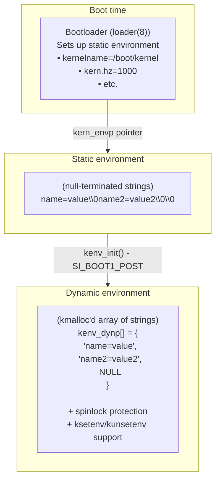

# Kernel Initialization and Bootstrap

**Source Files**:
- `sys/kern/init_main.c` - Main kernel initialization
- `sys/kern/init_sysent.c` - System call table (generated)
- `sys/kern/subr_param.c` - Kernel parameter computation
- `sys/kern/kern_environment.c` - Kernel environment variables

This document describes how the DragonFly BSD kernel boots and initializes, from the hand-off from machine-dependent code through the creation of the first userspace process (init).

---

## Overview

DragonFly's kernel initialization follows a carefully orchestrated sequence:

```
Machine-dependent startup (e.g., init386)
  ↓
mi_proc0init() - Initialize proc0/thread0/lwp0
  ↓
mi_startup() - Machine-independent initialization
  ↓
SYSINIT framework - Ordered subsystem initialization
  ↓
Create init process (PID 1)
  ↓
Start init - exec /sbin/init
  ↓
Userspace initialization begins
```

The initialization process relies on the **SYSINIT framework**, which allows subsystems to register initialization functions that are executed in a well-defined order based on subsystem (SI_SUB_*) and order (SI_ORDER_*) values.

---

## Architecture

### Key Data Structures

#### Process 0 (swapper)

Process 0 is the kernel's initial context, created statically:

```c
/* sys/kern/init_main.c:79-91 */
static struct session session0;
static struct pgrp pgrp0;
static struct sigacts sigacts0;
static struct filedesc filedesc0;
static struct plimit limit0;
static struct vmspace vmspace0;
static struct sysreaper initreaper;

struct proc *initproc;        /* Will point to init (PID 1) */
struct proc proc0;            /* Process 0 (swapper) */
struct lwp lwp0;              /* LWP 0 */
struct thread thread0;        /* Thread 0 */
```

These static structures are never freed and serve as the template for forking other processes.

#### SYSINIT Structure

```c
struct sysinit {
    unsigned int    subsystem;    /* SI_SUB_* */
    unsigned int    order;        /* SI_ORDER_* within subsystem */
    void            (*func)(void *);
    void            *udata;
};
```

**Subsystem levels** (SI_SUB_*):
- `SI_BOOT1_COPYRIGHT` - Print copyright
- `SI_BOOT1_POST` - Early boot tasks
- `SI_BOOT2_LEAVE_CRIT` - Enable interrupts
- `SI_BOOT2_PROC0` - Initialize proc0
- `SI_BOOT2_FINISH_SMP` - SMP initialization complete
- `SI_SUB_PROC0_POST` - Post-proc0 initialization
- `SI_SUB_CREATE_INIT` - Create init process
- `SI_SUB_KTHREAD_INIT` - Start init process
- Many more (see `<sys/kernel.h>`)

**Order values** (SI_ORDER_*):
- `SI_ORDER_FIRST` - First in subsystem
- `SI_ORDER_SECOND` - Second
- `SI_ORDER_MIDDLE` - Middle
- `SI_ORDER_ANY` - No specific order
- `SI_ORDER_LAST` - Last in subsystem

---

## Initialization Sequence

### Phase 1: Machine-Dependent Setup

Before `mi_proc0init()` is called, the machine-dependent code (e.g., `init386()` on x86-64) has:

1. Set up the boot stack
2. Initialized basic CPU structures
3. Set up memory management (paging)
4. Initialized the GDT/IDT
5. Set up the boot CPU's globaldata structure
6. Prepared the initial kernel environment

### Phase 2: Process 0 Creation

**Function**: `mi_proc0init()` (`init_main.c:162`)

Called from very low-level boot code to initialize CPU #0's structures:

```c
void mi_proc0init(struct globaldata *gd, struct user *proc0paddr)
{
    /* Initialize thread0 */
    lwkt_init_thread(&thread0, proc0paddr, LWKT_THREAD_STACK, 0, gd);
    lwkt_set_comm(&thread0, "thread0");
    
    /* Initialize proc0 */
    RB_INIT(&proc0.p_lwp_tree);
    spin_init(&proc0.p_spin, "iproc_proc0");
    lwkt_token_init(&proc0.p_token, "iproc");
    
    /* Initialize lwp0 */
    lwp0.lwp_tid = 1;
    proc0.p_lasttid = lwp0.lwp_tid;
    lwp_rb_tree_RB_INSERT(&proc0.p_lwp_tree, &lwp0);
    lwp0.lwp_thread = &thread0;
    lwp0.lwp_proc = &proc0;
    
    /* Set up user scheduler */
    proc0.p_usched = usched_init();
    
    /* Thread0 linkage */
    thread0.td_flags |= TDF_RUNNING;
    thread0.td_proc = &proc0;
    thread0.td_lwp = &lwp0;
    thread0.td_switch = cpu_lwkt_switch;
    
    lwkt_schedule_self(curthread);
}
```

At this point:
- Thread0 is running on CPU 0
- Proc0 exists but is incomplete
- LWKT threading is operational
- Interrupts are still disabled (critical section)

### Phase 3: Machine-Independent Startup

**Function**: `mi_startup()` (`init_main.c:199`)

This is the main initialization orchestrator:

```c
void mi_startup(void)
{
    struct sysinit *sip;
    struct sysinit **sipp, **xipp;
    
    /* Get sysinit array from linker set */
    if (sysinit == NULL) {
        sysinit = SET_BEGIN(sysinit_set);
        sysinit_end = SET_LIMIT(sysinit_set);
    }
    
restart:
    /* Bubble sort sysinits by subsystem and order */
    for (sipp = sysinit; sipp < sysinit_end; sipp++) {
        for (xipp = sipp + 1; xipp < sysinit_end; xipp++) {
            if ((*sipp)->subsystem < (*xipp)->subsystem ||
                ((*sipp)->subsystem == (*xipp)->subsystem &&
                 (*sipp)->order <= (*xipp)->order))
                continue;
            /* Swap */
            save = *sipp;
            *sipp = *xipp;
            *xipp = save;
        }
    }
    
    /* Execute all sysinit functions in order */
    for (sipp = sysinit; sipp < sysinit_end; sipp++) {
        sip = *sipp;
        
        if (sip->subsystem == SI_SPECIAL_DUMMY)
            continue;
        if (sip->subsystem == SI_SPECIAL_DONE)
            continue;
        
        /* Call initialization function */
        (*(sip->func))(sip->udata);
        
        /* Mark as done */
        sip->subsystem = SI_SPECIAL_DONE;
        
        /* Check if KLDs added more sysinits */
        if (newsysinit != NULL) {
            sysinit = newsysinit;
            sysinit_end = newsysinit_end;
            newsysinit = NULL;
            goto restart;
        }
    }
    
    panic("Shouldn't get here!");  /* Scheduler never returns */
}
```

**Key aspects**:

1. **Sorting**: SYSINITs are sorted by subsystem (primary key) and order (secondary key)
2. **Execution**: Each function is called in order
3. **Dynamic loading**: If kernel modules (KLDs) are loaded during initialization, their SYSINITs are merged and the process restarts
4. **Never returns**: The last SYSINIT starts the scheduler, which never returns

### Phase 4: Important SYSINIT Stages

#### 4.1 Copyright and Early Boot

```c
/* Print copyright */
SYSINIT(announce, SI_BOOT1_COPYRIGHT, SI_ORDER_FIRST,
        print_caddr_t, copyright);

/* Initialize kernel environment */
SYSINIT(kenv, SI_BOOT1_POST, SI_ORDER_ANY, kenv_init, NULL);
```

The `kenv_init()` function (`kern_environment.c:571`):
- Creates dynamic environment array
- Copies static environment from bootloader
- Sets up kenv spinlock
- Enables dynamic environment operations

#### 4.2 Leave Critical Section

```c
SYSINIT(leavecrit, SI_BOOT2_LEAVE_CRIT, SI_ORDER_ANY,
        leavecrit, NULL);
```

The `leavecrit()` function (`init_main.c:305`):
- Stabilizes machine interrupt ABI
- Enables CPU interrupts
- Exits critical section
- Allows device probes to work

After this point, interrupts are enabled and the system can respond to external events.

#### 4.3 Enable tsleep

```c
SYSINIT(tsleepworks, SI_BOOT2_FINISH_SMP, SI_ORDER_SECOND,
        tsleepworks, NULL);
```

Sets `tsleep_now_works = 1`, allowing threads to block/sleep.

#### 4.4 Initialize Process 0

```c
SYSINIT(p0init, SI_BOOT2_PROC0, SI_ORDER_FIRST, proc0_init, NULL);
```

The `proc0_init()` function (`init_main.c:373`) completes proc0 setup:

```c
static void proc0_init(void *dummy)
{
    struct proc *p = &proc0;
    
    /* Initialize osrel */
    p->p_osrel = osreldate;
    
    /* Initialize process and pgrp structures */
    procinit();
    vm_init2();
    
    /* Create process 0 (the swapper) */
    procinsertinit(p);
    pgrpinsertinit(&pgrp0);
    LIST_INIT(&pgrp0.pg_members);
    LIST_INSERT_HEAD(&pgrp0.pg_members, p, p_pglist);
    
    /* Set up session */
    pgrp0.pg_session = &session0;
    session0.s_count = 1;
    session0.s_leader = p;
    
    /* Set process attributes */
    p->p_flags = P_SYSTEM;
    p->p_stat = SACTIVE;
    lwp0.lwp_stat = LSRUN;
    p->p_nice = NZERO;
    p->p_sysent = &null_sysvec;
    
    bcopy("swapper", p->p_comm, sizeof("swapper"));
    
    /* Create credentials (root) */
    uip = uicreate(0);
    p->p_ucred = crget();
    p->p_ucred->cr_ruidinfo = uip;
    p->p_ucred->cr_uidinfo = uip;
    p->p_ucred->cr_ngroups = 1;
    
    /* Create sigacts */
    p->p_sigacts = &sigacts0;
    refcount_init(&p->p_sigacts->ps_refcnt, 1);
    siginit(p);
    
    /* Create file descriptor table */
    fdinit_bootstrap(p, &filedesc0, cmask);
    
    /* Create limits */
    plimit_init0(&limit0);
    p->p_limit = &limit0;
    
    /* Set up address space */
    pmap_pinit0(vmspace_pmap(&vmspace0));
    p->p_vmspace = &vmspace0;
    lwp0.lwp_vmspace = p->p_vmspace;
    vmspace_initrefs(&vmspace0);
    vm_map_init(&vmspace0.vm_map, VM_MIN_USER_ADDRESS,
                VM_MAX_USER_ADDRESS, vmspace_pmap(&vmspace0));
    
    /* Initialize kqueue */
    kqueue_init(&lwp0.lwp_kqueue, &filedesc0);
    
    /* Charge root for one process */
    chgproccnt(p->p_ucred->cr_uidinfo, 1, 0);
    vm_init_limits(p);
}
```

After this, proc0 is a fully functional kernel process.

#### 4.5 End Cold Boot

```c
SYSINIT(endofcoldboot, SI_SUB_ISWARM, SI_ORDER_ANY,
        endofcoldboot, NULL);
```

Sets `cold = 0`, indicating the system is no longer in cold boot phase. Device drivers use this flag to determine if they're being initialized at boot or hotplugged later.

#### 4.6 Create Init Process

```c
SYSINIT(init, SI_SUB_CREATE_INIT, SI_ORDER_FIRST, create_init, NULL);
```

The `create_init()` function (`init_main.c:716`):

```c
static void create_init(const void *udata)
{
    int error;
    struct lwp *lp;
    
    crit_enter();
    
    /* Fork process 1 from lwp0 */
    error = fork1(&lwp0, RFFDG | RFPROC, &initproc);
    if (error)
        panic("cannot fork init: %d", error);
    
    initproc->p_flags |= P_SYSTEM;
    reaper_init(initproc, &initreaper);
    
    lp = ONLY_LWP_IN_PROC(initproc);
    
    /* Set up fork handler to call start_init() */
    cpu_set_fork_handler(lp, start_init, NULL);
    
    crit_exit();
}
```

At this point:
- Init process (PID 1) is created but not running
- It's marked as a system process
- Fork handler is set to `start_init()`

#### 4.7 Start Init Process

```c
SYSINIT(kickinit, SI_SUB_KTHREAD_INIT, SI_ORDER_FIRST, kick_init, NULL);
```

The `kick_init()` function (`init_main.c:737`):

```c
static void kick_init(const void *udata)
{
    start_forked_proc(&lwp0, initproc);
}
```

This makes the init process runnable. When it's scheduled, it will execute `start_init()`.

### Phase 5: Starting Userspace

**Function**: `start_init()` (`init_main.c:556`)

This function executes in the context of the init process (PID 1):

```c
static void start_init(void *dummy, struct trapframe *frame)
{
    struct proc *p = curproc;
    struct mount *mp;
    struct vnode *vp;
    char *path, *next;
    int error;
    
    /* Get kernel name from environment */
    env = kgetenv("kernelname");
    if (env != NULL)
        strlcpy(kernelname, env, sizeof(kernelname));
    
    /* Set up root vnode */
    mp = mountlist_boot_getfirst();
    if (VFS_ROOT(mp, &vp))
        panic("cannot find root vnode");
    
    p->p_fd->fd_cdir = vp;
    vref(p->p_fd->fd_cdir);
    p->p_fd->fd_rdir = vp;
    vref(p->p_fd->fd_rdir);
    
    /* Mount devfs */
    kprintf("Mounting devfs\n");
    vfs_mountroot_devfs();
    
    /* Allocate stack space for execve args */
    addr = trunc_page(USRSTACK - PAGE_SIZE);
    error = vm_map_find(&p->p_vmspace->vm_map, NULL, NULL,
                        0, &addr, PAGE_SIZE, PAGE_SIZE, FALSE,
                        VM_MAPTYPE_NORMAL, VM_SUBSYS_INIT,
                        VM_PROT_ALL, VM_PROT_ALL, 0);
    if (error)
        panic("init: couldn't allocate argument space");
    
    /* Try each path in init_path */
    for (path = init_path; *path != '\0'; path = next) {
        /* Parse next path component */
        while (*path == ':')
            path++;
        if (*path == '\0')
            break;
        for (next = path; *next != '\0' && *next != ':'; next++)
            ;
        
        /* Build argv for exec */
        /* argv[0] = path (e.g., "/sbin/init") */
        /* argv[1] = boot flags (e.g., "-s" for single-user) */
        
        /* Try to exec */
        if ((error = sys_execve(&sysmsg, &args)) == 0) {
            /* Success! Now running /sbin/init */
            lp->lwp_proc->p_usched->acquire_curproc(lp);
            return;
        }
        
        if (error != ENOENT)
            kprintf("exec %.*s: error %d\n",
                   (int)(next - path), path, error);
    }
    
    kprintf("init: not found in path %s\n", init_path);
    panic("no init");
}
```

**Default init_path**:
```
/sbin/init:/sbin/oinit:/sbin/init.bak
```

This can be overridden with `kern.init_path` environment variable.

**Boot flags passed to init**:
- `-s`: Single-user mode (if `RB_SINGLE` set)
- `-C`: Boot from CDROM (if `BOOTCDROM` defined)

Once `sys_execve()` succeeds:
1. Init's address space is replaced with `/sbin/init`
2. Init becomes PID 1 in userspace
3. Kernel initialization is complete
4. Userspace initialization begins (init spawns getty, starts services, etc.)

---

## Kernel Parameters

**Source**: `sys/kern/subr_param.c`

### Parameter Computation

DragonFly computes many kernel parameters at boot time based on available physical memory and tunables. This happens in two phases:

#### Phase 1: Init Param1 - Fixed Parameters

**Function**: `init_param1()` (`subr_param.c:197`)

Called very early, before memory-dependent calculations:

```c
void init_param1(void)
{
    /* Timer frequency */
    hz = HZ_DEFAULT;  /* Default: 100 Hz */
    TUNABLE_INT_FETCH("kern.hz", &hz);
    
    ustick = 1000000 / hz;        /* microseconds per tick */
    nstick = 1000000000 / hz;     /* nanoseconds per tick */
    
    /* Statistics clock */
    stathz = hz + 1;
    TUNABLE_INT_FETCH("kern.stathz", &stathz);
    
    /* Profiling clock */
    profhz = stathz;
    
    /* NTP tick delta */
    ntp_default_tick_delta = howmany(30000000, 60 * hz);
    
    /* Size limits (can be tuned) */
    maxswzone = VM_SWZONE_SIZE_MAX;
    TUNABLE_LONG_FETCH("kern.maxswzone", &maxswzone);
    
    maxbcache = VM_BCACHE_SIZE_MAX;
    TUNABLE_LONG_FETCH("kern.maxbcache", &maxbcache);
    
    /* User address space limits */
    maxtsiz = MAXTSIZ;    /* Max text size */
    dfldsiz = DFLDSIZ;    /* Default data size */
    maxdsiz = MAXDSIZ;    /* Max data size */
    dflssiz = DFLSSIZ;    /* Default stack size */
    maxssiz = MAXSSIZ;    /* Max stack size */
    sgrowsiz = SGROWSIZ;  /* Stack growth size */
    maxthrssiz = MAXTHRSSIZ;  /* Thread stack area */
    
    /* Each can be overridden via tunable */
    TUNABLE_QUAD_FETCH("kern.maxtsiz", &maxtsiz);
    TUNABLE_QUAD_FETCH("kern.dfldsiz", &dfldsiz);
    /* ... etc ... */
}
```

#### Phase 2: Init Param2 - Memory-Scaled Parameters

**Function**: `init_param2(int physpages)` (`subr_param.c:237`)

Called after physical memory detection:

```c
void init_param2(int physpages)
{
    size_t limsize;
    
    /* Calculate memory size in bytes, limited by KVA */
    limsize = (size_t)physpages * PAGE_SIZE;
    if (limsize > KvaSize)
        limsize = KvaSize;
    
    /* Limit maxswzone to 1/2 of physical memory */
    if (maxswzone > limsize / 2)
        maxswzone = limsize / 2;
    
    limsize /= 1024 * 1024;  /* Convert to MB */
    
    /* Compute maxusers (affects many other limits) */
    maxusers = MAXUSERS;
    TUNABLE_INT_FETCH("kern.maxusers", &maxusers);
    
    if (maxusers == 0) {
        /* Auto-compute: ~384 per 3GB */
        maxusers = limsize / 8;
        if (maxusers < 32)
            maxusers = 32;
    }
    
    /* Maximum number of processes */
    maxproc = NPROC;  /* 20 + 16 * maxusers */
    TUNABLE_INT_FETCH("kern.maxproc", &maxproc);
    
    if (maxproc < 32)
        maxproc = 32;
    if (maxproc > limsize * 40)
        maxproc = limsize * 40;  /* Prevent kmap exhaustion */
    
    /* Maximum open files */
    maxfiles = MAXFILES;  /* maxproc * 16 */
    TUNABLE_INT_FETCH("kern.maxfiles", &maxfiles);
    
    if (maxfiles < 128)
        maxfiles = 128;
    
    /* Per-user/per-proc limits */
    maxprocperuid = maxproc / 4;
    if (maxprocperuid < 128)
        maxprocperuid = maxproc / 2;
    
    minfilesperproc = 8;
    maxfilesperproc = maxfiles / 4;
    maxfilesperuser = maxfilesperproc * 2;
    maxfilesrootres = maxfiles / 20;  /* Reserved for root */
    
    /* POSIX locks */
    maxposixlocksperuid = MAXPOSIXLOCKSPERUID;  /* maxproc * 4 */
    TUNABLE_INT_FETCH("kern.maxposixlocksperuid", &maxposixlocksperuid);
    
    /* Buffer cache */
    nbuf = NBUF;  /* Usually 0 (auto-sized) */
    TUNABLE_LONG_FETCH("kern.nbuf", &nbuf);
    
    /* Callout wheel size */
    ncallout = 16 + maxproc + maxfiles;
    if (ncallout > 5*60*hz)  /* Limit to ~5 minutes worth */
        ncallout = 5*60*hz;
    TUNABLE_INT_FETCH("kern.ncallout", &ncallout);
}
```

### Key Computed Parameters

| Parameter | Formula | Description |
|-----------|---------|-------------|
| `maxusers` | `limsize / 8` (if not set) | Tuning knob affecting many limits |
| `maxproc` | `20 + 16 * maxusers` | Maximum processes |
| `maxfiles` | `maxproc * 16` | Maximum open files system-wide |
| `maxprocperuid` | `maxproc / 4` | Max processes per user |
| `maxfilesperproc` | `maxfiles / 4` | Max files per process |
| `maxfilesperuser` | `maxfilesperproc * 2` | Max files per user |
| `maxposixlocksperuid` | `maxproc * 4` | Max POSIX locks per user |
| `ncallout` | `16 + maxproc + maxfiles` | Callout wheel size |

### Virtual Machine Detection

DragonFly can detect if it's running as a VM guest:

```c
enum vmm_guest_type detect_virtual(void)
{
    char *sysenv;
    
    /* Check SMBIOS BIOS vendor */
    sysenv = kgetenv("smbios.bios.vendor");
    if (sysenv != NULL) {
        /* Check for QEMU, Xen, BHYVE, KVM, etc. */
        for (i = 0; vmm_bnames[i].str != NULL; i++)
            if (strcmp(sysenv, vmm_bnames[i].str) == 0)
                return (vmm_bnames[i].type);
    }
    
    /* Check SMBIOS system product */
    sysenv = kgetenv("smbios.system.product");
    if (sysenv != NULL) {
        /* Check for VMware, Hyper-V, VirtualBox, etc. */
        for (i = 0; vmm_pnames[i].str != NULL; i++)
            if (strcmp(sysenv, vmm_pnames[i].str) == 0)
                return (vmm_pnames[i].type);
    }
    
    return (VMM_GUEST_NONE);
}
```

**Detected VM types**:
- VMM_GUEST_QEMU
- VMM_GUEST_XEN
- VMM_GUEST_BHYVE
- VMM_GUEST_KVM
- VMM_GUEST_VMWARE
- VMM_GUEST_HYPERV
- VMM_GUEST_VBOX
- VMM_GUEST_PARALLELS

Exposed via `sysctl kern.vmm_guest`.

---

## Kernel Environment

**Source**: `sys/kern/kern_environment.c`

The kernel environment provides a key-value store passed from the bootloader, similar to Unix environment variables.

### Architecture



### Static Environment

At boot, the bootloader passes a pointer to a static environment:

```c
char *kern_envp;  /* Pointer to static environment */
```

Format:
```
"var1=value1\0var2=value2\0var3=value3\0\0"
           ^              ^              ^
           |              |              |
         NUL            NUL          Double NUL (end)
```

### Dynamic Environment

After `kenv_init()` (SI_BOOT1_POST), the environment becomes dynamic:

```c
/* kern_environment.c:570 */
static void kenv_init(void *dummy)
{
    char *cp;
    int len, i;
    
    /* Allocate dynamic array (max 512 entries) */
    kenv_dynp = kmalloc(KENV_DYNMAXNUM * sizeof(char *),
                        M_KENV, M_WAITOK | M_ZERO);
    
    /* Copy static environment to dynamic */
    for (i = 0, cp = kern_envp; cp != NULL; cp = kernenv_next(cp)) {
        len = strlen(cp) + 1;
        if (i < (KENV_DYNMAXNUM - 1)) {
            kenv_dynp[i] = kmalloc(len, M_KENV, M_WAITOK);
            strcpy(kenv_dynp[i++], cp);
        } else {
            kprintf("WARNING: kenv: exhausted dynamic storage\n");
        }
    }
    kenv_dynp[i] = NULL;
    
    spin_init(&kenv_dynlock, "kenvdynlock");
    kenv_isdynamic = 1;
}
```

After this:
- Static environment is still accessible (read-only)
- Dynamic environment is modifiable
- Protected by spinlock (`kenv_dynlock`)

### API

#### Get Environment Variable

```c
char *kgetenv(const char *name);
```

Returns a kmalloc'd copy of the value, or NULL if not found. Must be freed with `kfreeenv()`.

**Example**:
```c
char *hz_str = kgetenv("kern.hz");
if (hz_str != NULL) {
    hz = atoi(hz_str);
    kfreeenv(hz_str);
}
```

#### Set Environment Variable

```c
int ksetenv(const char *name, const char *value);
```

Sets or replaces an environment variable. Returns 0 on success, -1 on error.

**Example**:
```c
ksetenv("debug.verbose", "1");
```

#### Unset Environment Variable

```c
int kunsetenv(const char *name);
```

Removes an environment variable. Returns 0 on success, -1 if not found.

#### Test Environment Variable

```c
int ktestenv(const char *name);
```

Returns 1 if variable exists, 0 otherwise.

#### Typed Getters

```c
int kgetenv_string(const char *name, char *data, int size);
int kgetenv_int(const char *name, int *data);
int kgetenv_long(const char *name, long *data);
int kgetenv_ulong(const char *name, unsigned long *data);
int kgetenv_quad(const char *name, quad_t *data);
```

These return 1 on success, 0 if variable not found or parse error.

**kgetenv_quad() supports size suffixes**:
- `k` or `K`: × 1024
- `m` or `M`: × 1024²
- `g` or `G`: × 1024³
- `t` or `T`: × 1024⁴

**Example**:
```c
quad_t size;
if (kgetenv_quad("vm.kmem_size", &size)) {
    /* size now contains value in bytes */
    /* "512m" → 536870912 */
    /* "2g" → 2147483648 */
}
```

#### Free Environment Value

```c
void kfreeenv(char *env);
```

Frees a string returned by `kgetenv()`.

### Userspace Access

The `kenv(2)` system call provides userspace access:

```c
int kenv(int action, const char *name, char *value, int len);
```

**Actions**:
- `KENV_GET`: Get variable value
- `KENV_SET`: Set variable (requires SYSCAP_NOKENV_WR)
- `KENV_UNSET`: Unset variable (requires SYSCAP_NOKENV_WR)
- `KENV_DUMP`: Dump all variables

**Userspace tools**:
```sh
# Get variable
kenv kern.hz

# Set variable
kenv kern.verbose=1

# Unset variable
kenv -u debug.trace

# Dump all
kenv
```

### Tunables

The **TUNABLE** macros simplify reading boot-time configuration:

```c
/* Definition (from subr_param.c:74) */
int maxusers;

TUNABLE_INT_FETCH("kern.maxusers", &maxusers);
```

**TUNABLE types**:
- `TUNABLE_INT_FETCH(path, var)`
- `TUNABLE_LONG_FETCH(path, var)`
- `TUNABLE_ULONG_FETCH(path, var)`
- `TUNABLE_QUAD_FETCH(path, var)`
- `TUNABLE_STR_FETCH(path, var, size)`

These are typically called during `init_param1()` or `init_param2()`.

### Common Kernel Environment Variables

| Variable | Description | Example |
|----------|-------------|---------|
| `kern.hz` | Timer frequency (Hz) | `1000` |
| `kern.maxusers` | Base tuning parameter | `384` |
| `kern.maxproc` | Max processes | `4096` |
| `kern.maxfiles` | Max open files | `65536` |
| `kern.ipc.maxsockets` | Max sockets | `16384` |
| `vm.kmem_size` | Kernel memory size | `512m` |
| `vm.kmem_size_max` | Max kernel memory | `2g` |
| `debug.bootverbose` | Verbose boot messages | `1` |
| `init_path` | Path to init | `/sbin/init:/sbin/oinit` |
| `kernelname` | Kernel path | `/boot/kernel/kernel` |

---

## System Call Table

**Source**: `sys/kern/init_sysent.c` (generated from `syscalls.master`)

### Structure

The system call table is an array of `struct sysent`:

```c
struct sysent {
    int         sy_narg;        /* Number of arguments */
    int         sy_flags;       /* Flags (reserved) */
    sy_call_t   *sy_call;       /* System call handler */
};

/* The table */
struct sysent sysent[] = {
    { 0, 4, (sy_call_t *)sys_xsyscall },    /* 0 = syscall */
    { AS(exit_args), 4, (sy_call_t *)sys_exit },  /* 1 = exit */
    { 0, 4, (sy_call_t *)sys_fork },        /* 2 = fork */
    { AS(read_args), 8, (sy_call_t *)sys_read },  /* 3 = read */
    { AS(write_args), 8, (sy_call_t *)sys_write },/* 4 = write */
    /* ... 500+ more ... */
};
```

**AS() macro**:
```c
#define AS(name) (sizeof(struct name) / sizeof(register_t))
```

Computes the number of register-sized arguments.

### System Call Dispatch

When userspace issues a system call:

1. Trap to kernel (syscall instruction)
2. Kernel trap handler extracts syscall number
3. Lookup in `sysent[]` table
4. Validate syscall number and argument count
5. Copy arguments from userspace
6. Call `sy_call()` function
7. Return result to userspace

**Example syscalls**:
```c
/* 1 = exit */
{ AS(exit_args), 4, (sy_call_t *)sys_exit }

struct exit_args {
    int rval;  /* Exit status */
};

int sys_exit(struct sysmsg *sysmsg, const struct exit_args *uap)
{
    /* Never returns */
    exit1(W_EXITCODE(uap->rval, 0));
    /* NOTREACHED */
}
```

```c
/* 59 = execve */
{ AS(execve_args), 4, (sy_call_t *)sys_execve }

struct execve_args {
    char *fname;      /* Path to executable */
    char **argv;      /* Argument vector */
    char **envv;      /* Environment vector */
};

int sys_execve(struct sysmsg *sysmsg, const struct execve_args *uap)
{
    /* Implemented in kern_exec.c */
    return kern_execve(...);
}
```

### Obsolete Syscalls

Many syscall numbers are marked obsolete:

```c
{ 0, 4, (sy_call_t *)sys_nosys },  /* 8 = __nosys */
{ 0, 4, (sy_call_t *)sys_nosys },  /* 11 = obsolete execv */
```

These return `ENOSYS` (function not implemented).

### Generating the Table

The syscall table is generated from `sys/kern/syscalls.master`:

```
0   STD     { int syscall(void); }
1   STD     { void exit(int rval); }
2   STD     { int fork(void); }
3   STD     { ssize_t read(int fd, void *buf, size_t nbyte); }
4   STD     { ssize_t write(int fd, const void *buf, size_t nbyte); }
...
```

**Build process**:
```sh
cd sys/kern
make sysent
```

This regenerates:
- `init_sysent.c` - syscall table
- `syscalls.c` - syscall names array
- `sysproto.h` - argument structure declarations
- `sysmsg.h` - message structure declarations
- `sysunion.h` - union of all argument structures

---

## Global Data Initialization

**Function**: `mi_gdinit()` (`init_main.c:772`)

Called for each CPU to initialize per-CPU global data:

```c
void mi_gdinit(struct globaldata *gd, int cpuid)
{
    /* Initialize systimer queue */
    TAILQ_INIT(&gd->gd_systimerq);
    
    /* Set CPU ID */
    gd->gd_sysid_alloc = cpuid;
    gd->gd_cpuid = cpuid;
    
    /* Set CPU mask */
    CPUMASK_ASSBIT(gd->gd_cpumask, cpuid);
    gd->gd_cpumask_simple = CPUMASK_SIMPLE(cpuid);
    gd->gd_cpumask_offset = ...;
    
    /* Initialize LWKT for this CPU */
    lwkt_gdinit(gd);
    
    /* Initialize VM map entry reserve */
    vm_map_entry_reserve_cpu_init(gd);
    
    /* Initialize sleep queue */
    if (gd->gd_cpuid == 0)
        sleep_early_gdinit(gd);
    else
        sleep_gdinit(gd);
    
    /* Initialize slab allocator for this CPU */
    slab_gdinit(gd);
    
    /* Add CPU to global mask */
    ATOMIC_CPUMASK_ORBIT(usched_global_cpumask, cpuid);
    
    /* Set up vmstats pointer */
    gd->gd_vmstats = vmstats;
}
```

This is called:
- Once for CPU 0 during early boot
- Once for each additional CPU during SMP initialization

---

## Kernel Process Map (kpmap)

**Function**: `kpmap_init()` (`init_main.c:744`)

Initializes a shared read-only page mapped into all processes:

```c
static void kpmap_init(const void *udata)
{
    /* Allocate page-aligned kpmap structure */
    kpmap = kmalloc(roundup2(sizeof(*kpmap), PAGE_SIZE),
                    M_TEMP, M_ZERO | M_WAITOK);
    
    /* Set up header describing available fields */
    kpmap->header[0].type = UKPTYPE_VERSION;
    kpmap->header[0].offset = offsetof(struct sys_kpmap, version);
    
    kpmap->header[1].type = KPTYPE_UPTICKS;
    kpmap->header[1].offset = offsetof(struct sys_kpmap, upticks);
    
    kpmap->header[2].type = KPTYPE_TS_UPTIME;
    kpmap->header[2].offset = offsetof(struct sys_kpmap, ts_uptime);
    
    kpmap->header[3].type = KPTYPE_TS_REALTIME;
    kpmap->header[3].offset = offsetof(struct sys_kpmap, ts_realtime);
    
    kpmap->header[4].type = KPTYPE_TSC_FREQ;
    kpmap->header[4].offset = offsetof(struct sys_kpmap, tsc_freq);
    
    kpmap->header[5].type = KPTYPE_TICK_FREQ;
    kpmap->header[5].offset = offsetof(struct sys_kpmap, tick_freq);
    
    kpmap->header[6].type = KPTYPE_FAST_GTOD;
    kpmap->header[6].offset = offsetof(struct sys_kpmap, fast_gtod);
    
    kpmap->version = KPMAP_VERSION;
}
SYSINIT(kpmapinit, SI_BOOT1_POST, SI_ORDER_FIRST, kpmap_init, NULL);
```

This page is later mapped into userspace, allowing fast access to:
- System uptime
- Real-time clock
- TSC frequency
- Tick frequency
- Fast gettimeofday

This avoids syscall overhead for time queries.

---

## Summary

DragonFly's kernel initialization follows a well-orchestrated sequence:

1. **Machine-dependent setup** - CPU, memory, interrupts
2. **mi_proc0init()** - Initialize proc0, thread0, lwp0
3. **mi_startup()** - Execute SYSINIT functions in order
4. **proc0_init()** - Complete proc0 setup
5. **create_init()** - Fork init process (PID 1)
6. **kick_init()** - Start init process
7. **start_init()** - Exec /sbin/init

Key mechanisms:
- **SYSINIT framework**: Ordered subsystem initialization
- **Kernel parameters**: Computed based on physical memory
- **Environment**: Boot-time configuration key-value store
- **System call table**: Dispatch table for userspace→kernel transitions

After initialization completes, the init process becomes the first userspace process, and normal system operation begins.
