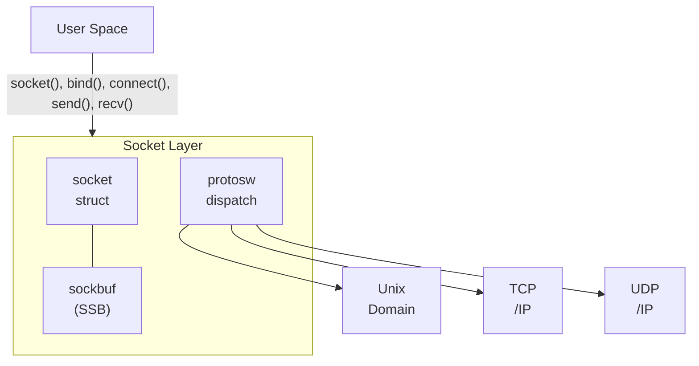

# IPC & Sockets Overview

DragonFly BSD provides multiple inter-process communication mechanisms,
from low-level kernel primitives to POSIX-standard APIs. This section
documents the kernel implementation of these facilities.

---

## Socket Layer

The socket abstraction provides a uniform interface for network and local
communication:

- [Mbufs](ipc/mbufs.md) - Network memory buffer management
- [Sockets](ipc/sockets.md) - Socket API implementation and socket buffers
- [Unix Domain Sockets](ipc/unix-sockets.md) - Local IPC via filesystem namespace
- [Protocol Dispatch](ipc/protocol-dispatch.md) - Protocol family registration and netisr

### Architecture

---

## Pipes

Traditional Unix pipes for unidirectional byte streams between related processes:

- [Pipes](ipc/pipes.md) - pipe() system call, direct data transfer optimization

---

## Message Queues

Two message queue implementations:

- [POSIX Message Queues](ipc/mqueue.md) - mq_open(), priority-based queuing
- [System V Message Queues](ipc/sysv-msg.md) - msgget(), msgctl(), msgsnd(), msgrcv()

---

## System V IPC

Classic System V IPC primitives:

- [System V Message Queues](ipc/sysv-msg.md) - Message passing
- [System V Semaphores](ipc/sysv-sem.md) - Counting semaphores with undo support
- [System V Shared Memory](ipc/sysv-shm.md) - Shared memory segments

All System V IPC facilities share common permission checking via `ipcperm()`
and use integer keys for namespace management.

---

## Comparison

| Mechanism | Scope | Data Model | Persistence | Best For |
|-----------|-------|------------|-------------|----------|
| Pipes | Related processes | Byte stream | Process lifetime | Simple parent-child |
| Unix Sockets | Local system | Stream/Datagram | Filesystem | Local services, fd passing |
| POSIX Mqueue | System-wide | Messages | Kernel (can persist) | Priority messaging |
| SysV Mqueue | System-wide | Messages | Kernel | Legacy compatibility |
| SysV Semaphores | System-wide | Counters | Kernel | Process synchronization |
| SysV Shm | System-wide | Raw memory | Kernel | High-bandwidth sharing |
| TCP/UDP Sockets | Network | Stream/Datagram | Connection lifetime | Network communication |

---

## Key Source Files

| File | Description |
|------|-------------|
| `sys/kern/uipc_socket.c` | Socket layer core |
| `sys/kern/uipc_usrreq.c` | Unix domain sockets |
| `sys/kern/uipc_mbuf.c` | Mbuf allocation |
| `sys/kern/sys_pipe.c` | Pipe implementation |
| `sys/kern/sys_mqueue.c` | POSIX message queues |
| `sys/kern/sysv_msg.c` | System V messages |
| `sys/kern/sysv_sem.c` | System V semaphores |
| `sys/kern/sysv_shm.c` | System V shared memory |
