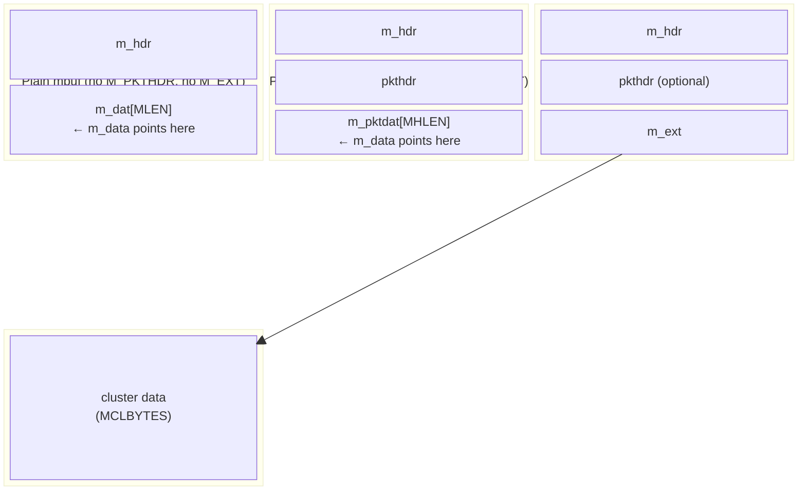

# Mbuf Memory Buffers

The mbuf (memory buffer) subsystem provides efficient, flexible memory management for network data. Mbufs are the fundamental unit of memory used throughout the DragonFly BSD networking stack for storing packet data, protocol headers, and socket buffers.

**Source files:**

- `sys/kern/uipc_mbuf.c` - Core mbuf allocation and manipulation
- `sys/kern/uipc_mbuf2.c` - Extended mbuf operations and packet tags
- `sys/sys/mbuf.h` - Structure definitions and macros

## Design Overview

The mbuf system is designed around several key principles:

1. **Fixed-size allocation** - Mbufs are a single size (`MSIZE`), reducing fragmentation
2. **Cluster attachment** - Large data uses external clusters rather than mbuf chains
3. **Per-CPU caching** - Object caches provide lock-free allocation on each CPU
4. **Reference counting** - Clusters can be shared across multiple mbufs
5. **Zero-copy optimization** - Data can be shared without copying when safe

### DragonFly-Specific Features

- **Per-CPU statistics**: `mbstat[SMP_MAXCPU]` and `mbtypes[SMP_MAXCPU]` arrays with `__cachealign` for cache-line isolation
- **Object cache integration**: Uses DragonFly's `objcache(9)` for efficient per-CPU allocation
- **Message-passing support**: Embedded `netmsg` structures in mbuf headers for LWKT message passing
- **Jumbo cluster support**: Native support for jumbo frames via `MJUMPAGESIZE` clusters

## Data Structures

### struct mbuf

The core mbuf structure (`sys/mbuf.h:206`):

```c
struct mbuf {
    struct m_hdr m_hdr;
    union {
        struct {
            struct pkthdr MH_pkthdr;    /* M_PKTHDR set */
            union {
                struct m_ext MH_ext;    /* M_EXT set */
                char MH_databuf[MHLEN];
            } MH_dat;
        } MH;
        char M_databuf[MLEN];           /* !M_PKTHDR, !M_EXT */
    } M_dat;
};
```

Convenience macros provide field access:

| Macro | Field | Description |
|-------|-------|-------------|
| `m_next` | `m_hdr.mh_next` | Next buffer in chain |
| `m_nextpkt` | `m_hdr.mh_nextpkt` | Next chain in queue |
| `m_data` | `m_hdr.mh_data` | Pointer to data |
| `m_len` | `m_hdr.mh_len` | Data length in this mbuf |
| `m_flags` | `m_hdr.mh_flags` | Flags (M_EXT, M_PKTHDR, etc.) |
| `m_type` | `m_hdr.mh_type` | Type of data |
| `m_pkthdr` | `M_dat.MH.MH_pkthdr` | Packet header (if M_PKTHDR) |
| `m_ext` | `M_dat.MH.MH_dat.MH_ext` | External storage (if M_EXT) |

### struct m_hdr

The mbuf header (`sys/mbuf.h:79`):

```c
struct m_hdr {
    struct mbuf *mh_next;       /* next buffer in chain */
    union {
        struct mbuf *mh_nextpkt;
        STAILQ_ENTRY(mbuf) mh_stailqpkt;
    };
    caddr_t mh_data;            /* location of data */
    int mh_len;                 /* amount of data */
    int mh_flags;               /* flags */
    short mh_type;              /* type of data */
    short mh_pad;
    union {
        struct netmsg_packet mhm_pkt;   /* hardware->proto msg */
        struct netmsg_pru_send mhm_snd; /* userspace->proto msg */
        struct netmsg_inarp mhm_arp;    /* arpinput msg */
        struct netmsg_ctlinput mhm_ctl; /* ctlinput msg */
        struct netmsg_genpkt mhm_gen;   /* generic pkt msg */
        struct netmsg_forward mhm_fwd;  /* forwarding msg */
    } mh_msgu;
};
```

The embedded `netmsg` union enables efficient LWKT message passing without separate allocation.

### struct pkthdr

Packet header for first mbuf in chain (`sys/mbuf.h:153`):

```c
struct pkthdr {
    struct ifnet *rcvif;        /* receive interface */
    struct packet_tags tags;    /* list of packet tags */
    void *header;               /* pointer to packet header */
    int len;                    /* total packet length */
    int csum_flags;             /* checksum flags */
    int csum_data;              /* checksum data */
    uint16_t csum_iphlen;       /* IP header length */
    uint8_t csum_thlen;         /* TCP/UDP header length */
    uint8_t csum_lhlen;         /* link header length */
    uint16_t tso_segsz;         /* TSO segment size */
    uint16_t ether_vlantag;     /* VLAN tag */
    uint16_t hash;              /* packet hash */
    /* ... additional fields ... */
    struct pkthdr_pf pf;        /* PF state */
};
```

### struct m_ext

External storage descriptor (`sys/mbuf.h:194`):

```c
struct m_ext {
    caddr_t ext_buf;            /* start of buffer */
    void (*ext_free)(void *);   /* free function */
    u_int ext_size;             /* size of buffer */
    void (*ext_ref)(void *);    /* reference function */
    void *ext_arg;              /* argument for callbacks */
};
```

### struct mbcluster

Cluster metadata for reference counting (`uipc_mbuf.c:101`):

```c
struct mbcluster {
    int32_t mcl_refs;           /* reference count */
    void *mcl_data;             /* pointer to cluster data */
};
```

### struct mbstat

Per-CPU statistics (`sys/mbuf.h:342`):

```c
struct mbstat {
    u_long m_mbufs;         /* mbufs obtained */
    u_long m_clusters;      /* clusters obtained */
    u_long m_jclusters;     /* jumbo clusters obtained */
    u_long m_clfree;        /* free clusters */
    u_long m_drops;         /* allocation failures */
    u_long m_wait;          /* times waited for space */
    u_long m_drain;         /* times drained protocols */
    u_long m_mcfail;        /* m_copym failures */
    u_long m_mpfail;        /* m_pullup failures */
    /* ... size constants ... */
};
```

## Memory Layout

### Size Constants

| Constant | Description |
|----------|-------------|
| `MSIZE` | Total mbuf size (256 bytes typical) |
| `MLEN` | Data area in plain mbuf (`MSIZE - sizeof(m_hdr)`) |
| `MHLEN` | Data area with packet header (`MLEN - sizeof(pkthdr)`) |
| `MCLBYTES` | Standard cluster size (2048 bytes) |
| `MJUMPAGESIZE` | Jumbo cluster size (PAGE_SIZE) |
| `MINCLSIZE` | Minimum size to use cluster (`MHLEN + 1`) |

### Mbuf Variants



## Mbuf Flags

### Core Flags

| Flag | Value | Description |
|------|-------|-------------|
| `M_EXT` | 0x0001 | Has external storage |
| `M_PKTHDR` | 0x0002 | Start of record/packet |
| `M_EOR` | 0x0004 | End of record |
| `M_CLCACHE` | 0x2000 | Allocated from cluster cache |
| `M_EXT_CLUSTER` | 0x4000 | Standard cluster (not custom) |
| `M_PHCACHE` | 0x8000 | Allocated from packet header cache |

### Packet Flags

| Flag | Value | Description |
|------|-------|-------------|
| `M_BCAST` | 0x0100 | Broadcast packet |
| `M_MCAST` | 0x0200 | Multicast packet |
| `M_FRAG` | 0x0400 | Fragment of larger packet |
| `M_FIRSTFRAG` | 0x0800 | First fragment |
| `M_LASTFRAG` | 0x1000 | Last fragment |
| `M_VLANTAG` | 0x20000 | VLAN tag valid |
| `M_HASH` | 0x100000 | Hash field valid |

### Mbuf Types

| Type | Value | Description |
|------|-------|-------------|
| `MT_FREE` | 0 | On free list |
| `MT_DATA` | 1 | Dynamic data |
| `MT_HEADER` | 2 | Packet header |
| `MT_SONAME` | 3 | Socket name |
| `MT_CONTROL` | 5 | Control message |
| `MT_OOBDATA` | 6 | Out-of-band data |

## Object Caches

The mbuf subsystem uses eight specialized object caches for efficient allocation (`uipc_mbuf.c:91-98`):

| Cache | Contents |
|-------|----------|
| `mbuf_cache` | Plain mbufs |
| `mbufphdr_cache` | Mbufs with packet header |
| `mclmeta_cache` | Standard cluster metadata |
| `mjclmeta_cache` | Jumbo cluster metadata |
| `mbufcluster_cache` | Mbuf + standard cluster |
| `mbufphdrcluster_cache` | Mbuf + pkthdr + standard cluster |
| `mbufjcluster_cache` | Mbuf + jumbo cluster |
| `mbufphdrjcluster_cache` | Mbuf + pkthdr + jumbo cluster |

Each cache is configured with constructor/destructor functions and uses per-CPU magazines for lock-free fast-path allocation.

### Cache Initialization

Caches are initialized in `mbinit()` (`uipc_mbuf.c:253`):

```c
SYSINIT(mbuf, SI_BOOT2_MACHDEP, SI_ORDER_FIRST, mbinit, NULL);
```

The `mbinit_cluster()` function creates cluster caches using `SYSINIT` at `SI_ORDER_ANY` to ensure VM is ready.

## Allocation Functions

### Basic Allocation

| Function | Description |
|----------|-------------|
| `m_get(how, type)` | Allocate plain mbuf |
| `m_gethdr(how, type)` | Allocate mbuf with packet header |
| `m_getcl(how, type, flags)` | Allocate mbuf with standard cluster |
| `m_getjcl(how, type, flags, size)` | Allocate mbuf with jumbo cluster |
| `m_getl(len, how, type, flags, psize)` | Allocate appropriate mbuf for length |
| `m_getc(len, how, type)` | Allocate mbuf chain for length |

The `how` parameter is either `M_WAITOK` (can block) or `M_NOWAIT` (fails immediately if unavailable).

### m_get / m_gethdr

Basic mbuf allocation (`uipc_mbuf.c:423-457`):

```c
struct mbuf *
m_get(int how, int type)
{
    struct mbuf *m;
    int ntries = 0;

retryonce:
    m = objcache_get(mbuf_cache, MB_OCFLAG(how));
    if (m == NULL) {
        if (how == M_WAITOK && ntries++ == 0) {
            m_reclaim();
            goto retryonce;
        }
        ++mbstat[mycpu->gd_cpuid].m_drops;
        return (NULL);
    }
    /* ... initialization ... */
    return (m);
}
```

### m_getcl

Combined mbuf+cluster allocation (`uipc_mbuf.c:517-545`):

```c
struct mbuf *
m_getcl(int how, short type, int flags)
{
    struct mbuf *m;
    int ntries = 0;

retryonce:
    if (flags & M_PKTHDR)
        m = objcache_get(mbufphdrcluster_cache, MB_OCFLAG(how));
    else
        m = objcache_get(mbufcluster_cache, MB_OCFLAG(how));
    /* ... */
}
```

### m_getl (Inline)

Smart allocation based on length (`sys/mbuf.h:583-601`):

```c
static __inline struct mbuf *
m_getl(int len, int how, int type, int flags, int *psize)
{
    struct mbuf *m;
    int size;

    if (len >= MINCLSIZE) {
        m = m_getcl(how, type, flags);
        size = MCLBYTES;
    } else if (flags & M_PKTHDR) {
        m = m_gethdr(how, type);
        size = MHLEN;
    } else {
        m = m_get(how, type);
        size = MLEN;
    }
    if (psize != NULL)
        *psize = size;
    return m;
}
```

### m_getc

Allocate chain for specified length (`uipc_mbuf.c:1154-1201`):

```c
struct mbuf *
m_getc(int len, int how, int type)
{
    struct mbuf *nfirst = NULL, *n;
    int nsize;

    while (len > 0) {
        n = m_getl(len, how, type, nfirst == NULL ? M_PKTHDR : 0, &nsize);
        if (n == NULL)
            goto failed;
        if (nfirst == NULL)
            nfirst = n;
        /* ... chain building ... */
        len -= nsize;
    }
    return (nfirst);
}
```

## Deallocation Functions

### m_free

Free single mbuf (`uipc_mbuf.c:1307-1456`):

```c
struct mbuf *
m_free(struct mbuf *m)
{
    struct mbuf *n;
    struct globaldata *gd = mycpu;

    KASSERT(m->m_type != MT_FREE, ("freeing free mbuf %p", m));
    --mbtypes[gd->gd_cpuid].stats[m->m_type];
    n = m->m_next;
    
    /* Clean up and return to appropriate cache */
    switch (m->m_flags & (M_CLCACHE | M_EXT | M_EXT_CLUSTER)) {
    case M_CLCACHE | M_EXT | M_EXT_CLUSTER:
        /* Return to combined mbuf+cluster cache if not shared */
        if (m_sharecount(m) == 1) {
            m->m_data = m->m_ext.ext_buf;
            objcache_put(mbufcluster_cache, m);
        } else {
            /* Cluster shared, must disconnect */
            m->m_ext.ext_free(m->m_ext.ext_arg);
            objcache_dtor(mbufcluster_cache, m);
        }
        break;
    /* ... other cases ... */
    }
    return (n);
}
```

Key handling for shared clusters: when `m_sharecount(m) > 1`, the mbuf cannot be returned to the combined cache and must be destroyed.

### m_freem

Free entire mbuf chain (`uipc_mbuf.c:1469-1474`):

```c
void
m_freem(struct mbuf *m)
{
    while (m)
        m = m_free(m);
}
```

## Cluster Reference Counting

Clusters use atomic reference counting for safe sharing (`uipc_mbuf.c:1263-1296`):

### m_mclref

```c
static void
m_mclref(void *arg)
{
    struct mbcluster *mcl = arg;
    atomic_add_int(&mcl->mcl_refs, 1);
}
```

### m_mclfree

```c
static void
m_mclfree(void *arg)
{
    struct mbcluster *mcl = arg;
    if (atomic_fetchadd_int(&mcl->mcl_refs, -1) == 1) {
        --mbstat[mycpu->gd_cpuid].m_clusters;
        objcache_put(mclmeta_cache, mcl);
    }
}
```

The `atomic_fetchadd_int()` returns the *previous* value, so a return of 1 means the reference count is now 0.

### m_sharecount

Check if cluster is shared (`uipc_mbuf.c:1040-1049`):

```c
int
m_sharecount(struct mbuf *m)
{
    if (m->m_flags & (M_EXT | M_EXT_CLUSTER)) {
        struct mbcluster *mcl = m->m_ext.ext_arg;
        return mcl->mcl_refs;
    }
    return 1;  /* Not external, single reference */
}
```

## Chain Manipulation Functions

### m_copym

Create read-only copy of mbuf chain (`uipc_mbuf.c:1530-1603`):

```c
struct mbuf *
m_copym(const struct mbuf *m, int off0, int len, int wait)
```

- Copies from offset `off0` for `len` bytes (or `M_COPYALL`)
- Clusters are **shared** (reference count incremented), not copied
- Result is read-only due to shared clusters

### m_copypacket

Optimized full packet copy (`uipc_mbuf.c:1614-1665`):

```c
struct mbuf *
m_copypacket(struct mbuf *m, int how)
```

- Equivalent to `m_copym(m, 0, M_COPYALL, how)`
- Preserves alignment of first mbuf

### m_dup

Create writable copy (`uipc_mbuf.c:1704-1759`):

```c
struct mbuf *
m_dup(struct mbuf *m, int how)
```

- Copies all data (clusters are copied, not shared)
- Result is fully writable

### m_cat

Concatenate chains (`uipc_mbuf.c:1841-1857`):

```c
void
m_cat(struct mbuf *m, struct mbuf *n)
{
    m = m_last(m);
    while (n) {
        if (m->m_flags & M_EXT ||
            m->m_data + m->m_len + n->m_len >= &m->m_dat[MLEN]) {
            /* Just link chains */
            m->m_next = n;
            return;
        }
        /* Copy data into trailing space */
        bcopy(mtod(n, caddr_t), mtod(m, caddr_t) + m->m_len, n->m_len);
        m->m_len += n->m_len;
        n = m_free(n);
    }
}
```

### m_adj

Trim data from head or tail (`uipc_mbuf.c:1859-1928`):

```c
void
m_adj(struct mbuf *mp, int req_len)
```

- Positive `req_len`: trim from head
- Negative `req_len`: trim from tail
- Updates `m_pkthdr.len` if present

### m_pullup

Make initial bytes contiguous (`uipc_mbuf.c:2103-2159`):

```c
struct mbuf *
m_pullup(struct mbuf *n, int len)
```

- Ensures first `len` bytes are in first mbuf's data area
- Required for protocol header access via casting
- Frees original and returns NULL on failure

### m_pulldown

Make arbitrary region contiguous (`uipc_mbuf2.c:89-234`):

```c
struct mbuf *
m_pulldown(struct mbuf *m, int off, int len, int *offp)
```

- Makes bytes `[off, off+len)` contiguous
- More flexible than `m_pullup()`
- Returns mbuf containing the region; `*offp` is offset within that mbuf

### m_split

Partition chain (`uipc_mbuf.c:2171-2229`):

```c
struct mbuf *
m_split(struct mbuf *m0, int len0, int wait)
```

- Returns tail of chain starting at offset `len0`
- Original chain is truncated to `len0` bytes
- May share clusters (result may be read-only)

### m_copydata

Copy to linear buffer (`uipc_mbuf.c:1671-1697`):

```c
void
m_copydata(const struct mbuf *m, int off, int len, void *cp)
```

### m_copyback

Copy from linear buffer (`uipc_mbuf.c:2408-2416`):

```c
void
m_copyback(struct mbuf *m0, int off, int len, const void *cp)
```

### m_defrag

Defragment chain (`uipc_mbuf.c:2591-2659`):

```c
struct mbuf *
m_defrag(struct mbuf *m0, int how)
```

- Creates shortest possible chain
- Useful before DMA operations requiring few scatter-gather entries

### m_unshare

Create writable chain (`uipc_mbuf.c:1958-2093`):

```c
struct mbuf *
m_unshare(struct mbuf *m0, int how)
```

- Replaces shared clusters with private copies
- Compacts chain where possible
- Used before encryption/compression that modifies data in place

## Device Interface Functions

### m_devget

Copy from device memory to mbuf chain (`uipc_mbuf.c:2235-2270`):

```c
struct mbuf *
m_devget(void *buf, int len, int offset, struct ifnet *ifp)
```

- Creates chain from linear device buffer
- Sets `m_pkthdr.rcvif` to receiving interface
- Leaves room for `max_linkhdr` in first mbuf

### m_devpad

Pad packet to minimum length (`uipc_mbuf.c:2275-2318`):

```c
int
m_devpad(struct mbuf *m, int padto)
```

- Pads packet to `padto` bytes
- Required for Ethernet minimum frame size

## Packet Tags

Packet tags attach auxiliary information to mbufs without modifying the mbuf structure.

### struct m_tag

Tag structure (`sys/mbuf.h:138`):

```c
struct m_tag {
    SLIST_ENTRY(m_tag) m_tag_link;  /* List linkage */
    uint16_t m_tag_id;              /* Tag ID */
    uint16_t m_tag_len;             /* Data length */
    uint32_t m_tag_cookie;          /* ABI/Module ID */
};
```

Data follows immediately after the structure.

### Tag Functions

| Function | Description |
|----------|-------------|
| `m_tag_alloc(cookie, type, len, how)` | Allocate tag with data |
| `m_tag_free(t)` | Free tag |
| `m_tag_prepend(m, t)` | Add tag to mbuf |
| `m_tag_unlink(m, t)` | Remove tag from mbuf |
| `m_tag_delete(m, t)` | Remove and free tag |
| `m_tag_delete_chain(m)` | Free all tags |
| `m_tag_locate(m, cookie, type, t)` | Find tag by cookie/type |
| `m_tag_copy(t, how)` | Copy single tag |
| `m_tag_copy_chain(to, from, how)` | Copy all tags |

### Tag Usage Example

```c
struct m_tag *tag;

/* Allocate and attach */
tag = m_tag_alloc(MTAG_ABI_COMPAT, type, sizeof(data), M_NOWAIT);
if (tag != NULL) {
    bcopy(&data, tag + 1, sizeof(data));
    m_tag_prepend(m, tag);
}

/* Find and use */
tag = m_tag_locate(m, MTAG_ABI_COMPAT, type, NULL);
if (tag != NULL) {
    struct data *dp = (struct data *)(tag + 1);
    /* use dp */
}
```

## Utility Macros

### Data Access

```c
mtod(m, t)          /* Cast m->m_data to type t */
mtodoff(m, t, off)  /* Cast m->m_data + off to type t */
```

### Space Calculation

```c
M_LEADINGSPACE(m)   /* Bytes available before m_data */
M_TRAILINGSPACE(m)  /* Bytes available after data */
```

### Writability Check

```c
M_WRITABLE(m)       /* True if mbuf data is writable */
M_EXT_WRITABLE(m)   /* True if cluster is writable (sharecount == 1) */
```

### Alignment

```c
M_ALIGN(m, len)     /* Align for 'len' bytes at end of plain mbuf */
MH_ALIGN(m, len)    /* Align for 'len' bytes at end of pkthdr mbuf */
```

### Prepend

```c
M_PREPEND(m, plen, how)  /* Prepend 'plen' bytes to mbuf */
```

Adjusts `m_data` and `m_len`; allocates new mbuf if insufficient leading space.

## Statistics and Debugging

### Per-CPU Statistics

```c
extern struct mbstat mbstat[SMP_MAXCPU] __cachealign;
extern struct mbtypes_stat mbtypes[SMP_MAXCPU] __cachealign;
```

Statistics are updated without locking using CPU-local arrays.

### Debug Support

When `MBUF_DEBUG` is defined:

- `m->m_hdr.mh_lastfunc` tracks last function that touched mbuf
- `mbuftrackid()` records operations
- `_m_free()` / `_m_freem()` include caller name

### Sysctl Interface

- `kern.ipc.nmbclusters` - Maximum clusters
- `kern.ipc.nmbufs` - Maximum mbufs
- `kern.ipc.mbuf_wait` - Wait count for allocation

## Memory Reclamation

When allocation fails with `M_WAITOK`, the system attempts reclamation (`uipc_mbuf.c:410-421`):

```c
static void
m_reclaim(void)
{
    struct domain *dp;
    struct protosw *pr;

    SLIST_FOREACH(dp, &domains, dom_next) {
        for (pr = dp->dom_protosw; pr < dp->dom_protoswNPROTOSW; pr++) {
            if (pr->pr_drain)
                (*pr->pr_drain)();
        }
    }
}
```

Protocols implement `pr_drain` to release cached mbufs.

## See Also

- [Socket Core](sockets.md) - Socket buffer management using mbufs
- [VFS Buffer Cache](../vfs/buffer-cache.md) - Similar caching concepts
- [Memory Management](../memory.md) - Kernel memory subsystem
