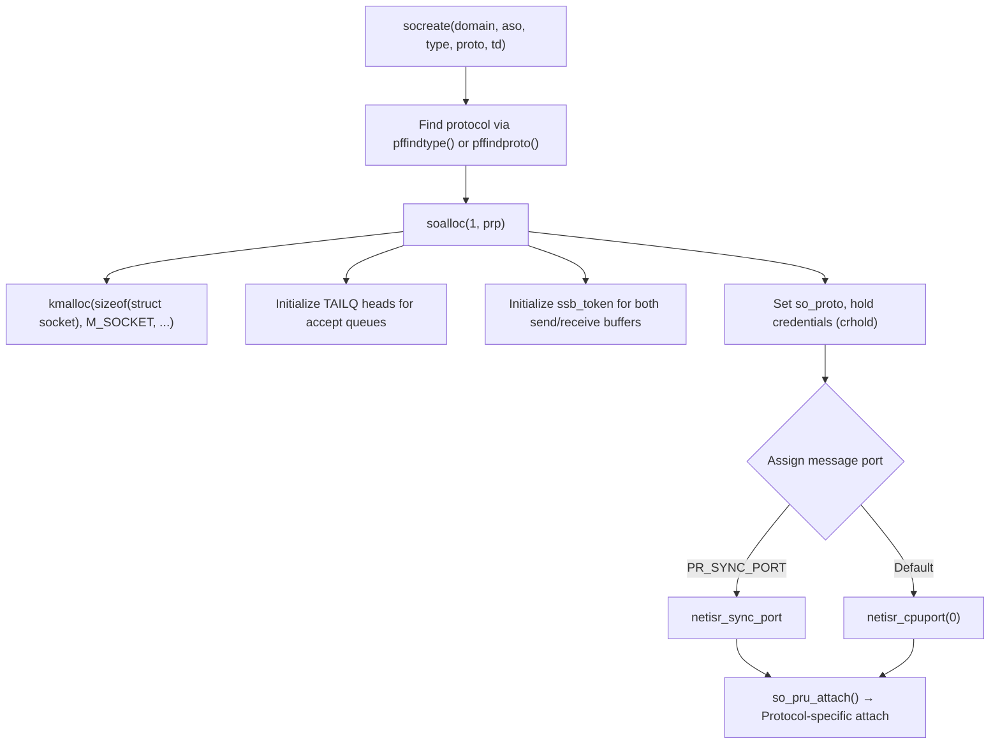
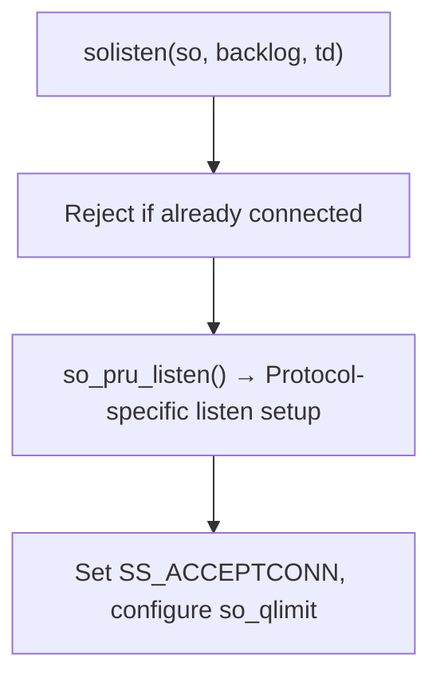
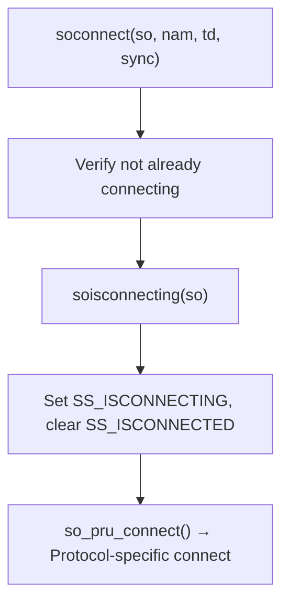
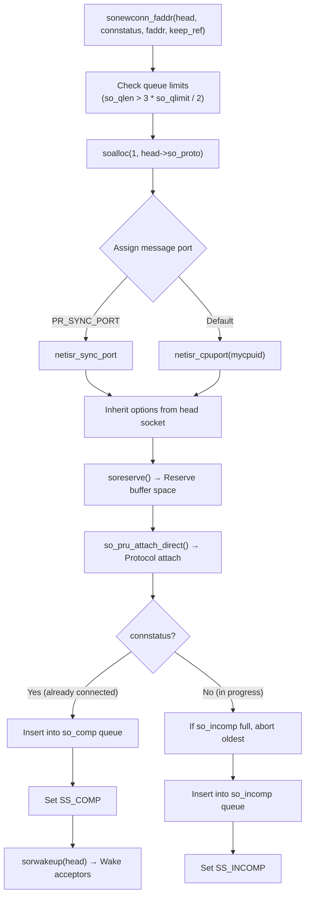
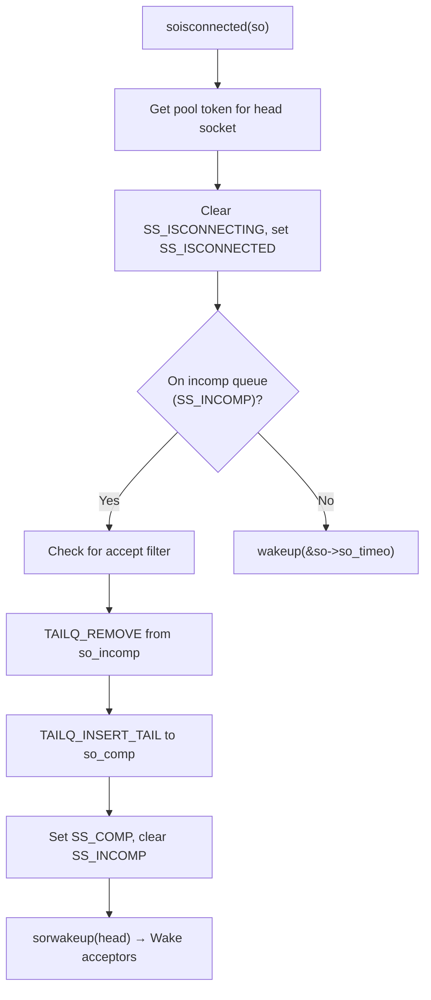
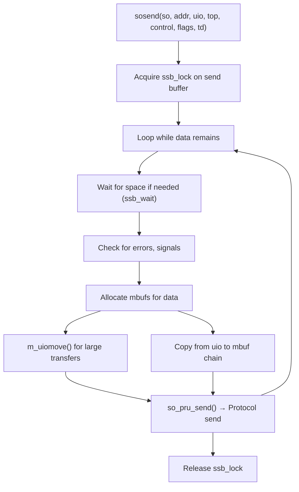
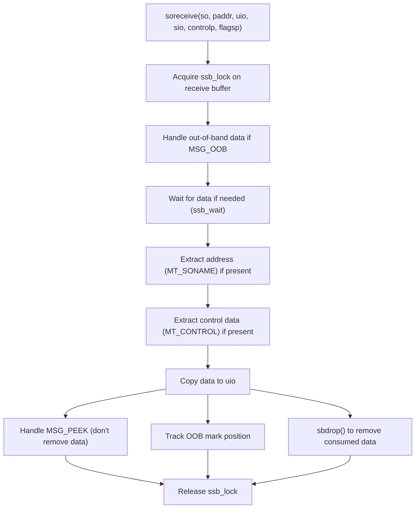
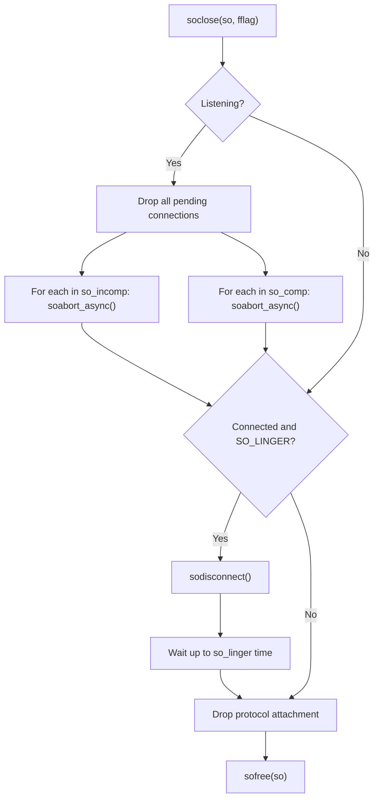
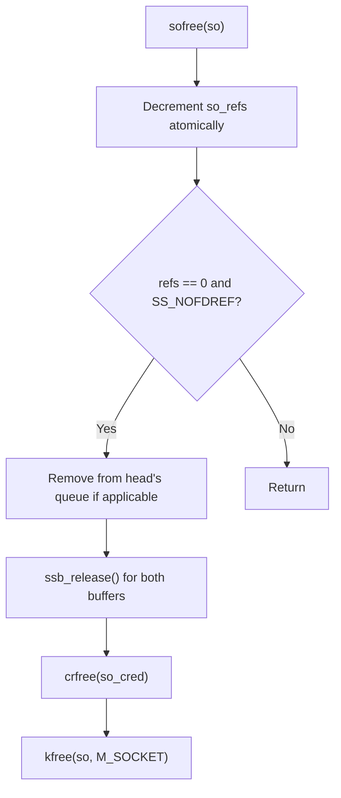

# Socket Layer

The socket layer provides the kernel interface for network communication in DragonFly BSD. It implements the BSD socket API, managing connection state, buffering, and protocol dispatch through a message-passing architecture optimized for multi-processor systems.

## Overview

DragonFly's socket implementation extends the traditional BSD socket model with:

- **Per-socket message ports** for protocol thread routing
- **LWKT tokens** for fine-grained synchronization
- **Reference counting** with atomic operations
- **Signaling socket buffers** with integrated event notification
- **Protocol-specific optimized send/receive paths**

## Source Files

| File | Description |
|------|-------------|
| `sys/kern/uipc_socket.c` | Core socket operations (create, bind, listen, accept, connect, send, receive, close) |
| `sys/kern/uipc_socket2.c` | Socket state management, wakeup routines, new connection handling |
| `sys/kern/uipc_sockbuf.c` | Socket buffer (sockbuf) mbuf chain manipulation |
| `sys/sys/socketvar.h` | Socket structure definitions and macros |
| `sys/sys/sockbuf.h` | Generic socket buffer definitions |

## Data Structures

### struct socket

The primary socket structure (`sys/sys/socketvar.h:116`):

```c
struct socket {
    short   so_type;            /* generic type (SOCK_STREAM, etc.) */
    short   so_options;         /* from socket call (SO_REUSEADDR, etc.) */
    short   so_linger;          /* time to linger while closing */
    short   so_state;           /* internal state flags SS_* */
    void    *so_pcb;            /* protocol control block */
    struct  protosw *so_proto;  /* protocol handle */
    struct  socket *so_head;    /* back pointer to accept socket */
    lwkt_port_t so_port;        /* message port for protocol thread */

    /* Accept queue management */
    TAILQ_HEAD(, socket) so_incomp;  /* incomplete connections */
    TAILQ_HEAD(, socket) so_comp;    /* completed connections */
    TAILQ_ENTRY(socket) so_list;     /* list of unaccepted connections */
    short   so_qlen;            /* count of so_comp */
    short   so_incqlen;         /* count of so_incomp */
    short   so_qlimit;          /* max queued connections */

    /* Error and signal handling */
    u_short so_error;           /* error affecting connection */
    u_short so_rerror;          /* error affecting receiving */
    struct  sigio *so_sigio;    /* async I/O / SIGURG info */
    u_long  so_oobmark;         /* chars to out-of-band mark */

    /* Socket buffers */
    struct signalsockbuf so_rcv;    /* receive buffer */
    struct signalsockbuf so_snd;    /* send buffer */

    /* Upcall support */
    void    (*so_upcall)(struct socket *, void *, int);
    void    *so_upcallarg;

    /* Credentials and reference counting */
    struct  ucred *so_cred;     /* user credentials */
    int     so_refs;            /* reference count */

    /* Async receive message handling */
    struct spinlock so_rcvd_spin;
    struct netmsg_pru_rcvd so_rcvd_msg;

    uint32_t so_user_cookie;    /* user-specified metadata */
};
```

### struct signalsockbuf

The signaling socket buffer wraps the basic `struct sockbuf` with synchronization and event notification (`sys/sys/socketvar.h:72`):

```c
struct signalsockbuf {
    struct sockbuf sb;              /* embedded basic sockbuf */
    struct kqinfo ssb_kq;           /* kqueue/select info */
    struct notifymsglist ssb_mlist; /* pending predicate messages */
    uint32_t ssb_flags;             /* flags (atomic operations) */
    u_int   ssb_timeo;              /* timeout for read/write */
    long    ssb_lowat;              /* low water mark */
    u_long  ssb_hiwat;              /* high water mark */
    u_long  ssb_mbmax;              /* max mbuf chars to use */
    struct lwkt_token ssb_token;    /* frontend/backend serializer */
};
```

The embedded `struct sockbuf` (`sys/sys/sockbuf.h:48`) manages the mbuf chain:

```c
struct sockbuf {
    u_long  sb_cc;              /* actual chars in buffer */
    u_long  sb_mbcnt;           /* chars of mbufs used */
    u_long  sb_cc_prealloc;     /* preallocated data count */
    u_long  sb_mbcnt_prealloc;  /* preallocated mbuf count */
    u_long  sb_climit;          /* data limit for I/O */
    struct  mbuf *sb_mb;        /* the mbuf chain */
    struct  mbuf *sb_lastmbuf;  /* last mbuf in chain */
    struct  mbuf *sb_lastrecord;/* last record in chain */
};
```

### Socket State Flags (SS_*)

Socket states are tracked via `so_state` (`sys/sys/socketvar.h:186`):

| Flag | Value | Description |
|------|-------|-------------|
| `SS_NOFDREF` | 0x0001 | No file descriptor reference |
| `SS_ISCONNECTED` | 0x0002 | Connected to peer |
| `SS_ISCONNECTING` | 0x0004 | Connection in progress |
| `SS_ISDISCONNECTING` | 0x0008 | Disconnection in progress |
| `SS_CANTSENDMORE` | 0x0010 | Cannot send more data |
| `SS_CANTRCVMORE` | 0x0020 | Cannot receive more data |
| `SS_RCVATMARK` | 0x0040 | At out-of-band mark |
| `SS_ISCLOSING` | 0x0080 | Close in progress |
| `SS_ASSERTINPROG` | 0x0100 | Race debugging for sonewconn |
| `SS_ASYNC` | 0x0200 | Async I/O notify enabled |
| `SS_ISCONFIRMING` | 0x0400 | Deciding on connection request |
| `SS_INCOMP` | 0x0800 | Incomplete connection |
| `SS_COMP` | 0x1000 | Complete but unaccepted connection |
| `SS_ISDISCONNECTED` | 0x2000 | Fully disconnected |
| `SS_ACCEPTMECH` | 0x4000 | Allow bind override vs accepted |

### Signaling Sockbuf Flags (SSB_*)

Socket buffer flags (`sys/sys/socketvar.h:90`):

| Flag | Value | Description |
|------|-------|-------------|
| `SSB_LOCK` | 0x0001 | Lock on data queue |
| `SSB_WANT` | 0x0002 | Someone waiting for lock |
| `SSB_WAIT` | 0x0004 | Someone waiting for data/space |
| `SSB_ASYNC` | 0x0010 | Async I/O, need signals |
| `SSB_UPCALL` | 0x0020 | Upcall requested |
| `SSB_NOINTR` | 0x0040 | Operations not interruptible |
| `SSB_KNOTE` | 0x0100 | Kernel note attached |
| `SSB_MEVENT` | 0x0200 | Message event notification needed |
| `SSB_STOP` | 0x0400 | Backpressure indicator |
| `SSB_AUTOSIZE` | 0x0800 | Automatically size buffer |
| `SSB_AUTOLOWAT` | 0x1000 | Automatically scale lowat |
| `SSB_WAKEUP` | 0x2000 | Wakeup event race handling |
| `SSB_PREALLOC` | 0x4000 | Preallocation supported |
| `SSB_STOPSUPP` | 0x8000 | SSB_STOP supported |

## Socket Lifecycle

### Socket Creation

`socreate()` (`sys/kern/uipc_socket.c`) creates a new socket:



Socket allocation uses `kmalloc()` with `M_SOCKET` type. Each socket gets LWKT tokens for its send and receive buffers.

### Binding and Listening

**`sobind()`** binds a socket to a local address:

```c
int sobind(struct socket *so, struct sockaddr *nam, struct thread *td)
{
    return so_pru_bind(so, nam, td);
}
```

**`solisten()`** marks a socket as accepting connections:



The backlog parameter sets `so_qlimit`, clamped between 0 and `somaxconn` (default 128).

### Connection Establishment

#### Active Side (Client)

**`soconnect()`** initiates a connection:



The `sync` parameter controls whether to wait for completion.

#### Passive Side (Server)

**`sonewconn()`** creates a socket for an incoming connection (`sys/kern/uipc_socket2.c:347`):



When a connection completes, `soisconnected()` moves it from `so_incomp` to `so_comp`:



### Accept

**`soaccept()`** extracts a completed connection:

```c
int soaccept(struct socket *so, struct sockaddr **nam)
{
    int error;

    if ((so->so_state & SS_NOFDREF) == 0)
        panic("soaccept: !NOFDREF");
    soclrstate(so, SS_NOFDREF);  /* File descriptor now references socket */
    error = so_pru_accept_direct(so, nam);
    return error;
}
```

The accept happens in `kern_accept()` which removes the socket from `so_comp` queue.

### Data Transfer

#### Sending Data

**`sosend()`** is the generic send function (`sys/kern/uipc_socket.c`):



Protocol-optimized variants:

- **`sosendtcp()`** - Optimized for TCP streams
- **`sosendudp()`** - Optimized for UDP datagrams

#### Receiving Data

**`soreceive()`** is the generic receive function:



**`sorecvtcp()`** provides an optimized path for TCP.

### Socket Shutdown and Close

**`soshutdown()`** performs half-close:

```c
int soshutdown(struct socket *so, int how)
{
    if (how != SHUT_WR)
        sorflush(so);           /* Flush receive buffer */
    if (how != SHUT_RD)
        return so_pru_shutdown(so);
    return 0;
}
```

**`soclose()`** fully closes a socket:



**`sofree()`** handles reference counting and final cleanup:



## Socket Buffers

### Buffer Space Management

**`soreserve()`** reserves space for both buffers (`sys/kern/uipc_socket2.c:664`):

```c
int soreserve(struct socket *so, u_long sndcc, u_long rcvcc, struct rlimit *rl)
{
    if (so->so_snd.ssb_lowat == 0)
        atomic_set_int(&so->so_snd.ssb_flags, SSB_AUTOLOWAT);
    if (ssb_reserve(&so->so_snd, sndcc, so, rl) == 0)
        goto bad;
    if (ssb_reserve(&so->so_rcv, rcvcc, so, rl) == 0)
        goto bad2;
    /* Set default lowat values */
    if (so->so_rcv.ssb_lowat == 0)
        so->so_rcv.ssb_lowat = 1;
    if (so->so_snd.ssb_lowat == 0)
        so->so_snd.ssb_lowat = MCLBYTES;
    ...
}
```

**`ssb_reserve()`** allocates buffer space with resource limits:

```c
int ssb_reserve(struct signalsockbuf *ssb, u_long cc, struct socket *so,
                struct rlimit *rl)
{
    /* Apply sb_max limit for user sockets */
    if (rl && cc > sb_max_adj)
        cc = sb_max_adj;
    /* Account against user's resource limits */
    if (!chgsbsize(so->so_cred->cr_uidinfo, &ssb->ssb_hiwat, cc, ...))
        return 0;
    /* Set mbuf limit based on efficiency factor */
    ssb->ssb_mbmax = cc * sb_efficiency;  /* default: cc * 8 */
    ...
}
```

### Space Calculation

**`ssb_space()`** returns available buffer space (`sys/sys/socketvar.h:270`):

```c
static __inline long ssb_space(struct signalsockbuf *ssb)
{
    long bleft, mleft;

    if (ssb->ssb_flags & SSB_STOP)
        return 0;  /* Backpressure active */
    bleft = ssb->ssb_hiwat - ssb->ssb_cc;
    mleft = ssb->ssb_mbmax - ssb->ssb_mbcnt;
    return (bleft < mleft) ? bleft : mleft;
}
```

### Appending Data

**`sbappend()`** appends mbufs to the buffer (`sys/kern/uipc_sockbuf.c:83`):

```c
void sbappend(struct sockbuf *sb, struct mbuf *m)
{
    struct mbuf *n;

    if (m) {
        n = sb->sb_lastrecord;
        if (n) {
            if (n->m_flags & M_EOR) {
                sbappendrecord(sb, m);  /* Start new record */
                return;
            }
        }
        n = sb->sb_lastmbuf;
        if (n) {
            if (n->m_flags & M_EOR) {
                sbappendrecord(sb, m);
                return;
            }
        }
        sbcompress(sb, m, n);  /* Compress into existing */
    }
}
```

**`sbappendstream()`** is optimized for stream protocols (TCP):

```c
void sbappendstream(struct sockbuf *sb, struct mbuf *m)
{
    KKASSERT(m->m_nextpkt == NULL);
    sbcompress(sb, m, sb->sb_lastmbuf);
}
```

**`sbappendrecord()`** starts a new record:

```c
void sbappendrecord(struct sockbuf *sb, struct mbuf *m0)
{
    /* Break first mbuf off from chain */
    firstmbuf = m0;
    secondmbuf = m0->m_next;
    m0->m_next = NULL;

    /* Insert as new record */
    if (sb->sb_mb == NULL)
        sb->sb_mb = firstmbuf;
    else
        sb->sb_lastrecord->m_nextpkt = firstmbuf;
    sb->sb_lastrecord = firstmbuf;
    sb->sb_lastmbuf = firstmbuf;
    sballoc(sb, firstmbuf);

    /* Compress rest of chain */
    sbcompress(sb, secondmbuf, firstmbuf);
}
```

**`sbappendaddr()`** prepends sender's address (for datagram sockets):

```c
int sbappendaddr(struct sockbuf *sb, const struct sockaddr *asa,
                 struct mbuf *m0, struct mbuf *control)
{
    /* Allocate mbuf for address */
    MGET(m, M_NOWAIT, MT_SONAME);
    m->m_len = asa->sa_len;
    bcopy(asa, mtod(m, caddr_t), asa->sa_len);
    
    /* Chain: address → control → data */
    if (n)  /* control tail */
        n->m_next = m0;
    else
        control = m0;
    m->m_next = control;
    
    /* Insert as new record */
    ...
}
```

### Compression

**`sbcompress()`** coalesces small mbufs (`sys/kern/uipc_sockbuf.c:339`):

```c
void sbcompress(struct sockbuf *sb, struct mbuf *m, struct mbuf *tailm)
{
    while (m) {
        /* Skip empty mbufs unless EOR */
        if (m->m_len == 0 && (eor == 0 || ...)) {
            /* defer to free_chain */
            continue;
        }

        /* Try to coalesce with preceding mbuf */
        if (tailm && !(tailm->m_flags & (M_EOR | M_SOLOCKED)) &&
            M_WRITABLE(tailm) &&
            m->m_len <= MCLBYTES / 4 &&     /* Don't copy too much */
            m->m_len <= M_TRAILINGSPACE(tailm) &&
            tailm->m_type == m->m_type) {
            /* Copy data to tail of existing mbuf */
            bcopy(mtod(m, caddr_t),
                  mtod(tailm, caddr_t) + tailm->m_len,
                  m->m_len);
            tailm->m_len += m->m_len;
            sb->sb_cc += m->m_len;
            /* Move to free chain */
            continue;
        }

        /* Insert whole mbuf */
        if (tailm == NULL) {
            sb->sb_mb = m;
            sb->sb_lastrecord = m;
        } else {
            tailm->m_next = m;
        }
        sb->sb_lastmbuf = m;
        sballoc(sb, m);
        tailm = m;
        m = m->m_next;
        tailm->m_next = NULL;
    }
}
```

### Dropping Data

**`sbdrop()`** removes data from the front (`sys/kern/uipc_sockbuf.c:472`):

```c
void sbdrop(struct sockbuf *sb, int len)
{
    struct mbuf *m;

    crit_enter();
    m = sb->sb_mb;
    while (m && len > 0) {
        if (m->m_len > len) {
            m->m_len -= len;
            m->m_data += len;
            sb->sb_cc -= len;
            break;
        }
        len -= m->m_len;
        m = sbunlinkmbuf(sb, m, &free_chain);
        if (m == NULL && len)
            m = sb->sb_mb;  /* Move to next record */
    }
    /* Remove trailing zero-length mbufs */
    while (m && m->m_len == 0)
        m = sbunlinkmbuf(sb, m, &free_chain);
    crit_exit();
    
    if (free_chain)
        m_freem(free_chain);
}
```

**`sbdroprecord()`** removes entire first record:

```c
void sbdroprecord(struct sockbuf *sb)
{
    struct mbuf *m, *n;

    m = sb->sb_mb;
    if (m) {
        sb->sb_mb = m->m_nextpkt;  /* Advance to next record */
        if (sb->sb_mb == NULL) {
            sb->sb_lastrecord = NULL;
            sb->sb_lastmbuf = NULL;
        }
        m->m_nextpkt = NULL;
        for (n = m; n; n = n->m_next)
            sbfree(sb, n);
        m_freem(m);
    }
}
```

## Wakeup and Notification

### sowakeup()

**`sowakeup()`** notifies waiters of buffer state changes (`sys/kern/uipc_socket2.c:551`):

```c
void sowakeup(struct socket *so, struct signalsockbuf *ssb)
{
    uint32_t flags;

    /* Fast path: if WAKEUP already set and no special features */
    flags = atomic_fetchadd_int(&ssb->ssb_flags, 0);
    if ((flags & SSB_NOTIFY_MASK) == 0) {
        if (flags & SSB_WAKEUP)
            return;
    }

    /* Check conditions and set WAKEUP flag */
    for (;;) {
        long space;
        flags = ssb->ssb_flags;

        if (ssb->ssb_flags & SSB_PREALLOC)
            space = ssb_space_prealloc(ssb);
        else
            space = ssb_space(ssb);

        /* Wake if: space available, data ready, or end condition */
        if ((ssb == &so->so_snd && space >= ssb->ssb_lowat) ||
            (ssb == &so->so_rcv && ssb->ssb_cc >= ssb->ssb_lowat) ||
            (ssb == &so->so_snd && (so->so_state & SS_CANTSENDMORE)) ||
            (ssb == &so->so_rcv && (so->so_state & SS_CANTRCVMORE))) {
            if (atomic_cmpset_int(&ssb->ssb_flags, flags,
                              (flags | SSB_WAKEUP) & ~SSB_WAIT)) {
                if (flags & SSB_WAIT)
                    wakeup(&ssb->ssb_cc);
                break;
            }
        } else {
            break;
        }
    }

    /* Handle async signals and upcalls */
    if ((so->so_state & SS_ASYNC) && so->so_sigio != NULL)
        pgsigio(so->so_sigio, SIGIO, 0);
    if (ssb->ssb_flags & SSB_UPCALL)
        (*so->so_upcall)(so, so->so_upcallarg, M_NOWAIT);
    KNOTE(&ssb->ssb_kq.ki_note, 0);

    /* Process predicate message notifications */
    if (ssb->ssb_flags & SSB_MEVENT) {
        /* Scan ssb_mlist and reply to satisfied predicates */
        ...
    }
}
```

Convenience macros:
- `sorwakeup(so)` → `sowakeup(so, &so->so_rcv)`
- `sowwakeup(so)` → `sowakeup(so, &so->so_snd)`

### ssb_wait()

**`ssb_wait()`** blocks waiting for buffer state change (`sys/kern/uipc_socket2.c:103`):

```c
int ssb_wait(struct signalsockbuf *ssb)
{
    uint32_t flags;
    int pflags, error;

    pflags = (ssb->ssb_flags & SSB_NOINTR) ? 0 : PCATCH;

    for (;;) {
        flags = ssb->ssb_flags;
        cpu_ccfence();

        /* Check if WAKEUP already set */
        if (flags & SSB_WAKEUP) {
            if (atomic_cmpset_int(&ssb->ssb_flags, flags,
                                  flags & ~SSB_WAKEUP)) {
                error = 0;
                break;
            }
            continue;
        }

        /* Set WAIT and sleep */
        tsleep_interlock(&ssb->ssb_cc, pflags);
        if (atomic_cmpset_int(&ssb->ssb_flags, flags, flags | SSB_WAIT)) {
            error = tsleep(&ssb->ssb_cc, pflags | PINTERLOCKED,
                           "sbwait", ssb->ssb_timeo);
            break;
        }
    }
    return error;
}
```

### Connection State Transitions

**`soisconnecting()`** - marks connection attempt starting:
```c
void soisconnecting(struct socket *so)
{
    soclrstate(so, SS_ISCONNECTED | SS_ISDISCONNECTING);
    sosetstate(so, SS_ISCONNECTING);
}
```

**`soisdisconnecting()`** - marks graceful disconnect starting:
```c
void soisdisconnecting(struct socket *so)
{
    soclrstate(so, SS_ISCONNECTING);
    sosetstate(so, SS_ISDISCONNECTING | SS_CANTRCVMORE | SS_CANTSENDMORE);
    wakeup(&so->so_timeo);
    sowwakeup(so);
    sorwakeup(so);
}
```

**`soisdisconnected()`** - marks socket fully disconnected:
```c
void soisdisconnected(struct socket *so)
{
    soclrstate(so, SS_ISCONNECTING | SS_ISCONNECTED | SS_ISDISCONNECTING);
    sosetstate(so, SS_CANTRCVMORE | SS_CANTSENDMORE | SS_ISDISCONNECTED);
    wakeup(&so->so_timeo);
    sbdrop(&so->so_snd.sb, so->so_snd.ssb_cc);  /* Discard pending sends */
    sowwakeup(so);
    sorwakeup(so);
}
```

**`socantsendmore()`** / **`socantrcvmore()`** - half-close notifications:
```c
void socantsendmore(struct socket *so)
{
    sosetstate(so, SS_CANTSENDMORE);
    sowwakeup(so);
}

void socantrcvmore(struct socket *so)
{
    sosetstate(so, SS_CANTRCVMORE);
    sorwakeup(so);
}
```

## Socket Options

### sosetopt()

**`sosetopt()`** sets socket options (`sys/kern/uipc_socket.c`):

```c
int sosetopt(struct socket *so, struct sockopt *sopt)
{
    switch (sopt->sopt_name) {
    case SO_LINGER:
        /* Set linger time on close */
        so->so_linger = l.l_linger;
        if (l.l_onoff)
            so->so_options |= SO_LINGER;
        else
            so->so_options &= ~SO_LINGER;
        break;

    case SO_SNDBUF:
        /* Set send buffer size */
        ssb_reserve(&so->so_snd, optval, so, ...);
        break;

    case SO_RCVBUF:
        /* Set receive buffer size */
        ssb_reserve(&so->so_rcv, optval, so, ...);
        break;

    case SO_SNDLOWAT:
    case SO_RCVLOWAT:
        /* Set low water marks */
        ssb->ssb_lowat = (optval > ssb->ssb_hiwat) ?
                         ssb->ssb_hiwat : optval;
        break;

    case SO_SNDTIMEO:
    case SO_RCVTIMEO:
        /* Set timeout values */
        ssb->ssb_timeo = val;
        break;

    /* Boolean options */
    case SO_DEBUG:
    case SO_KEEPALIVE:
    case SO_DONTROUTE:
    case SO_BROADCAST:
    case SO_REUSEADDR:
    case SO_REUSEPORT:
    case SO_OOBINLINE:
    case SO_TIMESTAMP:
    case SO_NOSIGPIPE:
        if (optval)
            so->so_options |= sopt->sopt_name;
        else
            so->so_options &= ~sopt->sopt_name;
        break;
    }

    /* Forward to protocol if handler exists */
    if (so->so_proto->pr_ctloutput)
        so_pr_ctloutput(so, sopt);
}
```

### sogetopt()

**`sogetopt()`** retrieves socket options with similar structure, copying values to user space.

## kqueue Integration

### Filter Operations

Socket kqueue filters (`sys/kern/uipc_socket.c:2549`):

```c
int sokqfilter(struct file *fp, struct knote *kn)
{
    struct socket *so = (struct socket *)kn->kn_fp->f_data;

    switch (kn->kn_filter) {
    case EVFILT_READ:
        if (so->so_options & SO_ACCEPTCONN)
            kn->kn_fop = &solisten_filtops;  /* Listen socket */
        else
            kn->kn_fop = &soread_filtops;    /* Data socket */
        ssb = &so->so_rcv;
        break;
    case EVFILT_WRITE:
        kn->kn_fop = &sowrite_filtops;
        ssb = &so->so_snd;
        break;
    case EVFILT_EXCEPT:
        kn->kn_fop = &soexcept_filtops;
        ssb = &so->so_rcv;
        break;
    }

    knote_insert(&ssb->ssb_kq.ki_note, kn);
    atomic_set_int(&ssb->ssb_flags, SSB_KNOTE);
    return 0;
}
```

### Read Filter

**`filt_soread()`** checks read readiness:

```c
static int filt_soread(struct knote *kn, long hint)
{
    struct socket *so = (struct socket *)kn->kn_fp->f_data;

    /* Handle out-of-band data request */
    if (kn->kn_sfflags & NOTE_OOB) {
        if (so->so_oobmark || (so->so_state & SS_RCVATMARK)) {
            kn->kn_fflags |= NOTE_OOB;
            return 1;
        }
        return 0;
    }

    kn->kn_data = so->so_rcv.ssb_cc;  /* Available data */

    /* Handle EOF conditions */
    if (so->so_state & SS_CANTRCVMORE) {
        if (kn->kn_data == 0)
            kn->kn_flags |= EV_NODATA;
        kn->kn_flags |= EV_EOF;
        kn->kn_fflags = so->so_error;
        if (so->so_state & SS_CANTSENDMORE)
            kn->kn_flags |= EV_HUP;
        return 1;
    }

    if (so->so_error || so->so_rerror)
        return 1;

    /* Check low water mark */
    if (kn->kn_sfflags & NOTE_LOWAT)
        return (kn->kn_data >= kn->kn_sdata);
    return (kn->kn_data >= so->so_rcv.ssb_lowat) ||
           !TAILQ_EMPTY(&so->so_comp);
}
```

### Listen Filter

**`filt_solisten()`** checks for pending connections:

```c
static int filt_solisten(struct knote *kn, long hint)
{
    struct socket *so = (struct socket *)kn->kn_fp->f_data;
    int qlen = so->so_qlen;

    if (soavailconn > 0 && qlen > soavailconn)
        qlen = soavailconn;
    kn->kn_data = qlen;

    return !TAILQ_EMPTY(&so->so_comp);
}
```

## Synchronization

### State Manipulation

Socket state is modified atomically:

```c
static __inline void sosetstate(struct socket *so, int state)
{
    atomic_set_int(&so->so_state, state);
}

static __inline void soclrstate(struct socket *so, int state)
{
    atomic_clear_int(&so->so_state, state);
}
```

### Buffer Locking

**`_ssb_lock()`** acquires exclusive buffer access (`sys/kern/uipc_socket2.c:148`):

```c
int _ssb_lock(struct signalsockbuf *ssb)
{
    uint32_t flags;
    int pflags, error;

    pflags = (ssb->ssb_flags & SSB_NOINTR) ? 0 : PCATCH;

    for (;;) {
        flags = ssb->ssb_flags;
        if (flags & SSB_LOCK) {
            /* Already locked, wait */
            tsleep_interlock(&ssb->ssb_flags, pflags);
            if (atomic_cmpset_int(&ssb->ssb_flags, flags,
                                  flags | SSB_WANT)) {
                error = tsleep(&ssb->ssb_flags,
                               pflags | PINTERLOCKED, "sblock", 0);
                if (error)
                    break;
            }
        } else {
            /* Acquire lock */
            if (atomic_cmpset_int(&ssb->ssb_flags, flags,
                                  flags | SSB_LOCK)) {
                lwkt_gettoken(&ssb->ssb_token);
                error = 0;
                break;
            }
        }
    }
    return error;
}
```

The inline `ssb_lock()` provides the fast path.

### Reference Counting

Socket references prevent premature deallocation:

```c
static __inline void soreference(struct socket *so)
{
    atomic_add_int(&so->so_refs, 1);
}

void sofree(struct socket *so)
{
    /* Atomically decrement and check */
    if (atomic_fetchadd_int(&so->so_refs, -1) != 1)
        return;
    /* Last reference, actually free if SS_NOFDREF */
    ...
}
```

## Sysctl Parameters

Key tunable parameters (`sys/kern/uipc_socket2.c`):

| Sysctl | Default | Description |
|--------|---------|-------------|
| `kern.ipc.maxsockbuf` | 512KB | Maximum socket buffer size |
| `kern.ipc.maxsockets` | varies | Maximum number of sockets |
| `kern.ipc.sockbuf_waste_factor` | 8 | Buffer efficiency factor |
| `kern.ipc.soaccept_reuse` | 1 | Allow quick local port reuse |
| `kern.ipc.somaxconn` | 128 | Maximum listen backlog |

## Accept Filters

Accept filters allow deferred connection acceptance:

```c
struct accept_filter {
    char    accf_name[16];
    void    (*accf_callback)(struct socket *so, void *arg, int waitflag);
    void *  (*accf_create)(struct socket *so, char *arg);
    void    (*accf_destroy)(struct socket *so);
    SLIST_ENTRY(accept_filter) accf_next;
};
```

When `SO_ACCEPTFILTER` is set, new connections go through the filter callback before being moved to `so_comp`. This allows filtering based on initial data (e.g., HTTP request line).

## Error Handling

### Connection Errors

Errors are stored in `so_error` and propagated to waiters:

```c
/* In protocol code when error occurs */
so->so_error = error;
sorwakeup(so);
sowwakeup(so);
```

### Receive Buffer Errors

Receive-specific errors use `so_rerror`:

```c
void soroverflow(struct socket *so)
{
    if (so->so_options & SO_RERROR) {
        so->so_rerror = ENOBUFS;
        sorwakeup(so);
    }
}
```

## See Also

- [Mbufs](mbufs.md) - Memory buffer management
- [IPC Overview](../ipc.md) - Inter-process communication
- [LWKT Threading](../lwkt.md) - Thread subsystem
- [Synchronization](../synchronization.md) - Locking primitives
