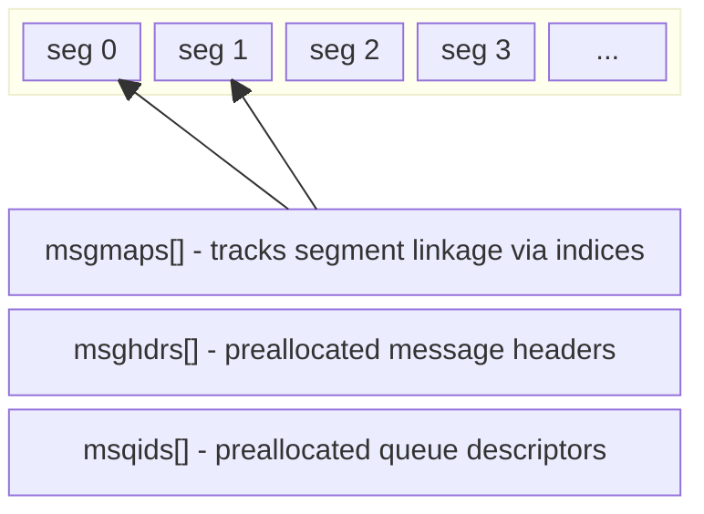

# System V Message Queues

System V message queues provide inter-process communication through
kernel-managed message buffers. DragonFly's implementation derives from
FreeBSD and follows the SVID (System V Interface Definition) specification.

**Source files:**
- `sys/kern/sysv_msg.c` - Implementation
- `sys/sys/msg.h` - Public interface

## Data Structures

### Message Queue Descriptor

```c
struct msqid_ds {
    struct  ipc_perm msg_perm;  /* permission bits */
    struct  msg *msg_first;     /* first message in queue */
    struct  msg *msg_last;      /* last message in queue */
    msglen_t msg_cbytes;        /* bytes currently in queue */
    msgqnum_t msg_qnum;         /* number of messages */
    msglen_t msg_qbytes;        /* max bytes allowed */
    pid_t   msg_lspid;          /* last msgsnd() pid */
    pid_t   msg_lrpid;          /* last msgrcv() pid */
    time_t  msg_stime;          /* last msgsnd() time */
    time_t  msg_rtime;          /* last msgrcv() time */
    time_t  msg_ctime;          /* last msgctl() time */
};
```

Defined in `sys/sys/msg.h:68-84`.

### Internal Message Header

```c
struct msg {
    struct  msg *msg_next;  /* next msg in chain */
    long    msg_type;       /* message type (>0) or 0 if free */
    u_short msg_ts;         /* message size in bytes */
    short   msg_spot;       /* index of first segment in msgpool */
};
```

Defined in `sys/kern/sysv_msg.c:45-52`.

### Segment Map

```c
struct msgmap {
    short   next;   /* next segment index, or -1 if available */
};
```

Defined in `sys/kern/sysv_msg.c:104-108`.

## Memory Layout

Messages are stored in a segmented buffer pool:



The `msgpool` contains MSGMAX bytes divided into segments.

Each segment is `MSGSSZ` bytes (default 8, must be power of 2 between 8-1024).
Segments are linked via `msgmaps[].next` forming a free list or per-message chain.

## System Limits

| Parameter | Default | Description |
|-----------|---------|-------------|
| `MSGSSZ` | 8 | Segment size (bytes, power of 2) |
| `MSGSEG` | 2048 | Total segments (<32767) |
| `MSGMAX` | MSGSSZ*MSGSEG | Max message size |
| `MSGMNB` | 2048 | Max bytes per queue |
| `MSGMNI` | 40 | Max queue identifiers |
| `MSGTQL` | 40 | Max messages system-wide |

Defined in `sys/kern/sysv_msg.c:55-70`.

## Synchronization

A single LWKT token protects all message queue operations:

```c
static struct lwkt_token msg_token = LWKT_TOKEN_INITIALIZER(msg_token);
```

Defined at `sys/kern/sysv_msg.c:119`.

### Queue Locking

The `MSG_LOCKED` flag (value `01000`) in `msg_perm.mode` prevents queue
reallocation while a process is copying message data to/from userspace:

```c
#define MSG_LOCKED  01000
```

This lock serializes concurrent senders when resources are scarce, ensuring
first-come-first-served semantics.

## Initialization

`msginit()` runs at `SI_SUB_SYSV_MSG`:

1. Allocates `msgpool` (MSGMAX bytes)
2. Allocates `msgmaps[]` (MSGSEG entries)
3. Allocates `msghdrs[]` (MSGTQL entries)
4. Allocates `msqids[]` (MSGMNI entries)
5. Validates `msgssz` is power of 2 in [8,1024]
6. Links free segment list via `free_msgmaps`
7. Links free header list via `free_msghdrs`
8. Marks all queue slots as available (`msg_qbytes = 0`)

See `sys/kern/sysv_msg.c:121-174`.

## System Calls

### msgget - Create or Access Queue

```c
int sys_msgget(struct sysmsg *sysmsg, const struct msgget_args *uap)
```

**Arguments:** `key`, `msgflg`

**Operation:**
1. Check jail capabilities (`PRISON_CAP_SYS_SYSVIPC`)
2. If `key != IPC_PRIVATE`, search for existing queue with matching key
3. If found and `IPC_CREAT|IPC_EXCL` set, return `EEXIST`
4. If not found and `IPC_CREAT` set, allocate new slot
5. Initialize permissions, timestamps, byte limits
6. Return unique msqid: `(index & 0xffff) | (seq << 16)`

The sequence number prevents stale ID reuse after queue deletion.

See `sys/kern/sysv_msg.c:344-450`.

### msgsnd - Send Message

```c
int sys_msgsnd(struct sysmsg *sysmsg, const struct msgsnd_args *uap)
```

**Arguments:** `msqid`, `msgp`, `msgsz`, `msgflg`

**Operation:**
1. Validate msqid and permissions (`IPC_W`)
2. Calculate segments needed: `howmany(msgsz, msgssz)`
3. Wait loop for resources:
   - Queue not locked
   - Space available (`msgsz + msg_cbytes <= msg_qbytes`)
   - Enough free segments
   - Free message header available
4. If `IPC_NOWAIT` and resources unavailable, return `EAGAIN`
5. Set `MSG_LOCKED` to prevent queue reallocation during copy
6. Allocate message header from `free_msghdrs`
7. Allocate segments from `free_msgmaps`, linking them
8. `copyin()` message type (must be > 0) and body segment by segment
9. Append to queue (`msg_last->msg_next = msghdr`)
10. Update statistics, clear `MSG_LOCKED`, `wakeup()` waiters

See `sys/kern/sysv_msg.c:455-782`.

### msgrcv - Receive Message

```c
int sys_msgrcv(struct sysmsg *sysmsg, const struct msgrcv_args *uap)
```

**Arguments:** `msqid`, `msgp`, `msgsz`, `msgtyp`, `msgflg`

**Message Selection by `msgtyp`:**
- `msgtyp == 0`: First message (FIFO)
- `msgtyp > 0`: First message with `msg_type == msgtyp`
- `msgtyp < 0`: First message with `msg_type <= |msgtyp|` (lowest type first)

**Operation:**
1. Validate msqid and permissions (`IPC_R`)
2. Search queue for matching message
3. If not found and `IPC_NOWAIT` set, return `ENOMSG`
4. If not found, `tsleep()` on queue address
5. Remove message from queue, update `msg_first`/`msg_last`
6. `copyout()` message type and body segment by segment
7. If `msgsz < msg_ts` and `MSG_NOERROR` not set, return `E2BIG`
8. Free message header and segments via `msg_freehdr()`
9. `wakeup()` waiters, return actual bytes copied

See `sys/kern/sysv_msg.c:787-1070`.

### msgctl - Control Operations

```c
int sys_msgctl(struct sysmsg *sysmsg, const struct msgctl_args *uap)
```

**Commands:**

| Command | Description |
|---------|-------------|
| `IPC_STAT` | Copy `msqid_ds` to user buffer |
| `IPC_SET` | Update uid, gid, mode, qbytes |
| `IPC_RMID` | Remove queue and free all messages |

**IPC_RMID Operation:**
1. Free all message headers via `msg_freehdr()`
2. Set `msg_qbytes = 0` to mark slot available
3. `wakeup()` all blocked processes (they get `EIDRM`)

See `sys/kern/sysv_msg.c:202-339`.

## Segment Allocation

### Allocation (in msgsnd)

```c
while (segs_needed > 0) {
    next = free_msgmaps;
    free_msgmaps = msgmaps[next].next;
    nfree_msgmaps--;
    msgmaps[next].next = msghdr->msg_spot;
    msghdr->msg_spot = next;
    segs_needed--;
}
```

Segments are prepended to the message's chain, so the chain is reversed
from allocation order. See `sys/kern/sysv_msg.c:657-675`.

### Deallocation (msg_freehdr)

```c
static void msg_freehdr(struct msg *msghdr)
{
    while (msghdr->msg_ts > 0) {
        next = msgmaps[msghdr->msg_spot].next;
        msgmaps[msghdr->msg_spot].next = free_msgmaps;
        free_msgmaps = msghdr->msg_spot;
        nfree_msgmaps++;
        msghdr->msg_spot = next;
        msghdr->msg_ts -= msginfo.msgssz;
    }
    msghdr->msg_next = free_msghdrs;
    free_msghdrs = msghdr;
}
```

See `sys/kern/sysv_msg.c:176-197`.

## ID Encoding

Message queue IDs encode both index and sequence number:

```c
#define MSQID(ix,ds)    ((ix) & 0xffff | (((ds).msg_perm.seq << 16) & 0xffff0000))
#define MSQID_IX(id)    ((id) & 0xffff)
#define MSQID_SEQ(id)   (((id) >> 16) & 0xffff)
```

The sequence number increments on each allocation, preventing use of
stale IDs after a queue is removed and its slot reused.

See `sys/kern/sysv_msg.c:96-98`.

## Jail Support

All system calls check jail capabilities before proceeding:

```c
if (pr && !PRISON_CAP_ISSET(pr->pr_caps, PRISON_CAP_SYS_SYSVIPC))
    return (ENOSYS);
```

## Sysctl Interface

| Sysctl | Type | Description |
|--------|------|-------------|
| `kern.ipc.msgmax` | RD | Max chars in a message |
| `kern.ipc.msgmni` | RD | Max queue identifiers |
| `kern.ipc.msgmnb` | RD | Max chars in queue |
| `kern.ipc.msgtql` | RD | Max messages in system |
| `kern.ipc.msgssz` | RD | Segment size |
| `kern.ipc.msgseg` | RD | Number of segments |
| `kern.ipc.msqids` | RD | Queue ID array (raw) |

Tunable at boot via `kern.ipc.msgseg`, `kern.ipc.msgssz`, `kern.ipc.msgmni`.

See `sys/kern/sysv_msg.c:1079-1096`.

## Error Handling

| Error | Condition |
|-------|-----------|
| `ENOSYS` | Jail lacks SYSVIPC capability |
| `EINVAL` | Invalid msqid, deleted queue, or bad parameters |
| `EEXIST` | `IPC_CREAT|IPC_EXCL` and queue exists |
| `ENOENT` | Queue not found, no `IPC_CREAT` |
| `ENOSPC` | No free queue slots |
| `EAGAIN` | `IPC_NOWAIT` and resources unavailable |
| `EIDRM` | Queue deleted while waiting |
| `EINTR` | Signal received while waiting |
| `E2BIG` | Message too large, `MSG_NOERROR` not set |
| `ENOMSG` | No matching message, `IPC_NOWAIT` set |
