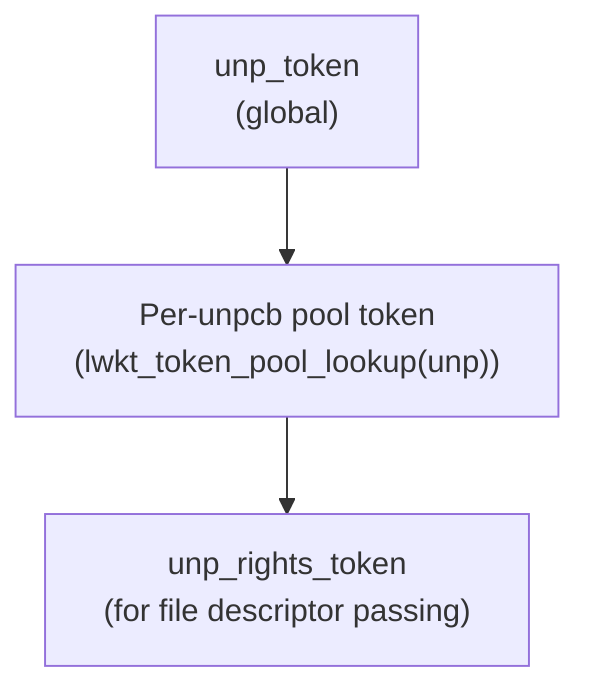
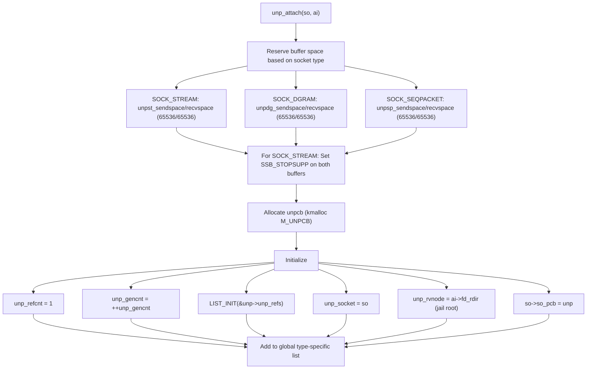
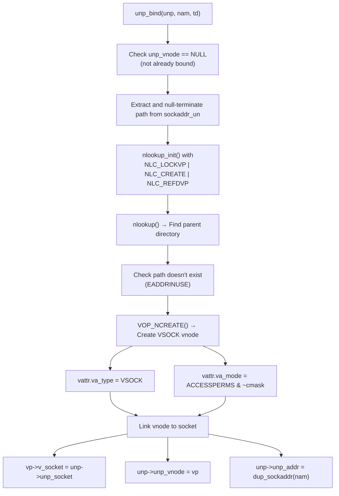
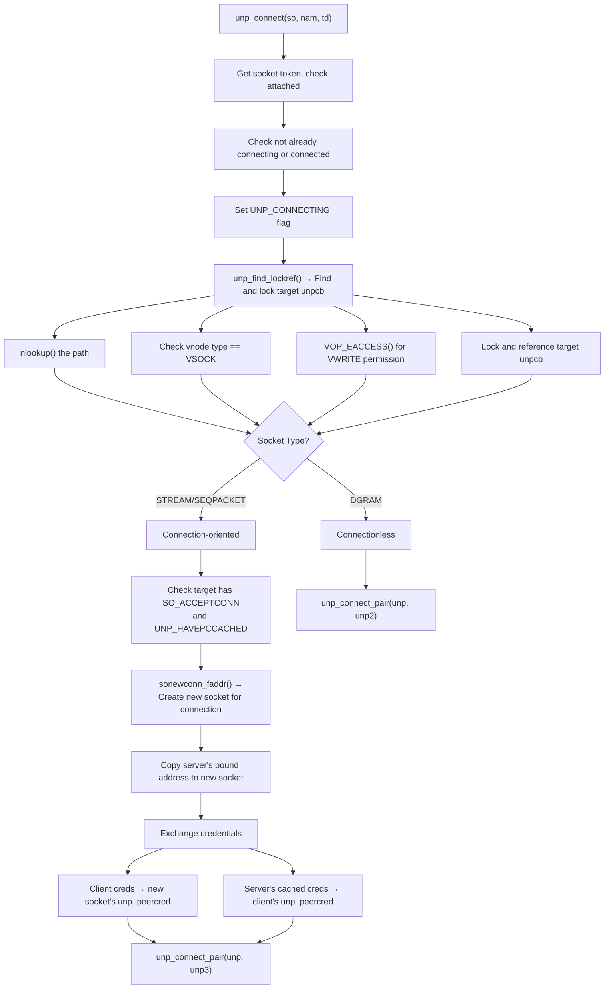
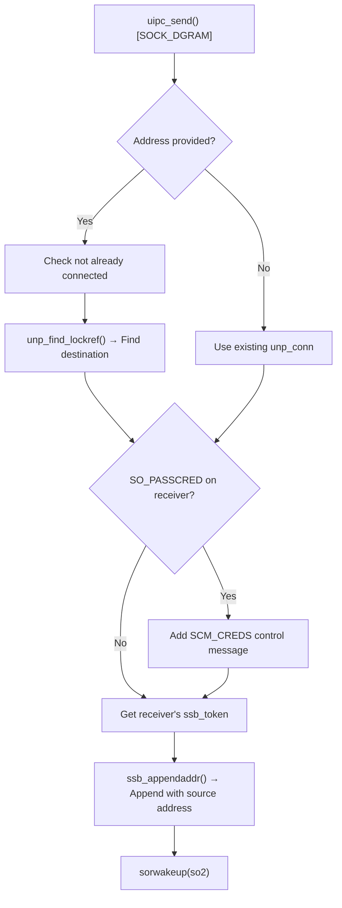
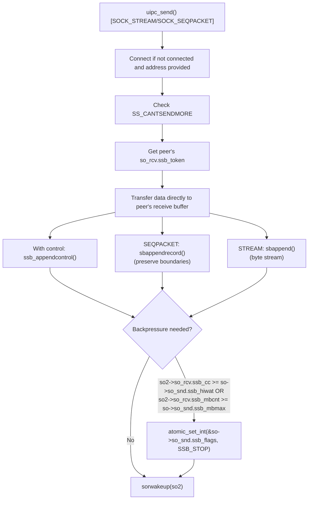
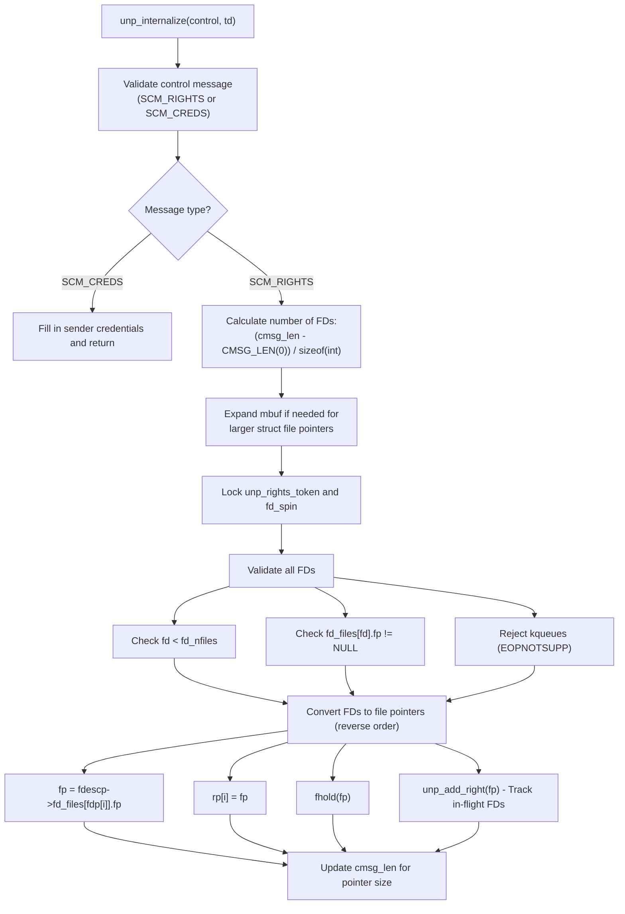
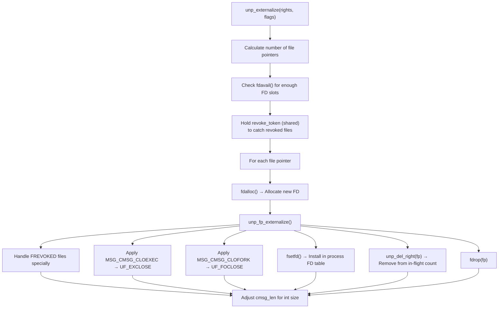
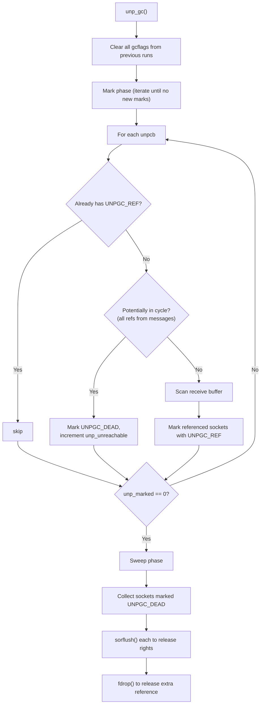
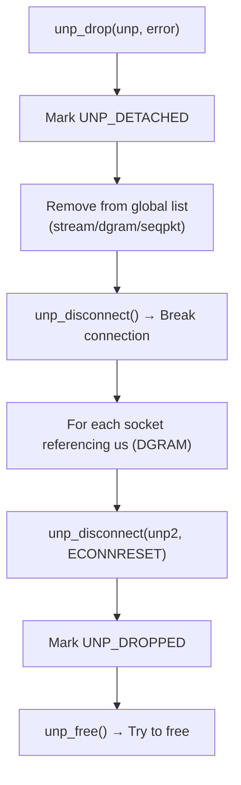

# Unix Domain Sockets

Unix domain sockets provide local inter-process communication using the familiar socket API. DragonFly BSD implements Unix domain sockets with LWKT token-based synchronization and reference counting for safe concurrent access across multiple processors.

## Overview

Unix domain sockets (also called local sockets) enable efficient communication between processes on the same machine without network protocol overhead. Key features include:

- **Filesystem binding** - Sockets can be bound to pathnames in the filesystem
- **File descriptor passing** - Transfer open file descriptors between processes
- **Credential passing** - Automatic sender credential transmission
- **Three socket types** - SOCK_STREAM, SOCK_DGRAM, and SOCK_SEQPACKET
- **Direct mbuf transfer** - Zero-copy data delivery to peer's receive buffer
- **Garbage collection** - Automatic cleanup of in-flight file descriptors

## Source Files

| File | Description |
|------|-------------|
| `sys/kern/uipc_usrreq.c` | Unix domain socket protocol implementation |
| `sys/sys/unpcb.h` | Unix domain protocol control block definitions |
| `sys/sys/un.h` | Unix domain socket address structure |

## Data Structures

### struct unpcb

The Unix domain protocol control block (`sys/sys/unpcb.h:68`):

```c
struct unpcb {
    struct socket   *unp_socket;    /* pointer back to socket */
    struct unpcb    *unp_conn;      /* control block of connected socket */
    int             unp_flags;      /* flags */
    int             unp_refcnt;     /* reference count */
    struct unp_head unp_refs;       /* referencing socket linked list (DGRAM) */
    LIST_ENTRY(unpcb) unp_reflink;  /* link in unp_refs list */
    struct sockaddr_un *unp_addr;   /* bound address of socket */
    struct xucred   unp_peercred;   /* peer credentials, if applicable */
    int             unp_msgcount;   /* # of cmsgs this unp are in */
    int             unp_gcflags;    /* flags reserved for unp GC to use */
    struct file     *unp_fp;        /* corresponding fp if unp is in cmsg */
    long            unp_unused01;
    struct vnode    *unp_vnode;     /* if associated with file */
    struct vnode    *unp_rvnode;    /* root vp for creating process (jail) */
    TAILQ_ENTRY(unpcb) unp_link;    /* glue on list of all PCBs */
    unp_gen_t       unp_gencnt;     /* generation count of this instance */
};
```

### struct sockaddr_un

The Unix domain socket address (`sys/sys/un.h`):

```c
struct sockaddr_un {
    uint8_t  sun_len;           /* total sockaddr length */
    sa_family_t sun_family;     /* AF_LOCAL / AF_UNIX */
    char     sun_path[104];     /* path name (null-terminated) */
};
```

### Global Socket Lists

Unix domain sockets are organized by type (`sys/kern/uipc_usrreq.c:124`):

```c
struct unp_global_head {
    struct unpcb_qhead  list;   /* TAILQ of unpcbs */
    int                 count;  /* number in list */
};

static struct unp_global_head unp_stream_head;   /* SOCK_STREAM sockets */
static struct unp_global_head unp_dgram_head;    /* SOCK_DGRAM sockets */
static struct unp_global_head unp_seqpkt_head;   /* SOCK_SEQPACKET sockets */
```

### UNP Flags

Protocol control block flags (`sys/sys/unpcb.h:102`):

| Flag | Value | Description |
|------|-------|-------------|
| `UNP_HAVEPC` | 0x001 | `unp_peercred` contains connected peer credentials |
| `UNP_HAVEPCCACHED` | 0x002 | `unp_peercred` cached from listen() |
| `UNP_DETACHED` | 0x004 | Socket detached from global list |
| `UNP_CONNECTING` | 0x008 | Connection in progress |
| `UNP_DROPPED` | 0x010 | Socket has been dropped |
| `UNP_MARKER` | 0x020 | Marker for list traversal |

## Synchronization

### Token Hierarchy

Unix domain sockets use a multi-level token hierarchy (`sys/kern/uipc_usrreq.c:185`):



**Rules:**

1. Any change to `unp_conn` requires **both** `unp_token` and the per-unpcb pool token
2. Access to `so_pcb` to obtain unp requires the pool token
3. File descriptor tracking (`unp_rights`) requires `unp_rights_token`

### Reference Counting

```c
static __inline void
unp_reference(struct unpcb *unp)
{
    KKASSERT(unp->unp_refcnt > 0);
    atomic_add_int(&unp->unp_refcnt, 1);
}

static __inline void
unp_free(struct unpcb *unp)
{
    KKASSERT(unp->unp_refcnt > 0);
    if (atomic_fetchadd_int(&unp->unp_refcnt, -1) == 1)
        unp_detach(unp);
}
```

### Socket Token Acquisition

`unp_getsocktoken()` safely acquires the pool token (`sys/kern/uipc_usrreq.c:215`):

```c
static __inline struct unpcb *
unp_getsocktoken(struct socket *so)
{
    struct unpcb *unp;

    /* The unp pointer is invalid until verified by re-checking
     * so_pcb AFTER obtaining the token. */
    while ((unp = so->so_pcb) != NULL) {
        lwkt_getpooltoken(unp);
        if (unp == so->so_pcb)
            break;
        lwkt_relpooltoken(unp);
    }
    return unp;
}
```

## Protocol Operations

### uipc_usrreqs

The protocol switch operations (`sys/kern/uipc_usrreq.c:905`):

```c
struct pr_usrreqs uipc_usrreqs = {
    .pru_abort = uipc_abort,
    .pru_accept = uipc_accept,
    .pru_attach = uipc_attach,
    .pru_bind = uipc_bind,
    .pru_connect = uipc_connect,
    .pru_connect2 = uipc_connect2,
    .pru_control = pr_generic_notsupp,
    .pru_detach = uipc_detach,
    .pru_disconnect = uipc_disconnect,
    .pru_listen = uipc_listen,
    .pru_peeraddr = uipc_peeraddr,
    .pru_rcvd = uipc_rcvd,
    .pru_rcvoob = pr_generic_notsupp,
    .pru_send = uipc_send,
    .pru_sense = uipc_sense,
    .pru_shutdown = uipc_shutdown,
    .pru_sockaddr = uipc_sockaddr,
    .pru_sosend = sosend,
    .pru_soreceive = soreceive
};
```

## Socket Lifecycle

### Attach

`unp_attach()` creates the protocol control block (`sys/kern/uipc_usrreq.c:1025`):



### Bind

`unp_bind()` binds a socket to a filesystem path (`sys/kern/uipc_usrreq.c:1124`):



### Listen

`unp_listen()` prepares for incoming connections (`sys/kern/uipc_usrreq.c:2322`):

```c
static int
unp_listen(struct unpcb *unp, struct thread *td)
{
    struct proc *p = td->td_proc;

    KKASSERT(p);
    cru2x(p->p_ucred, &unp->unp_peercred);  /* Cache server credentials */
    unp_setflags(unp, UNP_HAVEPCCACHED);
    return (0);
}
```

The cached credentials are later copied to connecting clients.

### Connect

`unp_connect()` establishes a connection (`sys/kern/uipc_usrreq.c:1177`):



### Connect Pair

`unp_connect_pair()` links two sockets (`sys/kern/uipc_usrreq.c:2480`):

```c
static int
unp_connect_pair(struct unpcb *unp, struct unpcb *unp2)
{
    unp->unp_conn = unp2;

    switch (so->so_type) {
    case SOCK_DGRAM:
        /* DGRAM: one-way reference, unp2 keeps list of referrers */
        LIST_INSERT_HEAD(&unp2->unp_refs, unp, unp_reflink);
        soisconnected(so);
        break;

    case SOCK_STREAM:
    case SOCK_SEQPACKET:
        /* STREAM/SEQPACKET: bidirectional connection */
        unp2->unp_conn = unp;
        soisconnected(so);
        soisconnected(so2);
        break;
    }
    return 0;
}
```

## Data Transfer

### Send

`uipc_send()` transmits data (`sys/kern/uipc_usrreq.c:603`):

#### Datagram Send



#### Stream/Seqpacket Send



### Receive Notification

`uipc_rcvd()` handles flow control after receive (`sys/kern/uipc_usrreq.c:539`):

```c
case SOCK_STREAM:
case SOCK_SEQPACKET:
    if (unp->unp_conn == NULL)
        break;
    unp2 = unp->unp_conn;
    so2 = unp2->unp_socket;

    unp_reference(unp2);
    lwkt_gettoken(&so2->so_rcv.ssb_token);

    /* Clear backpressure if buffer space available */
    if (so->so_rcv.ssb_cc < so2->so_snd.ssb_hiwat &&
        so->so_rcv.ssb_mbcnt < so2->so_snd.ssb_mbmax) {
        atomic_clear_int(&so2->so_snd.ssb_flags, SSB_STOP);
        sowwakeup(so2);  /* Wake sender */
    }

    lwkt_reltoken(&so2->so_rcv.ssb_token);
    unp_free(unp2);
    break;
```

## File Descriptor Passing

Unix domain sockets can transfer file descriptors between processes using ancillary data (SCM_RIGHTS).

### Internalize (Send Side)

`unp_internalize()` converts user FDs to kernel file pointers (`sys/kern/uipc_usrreq.c:1701`):



### Externalize (Receive Side)

`unp_externalize()` converts kernel file pointers to user FDs (`sys/kern/uipc_usrreq.c:1542`):



### In-Flight Tracking

```c
static __inline void
unp_add_right(struct file *fp)
{
    struct unpcb *unp;

    ASSERT_LWKT_TOKEN_HELD(&unp_rights_token);

    unp = unp_fp2unpcb(fp);
    if (unp != NULL) {
        unp->unp_fp = fp;
        unp->unp_msgcount++;
    }
    fp->f_msgcount++;
    unp_rights++;  /* Global in-flight counter */
}

static __inline void
unp_del_right(struct file *fp)
{
    struct unpcb *unp;

    unp = unp_fp2unpcb(fp);
    if (unp != NULL) {
        unp->unp_msgcount--;
        if (unp->unp_msgcount == 0)
            unp->unp_fp = NULL;
    }
    fp->f_msgcount--;
    unp_rights--;
}
```

## Credential Passing

### SCM_CREDS

Sender credentials are passed via `unp_internalize()` when control message type is SCM_CREDS:

```c
if (cm->cmsg_type == SCM_CREDS) {
    cmcred = (struct cmsgcred *)CMSG_DATA(cm);
    cmcred->cmcred_pid = p->p_pid;
    cmcred->cmcred_uid = p->p_ucred->cr_ruid;
    cmcred->cmcred_gid = p->p_ucred->cr_rgid;
    cmcred->cmcred_euid = p->p_ucred->cr_uid;
    cmcred->cmcred_ngroups = MIN(p->p_ucred->cr_ngroups, CMGROUP_MAX);
    for (i = 0; i < cmcred->cmcred_ngroups; i++)
        cmcred->cmcred_groups[i] = p->p_ucred->cr_groups[i];
    return 0;
}
```

### SO_PASSCRED

When the receiving socket has `SO_PASSCRED` set, credentials are automatically included even if the sender didn't provide them:

```c
if (so2->so_options & SO_PASSCRED) {
    /* Check if SCM_CREDS already present */
    mp = &control;
    while ((ncon = *mp) != NULL) {
        cm = mtod(ncon, struct cmsghdr *);
        if (cm->cmsg_type == SCM_CREDS && cm->cmsg_level == SOL_SOCKET)
            break;
        mp = &ncon->m_next;
    }
    if (ncon == NULL) {
        /* Create and internalize credentials */
        ncon = sbcreatecontrol(&cred, sizeof(cred), SCM_CREDS, SOL_SOCKET);
        unp_internalize(ncon, msg->send.nm_td);
        *mp = ncon;
    }
}
```

### LOCAL_PEERCRED

Connected stream/seqpacket sockets can retrieve peer credentials:

```c
case LOCAL_PEERCRED:
    if (unp->unp_flags & UNP_HAVEPC)
        soopt_from_kbuf(sopt, &unp->unp_peercred, sizeof(unp->unp_peercred));
    else {
        if (so->so_type == SOCK_STREAM || so->so_type == SOCK_SEQPACKET)
            error = ENOTCONN;
        else
            error = EINVAL;
    }
    break;
```

## Garbage Collection

### Problem Statement

File descriptors passed over Unix domain sockets can form unreachable cycles:

1. Socket A holds a reference to socket B in its receive buffer
2. Socket B holds a reference to socket A in its receive buffer
3. Both sockets are closed by their owning processes
4. The file descriptors in flight keep each other alive indefinitely

### GC Algorithm

The garbage collector runs when `unp_rights > 0` and a socket is detached (`sys/kern/uipc_usrreq.c:2144`):



### GC Flags

| Flag | Value | Description |
|------|-------|-------------|
| `UNPGC_REF` | 0x1 | Socket has external reference |
| `UNPGC_DEAD` | 0x2 | Socket might be in unreachable cycle |
| `UNPGC_SCANNED` | 0x4 | Socket's receive buffer has been scanned |

### Deferred Discard

To avoid deep recursion when discarding Unix domain sockets, disposal is deferred to a taskqueue:

```c
static void
unp_discard(struct file *fp, void *data __unused)
{
    unp_del_right(fp);
    if (unp_fp2unpcb(fp) != NULL) {
        /* This is a Unix socket - defer to avoid recursion */
        struct unp_defdiscard *d;

        d = kmalloc(sizeof(*d), M_UNPCB, M_WAITOK);
        d->fp = fp;

        spin_lock(&unp_defdiscard_spin);
        SLIST_INSERT_HEAD(&unp_defdiscard_head, d, next);
        spin_unlock(&unp_defdiscard_spin);

        taskqueue_enqueue(unp_taskqueue, &unp_defdiscard_task);
    } else {
        fdrop(fp);
    }
}
```

## Disconnect and Cleanup

### Disconnect

`unp_disconnect()` breaks a connection (`sys/kern/uipc_usrreq.c:1353`):

```c
static void
unp_disconnect(struct unpcb *unp, int error)
{
    struct socket *so = unp->unp_socket;
    struct unpcb *unp2;

    if (error)
        so->so_error = error;

    /* Get peer's token */
    while ((unp2 = unp->unp_conn) != NULL) {
        lwkt_getpooltoken(unp2);
        if (unp2 == unp->unp_conn)
            break;
        lwkt_relpooltoken(unp2);
    }
    if (unp2 == NULL)
        return;

    unp->unp_conn = NULL;

    switch (so->so_type) {
    case SOCK_DGRAM:
        LIST_REMOVE(unp, unp_reflink);
        soclrstate(so, SS_ISCONNECTED);
        break;

    case SOCK_STREAM:
    case SOCK_SEQPACKET:
        unp_reference(unp2);
        unp2->unp_conn = NULL;
        soisdisconnected(so);
        soisdisconnected(unp2->unp_socket);
        unp_free(unp2);
        break;
    }

    lwkt_relpooltoken(unp2);
}
```

### Drop

`unp_drop()` removes a socket from the system (`sys/kern/uipc_usrreq.c:2521`):



### Detach

`unp_detach()` performs final cleanup (`sys/kern/uipc_usrreq.c:1087`):

```c
static void
unp_detach(struct unpcb *unp)
{
    struct socket *so;

    lwkt_gettoken(&unp_token);
    lwkt_getpooltoken(unp);

    so = unp->unp_socket;

    unp->unp_gencnt = ++unp_gencnt;
    if (unp->unp_vnode) {
        unp->unp_vnode->v_socket = NULL;
        vrele(unp->unp_vnode);
        unp->unp_vnode = NULL;
    }
    soisdisconnected(so);
    so->so_pcb = NULL;
    unp->unp_socket = NULL;

    lwkt_relpooltoken(unp);
    lwkt_reltoken(&unp_token);

    sofree(so);

    if (unp->unp_addr)
        kfree(unp->unp_addr, M_SONAME);
    kfree(unp, M_UNPCB);

    /* Trigger GC if file descriptors still in flight */
    if (unp_rights)
        taskqueue_enqueue(unp_taskqueue, &unp_gc_task);
}
```

## Sysctl Parameters

Buffer size tunables (`sys/kern/uipc_usrreq.c:1005`):

| Sysctl | Default | Description |
|--------|---------|-------------|
| `net.local.stream.sendspace` | 65536 | Stream socket send buffer |
| `net.local.stream.recvspace` | 65536 | Stream socket receive buffer |
| `net.local.dgram.maxdgram` | 65536 | Maximum datagram size |
| `net.local.dgram.recvspace` | 65536 | Datagram socket receive buffer |
| `net.local.seqpacket.maxseqpacket` | 65536 | Maximum seqpacket size |
| `net.local.seqpacket.recvspace` | 65536 | Seqpacket receive buffer |
| `net.local.inflight` | (read-only) | File descriptors currently in flight |

PCB list access for netstat:

| Sysctl | Description |
|--------|-------------|
| `net.local.stream.pcblist` | List of active stream sockets |
| `net.local.dgram.pcblist` | List of active datagram sockets |
| `net.local.seqpacket.pcblist` | List of active seqpacket sockets |

## Jail Support

Unix domain sockets respect jail boundaries via `prison_unpcb()` (`sys/kern/uipc_usrreq.c:1416`):

```c
static int
prison_unpcb(struct thread *td, struct unpcb *unp)
{
    struct proc *p;

    if (td == NULL)
        return (0);
    if ((p = td->td_proc) == NULL)
        return (0);
    if (!p->p_ucred->cr_prison)
        return (0);
    /* Check if unp's root matches jail root */
    if (p->p_fd->fd_rdir == unp->unp_rvnode)
        return (0);
    return (1);  /* Reject - different jail */
}
```

The `unp_rvnode` field stores the root vnode of the process that created the socket, allowing cross-jail access to be filtered.

## Error Handling

Common error codes returned by Unix domain socket operations:

| Error | Condition |
|-------|-----------|
| `EINVAL` | Socket not attached, already bound, invalid address |
| `EADDRINUSE` | Bind path already exists |
| `ECONNREFUSED` | Target not listening, not attached, or connection rejected |
| `EPROTOTYPE` | Socket type mismatch |
| `EISCONN` | Already connected |
| `ENOTCONN` | Not connected (for connected operations) |
| `ENOTSOCK` | Path is not a socket |
| `ENOBUFS` | Buffer space exhausted |
| `EPIPE` | Cannot send (SS_CANTSENDMORE) |
| `EOPNOTSUPP` | Out-of-band data not supported |
| `EMSGSIZE` | Not enough FD slots for rights |
| `E2BIG` | Too many file descriptors in control message |
| `EBADF` | Invalid file descriptor in SCM_RIGHTS |

## See Also

- [Socket Layer](sockets.md) - Generic socket infrastructure
- [Mbufs](mbufs.md) - Memory buffer management
- [IPC Overview](../ipc.md) - Inter-process communication
- [Synchronization](../synchronization.md) - LWKT tokens and locking
