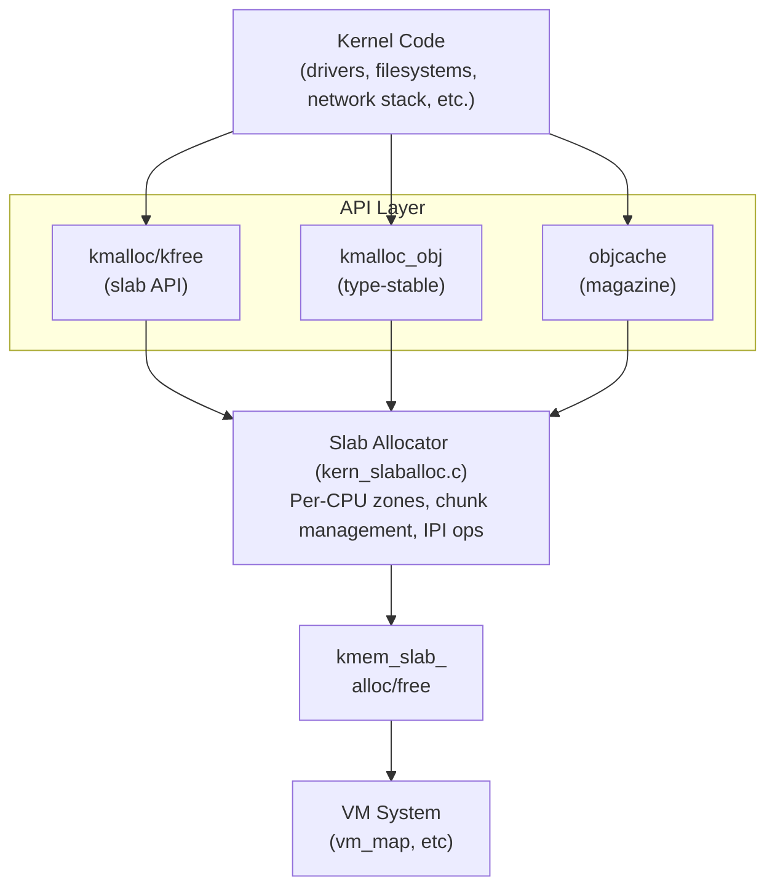

# Memory Allocation

This document describes DragonFly BSD's kernel memory allocation subsystems, which provide efficient, scalable memory management for kernel code.

## Overview

DragonFly BSD implements a sophisticated multi-layered memory allocation system optimized for SMP scalability and low overhead. The system provides several allocators, each optimized for different use cases:

1. **kmalloc/kfree** - General-purpose allocation API (`sys/kern/kern_slaballoc.c`)
2. **kmalloc_obj** - Type-stable object allocator (`sys/kern/kern_kmalloc.c`)
3. **objcache** - Per-CPU object caches with magazine layer (`sys/kern/kern_objcache.c`)
4. **mpipe** - Pre-allocated object pools (`sys/kern/kern_mpipe.c`)
5. **Helper allocators** - Specialized data structure allocators (alist, blist, etc.)

The system is designed around several key principles:

- **Per-CPU operation**: Most allocations occur without locks, using per-CPU data structures
- **Lock-free fast paths**: Common allocations complete without synchronization
- **Magazine/depot architecture**: Multi-level caching reduces contention
- **Type stability**: Object allocators maintain type information for improved debuggability
- **Lazy IPI**: Cross-CPU operations use asynchronous IPI messages

## Architectural Layers



### Layer Responsibilities

**API Layer** (`kern_kmalloc.c`):
- Provides `kmalloc()` and `kfree()` API
- Implements kmalloc_obj for type-stable allocations
- Manages malloc types and statistics
- Routes large allocations directly to VM

**Slab Allocator** (`kern_slaballoc.c`):
- Power-of-2 sized zones (8 bytes to 32KB)
- Per-CPU zone management
- Lock-free allocation and freeing
- Cross-CPU IPI-based operations
- Bitmap tracking for allocated chunks

**Object Cache** (`kern_objcache.c`):
- Magazine-based per-CPU caching
- Depot layer for magazine exchange
- Constructor/destructor support
- Configurable limits and policies

**VM Interface** (`kmem_slab_alloc/free`):
- Direct KVA and page allocation
- Wiring and mapping management
- Large allocation support

## Memory Allocation Flags

All allocation functions accept flags that control behavior:

### Blocking Behavior

| Flag | Description | Can Fail? |
|------|-------------|-----------|
| `M_WAITOK` | Block until memory available | No (panics on failure) |
| `M_NOWAIT` | Return NULL immediately if unavailable | Yes |
| `M_NULLOK` | Return NULL instead of panicking | Yes (with M_WAITOK) |
| `M_INTWAIT` | Like M_WAITOK for interrupt context | No |
| `M_INTNOWAIT` | Like M_NOWAIT for interrupt context | Yes |

### Memory Properties

| Flag | Description |
|------|-------------|
| `M_ZERO` | Zero allocated memory |
| `M_USE_RESERVE` | Can use emergency reserves |
| `M_USE_INTERRUPT_RESERVE` | Can exhaust free list (interrupt) |
| `M_CACHEALIGN` | Align to cache line boundary |
| `M_POWEROF2` | Round size to power of 2 |

**Important**: The default behavior without `M_ZERO` leaves memory uninitialized for performance. In `INVARIANTS` mode, memory may be filled with patterns to detect use-after-free.

## kmalloc/kfree API

The primary allocation interface for general-purpose kernel memory.

### Basic Usage

```c
#include <sys/malloc.h>

/* Define a malloc type */
MALLOC_DEFINE(M_MYSUBSYS, "mysubsys", "My subsystem allocations");

/* Allocate memory */
void *ptr = kmalloc(size, M_MYSUBSYS, M_WAITOK);

/* Allocate and zero */
void *ptr = kmalloc(size, M_MYSUBSYS, M_WAITOK | M_ZERO);

/* Non-blocking allocation */
void *ptr = kmalloc(size, M_MYSUBSYS, M_NOWAIT);
if (ptr == NULL) {
    /* Handle allocation failure */
}

/* Free memory */
kfree(ptr, M_MYSUBSYS);
```

### Malloc Types

Every allocation must specify a `malloc_type` for tracking and statistics. Types are defined with:

```c
MALLOC_DEFINE(type_name, "short-desc", "Long description");
```

**Pre-defined types** (in `sys/kern/kern_slaballoc.c`):
- `M_CACHE` - Various dynamically allocated caches
- `M_DEVBUF` - Device driver memory
- `M_TEMP` - Temporary buffers
- `M_DRM` - DRM subsystem allocations

### Allocation Size Limits

The slab allocator handles allocations based on size:

| Size Range | Chunk Size | Zones | Behavior |
|------------|------------|-------|----------|
| 1-127 bytes | 8 bytes | 16 | Slab allocation |
| 128-255 | 16 bytes | 8 | Slab allocation |
| 256-511 | 32 bytes | 8 | Slab allocation |
| 512-1023 | 64 bytes | 8 | Slab allocation |
| 1024-2047 | 128 bytes | 8 | Slab allocation |
| 2048-4095 | 256 bytes | 8 | Slab allocation |
| 4096-8191 | 512 bytes | 8 | Slab allocation |
| 8192-16383 | 1024 bytes | 8 | Slab allocation |
| 16384-32767 | 2048 bytes | 8 | Slab allocation |
| ≥ ZoneLimit | Page-aligned | - | Direct VM allocation |

**Notes**:
- Allocations are rounded up to chunk size
- Alignment equals chunk size for power-of-2 requests
- Large allocations (≥ ZoneLimit or >2 pages) bypass slab allocator
- ZoneLimit is typically 32KB on systems with ≥1GB RAM

### Zero-Sized Allocations

DragonFly allows `kmalloc(0, ...)` for compatibility (some drivers depend on this):

```c
void *ptr = kmalloc(0, M_TEMP, M_WAITOK);
/* Returns special ZERO_LENGTH_PTR (-8), not NULL */
kfree(ptr, M_TEMP);  /* Safe to free */
```

### String Allocation

Convenience functions for string duplication:

```c
/* Duplicate a string */
char *str = kstrdup(original, M_TEMP);
kfree(str, M_TEMP);

/* Duplicate with length limit */
char *str = kstrndup(original, maxlen, M_TEMP);
```

### Reallocation

```c
/* Resize allocation - may move data */
void *new_ptr = krealloc(old_ptr, new_size, M_TEMP, M_WAITOK);

/* If new size fits in same zone, returns same pointer */
/* Otherwise allocates new memory and copies data */
```

**Note**: `krealloc()` does not support `M_ZERO` flag.

### Memory Limits

Each malloc type has an associated limit (typically 10% of kernel memory):

```c
/* Check current limit */
long limit = kmalloc_limit(M_MYSUBSYS);

/* Raise limit (never shrinks) */
kmalloc_raise_limit(M_MYSUBSYS, new_limit_bytes);

/* Set to unlimited */
kmalloc_set_unlimited(M_MYSUBSYS);
```

When a limit is exceeded:
- `M_WAITOK` allocations **panic**
- `M_NULLOK` allocations return NULL
- Prevents runaway memory usage

### Dynamic Type Creation

For dynamically loaded modules or runtime-created subsystems:

```c
struct malloc_type *my_type = NULL;

/* Create malloc type */
kmalloc_create(&my_type, "runtime-type");

/* Use it */
void *ptr = kmalloc(size, my_type, M_WAITOK);
kfree(ptr, my_type);

/* Destroy when done (must have no outstanding allocations) */
kmalloc_destroy(&my_type);
```

## Type-Stable Object Allocator (kmalloc_obj)

For fixed-size object allocations, DragonFly provides a type-stable allocator optimized for common-sized objects. This allocator provides:

- **Type stability**: All objects of a type can be freed in bulk
- **Per-CPU slabs**: 128KB slabs with embedded object management
- **Lock-free operations**: Atomic operations for cross-CPU frees
- **Efficient recycling**: Two-tier slab management (per-CPU + global)

### Defining Object Types

```c
/* Define a type-stable object type */
static struct malloc_type *my_obj_type;

MALLOC_DEFINE_OBJ(my_obj_type, sizeof(struct my_object),
                  "myobj", "My object type");
```

Alternatively, create at runtime:

```c
_kmalloc_create_obj(&my_obj_type, "my_runtime_obj",
                    sizeof(struct my_object));
```

### Object Allocation

```c
struct my_object *obj;

/* Allocate object */
obj = kmalloc_obj(sizeof(struct my_object), my_obj_type, M_WAITOK);

/* Use object */
obj->field1 = value;
obj->field2 = value;

/* Free object */
kfree_obj(obj, my_obj_type);
```

### Type-Stable Architecture

**Per-CPU Slab Management**:

Each malloc type maintains per-CPU state in `struct kmalloc_use`:
- `active` - Current slab being allocated from
- `alternate` - Backup slab (hot spare)
- Per-CPU statistics (`memuse`, `inuse`, etc.)

**Slab Structure** (128KB each):

```
┌─────────────────────────────────────────────────────────────┐
│ kmalloc_slab (header)                                       │
├─────────────────────────────────────────────────────────────┤
│ fobjs[4096] - Circular buffer of free object pointers      │
│   - findex: next free index                                 │
│   - nindex: next allocation index                           │
│   - maxobjs: total capacity                                 │
├─────────────────────────────────────────────────────────────┤
│ Objects (allocated from end of slab)                        │
│                                                             │
│   [ obj 1 ][ obj 2 ][ obj 3 ] ... [ obj N ]                │
└─────────────────────────────────────────────────────────────┘
```

**Slab States**:

1. **Active/Alternate** (per-CPU): Fast allocation, no locks
2. **Partial** (global): Has free objects, used to refill per-CPU
3. **Full** (global): All allocated, kept for type-safety
4. **Empty** (global): All freed, eligible for recycling

### Allocation Fast Path

```c
/* From kern_kmalloc.c:kmalloc_obj_alloc() */
1. Try current active slab's fobjs[] array
2. If empty, swap active ↔ alternate
3. If both empty, rotate global partial→active
4. If no partial slabs, allocate new 128KB slab
```

**Key Insight**: The fobjs[] circular buffer provides O(1) alloc/free with no linked-list manipulation.

### Free Fast Path

```c
/* From kern_kmalloc.c:kmalloc_obj_free() */
1. Calculate slab from object pointer: obj & ~(128KB-1)
2. Atomically store pointer in slab->fobjs[slab->findex++]
3. Update per-CPU statistics
4. If cross-CPU free, use atomic ops only
```

**Cross-CPU Free**: When freeing to remote CPU's slab, atomic increments ensure thread-safety without explicit locks.

### Type Stability Benefits

When unmounting a filesystem (e.g., tmpfs), all memory from the filesystem's malloc type can be returned:

```c
/* During unmount */
malloc_uninit(tmpfs_mount_type);

/* This returns ALL slabs for this type to the system */
/* No fragmentation! All 128KB slabs are freed intact */
```

Traditional allocators would have fragmentation preventing full memory reclamation.

### Per-CPU Slab Cache

To avoid expensive `kmem_slab_alloc()` calls, DragonFly maintains a per-globaldata slab cache:

```c
/* In globaldata structure */
struct globaldata {
    ...
    kmalloc_slab_t gd_kmslab[KMGD_MAXFREESLABS];  /* 128 slabs */
    int            gd_kmslab_avail;
    ...
};
```

**Benefits**:
- Fast slab allocation from cache
- Amortizes VM allocation cost
- Reduces system map contention

## Slab Allocator Internals

The slab allocator (`kern_slaballoc.c`) provides the foundation for kmalloc operations.

### Zone Structure

A **zone** represents a region of memory divided into fixed-size chunks:

```c
struct SLZone {
    int32_t  z_Magic;          /* Magic number validation */
    int      z_NFree;          /* Number of free chunks */
    int      z_NMax;           /* Total chunks in zone */
    struct SLZone *z_Next;     /* List linkage */
    
    int      z_BaseIndex;      /* Optimization: start search here */
    int      z_ChunkSize;      /* Size of each chunk */
    int      z_ZoneIndex;      /* Which zone array (by size) */
    int      z_Cpu;            /* Owning CPU */
    struct globaldata *z_CpuGd;/* Owning CPU's globaldata */
    
    /* Free chunk lists */
    struct SLChunk *z_LChunks;    /* Local free chunks (LIFO) */
    struct SLChunk **z_LChunksp;  /* Tail pointer */
    struct SLChunk *z_RChunks;    /* Remote free chunks (from other CPUs) */
    
    /* Cross-CPU synchronization */
    int      z_RSignal;        /* Signal for remote operations */
    int      z_RCount;         /* Count of in-flight remote operations */
    
    char     *z_BasePtr;       /* Base of chunk array */
    
#ifdef INVARIANTS
    uint32_t z_Bitmap[...];    /* Allocation bitmap for debugging */
#endif
};
```

### Per-CPU Zone Management

Each CPU maintains separate zone lists in `struct SLGlobalData`:

```c
struct SLGlobalData {
    SLZoneList ZoneAry[NZONES];      /* Zones by size */
    SLZoneList FreeZones;            /* Completely free zones */
    SLZoneList FreeOvZones;          /* Oversized free zones */
    int        NFreeZones;           /* Count of free zones */
    int        JunkIndex;            /* Randomization for new zones */
};
```

**NZONES** is typically 72 (16 for small + 56 for larger sizes).

### Zone Size Calculation

Zone size is determined at boot based on system memory:

```c
/* From kmeminit() in kern_slaballoc.c */
ZoneSize = ZALLOC_MIN_ZONE_SIZE;  /* Start at 32KB */
while (ZoneSize < ZALLOC_MAX_ZONE_SIZE && (ZoneSize << 1) < usesize)
    ZoneSize <<= 1;

/* Typically:
 * < 128MB RAM: 32KB zones
 * >= 1GB RAM:  128KB zones (most systems)
 */
```

Larger zones reduce per-zone overhead but increase memory slack.

### Allocation Algorithm

The `_kmalloc()` function (kern_slaballoc.c:814) implements allocation:

```c
1. Handle special cases:
   - Check malloc type limit
   - Handle size == 0 (return ZERO_LENGTH_PTR)
   
2. For small allocations (< ZoneLimit):
   a. Calculate zone index: zoneindex(&size, &align)
   b. Enter critical section
   c. Find zone with free chunks:
      - Check tail of ZoneAry[zi] (most recently used)
      - If no free chunks, check z_RChunks (remote frees)
      - If still none, allocate new zone
   d. Pop chunk from free list or use z_UIndex (never-allocated)
   e. Update statistics
   f. Exit critical section
   g. Zero memory if M_ZERO requested
   
3. For large allocations (≥ ZoneLimit):
   a. Round size to page boundary
   b. Call kmem_slab_alloc(size, PAGE_SIZE, flags)
   c. Mark pages in kernel page table (btokup)
   d. Return pointer
```

**Critical section**: Uses `crit_enter()/crit_exit()` not locks. This blocks preemption but allows interrupts.

### Free Algorithm

The `_kfree()` function (kern_slaballoc.c:1391) implements deallocation:

```c
1. Handle special cases:
   - NULL pointer (panic)
   - ZERO_LENGTH_PTR (return immediately)
   - Check magic number
   
2. Determine zone or oversized:
   kup = btokup(ptr);  /* Kernel page table lookup */
   if (*kup > 0) {
       /* Oversized allocation */
       size = *kup << PAGE_SHIFT;
       kmem_slab_free(ptr, size);
       return;
   }
   
3. For zone allocations:
   z = (SLZone *)((uintptr_t)ptr & ZoneMask);
   
   a. If z->z_CpuGd != mycpu:
      /* Cross-CPU free */
      - Atomic add to z->z_RChunks list
      - Send IPI if zone needs reactivation
      
   b. If local CPU:
      - Enter critical section
      - Add chunk to z->z_LChunks (front, LIFO)
      - Update z->z_NFree
      - If zone becomes fully free, move to FreeZones list
      - Exit critical section
```

**LIFO ordering**: Recently freed memory is hot in cache, so reallocate it first.

### Cross-CPU Operations

When CPU A frees memory owned by CPU B:

```c
/* CPU A (freeing) */
1. chunk->c_Next = z->z_RChunks;     /* Atomic */
2. atomic_cmpset_ptr(&z->z_RChunks, old, chunk);
3. if (zone was fully allocated) {
       lwkt_send_ipiq_passive(z->z_CpuGd, kfree_remote, z);
   }

/* CPU B (IPI handler) */
kfree_remote(void *ptr) {
    z = (SLZone *)ptr;
    /* Move z->z_RChunks to z->z_LChunks */
    clean_zone_rchunks(z);
    /* Reactivate zone if it has free chunks */
    if (z->z_NFree > 0)
        TAILQ_INSERT_HEAD(&slgd->ZoneAry[z->z_ZoneIndex], z, z_Entry);
}
```

**Key optimizations**:
- Passive IPI: Low priority, batched
- z_RSignal flag: Avoids IPI if zone already active
- z_RCount: Prevents premature zone destruction

### Zone Recycling

Completely free zones are kept in the `FreeZones` list up to a threshold (`ZoneRelsThresh`, default 32). Beyond that, zones are returned to the VM system:

```c
/* In _kmalloc() hysteresis check */
while (slgd->NFreeZones > ZoneRelsThresh) {
    z = TAILQ_LAST(&slgd->FreeZones, SLZoneList);
    TAILQ_REMOVE(&slgd->FreeZones, z, z_Entry);
    --slgd->NFreeZones;
    kmem_slab_free(z, ZoneSize);  /* May block */
}
```

**Hysteresis**: Prevents thrashing by keeping a buffer of free zones.

### Chunk Bitmap (INVARIANTS)

In debug builds, zones maintain a bitmap to detect double-free and use-after-free:

```c
#ifdef INVARIANTS
static void chunk_mark_allocated(SLZone *z, void *chunk) {
    int bitdex = ((char *)chunk - (char *)z->z_BasePtr) / z->z_ChunkSize;
    KASSERT(!(z->z_Bitmap[bitdex >> 5] & (1 << (bitdex & 31))),
            ("double allocation"));
    z->z_Bitmap[bitdex >> 5] |= (1 << (bitdex & 31));
}

static void chunk_mark_free(SLZone *z, void *chunk) {
    int bitdex = ((char *)chunk - (char *)z->z_BasePtr) / z->z_ChunkSize;
    KASSERT(z->z_Bitmap[bitdex >> 5] & (1 << (bitdex & 31)),
            ("double free"));
    z->z_Bitmap[bitdex >> 5] &= ~(1 << (bitdex & 31));
}
#endif
```

### Memory Pattern Debugging

```c
/* In INVARIANTS mode */
static int use_malloc_pattern = 0;  /* sysctl debug.use_malloc_pattern */
static int use_weird_array = 0;     /* sysctl debug.use_weird_array */

/* On allocation without M_ZERO */
if (use_malloc_pattern) {
    for (i = 0; i < size; i += sizeof(int))
        *(int *)((char *)chunk + i) = -1;  /* 0xFFFFFFFF pattern */
}

/* On free */
if (use_weird_array) {
    bcopy(weirdary, chunk, min(size, sizeof(weirdary)));
    /* weirdary = { WEIRD_ADDR, ...} = { 0xdeadc0de, ... } */
}
```

**Usage**: Enable via sysctl to detect:
- Use of uninitialized memory (all 0xFF bytes)
- Use after free (0xDEADC0DE pattern)

## Object Cache (objcache)

The object cache system (`kern_objcache.c`) provides a high-level caching layer for frequently allocated objects. It implements a **magazine-based** architecture similar to Solaris/Illumos slab allocator.

### Architecture

```
                Per-CPU Layer (lock-free)
┌──────────────────────────────────────────────────────────┐
│  CPU 0                CPU 1                CPU N          │
│ ┌─────────────┐     ┌─────────────┐     ┌─────────────┐ │
│ │  loaded     │     │  loaded     │     │  loaded     │ │
│ │  magazine   │     │  magazine   │     │  magazine   │ │
│ │ ┌─────────┐ │     │ ┌─────────┐ │     │ ┌─────────┐ │ │
│ │ │ obj obj │ │     │ │ obj obj │ │     │ │ obj obj │ │ │
│ │ │ obj obj │ │     │ │ obj obj │ │     │ │ obj obj │ │ │
│ │ └─────────┘ │     │ └─────────┘ │     │ └─────────┘ │ │
│ │             │     │             │     │             │ │
│ │  previous   │     │  previous   │     │  previous   │ │
│ │  magazine   │     │  magazine   │     │  magazine   │ │
│ │ ┌─────────┐ │     │ ┌─────────┐ │     │ ┌─────────┐ │ │
│ │ │ obj     │ │     │ │         │ │     │ │ obj obj │ │ │
│ │ │         │ │     │ │         │ │     │ │ obj     │ │ │
│ │ └─────────┘ │     │ └─────────┘ │     │ └─────────┘ │ │
│ └─────────────┘     └─────────────┘     └─────────────┘ │
└───────────────────────────┬──────────────────────────────┘
                            │
                    Depot Layer (locked)
┌───────────────────────────▼──────────────────────────────┐
│  Cluster 0 Depot (spinlock protected)                    │
│ ┌──────────────────┐  ┌──────────────────┐              │
│ │ Full Magazines   │  │ Empty Magazines  │              │
│ │ ┌──────────────┐ │  │ ┌──────────────┐ │              │
│ │ │full mag      │ │  │ │empty mag     │ │              │
│ │ │full mag      │ │  │ │empty mag     │ │              │
│ │ │full mag      │ │  │ │empty mag     │ │              │
│ │ └──────────────┘ │  │ └──────────────┘ │              │
│ └──────────────────┘  └──────────────────┘              │
│                                                          │
│  unallocated_objects: 1024                              │
│  cluster_limit: 2048                                    │
└──────────────────────────┬───────────────────────────────┘
                           │
                  Backend Allocator
┌──────────────────────────▼───────────────────────────────┐
│  objcache_malloc_alloc() / objcache_malloc_free()        │
│  (or custom allocator)                                   │
└──────────────────────────────────────────────────────────┘
```

### Key Data Structures

```c
/* Magazine - array of object pointers */
struct magazine {
    int rounds;              /* Current number of objects */
    int capacity;            /* Maximum capacity */
    SLIST_ENTRY(magazine) nextmagazine;
    void *objects[];         /* Flexible array of object pointers */
};

/* Per-CPU cache state */
struct percpu_objcache {
    struct magazine *loaded_magazine;    /* Active magazine */
    struct magazine *previous_magazine;  /* Backup magazine */
    
    /* Statistics */
    u_long gets_cumulative;
    u_long gets_null;
    u_long allocs_cumulative;  /* Backend allocations */
    u_long puts_cumulative;
    u_long gets_exhausted;     /* Hit limit */
};

/* Depot (shared between CPUs) */
struct magazinedepot {
    struct magazinelist fullmagazines;
    struct magazinelist emptymagazines;
    int magcapacity;           /* Objects per magazine */
    struct spinlock spin;      /* Protects depot */
    
    int unallocated_objects;   /* Remaining quota */
    int cluster_limit;         /* Total object limit */
    int waiting;               /* Waiters for objects */
};

/* Object cache */
struct objcache {
    objcache_ctor_fn  *ctor;       /* Constructor */
    objcache_dtor_fn  *dtor;       /* Destructor */
    void              *privdata;   /* Private data for ctor/dtor */
    
    objcache_alloc_fn *alloc;      /* Backend allocator */
    objcache_free_fn  *free;       /* Backend free */
    void              *allocator_args;
    
    struct magazinedepot depot[MAXCLUSTERS];  /* MAXCLUSTERS=1 currently */
    struct percpu_objcache cache_percpu[];    /* Per-CPU caches */
};
```

### Creating an Object Cache

```c
/* Simple cache backed by kmalloc */
struct objcache *cache;
cache = objcache_create_simple(M_MYTYPE, sizeof(struct my_object));

/* Cache with constructor/destructor */
static boolean_t my_ctor(void *obj, void *privdata, int ocflags) {
    struct my_object *o = obj;
    /* Initialize object fields */
    o->refcount = 1;
    o->lock = NULL;
    return TRUE;  /* Success */
}

static void my_dtor(void *obj, void *privdata) {
    struct my_object *o = obj;
    /* Clean up before freeing */
    KKASSERT(o->refcount == 0);
}

cache = objcache_create_mbacked(
    M_MYTYPE,                    /* malloc type */
    sizeof(struct my_object),    /* object size */
    1000,                        /* cluster_limit (total objects) */
    200,                         /* nom_cache (cached objects) */
    my_ctor,                     /* constructor */
    my_dtor,                     /* destructor */
    NULL                         /* privdata */
);
```

**Key parameters**:
- `cluster_limit`: Maximum total objects (0 = unlimited)
- `nom_cache`: Desired number of cached objects
- Magazine capacity is calculated: `nom_cache / (ncpus + 1) / 2`

### Allocating Objects

```c
struct my_object *obj;

/* Blocking allocation */
obj = objcache_get(cache, M_WAITOK);

/* Non-blocking allocation */
obj = objcache_get(cache, M_NOWAIT);
if (obj == NULL) {
    /* Handle failure */
}

/* Use object */
obj->data = value;

/* Return to cache */
objcache_put(cache, obj);
```

**Allocation Flow**:

```c
/* From objcache_get() - kern_objcache.c:427 */
1. crit_enter();  /* Block preemption */

2. Check loaded magazine:
   if (loadedmag->rounds > 0) {
       obj = loadedmag->objects[--loadedmag->rounds];
       crit_exit();
       return obj;  /* FAST PATH - no depot access */
   }

3. Check previous magazine:
   if (previous->rounds > 0) {
       swap(loaded, previous);
       obj = loadedmag->objects[--loadedmag->rounds];
       crit_exit();
       return obj;  /* Still fast, no depot */
   }

4. Both magazines empty - depot exchange:
   spin_lock(&depot->spin);
   if (!SLIST_EMPTY(&depot->fullmagazines)) {
       /* Exchange empty for full */
       emptymag = previous;
       previous = loaded;
       loaded = SLIST_FIRST(&depot->fullmagazines);
       SLIST_REMOVE_HEAD(&depot->fullmagazines);
       SLIST_INSERT_HEAD(&depot->emptymagazines, emptymag);
       spin_unlock(&depot->spin);
       goto retry;  /* Now have full magazine */
   }

5. Depot empty - backend allocation:
   if (depot->unallocated_objects > 0) {
       --depot->unallocated_objects;
       spin_unlock(&depot->spin);
       crit_exit();
       
       obj = oc->alloc(oc->allocator_args, ocflags);
       if (obj && !oc->ctor(obj, oc->privdata, ocflags)) {
           oc->free(obj, oc->allocator_args);
           obj = NULL;
       }
       return obj;
   }

6. Limit exceeded:
   if (ocflags & M_WAITOK) {
       ssleep(depot, &depot->spin, 0, "objcache_get", 0);
       goto retry;
   }
   return NULL;
```

### Returning Objects

```c
/* From objcache_put() - kern_objcache.c:620 */
1. crit_enter();

2. Check loaded magazine:
   if (loadedmag->rounds < loadedmag->capacity) {
       loadedmag->objects[loadedmag->rounds++] = obj;
       crit_exit();
       return;  /* FAST PATH */
   }

3. Check previous magazine:
   if (previous->rounds < previous->capacity) {
       swap(loaded, previous);
       loadedmag->objects[loadedmag->rounds++] = obj;
       crit_exit();
       return;
   }

4. Both magazines full - depot exchange:
   spin_lock(&depot->spin);
   if (!SLIST_EMPTY(&depot->emptymagazines)) {
       /* Exchange full for empty */
       loadedmag = previous;
       previous = loaded;
       loaded = SLIST_FIRST(&depot->emptymagazines);
       SLIST_REMOVE_HEAD(&depot->emptymagazines);
       
       if (MAGAZINE_EMPTY(loadedmag))
           SLIST_INSERT_HEAD(&depot->emptymagazines, loadedmag);
       else
           SLIST_INSERT_HEAD(&depot->fullmagazines, loadedmag);
       
       spin_unlock(&depot->spin);
       goto retry;
   }

5. No empty magazines - free to backend:
   ++depot->unallocated_objects;
   spin_unlock(&depot->spin);
   crit_exit();
   
   oc->dtor(obj, oc->privdata);
   oc->free(obj, oc->allocator_args);
```

### Magazine Sizing

Magazine capacity is cache-line aligned and bounded:

```c
/* From objcache_create() */
#define MAGAZINE_CAPACITY_MIN  4
#define MAGAZINE_CAPACITY_MAX  4096

mag_capacity = mag_capacity_align(nom_cache / (ncpus + 1) / 2 + 1);
if (mag_capacity > MAGAZINE_CAPACITY_MAX)
    mag_capacity = MAGAZINE_CAPACITY_MAX;
else if (mag_capacity < MAGAZINE_CAPACITY_MIN)
    mag_capacity = MAGAZINE_CAPACITY_MIN;

/* Align to cache line */
mag_size = __VM_CACHELINE_ALIGN(offsetof(struct magazine, objects[mag_capacity]));
mag_capacity = (mag_size - MAGAZINE_HDRSIZE) / sizeof(void *);
```

**Example**: For 1000 object cache on 4-CPU system:
- `nom_cache / (4 + 1) / 2 = 1000 / 5 / 2 = 100` objects per magazine
- Aligns to cache line, typically 96 or 128 depending on alignment

### Dynamic Limit Adjustment

```c
/* Adjust cluster limit at runtime */
objcache_set_cluster_limit(cache, new_limit);

/* Affects depot->unallocated_objects:
 * delta = new_limit - old_cluster_limit;
 * depot->unallocated_objects += delta;
 */
```

**Use case**: Dynamically grow/shrink cache based on load.

### Destroying an Object Cache

```c
/* All objects must be returned to cache first */
objcache_destroy(cache);

/* Process:
 * 1. Remove from global objcache list
 * 2. Drain all depot magazines (call dtors)
 * 3. Drain all per-CPU magazines
 * 4. Free magazines and objcache structure
 */
```

### Backend Allocators

**Built-in allocators**:

```c
/* Standard kmalloc backend */
objcache_malloc_alloc();    /* Allocates with kmalloc */
objcache_malloc_free();     /* Frees with kfree */

/* kmalloc with M_ZERO */
objcache_malloc_alloc_zero();

/* No-op backend (pre-allocated objects only) */
objcache_nop_alloc();
objcache_nop_free();
```

**Custom backend**:

```c
void *my_alloc(void *allocator_args, int ocflags) {
    struct my_alloc_args *args = allocator_args;
    /* Custom allocation logic */
    return custom_allocate(args->param, ocflags & OC_MFLAGS);
}

void my_free(void *obj, void *allocator_args) {
    /* Custom free logic */
    custom_free(obj);
}

struct my_alloc_args alloc_args = { .param = 42 };

cache = objcache_create("mycache", limit, nom_cache,
                        ctor, dtor, privdata,
                        my_alloc, my_free, &alloc_args);
```

### Objcache Statistics

Statistics are accessible via `sysctl kern.objcache.stats`:

```c
struct objcache_stats {
    char oc_name[OBJCACHE_NAMELEN];
    u_long oc_limit;       /* cluster_limit */
    u_long oc_requested;   /* Total get requests */
    u_long oc_allocated;   /* Backend allocations */
    u_long oc_exhausted;   /* Times limit was hit */
    u_long oc_failed;      /* Failed allocations */
    u_long oc_used;        /* Currently allocated */
    u_long oc_cached;      /* Cached in magazines */
};
```

**Example usage**:
```sh
$ sysctl kern.objcache.stats
# Shows statistics for all objcaches
```

### Magazine Advantages

1. **Batch operations**: Amortize depot lock acquisition over magazine capacity
2. **CPU cache affinity**: Recently freed objects are hot in cache
3. **Reduced contention**: Most operations are per-CPU lock-free
4. **Simple**: No complex data structures, just object pointer arrays

### When to Use Objcache

**Use objcache when**:
- Allocating many same-sized objects
- High allocation/free frequency
- Constructor/destructor needed
- Want detailed statistics
- Need fine-grained limit control

**Use kmalloc_obj when**:
- Fixed-size objects, simple lifecycle
- Want type stability (bulk free)
- Less overhead than objcache
- No constructor/destructor needed

**Use plain kmalloc when**:
- Variable sizes
- Infrequent allocations
- No special lifecycle requirements

---

## Malloc Pipes (mpipe)

**Location**: `sys/kern/kern_mpipe.c`

Malloc pipes provide **pre-allocated object pools** with automatic growth and callback support. They are primarily used for critical allocations that cannot fail, such as network packet buffers (mbufs).

### Architecture

```
┌─────────────────────────────────────┐
│         Malloc Pipe (mpipe)         │
├─────────────────────────────────────┤
│  Free list (LIFO, cache-hot)        │
│  ├─ obj1 → obj2 → obj3 → ...        │
│                                      │
│  Allocation token (atomic)          │
│  ├─ Lock-free fast path             │
│                                      │
│  Callback mechanism                  │
│  ├─ MPF_CALLBACK flag                │
│  ├─ Support thread (mpipe_thread)   │
│  ├─ Pending request queue            │
│                                      │
│  Constructor/deconstructor           │
│  ├─ Called on alloc/free             │
│                                      │
│  Statistics                          │
│  ├─ total, free, array size          │
└─────────────────────────────────────┘
```

### Key Features

1. **Pre-allocated pool**: Objects allocated at initialization
2. **Lock-free allocation**: Uses atomic token instead of spinlock
3. **Callback support**: Can queue requests when pool exhausted
4. **LIFO caching**: Recently freed objects are cache-hot
5. **Constructor/deconstructor**: Called on alloc/free for initialization
6. **Statistics**: Track usage via sysctl

### API

#### Creating a Malloc Pipe

```c
void mpipe_init(malloc_pipe_t mpipe, malloc_type_t type,
                size_t bytes, int nnom, int nmax,
                int mpflags,
                void (*construct)(void *, void *),
                void (*deconstruct)(void *, void *),
                void *priv);

/* Parameters:
 * mpipe:      Pointer to malloc_pipe structure
 * type:       Malloc type for accounting
 * bytes:      Size of each object
 * nnom:       Nominal number of objects (initial allocation)
 * nmax:       Maximum number of objects (0 = unlimited)
 * mpflags:    MPF_CALLBACK (enable callback support) | MPF_NOZERO (don't zero)
 * construct:  Constructor called on allocation
 * deconstruct: Deconstructor called on free
 * priv:       Private data passed to construct/deconstruct
 */
```

**Example**:
```c
#include <sys/mpipe.h>

struct malloc_pipe my_pipe;

void my_construct(void *obj, void *priv) {
    struct my_object *o = obj;
    /* Initialize object fields */
    o->magic = MY_MAGIC;
    o->refcount = 1;
}

void my_deconstruct(void *obj, void *priv) {
    struct my_object *o = obj;
    /* Clean up object before returning to pool */
    KASSERT(o->refcount == 0, ("mpipe: object still referenced"));
    o->magic = 0;
}

void init_my_subsystem(void) {
    mpipe_init(&my_pipe, M_MYSUBSYS, sizeof(struct my_object),
               64,      /* Start with 64 objects */
               1024,    /* Max 1024 objects */
               MPF_CALLBACK,  /* Enable callback support */
               my_construct, my_deconstruct, NULL);
}
```

#### Allocating from Pipe

```c
void *mpipe_alloc_waitok(malloc_pipe_t mpipe);
void *mpipe_alloc_nowait(malloc_pipe_t mpipe);

/* mpipe_alloc_waitok():
 *  - Always succeeds (blocks if necessary)
 *  - If pool exhausted and nmax not reached, grows pool
 *  - If nmax reached and MPF_CALLBACK set, queues request
 *  - Constructor called before returning
 *
 * mpipe_alloc_nowait():
 *  - Returns NULL if pool exhausted
 *  - Never blocks
 *  - Constructor still called on success
 */
```

**Example**:
```c
struct my_object *obj;

/* In process context (can sleep) */
obj = mpipe_alloc_waitok(&my_pipe);
/* obj is never NULL */

/* In interrupt context (cannot sleep) */
obj = mpipe_alloc_nowait(&my_pipe);
if (obj == NULL) {
    /* Handle allocation failure */
    return ENOMEM;
}

/* Use object... */
```

#### Freeing to Pipe

```c
void mpipe_free(malloc_pipe_t mpipe, void *obj);

/* Process:
 * 1. Call deconstructor on obj
 * 2. Return obj to pipe's free list (LIFO)
 * 3. If MPF_CALLBACK and pending requests, wake support thread
 */
```

**Example**:
```c
/* Return object to pool */
mpipe_free(&my_pipe, obj);
/* obj is back in pool, ready for reuse */
```

#### Destroying a Malloc Pipe

```c
void mpipe_done(malloc_pipe_t mpipe);

/* Cleans up malloc pipe:
 * - Frees all objects in pool
 * - Deallocates array memory
 * - Asserts that all objects were returned (ary_count == total_count)
 */
```

### Callback Mechanism

When `MPF_CALLBACK` is set, the malloc pipe can handle allocation requests when the pool is exhausted:

```
Allocation when pool empty and nmax reached:
┌─────────────────────────────────────┐
│  1. mpipe_alloc_waitok() called     │
│                                      │
│  2. Pool empty, nmax reached         │
│                                      │
│  3. Add to pending list              │
│     (mpipe->pending_list)            │
│                                      │
│  4. tsleep() on mpipe                │
│                                      │
│  ... waiting ...                     │
│                                      │
│  5. Another thread calls mpipe_free()│
│                                      │
│  6. mpipe_thread woken               │
│                                      │
│  7. Process pending requests         │
│                                      │
│  8. Original thread woken            │
│                                      │
│  9. Allocation completes             │
└─────────────────────────────────────┘
```

**mpipe_thread** (`kern_mpipe.c:277`):
- Support thread for callback mechanism
- Processes `mpipe_pending_list`
- Wakes blocked allocators when objects become available
- Only runs when MPF_CALLBACK pipes exist

### Internal Structure

```c
struct malloc_pipe {
    void    **array;           /* Array of object pointers */
    int     total_count;       /* Total objects allocated */
    int     free_count;        /* Objects in array */
    int     ary_count;         /* Array size */
    int     max_count;         /* nmax (0 = unlimited) */
    int     nominal_count;     /* nnom */
    int     mpflags;           /* MPF_* flags */
    size_t  bytes;             /* Object size */
    malloc_type_t type;        /* For accounting */
    int     token;             /* Atomic allocation token */
    void    (*construct)(void *, void *);
    void    (*deconstruct)(void *, void *);
    void    *priv;
    /* ... */
};
```

### Allocation Algorithm

**Fast path** (lock-free):
```c
int mpipe_alloc_callback(...) {  /* kern_mpipe.c:103 */
    /* 1. Try to get token atomically */
    if (token_test_and_set(&mpipe->token)) {
        /* Someone else has token, slow path */
        goto slow_path;
    }
    
    /* 2. We have token, check free list */
    if (mpipe->free_count) {
        /* 3. Pop object from array (LIFO) */
        obj = mpipe->array[--mpipe->free_count];
        token_clear(&mpipe->token);
        
        /* 4. Call constructor */
        if (mpipe->construct)
            mpipe->construct(obj, mpipe->priv);
        
        return obj;
    }
    
    /* Pool empty, release token and go to slow path */
    token_clear(&mpipe->token);
    
slow_path:
    /* Acquire lock, check if need to grow pool... */
}
```

**Slow path** (with lock):
- Grow pool if `total_count < max_count` (or `max_count == 0`)
- If cannot grow and `MPF_CALLBACK` set, queue request
- Otherwise block or return NULL

### Statistics

```c
/* Per-pipe statistics via mpipe structure */
struct malloc_pipe {
    int total_count;   /* Total objects ever allocated */
    int free_count;    /* Objects currently in pool */
    int ary_count;     /* Size of array */
    /* ... */
};

/* Can be exposed via sysctl for monitoring */
```

### Usage Patterns

**Network packet buffers (mbufs)**:
```c
static struct malloc_pipe mbuf_pipe;

void mbuf_init(void) {
    mpipe_init(&mbuf_pipe, M_MBUF, MSIZE,
               256,     /* Start with 256 mbufs */
               0,       /* Unlimited */
               MPF_CALLBACK,
               mbuf_construct, mbuf_deconstruct, NULL);
}

struct mbuf *m_get(int how) {
    if (how == M_WAITOK)
        return mpipe_alloc_waitok(&mbuf_pipe);
    else
        return mpipe_alloc_nowait(&mbuf_pipe);
}

void m_free(struct mbuf *m) {
    mpipe_free(&mbuf_pipe, m);
}
```

**Temporary objects with initialization**:
```c
static struct malloc_pipe temp_pipe;

void temp_construct(void *obj, void *priv) {
    struct temp_obj *t = obj;
    spin_init(&t->lock, "tempobj");
    TAILQ_INIT(&t->list);
}

void temp_deconstruct(void *obj, void *priv) {
    struct temp_obj *t = obj;
    spin_uninit(&t->lock);
    KASSERT(TAILQ_EMPTY(&t->list), ("temp_obj: list not empty"));
}
```

### When to Use Malloc Pipes

**Use mpipe when**:
- Need guaranteed allocations (cannot fail)
- High allocation/free frequency
- Constructor/deconstructor required
- Want to pre-allocate and limit resource usage
- Need LIFO cache-hot behavior

**Use objcache when**:
- Need detailed statistics and tuning
- Want dynamic magazine sizing
- More complex caching strategies

**Use kmalloc when**:
- Simple allocations without special lifecycle
- Variable sizes

### Advantages

1. **Pre-allocation**: Amortize allocation cost at initialization
2. **Lock-free fast path**: Uses atomic token, no spinlock contention
3. **Cache-hot**: LIFO means recently freed objects are hot in CPU cache
4. **Simple**: Straightforward LIFO array, easy to understand
5. **Callback mechanism**: Handles exhaustion gracefully

### Limitations

1. **Fixed size**: All objects same size
2. **Memory overhead**: Pre-allocated objects consume memory even if unused
3. **Constructor overhead**: Called on every allocation
4. **No depot**: Unlike objcache, no sophisticated caching layers

---

## Helper Allocators

### alist: Power-of-2 Allocator

**Location**: `sys/kern/subr_alist.c`

The **alist** allocator manages free blocks using a **radix tree** and supports only **power-of-2 sized allocations**. It can handle unlimited address space sizes.

**Key characteristics**:
- **Power-of-2 only**: Can only allocate sizes that are powers of 2
- **Power-of-2 aligned**: Allocations aligned to their size
- **Radix tree**: Efficient O(log n) operations with hinting
- **Unlimited size**: No fixed maximum range
- **Bitmap-based**: Uses bitmaps in tree nodes

**Data structure**:
```c
typedef struct almeta {
    alist_blk_t bm_bighint;  /* Biggest allocatable block in subtree */
    u_daddr_t   bm_bitmap;   /* Bitmap of free blocks (power-of-2) */
} almeta_t;

typedef struct alist {
    alist_blk_t bl_radix;    /* Coverage of one meta element */
    alist_blk_t bl_radix_mask;
    alist_blk_t bl_radix_ext;
    alist_blk_t bl_skip;     /* Starting skip (address offset) */
    alist_blk_t bl_free;     /* Number of free blocks */
    alist_blk_t bl_blocks;   /* Total blocks managed */
    alist_blk_t bl_bighint;  /* Biggest hint */
    almeta_t    *bl_root;    /* Root of radix tree */
    /* ... */
} *alist_t;
```

**API**:
```c
alist_t alist_create(alist_blk_t blocks, struct malloc_type *mtype);
void alist_destroy(alist_t live);
void alist_free(alist_t live, alist_blk_t blkno, alist_blk_t count);
alist_blk_t alist_alloc(alist_t live, alist_blk_t count);
```

**Example**:
```c
/* Create alist for 1GB range (2^30 bytes, 4KB blocks = 2^18 blocks) */
alist_t al = alist_create(262144, M_TEMP);  /* 2^18 blocks */

/* Allocate 16 blocks (must be power-of-2) */
alist_blk_t blk = alist_alloc(al, 16);

/* Free the blocks */
alist_free(al, blk, 16);

/* Destroy */
alist_destroy(al);
```

**Use case**: Managing memory ranges that require power-of-2 alignment (e.g., DMA buffers, hardware resource allocation).

**Algorithm** (`subr_alist.c:185`):
- Radix tree with 64-way fanout (ALIST_BMAP_RADIX = 64)
- Each meta node has bitmap and bighint
- Hinting accelerates allocation (bm_bighint)
- Power-of-2 check: `count & (count - 1) == 0`

---

### blist: Bitmap Block Allocator

**Location**: `sys/kern/subr_blist.c`

The **blist** allocator is a general-purpose **bitmap allocator** using a **radix tree**, primarily used for **swap space allocation**. Unlike alist, it supports arbitrary sizes and ranges.

**Key characteristics**:
- **General sizes**: Allocate any number of blocks
- **Arbitrary ranges**: No power-of-2 restrictions
- **Fixed maximum**: Cannot exceed initial size
- **Radix tree**: Efficient with hinting
- **Swap allocator**: Primary use case

**Data structure**:
```c
typedef struct blmeta {
    daddr_t bm_bighint;   /* Biggest allocatable run in subtree */
    daddr_t bm_bitmap;    /* Bitmap of free blocks */
} blmeta_t;

typedef struct blist {
    daddr_t bl_blocks;    /* Total blocks managed */
    daddr_t bl_radix;     /* Coverage of one meta element */
    daddr_t bl_skip;      /* Starting skip */
    daddr_t bl_free;      /* Number of free blocks */
    daddr_t bl_rootblks;  /* daddr_t blks allocated for root */
    blmeta_t *bl_root;    /* Root of radix tree */
    /* ... */
} *blist_t;
```

**API**:
```c
blist_t blist_create(daddr_t blocks, int flags);
void blist_destroy(blist_t blist);
daddr_t blist_alloc(blist_t blist, daddr_t count);
void blist_free(blist_t blist, daddr_t blkno, daddr_t count);
void blist_resize(blist_t *pblist, daddr_t count, int freenew, int flags);
```

**Example**:
```c
/* Create blist for swap: 10000 blocks */
blist_t bl = blist_create(10000, M_WAITOK);

/* Allocate 100 blocks (any size) */
daddr_t blk = blist_alloc(bl, 100);
if (blk == SWAPBLK_NONE) {
    /* Allocation failed */
}

/* Free the blocks */
blist_free(bl, blk, 100);

/* Destroy */
blist_destroy(bl);
```

**Use case**: Swap space management (`vm/swap_pager.c`).

**Algorithm** (`subr_blist.c:276`):
- Radix tree with BLIST_BMAP_RADIX fanout (currently 64)
- Each meta has bitmap and bighint
- Cursor-based allocation for sequential patterns
- Supports resizing (grow or shrink)

**Differences from alist**:

| Feature | alist | blist |
|---------|-------|-------|
| Alignment | Power-of-2 only | Any |
| Sizes | Power-of-2 only | Any |
| Max range | Unlimited (dynamic) | Fixed at creation |
| Primary use | General power-of-2 ranges | Swap allocation |

---

### sbuf: String Buffers

**Location**: `sys/kern/subr_sbuf.c`

The **sbuf** API provides **dynamic string buffers** with automatic growth, similar to C++ `std::string` or Java `StringBuilder`.

**Key features**:
- **Dynamic growth**: Automatically expands as needed
- **Safe**: Bounds-checked operations
- **Printf-style**: `sbuf_printf()` for formatted output
- **Fixed or auto**: Can use fixed buffer or auto-allocate
- **Length tracking**: Always know current length

**Data structure**:
```c
struct sbuf {
    char    *s_buf;       /* Buffer itself */
    int     s_size;       /* Size of buffer */
    int     s_len;        /* Current length */
    int     s_flags;      /* Flags (SBUF_*) */
    /* ... */
};

/* Flags */
#define SBUF_FIXEDLEN   0x00000001  /* Fixed length buffer */
#define SBUF_AUTOEXTEND 0x00000002  /* Auto-extend buffer */
#define SBUF_OVERFLOWED 0x00000010  /* Buffer overflowed */
#define SBUF_FINISHED   0x00000020  /* Buffer finalized */
```

**API**:
```c
/* Create/destroy */
struct sbuf *sbuf_new(struct sbuf *s, char *buf, int length, int flags);
void sbuf_delete(struct sbuf *s);

/* Append operations */
int sbuf_cat(struct sbuf *s, const char *str);
int sbuf_printf(struct sbuf *s, const char *fmt, ...);
int sbuf_putc(struct sbuf *s, int c);
int sbuf_bcpy(struct sbuf *s, const char *buf, size_t len);  /* Copy */
int sbuf_bcat(struct sbuf *s, const char *buf, size_t len);  /* Append */

/* Finalize and extract */
int sbuf_finish(struct sbuf *s);  /* NUL-terminate */
char *sbuf_data(struct sbuf *s);
int sbuf_len(struct sbuf *s);
int sbuf_overflowed(struct sbuf *s);

/* Clear */
void sbuf_clear(struct sbuf *s);
```

**Example - Auto-extending buffer**:
```c
struct sbuf *sb;

/* Create auto-extending buffer */
sb = sbuf_new(NULL, NULL, 0, SBUF_AUTOEXTEND);

/* Build string */
sbuf_printf(sb, "Process %d: ", proc->p_pid);
sbuf_cat(sb, proc->p_comm);
sbuf_printf(sb, " (%d threads)", proc->p_nthreads);

/* Finalize */
sbuf_finish(sb);

/* Use the string */
printf("%s\n", sbuf_data(sb));

/* Clean up */
sbuf_delete(sb);
```

**Example - Fixed buffer**:
```c
char buffer[256];
struct sbuf sb;

/* Use fixed buffer (no allocation) */
sbuf_new(&sb, buffer, sizeof(buffer), SBUF_FIXEDLEN);

sbuf_printf(&sb, "CPU %d: %s", cpuid, status);
sbuf_finish(&sb);

if (sbuf_overflowed(&sb)) {
    printf("Buffer too small!\n");
} else {
    printf("%s\n", sbuf_data(&sb));
}

sbuf_delete(&sb);  /* Does not free buffer, just cleans up */
```

**Use cases**:
- Building complex strings for sysctl output
- Generating debug messages
- Creating formatted data for userspace
- Any string building where final size is unknown

**Performance note**: Auto-extending sbufs reallocate using `kmalloc()`, which may be expensive for frequently reallocated buffers. Pre-allocate reasonable size if known.

---

### sglist: Scatter-Gather Lists

**Location**: `sys/kern/subr_sglist.c`

The **sglist** API manages **scatter-gather lists** for DMA operations. It describes physically discontiguous memory regions as an array of `(address, length)` pairs.

**Key features**:
- **Physical addressing**: Describes physical memory ranges
- **DMA-friendly**: Standard format for DMA engines
- **Bounds tracking**: Knows remaining space
- **Utilities**: Build from uio, mbufs, physical buffers

**Data structure**:
```c
struct sglist_seg {
    vm_paddr_t ss_paddr;  /* Physical address */
    size_t     ss_len;    /* Length in bytes */
};

struct sglist {
    struct sglist_seg *sg_segs;  /* Array of segments */
    int               sg_nseg;   /* Number of segments */
    int               sg_maxseg; /* Maximum segments */
    int               sg_refs;   /* Reference count */
};
```

**API**:
```c
/* Create/destroy */
struct sglist *sglist_alloc(int nsegs, int mflags);
struct sglist *sglist_build(void *buf, size_t len, int mflags);
void sglist_free(struct sglist *sg);
void sglist_hold(struct sglist *sg);   /* Increment refcount */
void sglist_release(struct sglist *sg); /* Decrement refcount */

/* Reset for reuse */
void sglist_reset(struct sglist *sg);

/* Append segments */
int sglist_append(struct sglist *sg, vm_paddr_t paddr, size_t len);
int sglist_append_mbuf(struct sglist *sg, struct mbuf *m);
int sglist_append_phys(struct sglist *sg, vm_paddr_t paddr, size_t len);
int sglist_append_uio(struct sglist *sg, struct uio *uio);

/* Query */
int sglist_count(void *buf, size_t len);
size_t sglist_length(struct sglist *sg);
int sglist_slice(struct sglist *original, struct sglist **slice,
                 size_t offset, size_t length, int mflags);

/* Join two sglists */
int sglist_join(struct sglist *first, struct sglist *second,
                struct sglist *out);
```

**Example - Build sglist from buffer**:
```c
void *buf = kmalloc(8192, M_TEMP, M_WAITOK);
struct sglist *sg;

/* Build sglist describing physical pages of buf */
sg = sglist_build(buf, 8192, M_WAITOK);

/* Program DMA engine with sglist */
for (int i = 0; i < sg->sg_nseg; i++) {
    dma_program_segment(sg->sg_segs[i].ss_paddr,
                       sg->sg_segs[i].ss_len);
}

/* Clean up */
sglist_free(sg);
kfree(buf, M_TEMP);
```

**Example - Build from mbuf chain**:
```c
struct mbuf *m = /* ... received packet ... */;
struct sglist *sg;

/* Allocate sglist with enough segments for mbuf chain */
int nsegs = /* estimate based on m_length(m) and page size */;
sg = sglist_alloc(nsegs, M_WAITOK);

/* Append mbuf chain to sglist */
if (sglist_append_mbuf(sg, m) != 0) {
    /* Not enough segments */
    sglist_free(sg);
    return EFBIG;
}

/* Use sglist for DMA... */

sglist_free(sg);
```

**Use cases**:
- Network DMA (NIC drivers)
- Storage device DMA
- Any hardware requiring scatter-gather I/O
- Zero-copy transfers

**Implementation note** (`subr_sglist.c:94`):
- `sglist_build()` walks virtual address using `pmap_extract()` to find physical pages
- Consecutive physical pages are coalesced into single segment
- `sglist_append_mbuf()` walks mbuf chain, extracting physical addresses

---

### rbtree: Red-Black Tree Utilities

**Location**: `sys/kern/subr_rbtree.c`

The **rbtree** module provides **red-black tree helper functions**, but DragonFly uses a **custom implementation** that is largely self-contained in header files (`sys/sys/tree.h`).

**Note**: This is not a full-featured allocator, but rather utilities for **tree-based data structures**. Most code uses the `RB_*` macros from `<sys/tree.h>` directly.

**Red-black tree properties**:
1. Every node is red or black
2. Root is black
3. Leaves (NIL) are black
4. Red nodes have black children
5. All paths from node to leaves have same black-height

**sys/tree.h macros**:
```c
/* Define tree structure */
RB_HEAD(my_tree, my_node);

/* Define node structure */
struct my_node {
    RB_ENTRY(my_node) entry;
    int key;
    /* ... data ... */
};

/* Generate tree functions */
RB_GENERATE(my_tree, my_node, entry, my_compare);

/* Use tree */
struct my_tree head = RB_INITIALIZER(&head);

RB_INSERT(my_tree, &head, node);
struct my_node *found = RB_FIND(my_tree, &head, &lookup);
RB_REMOVE(my_tree, &head, node);

/* Iteration */
RB_FOREACH(node, my_tree, &head) {
    /* ... */
}
```

**Use cases**:
- Ordered key-value data structures
- Interval trees
- Priority queues with O(log n) operations

**Alternative**: DragonFly also provides `<sys/queue.h>` for simpler lists/queues (TAILQ, LIST, SLIST, STAILQ).

---

## Code Flow Examples

### Example 1: Simple kmalloc Allocation

**Scenario**: Allocate memory for a temporary buffer in process context.

```c
void process_data(void) {
    char *buffer;
    size_t size = 4096;
    
    /* Step 1: Call kmalloc */
    buffer = kmalloc(size, M_TEMP, M_WAITOK | M_ZERO);
    /* M_WAITOK: Can block (process context)
     * M_ZERO: Zero-fill the buffer
     */
    
    /* Step 2: kmalloc() → kern_slaballoc.c:kmalloc() */
    /* - Round size to power-of-2 zone: 4096 → zone 4096 */
    
    /* Step 3: Get CPU-local zone structure */
    /* - cpuid = mycpuid (no lock needed) */
    /* - zone = &SLZone[cpuid][zid] */
    
    /* Step 4: Try to allocate from CPU-local zone */
    /* - Check zone->z_NFree > 0 */
    /* - Pop chunk from zone->z_FreeChunk */
    /* - Decrement zone->z_NFree */
    /* - If M_ZERO, bzero() the buffer */
    
    /* Step 5: Return buffer to caller */
    
    /* Use buffer... */
    bcopy(source, buffer, size);
    
    /* Step 6: Free buffer */
    kfree(buffer, M_TEMP);
    
    /* Step 7: kfree() → kern_slaballoc.c:kfree() */
    /* - Find zone based on pointer address */
    /* - Determine owning CPU from chunk metadata */
    /* - If local CPU: add to z_FreeChunk (fast) */
    /* - If remote CPU: add to z_ReleaseChunk and send IPI */
}
```

**Flow diagram**:
```
kmalloc(4096, M_TEMP, M_WAITOK|M_ZERO)
  ↓
Find zone: zid = 12 (4KB zone)
  ↓
Get CPU-local zone: cpuid=2, zone=&SLZone[2][12]
  ↓
zone->z_NFree = 5 (chunks available)
  ↓
Pop chunk from z_FreeChunk list
  ↓
z_NFree = 4
  ↓
bzero(chunk, 4096)  ← M_ZERO flag
  ↓
Return chunk to caller
  ↓
... use memory ...
  ↓
kfree(chunk, M_TEMP)
  ↓
Find owning CPU: cpuid=2 (local)
  ↓
Add chunk to z_FreeChunk (LIFO)
  ↓
z_NFree = 5
```

---

### Example 2: Cross-CPU Free with IPI

**Scenario**: Thread on CPU 0 frees memory allocated by thread on CPU 2.

```c
/* Thread on CPU 2 allocates */
char *buf = kmalloc(512, M_TEMP, M_WAITOK);
/* Allocated from SLZone[2][zone_512] */

/* Pass buf to thread on CPU 0 (via queue, etc.) */

/* Thread on CPU 0 frees */
kfree(buf, M_TEMP);

/* Step 1: kfree() determines owning CPU from chunk */
/* - Chunk metadata indicates CPU 2 */

/* Step 2: Current CPU (0) != owning CPU (2) */
/* - Cannot directly modify CPU 2's zone */

/* Step 3: Add to remote CPU's release list */
/* - zone->z_ReleaseChunk (uses lock) */
/* - Add chunk to linked list */

/* Step 4: Send IPI to CPU 2 */
/* - lwkt_send_ipiq(2, ...) */

/* Step 5: CPU 2 receives IPI */
/* - Interrupt handler runs on CPU 2 */

/* Step 6: Process release list */
/* - Move chunks from z_ReleaseChunk to z_FreeChunk */
/* - Update z_NFree */
/* - Chunks now available for allocation on CPU 2 */
```

**Flow diagram**:
```
CPU 2: kmalloc(512)
  ↓
Allocate from SLZone[2][zone_512]
  ↓
Return chunk (metadata: owner=CPU2)
  ↓
... pass to CPU 0 ...
  ↓
CPU 0: kfree(chunk)
  ↓
Check owner: CPU 2 (remote!)
  ↓
Acquire zone->z_ReleaseChunk lock
  ↓
Add chunk to z_ReleaseChunk list
  ↓
Release lock
  ↓
Send IPI to CPU 2
  ↓
━━━━━━━━━━━━━━━━━━━━━━━━━━━━━━━━
CPU 2: IPI arrives
  ↓
slgd_alloc() or periodic check
  ↓
Process z_ReleaseChunk list
  ↓
Move chunks to z_FreeChunk
  ↓
z_NFree += count
  ↓
Chunks available for reuse on CPU 2
```

**Why IPIs?**
- Maintain per-CPU zone invariants
- Avoid lock contention on allocation (fast path)
- Memory eventually returns to owning CPU's pool
- Trade-off: Occasional IPI cost vs. lock-free allocation

---

### Example 3: Type-Stable Object Allocation

**Scenario**: VFS allocating vnodes with type stability.

```c
/* Initialize malloc type for vnodes */
MALLOC_DEFINE(M_VNODE, "vnodes", "vnodes");

void vnode_init(void) {
    /* Create type for vnodes */
    kmalloc_create(&M_VNODE);
}

struct vnode *vnode_alloc(void) {
    struct vnode *vp;
    
    /* Step 1: Allocate from type-stable allocator */
    vp = kmalloc_obj(sizeof(struct vnode), M_VNODE, M_WAITOK|M_ZERO);
    
    /* Step 2: kmalloc_obj() flow */
    /* - Get per-CPU active slab (objcache->slabdata[cpuid].active) */
    /* - Check active->findex < KMALLOC_SLAB_FOBJS */
    /* - Pop object from fobjs[] circular buffer */
    /* - If active slab exhausted, get new slab from partial list */
    
    /* Step 3: Initialize vnode */
    vp->v_type = VNON;
    lockinit(&vp->v_lock, "vnode", 0, LK_CANRECURSE);
    TAILQ_INIT(&vp->v_namecache);
    
    return vp;
}

void vnode_free(struct vnode *vp) {
    /* Clean up */
    lockuninit(&vp->v_lock);
    
    /* Step 1: Free to type-stable allocator */
    kfree_obj(vp, M_VNODE);
    
    /* Step 2: kfree_obj() flow */
    /* - Find slab from object address */
    /* - Get per-CPU active slab */
    /* - Add object to fobjs[] circular buffer */
    /* - Update slab->findex atomically */
    /* - Object remains in slab, not returned to system */
}

void vnode_unmount_all(struct mount *mp) {
    /* On unmount: bulk destroy all vnodes for this mount */
    
    /* Step 1: Walk vnode list, free each */
    TAILQ_FOREACH(vp, &mp->mnt_vnodelist, v_mntvnodes) {
        kfree_obj(vp, M_VNODE);
    }
    
    /* Step 2: Type-stable allocator can now bulk-free slabs */
    /* - All vnodes for mount are freed */
    /* - Entire slabs may be empty */
    /* - kmalloc_obj can return slabs to system */
    
    /* Advantage: Type stability allows efficient bulk operations */
}
```

**Slab allocation flow**:
```
kmalloc_obj(sizeof(struct vnode), M_VNODE, ...)
  ↓
Get per-CPU objcache: &objcache[mycpuid]
  ↓
Get active slab: objcache->slabdata[mycpuid].active
  ↓
Active slab has free objects? (findex < KMALLOC_SLAB_FOBJS)
  ↓ YES
Pop object: obj = active->fobjs[findex++]
  ↓
Return object
  ↓
... use vnode ...
  ↓
kfree_obj(vnode, M_VNODE)
  ↓
Find slab from object address
  ↓
Get per-CPU active slab
  ↓
Add to circular buffer: active->fobjs[findex++] = obj
  ↓
Object back in pool (type-stable: not freed to system)
```

---

### Example 4: Objcache Magazine Exchange

**Scenario**: High-frequency allocation from objcache.

```c
/* Create objcache for connection objects */
struct objcache *conn_cache;

void conn_construct(void *obj, void *priv) {
    struct connection *conn = obj;
    bzero(conn, sizeof(*conn));
    TAILQ_INIT(&conn->send_queue);
}

void conn_destruct(void *obj, void *priv) {
    struct connection *conn = obj;
    KASSERT(TAILQ_EMPTY(&conn->send_queue), ("conn: queue not empty"));
}

void conn_init(void) {
    conn_cache = objcache_create("connections",
                                 1000,  /* cluster_limit */
                                 0,     /* nom_cache (auto) */
                                 conn_construct, conn_destruct, NULL,
                                 objcache_malloc_alloc,
                                 objcache_malloc_free, NULL);
}

struct connection *conn_alloc(void) {
    /* Step 1: Call objcache_get() */
    return objcache_get(conn_cache, M_WAITOK);
}

/* objcache_get() flow - Fast path */
void *objcache_get_fast_path(struct objcache *cache) {
    struct objcache_cpu *cpudata;
    struct magazine *mag;
    void *obj;
    
    /* Step 1: Get per-CPU data (lock-free) */
    cpudata = &cache->cpu[mycpuid];
    
    /* Step 2: Get loaded magazine */
    mag = cpudata->loaded_mag;
    
    /* Step 3: Check if magazine has objects */
    if (mag->rounds > 0) {
        /* Step 4: Pop object from magazine (lock-free) */
        obj = mag->objects[--mag->rounds];
        
        /* Step 5: Return object (constructor already called) */
        return obj;
    }
    
    /* Magazine empty, go to slow path */
    return objcache_get_slow_path(cache);
}

/* objcache_get() flow - Slow path (magazine empty) */
void *objcache_get_slow_path(struct objcache *cache) {
    struct objcache_cpu *cpudata = &cache->cpu[mycpuid];
    struct magazine *empty_mag, *full_mag;
    
    /* Step 1: Loaded magazine is empty */
    empty_mag = cpudata->loaded_mag;
    
    /* Step 2: Check previous magazine */
    if (cpudata->previous_mag && cpudata->previous_mag->rounds > 0) {
        /* Step 3: Swap loaded <-> previous */
        cpudata->loaded_mag = cpudata->previous_mag;
        cpudata->previous_mag = empty_mag;
        
        /* Step 4: Pop from newly loaded magazine */
        struct magazine *mag = cpudata->loaded_mag;
        return mag->objects[--mag->rounds];
    }
    
    /* Step 5: Both magazines empty, need to get from depot */
    spin_lock(&cache->depot_lock);
    
    /* Step 6: Check depot for full magazine */
    if (!SLIST_EMPTY(&cache->depot_full)) {
        full_mag = SLIST_FIRST(&cache->depot_full);
        SLIST_REMOVE_HEAD(&cache->depot_full, link);
        cache->depot_full_count--;
        
        /* Step 7: Return empty magazine to depot */
        SLIST_INSERT_HEAD(&cache->depot_empty, empty_mag, link);
        cache->depot_empty_count++;
        
        spin_unlock(&cache->depot_lock);
        
        /* Step 8: Install full magazine as loaded */
        cpudata->loaded_mag = full_mag;
        
        /* Step 9: Pop object */
        return full_mag->objects[--full_mag->rounds];
    }
    
    spin_unlock(&cache->depot_lock);
    
    /* Step 10: Depot empty, allocate from backend */
    return cache->alloc(cache->allocator_args, M_WAITOK);
}
```

**Magazine exchange diagram**:
```
objcache_get()
  ↓
Check loaded magazine: rounds = 0 (empty)
  ↓
Check previous magazine: rounds = 16 (full)
  ↓
Swap loaded ↔ previous (lock-free)
  ↓
Pop from loaded: obj = loaded->objects[15]
  ↓
loaded->rounds = 15
  ↓
Return object
  ↓
... 15 more fast allocations from loaded ...
  ↓
Both magazines empty
  ↓
Acquire depot_lock
  ↓
Check depot_full list: has magazines
  ↓
Pop full magazine from depot
  ↓
Push empty magazine to depot
  ↓
Release depot_lock
  ↓
Install full magazine as loaded
  ↓
Pop object from new loaded magazine
```

**Key insight**: Most allocations are **lock-free** from per-CPU magazines. Only when magazines are exhausted do we acquire the depot lock.

---

### Example 5: Zone Recycling and Hysteresis

**Scenario**: System with low memory pressure triggers zone recycling.

```c
/* Slab allocator monitors zone usage via:
 * - ZGlobalZone[zid].ZoneRelsThresh (hysteresis threshold)
 * - zone->z_NFree (free chunks in zone)
 * - zone->z_NMax (maximum free chunks before recycling)
 */

/* Allocation increases zone pressure */
void allocation_surge(void) {
    for (int i = 0; i < 1000; i++) {
        void *p = kmalloc(1024, M_TEMP, M_WAITOK);
        /* ... use p ... */
    }
    /* Many zones now have high z_NFree (lots of free chunks cached) */
}

/* Periodic zone cleanup (kern_slaballoc.c:slab_cleanup()) */
void slab_cleanup(void) {
    /* Called periodically (every few seconds) */
    
    for (int zid = 0; zid < nzones; zid++) {
        SLGlobalZone *zglobal = &ZGlobalZone[zid];
        
        /* Step 1: Calculate zone release threshold */
        /* Based on:
         * - Total zone memory
         * - System memory pressure
         * - Hysteresis to avoid thrashing
         */
        int thresh = zglobal->ZoneRelsThresh;
        
        /* Step 2: Check each CPU's zone */
        for (int cpuid = 0; cpuid < ncpus; cpuid++) {
            SLZone *zone = &SLZone[cpuid][zid];
            
            /* Step 3: Exceeds threshold? */
            if (zone->z_NFree > thresh) {
                /* Step 4: Recycle excess chunks */
                int excess = zone->z_NFree - (thresh / 2);
                
                /* Step 5: Free excess chunks back to system */
                for (int i = 0; i < excess; i++) {
                    void *chunk = zone->z_FreeChunk;
                    zone->z_FreeChunk = *(void **)chunk;
                    zone->z_NFree--;
                    
                    /* Step 6: Return page to VM system */
                    kfree_real(chunk);  /* → vm_page_free() */
                }
            }
        }
    }
}

/* Result: Zone caches are trimmed, memory returned to VM */
```

**Hysteresis prevents thrashing**:
```
Zone free chunks over time:

z_NFree
  ^
  |
200 |         ╱╲              ← Threshold (ZoneRelsThresh)
  |        ╱  ╲
  |       ╱    ╲___
100 |------╱------╲___________  ← Recycle to 100
  |     ╱              ╲
  |    ╱                ╲
  0 |___/________________╲___> time
     Alloc    Recycle    Steady state
     surge    event
     
Without hysteresis:
- Constant oscillation around threshold
- Frequent expensive recycle operations

With hysteresis:
- Recycle only when significantly above threshold
- Recycle to midpoint (thresh/2)
- Stable behavior under varying load
```

---

## Best Practices and Guidelines

### Choosing the Right Allocator

**Decision tree**:

```
┌─────────────────────────────────────┐
│ What are you allocating?            │
└────────────┬────────────────────────┘
             │
             ├─ Variable sizes, infrequent
             │  → Use kmalloc/kfree
             │
             ├─ Same-size, high frequency, no ctor/dtor
             │  → Use kmalloc_obj/kfree_obj
             │
             ├─ Same-size, high frequency, need ctor/dtor
             │  → Use objcache
             │
             ├─ Pre-allocated pool, guaranteed allocation
             │  → Use mpipe
             │
             ├─ Power-of-2 ranges, alignment critical
             │  → Use alist
             │
             ├─ General ranges (e.g., swap blocks)
             │  → Use blist
             │
             ├─ Building strings dynamically
             │  → Use sbuf
             │
             └─ DMA scatter-gather lists
                → Use sglist
```

**Detailed guidelines**:

| Allocator | Best For | Avoid When |
|-----------|----------|------------|
| **kmalloc** | General allocations, variable sizes, infrequent | High-frequency same-size objects |
| **kmalloc_obj** | Fixed-size, high frequency, type stability | Need ctor/dtor, variable sizes |
| **objcache** | High frequency, ctor/dtor, statistics | Simple allocations, low frequency |
| **mpipe** | Pre-allocated pools, guaranteed success | Dynamic sizing, unpredictable counts |
| **alist** | Power-of-2 aligned ranges | Non-power-of-2 sizes |
| **blist** | General block ranges (swap) | Need unlimited growth |
| **sbuf** | Dynamic string building | Fixed-size strings |
| **sglist** | DMA scatter-gather | Non-DMA memory management |

---

### Allocation Flags: M_WAITOK vs. M_NOWAIT

**M_WAITOK** (can sleep):
```c
/* Use in process context where blocking is acceptable */
void process_context_function(void) {
    void *p = kmalloc(size, M_TEMP, M_WAITOK);
    /* p is guaranteed to be non-NULL (or panic if truly OOM) */
    
    /* Advantages:
     * - Simple error handling (almost always succeeds)
     * - Can trigger VM pageout to free memory
     * - No need to check for NULL
     */
}
```

**M_NOWAIT** (cannot sleep):
```c
/* Use in interrupt context or holding locks */
void interrupt_handler(void) {
    void *p = kmalloc(size, M_TEMP, M_NOWAIT);
    if (p == NULL) {
        /* Handle allocation failure */
        return ENOMEM;
    }
    /* Use p... */
}

void holding_spinlock(void) {
    spin_lock(&lock);
    
    void *p = kmalloc(size, M_TEMP, M_NOWAIT);
    if (p == NULL) {
        spin_unlock(&lock);
        return ENOMEM;
    }
    
    /* Use p... */
    spin_unlock(&lock);
}
```

**Guidelines**:

1. **Default to M_WAITOK** in process context
   - Simpler code (no NULL checks)
   - Better resource utilization
   - Kernel can free memory if needed

2. **Use M_NOWAIT when**:
   - In interrupt context
   - Holding spinlocks
   - In callback functions (may be called from interrupt)
   - Performance-critical paths where blocking is unacceptable

3. **Always check M_NOWAIT return**:
   ```c
   /* WRONG */
   p = kmalloc(size, M_TEMP, M_NOWAIT);
   bcopy(src, p, size);  /* May crash if p == NULL! */
   
   /* CORRECT */
   p = kmalloc(size, M_TEMP, M_NOWAIT);
   if (p == NULL)
       return ENOMEM;
   bcopy(src, p, size);
   ```

4. **M_INTWAIT**: Special flag for slightly more aggressive M_NOWAIT
   - Will try harder than M_NOWAIT
   - Still won't block
   - Use in interrupt context when allocation is important

---

### Memory Leak Prevention

**Common patterns**:

1. **Match alloc/free**:
   ```c
   /* WRONG: Leak on error path */
   int process_data(void) {
       char *buf = kmalloc(size, M_TEMP, M_WAITOK);
       
       if (some_error())
           return EINVAL;  /* Leak: forgot to free buf! */
       
       /* ... use buf ... */
       kfree(buf, M_TEMP);
       return 0;
   }
   
   /* CORRECT: Free on all paths */
   int process_data(void) {
       char *buf = kmalloc(size, M_TEMP, M_WAITOK);
       int error = 0;
       
       if (some_error()) {
           error = EINVAL;
           goto cleanup;
       }
       
       /* ... use buf ... */
       
   cleanup:
       kfree(buf, M_TEMP);
       return error;
   }
   ```

2. **Use correct malloc type**:
   ```c
   /* WRONG: Type mismatch */
   p = kmalloc(size, M_VNODE, M_WAITOK);
   /* ... */
   kfree(p, M_TEMP);  /* Statistics corrupted! */
   
   /* CORRECT */
   p = kmalloc(size, M_VNODE, M_WAITOK);
   /* ... */
   kfree(p, M_VNODE);
   ```

3. **Avoid double-free**:
   ```c
   /* WRONG: Double free */
   kfree(p, M_TEMP);
   /* ... */
   kfree(p, M_TEMP);  /* Corruption! */
   
   /* CORRECT: NULL after free */
   kfree(p, M_TEMP);
   p = NULL;
   /* Later accidental free is safe */
   if (p != NULL)
       kfree(p, M_TEMP);
   ```

4. **Reference counting**:
   ```c
   struct refcounted_obj {
       int refcount;
       /* ... data ... */
   };
   
   void obj_hold(struct refcounted_obj *obj) {
       atomic_add_int(&obj->refcount, 1);
   }
   
   void obj_drop(struct refcounted_obj *obj) {
       if (atomic_fetchadd_int(&obj->refcount, -1) == 1) {
           /* Last reference, free object */
           kfree(obj, M_OBJ);
       }
   }
   ```

---

### Performance Tips

1. **Batch allocations**:
   ```c
   /* INEFFICIENT: Many small allocations */
   for (int i = 0; i < 1000; i++) {
       items[i] = kmalloc(sizeof(item_t), M_TEMP, M_WAITOK);
   }
   
   /* EFFICIENT: One large allocation */
   item_t *all_items = kmalloc(1000 * sizeof(item_t), M_TEMP, M_WAITOK);
   for (int i = 0; i < 1000; i++) {
       items[i] = &all_items[i];
   }
   ```

2. **Use object caches for hot paths**:
   ```c
   /* INEFFICIENT: kmalloc in packet processing loop */
   void process_packet(struct mbuf *m) {
       struct pkt_ctx *ctx = kmalloc(sizeof(*ctx), M_TEMP, M_NOWAIT);
       /* ... */
       kfree(ctx, M_TEMP);
   }
   
   /* EFFICIENT: Use objcache */
   static struct objcache *pkt_ctx_cache;
   
   void process_packet(struct mbuf *m) {
       struct pkt_ctx *ctx = objcache_get(pkt_ctx_cache, M_NOWAIT);
       /* ... */
       objcache_put(pkt_ctx_cache, ctx);
   }
   ```

3. **Avoid allocations in interrupt context**:
   ```c
   /* POOR: Allocate in interrupt */
   void device_interrupt(void) {
       struct work *w = kmalloc(sizeof(*w), M_TEMP, M_NOWAIT);
       if (w == NULL)
           return;  /* Drop work! */
       queue_work(w);
   }
   
   /* BETTER: Pre-allocated pool (mpipe) */
   static struct malloc_pipe work_pipe;
   
   void device_interrupt(void) {
       struct work *w = mpipe_alloc_nowait(&work_pipe);
       if (w == NULL)
           return;
       queue_work(w);
   }
   ```

4. **Cache-aware allocation**:
   ```c
   /* Per-CPU data structure: use kmalloc_obj for cache affinity */
   struct per_cpu_data *pcd = kmalloc_obj(sizeof(*pcd), M_PERCPU, M_WAITOK);
   /* Likely to be allocated from local CPU zone, cache-hot */
   ```

5. **Reuse objects when possible**:
   ```c
   /* INEFFICIENT: Constant alloc/free */
   void process_loop(void) {
       for (;;) {
           char *buf = kmalloc(BUFSIZE, M_TEMP, M_WAITOK);
           process(buf);
           kfree(buf, M_TEMP);
       }
   }
   
   /* EFFICIENT: Allocate once */
   void process_loop(void) {
       char *buf = kmalloc(BUFSIZE, M_TEMP, M_WAITOK);
       for (;;) {
           process(buf);
           /* Reuse buf */
       }
       kfree(buf, M_TEMP);
   }
   ```

---

### Debugging Techniques

**Enable INVARIANTS**:
```c
/* In kernel config */
options INVARIANTS

/* Enables:
 * - Memory pattern checks (0xdeadc0de, 0x5a5a5a5a)
 * - Chunk bitmap verification
 * - Redzone protection
 * - Double-free detection
 */
```

**Use vmstat -m for malloc statistics**:
```sh
$ vmstat -m
         Type InUse MemUse HighUse Requests  Size(s)
       vnode   1234   123K    234K     5678  128,256
        temp    567    67K     89K    12345  16,32,64,128,256
       mbuf    8901   890K   1234K   567890  256
# Shows:
# - InUse: Currently allocated objects
# - MemUse: Current memory usage
# - HighUse: Peak memory usage
# - Requests: Total allocation requests
# - Size(s): Zones used
```

**Check objcache statistics**:
```sh
$ sysctl kern.objcache.stats
# Shows per-cache statistics:
# - oc_limit: Cluster limit
# - oc_requested: Total get requests
# - oc_allocated: Backend allocations
# - oc_exhausted: Times limit was hit
# - oc_failed: Failed allocations
# - oc_used: Currently allocated
# - oc_cached: Cached in magazines
```

**Memory leak detection**:
```c
/* Before suspected leak point */
vmstat -m > before.txt

/* Run code that might leak */
test_suspected_leak();

/* After */
vmstat -m > after.txt

/* Compare */
diff before.txt after.txt
# Look for types with increased InUse counts
```

**Kernel malloc tracing**:
```c
/* Enable malloc tracing (if compiled with MALLOC_PROFILE) */
sysctl debug.malloc.trace=1

/* Generate trace */
/* ... run workload ... */

/* Analyze trace output in kernel log */
dmesg | grep malloc
```

**KTR (Kernel Trace) for detailed flow**:
```c
/* In kernel config */
options KTR
options KTR_MEMORY

/* At runtime */
sysctl debug.ktr.entries=16384
sysctl debug.ktr.mask=0x800  /* KTR_MEMORY */

/* Generate trace */
/* ... run workload ... */

/* Dump trace */
sysctl debug.ktr.dump
```

**Common memory corruption patterns**:
```c
/* Use-after-free: INVARIANTS detects 0xdeadc0de pattern */
kfree(p, M_TEMP);
p->field = 123;  /* INVARIANTS panic: 0xdeadc0de detected */

/* Buffer overflow: Watch for panics about corrupted chunks */
char *buf = kmalloc(10, M_TEMP, M_WAITOK);
strcpy(buf, "this_string_is_too_long");  /* Corruption! */

/* Double free: INVARIANTS detects chunk already free */
kfree(p, M_TEMP);
kfree(p, M_TEMP);  /* INVARIANTS panic: chunk already free */
```

---

### Security Considerations

1. **Zero sensitive data**:
   ```c
   /* Always use M_ZERO for sensitive data */
   struct password *pwd = kmalloc(sizeof(*pwd), M_SECURE, M_WAITOK|M_ZERO);
   
   /* After use, explicit zero before free */
   bzero(pwd, sizeof(*pwd));
   kfree(pwd, M_SECURE);
   ```

2. **Avoid uninitialized data leaks**:
   ```c
   /* UNSAFE: May leak kernel data to userspace */
   struct userdata *ud = kmalloc(sizeof(*ud), M_TEMP, M_WAITOK);
   ud->field1 = value1;
   /* ud->field2 uninitialized! */
   copyout(ud, userptr, sizeof(*ud));  /* Leak! */
   
   /* SAFE: Zero or initialize all fields */
   struct userdata *ud = kmalloc(sizeof(*ud), M_TEMP, M_WAITOK|M_ZERO);
   ud->field1 = value1;
   ud->field2 = value2;
   copyout(ud, userptr, sizeof(*ud));
   ```

3. **Validate sizes from userspace**:
   ```c
   /* UNSAFE: User can cause huge allocation */
   size_t size;
   copyin(userptr, &size, sizeof(size));
   void *buf = kmalloc(size, M_TEMP, M_WAITOK);  /* Danger! */
   
   /* SAFE: Validate and limit size */
   size_t size;
   copyin(userptr, &size, sizeof(size));
   if (size > MAX_USER_ALLOC) {
       return EINVAL;
   }
   void *buf = kmalloc(size, M_TEMP, M_WAITOK);
   ```

4. **Use M_NULLOK when appropriate**:
   ```c
   /* Allow NULL return instead of panic on exhaustion */
   void *p = kmalloc(huge_size, M_TEMP, M_WAITOK|M_NULLOK);
   if (p == NULL) {
       /* Handle gracefully instead of panic */
       return ENOMEM;
   }
   ```

---

### Common Pitfalls

1. **Allocating with locks held**:
   ```c
   /* WRONG: May deadlock */
   spin_lock(&lock);
   p = kmalloc(size, M_TEMP, M_WAITOK);  /* Can't sleep with spinlock! */
   spin_unlock(&lock);
   
   /* CORRECT: Allocate before lock or use M_NOWAIT */
   p = kmalloc(size, M_TEMP, M_WAITOK);
   spin_lock(&lock);
   /* ... use p ... */
   spin_unlock(&lock);
   ```

2. **Ignoring M_NOWAIT failures**:
   ```c
   /* WRONG: No NULL check */
   p = kmalloc(size, M_TEMP, M_NOWAIT);
   bcopy(src, p, size);  /* Crash if p == NULL! */
   
   /* CORRECT */
   p = kmalloc(size, M_TEMP, M_NOWAIT);
   if (p == NULL)
       return ENOMEM;
   bcopy(src, p, size);
   ```

3. **Type-stable allocator misconceptions**:
   ```c
   /* WRONG: Expecting memory to be returned to VM immediately */
   kfree_obj(obj, M_TYPE);
   /* Memory stays in type-stable slab, not freed to VM! */
   
   /* This is intentional: Type stability keeps memory allocated
    * for fast reuse. Use kmalloc if you need memory returned
    * to system immediately.
    */
   ```

4. **Objcache magazine sizing**:
   ```c
   /* POOR: Cluster limit too small */
   cache = objcache_create("foo", 10, 0, ...);  /* Only 10 objects max */
   /* Under load, will hit limit and fall back to backend frequently */
   
   /* BETTER: Size based on expected load */
   cache = objcache_create("foo", 1000, 0, ...);  /* Allow 1000 cached */
   ```

5. **Mixing allocators**:
   ```c
   /* WRONG: Allocate with one, free with another */
   p = kmalloc_obj(size, M_TYPE, M_WAITOK);
   kfree(p, M_TYPE);  /* Should use kfree_obj! */
   
   /* CORRECT */
   p = kmalloc_obj(size, M_TYPE, M_WAITOK);
   kfree_obj(p, M_TYPE);
   ```

---

## Summary

DragonFly's memory allocation system provides a sophisticated, multi-layered architecture optimized for different use cases:

- **kmalloc/kfree**: General-purpose, power-of-2 zones, per-CPU optimization
- **kmalloc_obj/kfree_obj**: Type-stable, 128KB slabs, bulk operations
- **objcache**: Magazine/depot caching, constructor/destructor support
- **mpipe**: Pre-allocated pools, guaranteed allocation
- **Helper allocators**: alist, blist, sbuf, sglist for specialized needs

Key design principles:
1. **Lock-free fast paths**: Per-CPU zones, atomic operations
2. **Cache affinity**: LIFO behavior, per-CPU allocation
3. **Hysteresis**: Prevent thrashing in zone recycling
4. **Layered architecture**: Choose the right tool for the job
5. **Type stability**: Enable efficient bulk operations

The system balances performance, memory efficiency, and simplicity, providing appropriate allocators for different allocation patterns from high-frequency small objects to dynamic string building and DMA scatter-gather lists.
