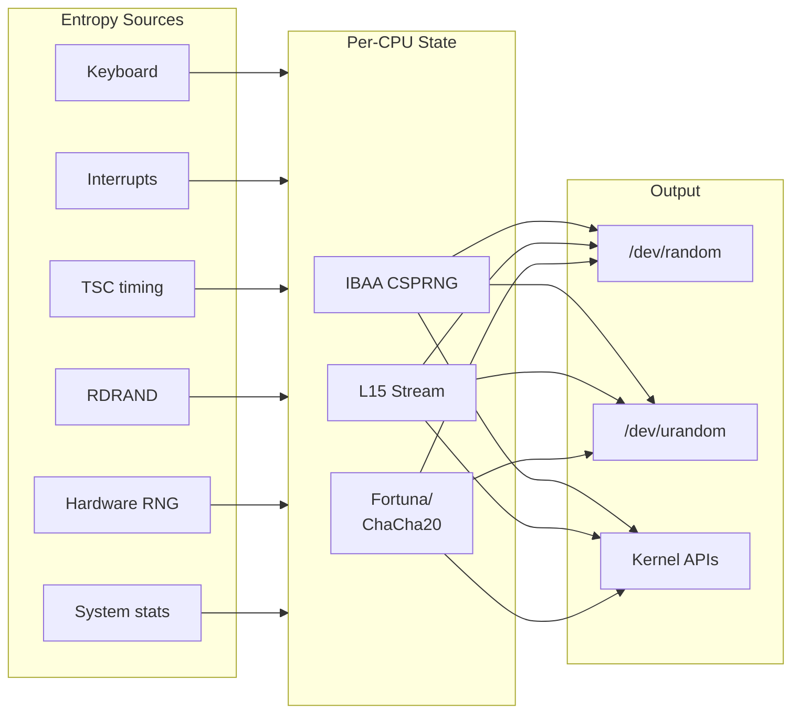

# Random Number Generation

The kernel's random number generation subsystem provides cryptographically
secure pseudo-random numbers for security-sensitive operations such as key
generation, address space randomization, and network protocol parameters.

DragonFly BSD uses a hybrid design combining multiple entropy sources and
cryptographic algorithms to ensure unpredictability even under adversarial
conditions.

**Source files:**

- `sys/kern/kern_nrandom.c` - Main random subsystem (966 lines)
- `sys/kern/subr_csprng.c` - CSPRNG (Fortuna-based) implementation (286 lines)
- `sys/sys/random.h` - Public kernel API (123 lines)
- `sys/sys/csprng.h` - CSPRNG state structures (53 lines)
- `sys/sys/ibaa.h` - IBAA/L15 state definitions (27 lines)

## Overview

### Design Goals

| Goal | Implementation |
|------|----------------|
| Unpredictability | Multiple entropy sources |
| Forward secrecy | Automatic rekeying |
| Recovery from compromise | Continuous entropy mixing |
| Performance | Per-CPU generators |
| Availability | Always returns data |

### Architecture



### Random Modes

The output mode is configurable via sysctl:

```c
/* sys/kern/kern_nrandom.c:466 */
static int rand_mode = 2;  /* default: mixed */

SYSCTL_PROC(_kern, OID_AUTO, rand_mode, ...);
```

| Mode | Name | Description |
|------|------|-------------|
| 0 | `csprng` | Only use Fortuna/ChaCha20 |
| 1 | `ibaa` | Only use IBAA CSPRNG |
| 2 | `mixed` | XOR both outputs (default) |

The mixed mode provides defense in depth: even if one algorithm is compromised,
the other provides protection.

## Entropy Sources

### Source Identifiers

```c
/* sys/sys/random.h:77 */
#define RAND_SRC_UNKNOWN    0x0000
#define RAND_SRC_SEEDING    0x0001
#define RAND_SRC_TIMING     0x0002
#define RAND_SRC_INTR       0x0003
#define RAND_SRC_RDRAND     0x0004
#define RAND_SRC_PADLOCK    0x0005
#define RAND_SRC_GLXSB      0x0006
#define RAND_SRC_HIFN       0x0007
#define RAND_SRC_UBSEC      0x0008
#define RAND_SRC_SAFE       0x0009
#define RAND_SRC_VIRTIO     0x000a
#define RAND_SRC_THREAD1    0x000b
#define RAND_SRC_THREAD2    0x000c
#define RAND_SRC_THREAD3    0x000d
#define RAND_SRC_TPM        0x000e

#define RAND_SRC_MASK       0x00FF
#define RAND_SRCF_PCPU      0x0100  /* Per-CPU source */
```

### Keyboard Events

Keyboard scan codes provide timing-based entropy:

```c
/* sys/kern/kern_nrandom.c:567 */
void
add_keyboard_randomness(u_char scancode)
{
    struct csprng_state *state;

    state = iterate_csprng_state(1);
    if (state) {
        spin_lock(&state->spin);
        L15_Vector(&state->l15,
                   (const LByteType *)&scancode, sizeof(scancode));
        ++state->nrandevents;
        ++state->nrandseed;
        spin_unlock(&state->spin);
        add_interrupt_randomness(0);
    }
}
```

### Interrupt Timing

High-frequency timer (TSC) sampled at interrupt time:

```c
/* sys/kern/kern_nrandom.c:590 */
void
add_interrupt_randomness(int intr)
{
    if (tsc_present) {
        rand_thread_value = (rand_thread_value << 4) ^ 1 ^
            ((int)rdtsc() % 151);
    }
    ++rand_thread_value;  /* ~1 bit of entropy */
}
```

The TSC provides sub-microsecond timing variations that are difficult to predict.

### Hardware RNG (RDRAND)

Intel RDRAND instruction provides hardware-generated random numbers:

```c
/* Called from various drivers with RAND_SRC_RDRAND */
add_buffer_randomness_src(buf, bytes, RAND_SRC_RDRAND | RAND_SRCF_PCPU);
```

### System Statistics

The random thread periodically harvests system statistics:

```c
/* sys/kern/kern_nrandom.c:886 */
add_buffer_randomness_state(state,
                            (void *)&rgd->gd_cnt,
                            sizeof(rgd->gd_cnt),
                            RAND_SRC_THREAD2);
add_buffer_randomness_state(state,
                            (void *)&rgd->gd_vmtotal,
                            sizeof(rgd->gd_vmtotal),
                            RAND_SRC_THREAD3);
```

## Cryptographic Primitives

### IBAA (Bob Jenkins' CSPRNG)

IBAA is a cryptographically secure PRNG with 256 32-bit words of state:

```c
/* sys/sys/ibaa.h:8 */
struct ibaa_state {
    uint32_t    IBAA_memory[SIZE];     /* 256 words of state */
    uint32_t    IBAA_results[SIZE];    /* 256 words of output */
    uint32_t    IBAA_aa;               /* accumulator */
    uint32_t    IBAA_bb;               /* previous result */
    uint32_t    IBAA_counter;          /* counter */
    int         IBAA_byte_index;       /* output position */
    int         memIndex;              /* seed position */
};
```

Core algorithm:

```c
/* sys/kern/kern_nrandom.c:217 */
static void IBAA(u4 *m, u4 *r, u4 *aa, u4 *bb, u4 *counter)
{
    u4 a, b, x, y, i;

    a = *aa;
    b = *bb + *counter;
    ++*counter;
    for (i = 0; i < SIZE; ++i) {
        x = m[i];
        a = barrel(a) + m[ind(i + (SIZE / 2))];  /* set a */
        m[i] = y = m[ind(x)] + a + b;            /* set m */
        r[i] = b = m[ind(y >> ALPHA)] + x;       /* set r */
    }
    *bb = b; *aa = a;
}
```

### L15 Stream Cipher

L15 is a lightweight stream cipher providing additional mixing:

```c
/* sys/sys/ibaa.h:18 */
struct l15_state {
    uint8_t     L15_x;
    uint8_t     L15_y;
    uint8_t     L15_start_x;
    uint8_t     L15_state[L15_STATE_SIZE];  /* 256 bytes */
    uint8_t     stateIndex;
};
```

Output generation:

```c
/* sys/kern/kern_nrandom.c:431 */
static LByteType
L15_Byte(struct l15_state *l15)
{
    LByteType z;

    L15_Swap(l15, l15->L15_state[l15->L15_x], l15->L15_y);
    z = (l15->L15_state[l15->L15_x++] + l15->L15_state[l15->L15_y--]);
    if (l15->L15_x == l15->L15_start_x) {
        --l15->L15_y;
    }
    return (l15->L15_state[z]);
}
```

### Fortuna (ChaCha20-based)

The main CSPRNG uses a Fortuna-like design with ChaCha20:

```c
/* sys/sys/csprng.h:23 */
struct csprng_state {
    uint8_t         key[SHA256_DIGEST_LENGTH];  /* 32-byte key */
    uint64_t        reseed_cnt;                  /* reseed counter */
    struct chacha_ctx cipher_ctx;                /* ChaCha20 context */
    struct csprng_pool pool[32];                 /* 32 entropy pools */
    uint8_t         src_pool_idx[256];           /* per-source pool index */
    struct spinlock spin;                        /* per-CPU lock */
    /* ... plus IBAA and L15 states ... */
};
```

#### Entropy Pools

32 pools with exponentially increasing reseed intervals:

```c
/* sys/kern/subr_csprng.c:16 */
struct csprng_pool {
    uint64_t    bytes;          /* entropy bytes accumulated */
    SHA256_CTX  hash_ctx;       /* running SHA-256 hash */
};
```

Pool `i` contributes to reseed when `reseed_cnt % 2^i == 0`:

- Pool 0: Every reseed
- Pool 1: Every 2nd reseed
- Pool 2: Every 4th reseed
- Pool 31: Every 2^31 reseeds

This design (from Fortuna) ensures that even if an attacker knows the
generator state, they cannot predict past outputs beyond a certain window.

#### Reseeding

```c
/* sys/kern/subr_csprng.c:174 */
static int
csprng_reseed(struct csprng_state *state)
{
    /* Require minimum entropy in pool 0 */
    if (state->pool[0].bytes < MIN_POOL_SIZE) {
        ++state->failed_reseeds;
        return 1;
    }

    SHA256_Init(&hash_ctx);
    SHA256_Update(&hash_ctx, state->key, sizeof(state->key));

    state->reseed_cnt++;

    /* Gather entropy from eligible pools */
    for (i = 0; i < 32; i++) {
        if ((state->reseed_cnt % (1 << i)) != 0)
            break;

        pool = &state->pool[i];
        SHA256_Final(digest, &pool->hash_ctx);
        csprng_pool_init(pool, digest, sizeof(digest));
        SHA256_Update(&hash_ctx, digest, sizeof(digest));
    }

    SHA256_Final(state->key, &hash_ctx);
    chacha_keysetup(&state->cipher_ctx, state->key, 8*sizeof(state->key));

    /* Reset counter (IV) */
    bzero(counter, sizeof(counter));
    chacha_ivsetup(&state->cipher_ctx, NULL, counter);

    return 0;
}
```

#### Random Generation

```c
/* sys/kern/subr_csprng.c:126 */
int
csprng_get_random(struct csprng_state *state, uint8_t *out, int bytes,
                  int flags)
{
    /* Check for reseed interval */
    if (ratecheck(&state->last_reseed, &csprng_reseed_interval)) {
        csprng_reseed(state);
    }

    /* Block if insufficient entropy (unless unlimited) */
    if ((flags & CSPRNG_UNLIMITED) == 0 && state->reseed_cnt == 0) {
        ssleep(state, &state->spin, 0, "csprngrsd", 0);
    }

    while (bytes > 0) {
        /* Limit output per key to 2^20 bytes */
        cnt = (bytes > (1 << 20)) ? (1 << 20) : bytes;

        /* Generate random bytes */
        chacha_encrypt_bytes(&state->cipher_ctx, NULL, out, cnt);

        /* Rekey after each output block */
        chacha_encrypt_bytes(&state->cipher_ctx, NULL, state->key,
                             sizeof(state->key));
        chacha_keysetup(&state->cipher_ctx, state->key,
                        8 * sizeof(state->key));

        out += cnt;
        bytes -= cnt;
    }

    return total_bytes;
}
```

Key properties:
- Automatic rekeying after each output limits damage from state compromise
- Maximum 2^20 bytes per key prevents cryptanalytic attacks
- Forward secrecy: old outputs cannot be recovered after rekeying

## Per-CPU Architecture

### State Distribution

Each CPU has its own random state to avoid lock contention:

```c
/* sys/kern/kern_nrandom.c:173 */
static struct csprng_state *csprng_pcpu;

/* sys/kern/kern_nrandom.c:697 */
state = &csprng_pcpu[mycpu->gd_cpuid];
```

### Entropy Distribution

Entropy is distributed across CPUs in round-robin fashion:

```c
/* sys/kern/kern_nrandom.c:181 */
static struct csprng_state *
iterate_csprng_state(int bytes)
{
    static unsigned int csprng_iterator;
    unsigned int n;

    if (csprng_pcpu) {
        n = csprng_iterator++ % ncpus;
        return &csprng_pcpu[n];
    }
    return NULL;
}
```

### Cross-CPU Mixing

CPUs are chained together to spread entropy:

```c
/* sys/kern/kern_nrandom.c:898 */
/* In rand_thread_loop: read from current CPU, feed to next */
read_random(buf, sizeof(buf), 1);
```

This ensures:
1. No CPU is starved of entropy
2. Entropy from any source eventually affects all CPUs
3. CPUs diverge quickly from similar initial states

## Kernel API

### Reading Random Data

```c
/* sys/sys/random.h:112 */
u_int read_random(void *buf, u_int size, int unlimited);
```

Primary interface for kernel random data:

**Parameters:**

| Parameter | Description |
|-----------|-------------|
| `buf` | Output buffer |
| `size` | Number of bytes requested |
| `unlimited` | If non-zero, never block (for /dev/urandom) |

**Returns:** Number of bytes written (may be less than requested).

**Implementation:**

```c
/* sys/kern/kern_nrandom.c:687 */
u_int
read_random(void *buf, u_int nbytes, int unlimited)
{
    struct csprng_state *state;
    int i, j;

    state = &csprng_pcpu[mycpu->gd_cpuid];

    spin_lock(&state->spin);
    if (rand_mode == 0) {
        /* Only CSPRNG */
        i = csprng_get_random(state, buf, nbytes,
                              unlimited ? CSPRNG_UNLIMITED : 0);
    } else if (rand_mode == 1) {
        /* Only IBAA */
        for (i = 0; i < nbytes; i++)
            ((u_char *)buf)[i] = IBAA_Byte(&state->ibaa);
    } else {
        /* Mix CSPRNG and IBAA */
        i = csprng_get_random(state, buf, nbytes,
                              unlimited ? CSPRNG_UNLIMITED : 0);
        for (j = 0; j < i; j++)
            ((u_char *)buf)[j] ^= IBAA_Byte(&state->ibaa);
    }
    spin_unlock(&state->spin);

    add_interrupt_randomness(0);
    return (i > 0) ? i : 0;
}
```

### Adding Entropy

```c
/* sys/sys/random.h:109 */
int add_buffer_randomness(const char *buf, int bytes);
int add_buffer_randomness_src(const char *buf, int bytes, int srcid);
```

Add entropy from any source:

```c
/* sys/kern/kern_nrandom.c:641 */
int
add_buffer_randomness(const char *buf, int bytes)
{
    struct csprng_state *state;

    state = iterate_csprng_state(bytes);
    return add_buffer_randomness_state(state, buf, bytes, RAND_SRC_UNKNOWN);
}
```

### Interrupt and Keyboard Sources

```c
/* sys/sys/random.h:107 */
void add_keyboard_randomness(u_char scancode);
void add_interrupt_randomness(int intr);
```

Specialized interfaces for common entropy sources.

### System Call: getrandom()

```c
/* sys/kern/kern_nrandom.c:748 */
int
sys_getrandom(struct sysmsg *sysmsg, const struct getrandom_args *uap)
{
    char buf[256];
    ssize_t bytes = (ssize_t)uap->len;

    while (r < bytes) {
        n = sizeof(buf);
        if (n > bytes - r)
            n = bytes - r;
        read_random(buf, n, 1);
        error = copyout(buf, (char *)uap->buf + r, n);
        if (error)
            break;
        r += n;
        lwkt_user_yield();

        /* Check for signals periodically */
        if (++sigcnt == 128) {
            sigcnt = 0;
            if (CURSIG_NOBLOCK(curthread->td_lwp) != 0) {
                error = EINTR;
                break;
            }
        }
    }
    return error;
}
```

User space interface:
```c
ssize_t getrandom(void *buf, size_t buflen, unsigned int flags);
```

**Flags:**
```c
#define GRND_RANDOM     0x0001  /* Use /dev/random (blocking) */
#define GRND_NONBLOCK   0x0002  /* Don't block */
#define GRND_INSECURE   0x0004  /* Allow before full initialization */
```

## Device Nodes

### /dev/random

Blocking interface - may block if insufficient entropy is available:

```c
/* In device read handler */
read_random(buf, count, 0);  /* unlimited = 0 */
```

### /dev/urandom

Non-blocking interface - always returns data:

```c
/* In device read handler */
read_random(buf, count, 1);  /* unlimited = 1 */
```

Both use the same underlying generator; the difference is only in blocking
behavior when the generator hasn't been seeded.

## Initialization

### Boot Sequence

```c
/* sys/kern/kern_nrandom.c:485 */
void
rand_initialize(void)
{
    /* Called twice:
     * 1. Early boot (ncpus == 1)
     * 2. After SMP initialization
     */

    /* Allocate per-CPU state */
    if (ncpus == 1) {
        csprng_pcpu = &csprng_boot;
    } else {
        csprng_pcpu = kmalloc(ncpus * sizeof(*csprng_pcpu),
                              M_NRANDOM, M_WAITOK | M_ZERO);
    }

    for (n = 0; n < ncpus; ++n) {
        state = &csprng_pcpu[n];

        /* Initialize CSPRNG */
        csprng_init(state);

        /* Initialize IBAA */
        IBAA_Init(&state->ibaa);

        /* Initialize L15 with nanosecond timing */
        nanouptime(&now);
        L15_Init(&state->l15, (const LByteType *)&now.tv_nsec,
                 sizeof(now.tv_nsec));

        /* Seed with timing data */
        for (i = 0; i < (SIZE / 2); ++i) {
            nanotime(&now);
            add_buffer_randomness_state(state, &now.tv_nsec, ...);
            nanouptime(&now);
            add_buffer_randomness_state(state, &now.tv_nsec, ...);
        }

        /* Chain to next CPU for divergence */
        read_random(buf, sizeof(buf), 1);
    }
}

SYSINIT(rand1, SI_BOOT2_POST_SMP, SI_ORDER_SECOND, rand_initialize, 0);
```

### Random Thread

A dedicated thread provides continuous entropy gathering:

```c
/* sys/kern/kern_nrandom.c:843 */
static void
rand_thread_loop(void *dummy)
{
    for (;;) {
        wcpu = (wcpu + 1) % ncpus;
        state = &csprng_pcpu[wcpu];

        /* Harvest timing entropy */
        NANOUP_EVENT(&last, state);

        /* Calculate variable sleep interval (0.1-0.2 seconds) */
        count = muldivu64(sys_cputimer->freq, count + 256, 256 * 10);
        if (time_uptime < 120)
            count = count / 10 + 1;  /* Faster during early boot */

        /* Harvest system statistics */
        add_buffer_randomness_state(state, &rgd->gd_cnt, ...);
        add_buffer_randomness_state(state, &rgd->gd_vmtotal, ...);

        /* Cross-CPU mixing */
        read_random(buf, sizeof(buf), 1);

        tsleep(rand_td, 0, "rwait", 0);
    }
}

SYSINIT(rand2, SI_SUB_HELPER_THREADS, SI_ORDER_ANY, rand_thread_init, 0);
```

## Sysctl Interface

### Reading Random Data

```
sysctl kern.random
```

Returns up to 1MB of random data via sysctl:

```c
/* sys/kern/kern_nrandom.c:724 */
static int
sysctl_kern_random(SYSCTL_HANDLER_ARGS)
{
    char buf[256];
    size_t n = req->oldlen;
    if (n > 1024 * 1024)
        n = 1024 * 1024;

    while (n > 0) {
        r = (n > sizeof(buf)) ? sizeof(buf) : n;
        read_random(buf, r, 1);
        error = SYSCTL_OUT(req, buf, r);
        if (error)
            break;
        n -= r;
    }
    return error;
}
```

### Configuring Mode

```
sysctl kern.rand_mode=mixed    # Use both generators (default)
sysctl kern.rand_mode=csprng   # Only ChaCha20/Fortuna
sysctl kern.rand_mode=ibaa     # Only IBAA
```

## Security Considerations

### Entropy Estimation

The system does not track precise entropy estimates. Instead, it relies on:

1. Multiple independent entropy sources
2. Conservative pool sizing (MIN_POOL_SIZE = 64 + 32 bytes)
3. Cryptographic mixing that preserves entropy

### Boot-Time Entropy

Early boot is the most vulnerable period. The system mitigates this by:

1. Using high-resolution timing (nanoseconds)
2. Sampling multiple times during initialization
3. Running the random thread faster during first 2 minutes
4. Accepting hardware RNG input when available

### State Compromise Recovery

The Fortuna design ensures recovery from state compromise:

1. Higher-numbered pools accumulate entropy over longer periods
2. After compromise, pools 1-31 eventually provide fresh entropy
3. Automatic rekeying limits the impact of key compromise

### Forward Secrecy

Output cannot be used to recover previous outputs because:

1. ChaCha20 key is replaced after each output
2. New key is generated from current state
3. Old key is overwritten in memory

## Performance

### Typical Performance

On modern hardware, `read_random()` achieves:
- ~100-200 MB/s for large requests
- Minimal overhead for small requests (< 1KB)

### Optimization Techniques

1. **Per-CPU state** - Eliminates cross-CPU lock contention
2. **Batch processing** - ChaCha20 generates 64 bytes at a time
3. **Lazy reseeding** - Rate-limited to avoid overhead
4. **Hardware acceleration** - Uses RDRAND when available

## See Also

- [Security](security.md) - Kernel security framework
- [Synchronization](synchronization.md) - Spinlock primitives
- [Time](time.md) - Timekeeping subsystem
- [Sysctl](sysctl.md) - System control interface
