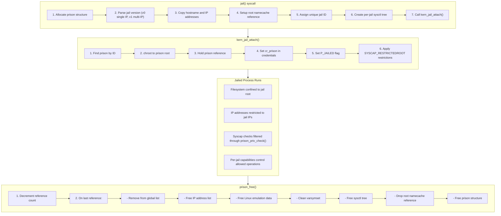

# Security Subsystems

This document covers DragonFly BSD's security infrastructure: system capabilities
for fine-grained privilege control, Access Control Lists (ACLs) for extended file
permissions, and jails for lightweight OS-level virtualization.

**Source files:**
- `sys/kern/kern_caps.c` - System capability framework
- `sys/kern/kern_acl.c` - Access Control List support
- `sys/kern/kern_jail.c` - Jail (container) implementation

## System Capabilities (syscap)

DragonFly implements a capability-based restriction system that allows processes
to voluntarily drop privileges. Unlike traditional UNIX privilege models where
root has full access, capabilities provide fine-grained control over specific
operations.

### Design Philosophy

Capabilities in DragonFly are implemented as **restrictions** (negatives) rather
than allowances. A process starts with full capabilities and can only drop them,
never gain them back. This provides a one-way security ratchet.

Key properties:
- Capabilities cannot be regained once dropped
- Children inherit parent restrictions (for EXEC/ALL modes)
- Restrictions are stored in credential structures
- Operations use `caps_priv_check()` to verify permissions

### Capability Storage

Capabilities are stored as a bitmask in credentials (`sys/caps.h:61`):

```c
typedef __uint64_t __syscapelm_t;

typedef struct syscaps {
    __syscapelm_t caps[__SYSCAP_NUMELMS];  /* 8 elements, 256 caps */
} __syscaps_t;
```

Each capability uses 2 bits, supporting four states:

| Value | Constant | Meaning |
|-------|----------|---------|
| 0 | `__SYSCAP_NONE` | No restriction |
| 1 | `__SYSCAP_SELF` | Restricted for this process |
| 2 | `__SYSCAP_EXEC` | Restricted after exec |
| 3 | `__SYSCAP_ALL` | Restricted for process and all children |

### Capability Groups

Capabilities are organized into 16 groups (`sys/caps.h:130`):

| Group | Meta Capability | Description |
|-------|-----------------|-------------|
| 0 | `SYSCAP_ANY` | Base group, controls other groups |
| 0 | `SYSCAP_RESTRICTEDROOT` | Dangerous root operations |
| 0 | `SYSCAP_SENSITIVEROOT` | Sensitive root operations |
| 1 | (RESTRICTEDROOT children) | Driver, mlock, kld, reboot |
| 2 | (SENSITIVEROOT children) | Process control, sysctl, scheduling |
| 3 | `SYSCAP_NOEXEC` | SUID/SGID execution |
| 4 | `SYSCAP_NOCRED` | Credential changes |
| 5 | `SYSCAP_NOJAIL` | Jail operations |
| 6 | `SYSCAP_NONET` | Basic network operations |
| 7 | `SYSCAP_NONET_SENSITIVE` | Sensitive network operations |
| 8 | `SYSCAP_NOVFS` | VFS operations |
| 9 | `SYSCAP_NOVFS_SENSITIVE` | Sensitive VFS operations |
| 10 | `SYSCAP_NOMOUNT` | Mount operations |

### Selected Capabilities

**Group 1 - Restricted Root** (dangerous operations):
```c
SYSCAP_NODRIVER       /* Device driver access */
SYSCAP_NOVM_MLOCK     /* Memory locking */
SYSCAP_NOKLD          /* Kernel module loading */
SYSCAP_NOREBOOT       /* System reboot/shutdown */
SYSCAP_NOACCT         /* Process accounting */
```

**Group 4 - Credential Operations**:
```c
SYSCAP_NOCRED_SETUID    /* setuid() */
SYSCAP_NOCRED_SETGID    /* setgid() */
SYSCAP_NOCRED_SETEUID   /* seteuid() */
SYSCAP_NOCRED_SETGROUPS /* setgroups() */
```

**Group 6/7 - Network Operations**:
```c
SYSCAP_NONET_RESPORT    /* Bind to reserved ports */
SYSCAP_NONET_RAW        /* Create raw sockets */
SYSCAP_NONET_IFCONFIG   /* Interface configuration */
SYSCAP_NONET_ROUTE      /* Routing table manipulation */
```

### System Calls

**syscap_get()** - Query capability status (`kern_caps.c:77`):

```c
int sys_syscap_get(struct sysmsg *sysmsg, const struct syscap_get_args *uap)
{
    int cap = uap->cap & ~__SYSCAP_XFLAGS;
    
    /* Can query parent's capabilities */
    if (uap->cap & __SYSCAP_INPARENT) {
        pp = pfind(curproc->p_ppid);
        cred = pp->p_ucred;
    } else {
        cred = curthread->td_ucred;
    }
    
    /* Return capability bits */
    res = (cred->cr_caps.caps[__SYSCAP_INDEX(cap)] >>
           __SYSCAP_SHIFT(cap)) & __SYSCAP_BITS_MASK;
    sysmsg->sysmsg_result = res;
}
```

**syscap_set()** - Set capability restrictions (`kern_caps.c:141`):

```c
int sys_syscap_set(struct sysmsg *sysmsg, const struct syscap_set_args *uap)
{
    int cap = uap->cap & ~__SYSCAP_XFLAGS;
    int flags = uap->flags;
    
    /* Can only add restrictions, never remove */
    if (res != (res | flags)) {
        cred = cratom_proc(pp);  /* Copy-on-write credential */
        
        /* Set SYSCAP_ANY bits indicating deviation from root */
        atomic_set_64(&cred->cr_caps.caps[0], anymask);
        
        /* Set the actual capability restriction */
        atomic_set_64(&cred->cr_caps.caps[__SYSCAP_INDEX(cap)],
                      (flags << __SYSCAP_SHIFT(cap)));
    }
}
```

### Capability Inheritance

On exec(), EXEC bits shift into SELF bits (`kern_caps.c:225`):

```c
void caps_exec(struct proc *p)
{
    for (i = 0; i < __SYSCAP_NUMELMS; ++i) {
        elm = cred->cr_caps.caps[i];
        /* EXEC bits (even positions) shift into SELF bits (odd positions) */
        elm = ((elm & __SYSCAP_EXECMASK) >> 1) |
              (elm & __SYSCAP_EXECMASK);
        cred->cr_caps.caps[i] = elm;
    }
}
```

This ensures that restrictions set for "after exec" take effect.

### Privilege Checking

The primary check function (`kern_caps.c:310`):

```c
int caps_priv_check(struct ucred *cred, int cap)
{
    /* NULL credential handling */
    if (cred == NULL) {
        if (cap & __SYSCAP_NULLCRED)
            return 0;
        return EPERM;
    }
    
    /* UID must be 0 unless NOROOTTEST is set */
    if (cred->cr_uid != 0 && (cap & __SYSCAP_NOROOTTEST) == 0)
        return EPERM;
    
    /* Check capability restriction */
    res = caps_check_cred(cred, cap);
    
    /* Also check group capability if specified */
    if (cap & __SYSCAP_GROUP_MASK) {
        cap = (cap & __SYSCAP_GROUP_MASK) >> __SYSCAP_GROUP_SHIFT;
        res |= caps_check_cred(cred, cap);
    }
    
    if (res & __SYSCAP_SELF)
        return EPERM;
    
    /* Finally check jail restrictions */
    return prison_priv_check(cred, cap);
}
```

---

## Access Control Lists (ACLs)

ACLs extend traditional UNIX permissions to support fine-grained access control.
DragonFly implements POSIX.1e ACLs, allowing permissions for specific users and
groups beyond the owner/group/other model.

### ACL Structure

ACL entries define access for specific subjects (`sys/acl.h:54`):

```c
struct acl_entry {
    acl_tag_t   ae_tag;    /* Entry type */
    uid_t       ae_id;     /* User/group ID */
    acl_perm_t  ae_perm;   /* Permissions */
};

struct acl {
    int             acl_cnt;                    /* Number of entries */
    struct acl_entry acl_entry[ACL_MAX_ENTRIES]; /* Up to 32 entries */
};
```

### Entry Types

| Tag | Description |
|-----|-------------|
| `ACL_USER_OBJ` | File owner permissions |
| `ACL_USER` | Specific user permissions |
| `ACL_GROUP_OBJ` | File group permissions |
| `ACL_GROUP` | Specific group permissions |
| `ACL_MASK` | Maximum permissions for users/groups |
| `ACL_OTHER` | Everyone else |

### ACL Types

| Type | Description |
|------|-------------|
| `ACL_TYPE_ACCESS` | Access permissions |
| `ACL_TYPE_DEFAULT` | Default ACL for directories |
| `ACL_TYPE_AFS` | AFS ACL |
| `ACL_TYPE_CODA` | Coda ACL |
| `ACL_TYPE_NTFS` | NTFS ACL |

### Permission Bits

```c
#define ACL_PERM_READ   0x0004
#define ACL_PERM_WRITE  0x0002
#define ACL_PERM_EXEC   0x0001
#define ACL_PERM_NONE   0x0000
```

### System Call Interface

The kernel provides low-level ACL operations (`kern_acl.c`):

**Get ACL** (`kern_acl.c:148`):
```c
int sys___acl_get_file(struct sysmsg *sysmsg,
                       const struct __acl_get_file_args *uap)
{
    error = nlookup_init(&nd, uap->path, UIO_USERSPACE, NLC_FOLLOW);
    error = nlookup(&nd);
    error = cache_vref(&nd.nl_nch, nd.nl_cred, &vp);
    
    error = vacl_get_acl(vp, uap->type, uap->aclp);
}
```

**Set ACL** (`kern_acl.c:66`):
```c
static int vacl_set_acl(struct vnode *vp, acl_type_t type, struct acl *aclp)
{
    error = copyin(aclp, &inkernacl, sizeof(struct acl));
    
    vn_lock(vp, LK_EXCLUSIVE | LK_RETRY);
    error = VOP_SETACL(vp, type, &inkernacl, ucred);
    vn_unlock(vp);
}
```

### ACL System Calls

| Syscall | Description |
|---------|-------------|
| `__acl_get_file` | Get ACL by path |
| `__acl_set_file` | Set ACL by path |
| `__acl_get_fd` | Get ACL by file descriptor |
| `__acl_set_fd` | Set ACL by file descriptor |
| `__acl_delete_file` | Delete ACL by path |
| `__acl_delete_fd` | Delete ACL by file descriptor |
| `__acl_aclcheck_file` | Validate ACL by path |
| `__acl_aclcheck_fd` | Validate ACL by file descriptor |

### VFS Integration

ACL operations are delegated to the filesystem via VOP:

- `VOP_GETACL(vp, type, aclp, cred)` - Retrieve ACL
- `VOP_SETACL(vp, type, aclp, cred)` - Set ACL  
- `VOP_ACLCHECK(vp, type, aclp, cred)` - Validate ACL

Not all filesystems support ACLs. UFS and HAMMER2 provide ACL support.

---

## Jails

Jails provide lightweight OS-level virtualization, isolating processes in a
restricted environment with its own hostname, IP addresses, and filesystem
root. Originally from FreeBSD, DragonFly's implementation adds capability-based
restrictions.

### Prison Structure

Each jail is represented by a prison structure (`sys/jail.h:113`):

```c
struct prison {
    LIST_ENTRY(prison) pr_list;       /* Global prison list */
    int         pr_id;                /* Unique jail ID */
    int         pr_ref;               /* Reference count */
    struct nchandle pr_root;          /* Jail root directory */
    char        pr_host[MAXHOSTNAMELEN]; /* Hostname */
    SLIST_HEAD(, jail_ip_storage) pr_ips; /* IP addresses */
    
    /* IP address caches for fast lookup */
    struct sockaddr_in  *local_ip4;   /* Loopback IPv4 */
    struct sockaddr_in  *nonlocal_ip4; /* Public IPv4 */
    struct sockaddr_in6 *local_ip6;   /* Loopback IPv6 */
    struct sockaddr_in6 *nonlocal_ip6; /* Public IPv6 */
    
    void        *pr_linux;            /* Linux emulation data */
    int         pr_securelevel;       /* Security level */
    struct varsymset pr_varsymset;    /* Variable symbols */
    
    struct sysctl_ctx_list *pr_sysctl_ctx;
    struct sysctl_oid *pr_sysctl_tree;
    
    prison_cap_t pr_caps;             /* Jail capabilities */
};
```

### Jail Capabilities

Jails have their own capability system (`sys/jail.h:68`):

| Capability | Description |
|------------|-------------|
| `PRISON_CAP_SYS_SET_HOSTNAME` | Can set hostname |
| `PRISON_CAP_SYS_SYSVIPC` | Can use System V IPC |
| `PRISON_CAP_NET_UNIXIPROUTE` | Restricted to UNIX/IP/route sockets |
| `PRISON_CAP_NET_RAW_SOCKETS` | Can create raw sockets |
| `PRISON_CAP_NET_LISTEN_OVERRIDE` | Can override host wildcard listen |
| `PRISON_CAP_VFS_CHFLAGS` | Can modify file flags |
| `PRISON_CAP_VFS_MOUNT_NULLFS` | Can mount nullfs |
| `PRISON_CAP_VFS_MOUNT_DEVFS` | Can mount devfs |
| `PRISON_CAP_VFS_MOUNT_TMPFS` | Can mount tmpfs |
| `PRISON_CAP_VFS_MOUNT_PROCFS` | Can mount procfs |
| `PRISON_CAP_VFS_MOUNT_FUSEFS` | Can mount FUSE |

### Creating a Jail

The `jail()` system call creates and enters a jail (`kern_jail.c:254`):

```c
int sys_jail(struct sysmsg *sysmsg, const struct jail_args *uap)
{
    /* Requires SYSCAP_NOJAIL_CREATE capability */
    error = caps_priv_check_self(SYSCAP_NOJAIL_CREATE);
    
    pr = kmalloc(sizeof(*pr), M_PRISON, M_WAITOK | M_ZERO);
    SLIST_INIT(&pr->pr_ips);
    
    /* Handle jail version */
    switch (jversion) {
    case 0:  /* Single IPv4 jail */
        ...
        break;
    case 1:  /* Multi-IP jail (DragonFly extension) */
        for (i = 0; i < j.n_ips; i++) {
            /* Copy IP addresses */
        }
        break;
    }
    
    /* Copy hostname and set default capabilities */
    copyinstr(j.hostname, &pr->pr_host, ...);
    pr->pr_caps = prison_default_caps;
    
    /* Setup jail root and attach */
    error = kern_jail(pr, &j);
}
```

### Jail Attachment

Attaching to a jail chroots and sets restrictions (`kern_jail.c:136`):

```c
static int kern_jail_attach(int jid)
{
    pr = prison_find(jid);
    
    /* Chroot to jail's root directory */
    error = kern_chroot(&pr->pr_root);
    
    /* Set jail reference and mark process as jailed */
    prison_hold(pr);
    cr = cratom_proc(p);
    cr->cr_prison = pr;
    p->p_flags |= P_JAILED;
    
    /* Apply restricted root capabilities */
    caps_set_locked(p, SYSCAP_RESTRICTEDROOT, __SYSCAP_ALL);
}
```

### IP Address Handling

Jails can have multiple IP addresses. The framework provides address
translation for loopback addresses (`kern_jail.c:492`):

```c
int prison_local_ip(struct thread *td, struct sockaddr *ip)
{
    pr = td->td_ucred->cr_prison;
    
    /* Convert jail's loopback IP back to 127.0.0.1 */
    if (ip->sa_family == AF_INET && pr->local_ip4 &&
        pr->local_ip4->sin_addr.s_addr == ip4->sin_addr.s_addr) {
        ip4->sin_addr.s_addr = htonl(INADDR_LOOPBACK);
    }
}
```

This allows programs in jails to use 127.0.0.1 while actually using
a different loopback address (e.g., 127.0.0.2).

### Privilege Checking in Jails

Jail privilege checks filter syscap checks (`kern_jail.c:846`):

```c
int prison_priv_check(struct ucred *cred, int cap)
{
    if (!jailed(cred))
        return 0;  /* Not in jail, allow */
    
    switch (cap & ~__SYSCAP_XFLAGS) {
    case SYSCAP_RESTRICTEDROOT:
        return EPERM;  /* Always denied in jails */
        
    case SYSCAP_NOJAIL_CREATE:
    case SYSCAP_NOJAIL_ATTACH:
        return EPERM;  /* No nested jails */
        
    case SYSCAP_NONET_RAW:
        /* Conditional based on jail capability */
        if (PRISON_CAP_ISSET(pr->pr_caps, PRISON_CAP_NET_RAW_SOCKETS))
            return 0;
        return EPERM;
        
    case SYSCAP_NOMOUNT_NULLFS:
        if (PRISON_CAP_ISSET(pr->pr_caps, PRISON_CAP_VFS_MOUNT_NULLFS))
            return 0;
        return EPERM;
        
    /* Most operations allowed in jails */
    default:
        return EPERM;
    }
}
```

### Sysctl Interface

Jails are configurable via sysctl:

**Global defaults** (`jail.defaults.*`):
```
jail.defaults.set_hostname_allowed
jail.defaults.socket_unixiproute_only
jail.defaults.sysvipc_allowed
jail.defaults.chflags_allowed
jail.defaults.allow_raw_sockets
jail.defaults.vfs_mount_nullfs
jail.defaults.vfs_mount_tmpfs
...
```

**Per-jail settings** (`jail.<id>.*`):
```
jail.1.sys_set_hostname
jail.1.sys_sysvipc
jail.1.net_raw_sockets
jail.1.vfs_mount_nullfs
...
```

**Monitoring**:
```
jail.list      - List active jails (id hostname path IPs)
jail.jailed    - Is current process jailed?
```

### Jail Lifecycle



### Security Considerations

1. **No Nested Jails** - Processes in jails cannot create new jails
2. **Automatic Restrictions** - Jailed processes get `SYSCAP_RESTRICTEDROOT`
3. **IP Isolation** - Jails can only bind/connect to assigned IPs
4. **Filesystem Isolation** - chroot provides filesystem boundary
5. **Capability-Based Control** - Fine-grained permission via `pr_caps`

---

## Integration Points

### Credential Structure

Security information is stored in credentials:

```c
struct ucred {
    uid_t       cr_uid;       /* Effective user ID */
    gid_t       cr_gid;       /* Effective group ID */
    uid_t       cr_ruid;      /* Real user ID */
    gid_t       cr_rgid;      /* Real group ID */
    struct prison *cr_prison;  /* Jail reference (or NULL) */
    __syscaps_t cr_caps;       /* Capability restrictions */
    ...
};
```

### Standard Privilege Check Pattern

```c
int some_privileged_operation(struct thread *td)
{
    int error;
    
    /* Check specific capability */
    error = caps_priv_check_self(SYSCAP_SOME_OPERATION);
    if (error)
        return error;
    
    /* Proceed with operation */
    ...
}
```

The check automatically considers:
1. UID (must be 0 unless NOROOTTEST)
2. Capability restrictions in credentials
3. Group capability restrictions
4. Jail-specific restrictions

---

## See Also

- [Processes](processes.md) - Process and credential management
- [System Calls](syscalls.md) - System call implementation
- [VFS Operations](vfs/vfs-operations.md) - ACL integration with filesystems
- [Sysctl Framework](sysctl.md) - Jail sysctl interface
