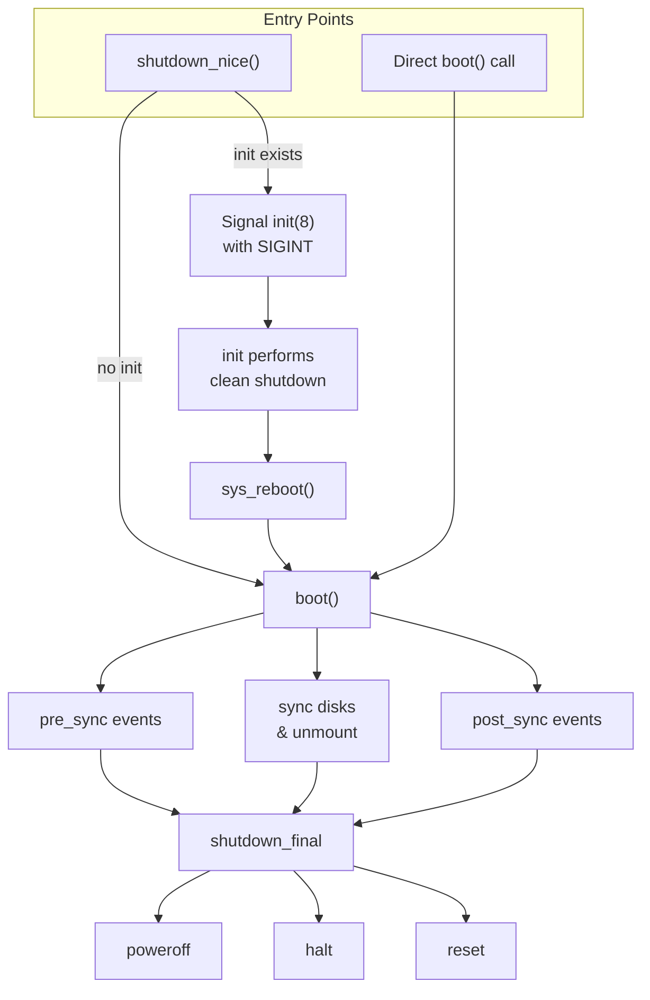
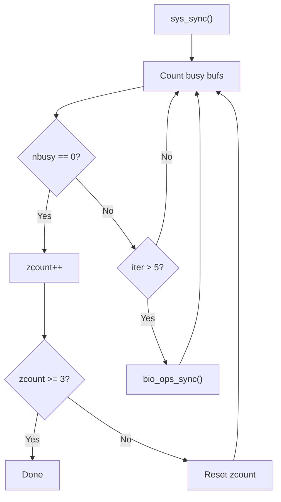
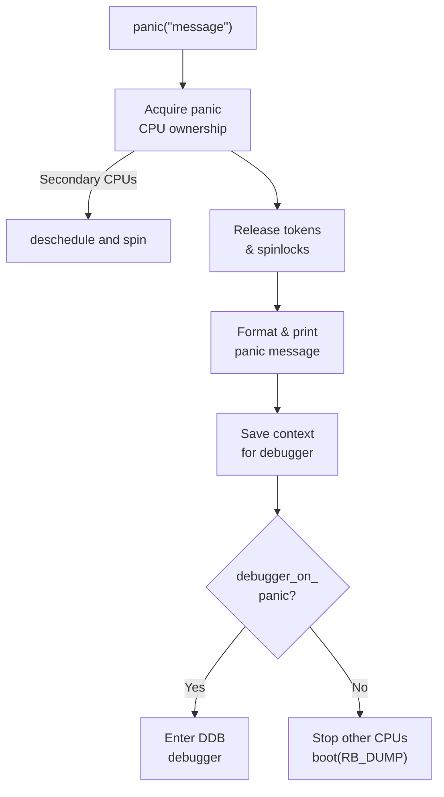

# System Shutdown and Panic Handling

The DragonFly BSD kernel provides a comprehensive shutdown subsystem that handles
orderly system shutdown, reboot operations, kernel panic handling, and crash dump
generation. This functionality is implemented in `sys/kern/kern_shutdown.c`.

## Overview

The shutdown subsystem provides:

- **Clean shutdown** - Orderly termination with filesystem sync and unmount
- **Reboot handling** - System restart with various options
- **Panic processing** - Kernel crash handling and diagnostics
- **Crash dumps** - Memory dump to disk for post-mortem analysis
- **Event handlers** - Extensible shutdown hook mechanism



## Shutdown Events

The shutdown subsystem uses event handlers to coordinate shutdown activities.
Components register handlers that are invoked at specific phases.

### Event Types

| Event | Priority Constants | Purpose |
|-------|-------------------|---------|
| `shutdown_pre_sync` | `SHUTDOWN_PRI_*` | Before filesystem sync |
| `shutdown_post_sync` | `SHUTDOWN_PRI_*` | After sync, before halt |
| `shutdown_final` | `SHUTDOWN_PRI_*` | Final shutdown operations |

### Priority Levels

```c
#define SHUTDOWN_PRI_FIRST      0
#define SHUTDOWN_PRI_DEFAULT    10000
#define SHUTDOWN_PRI_LAST       20000
```

### Built-in Final Handlers

Registered at initialization (`kern_shutdown.c:163-170`):

| Handler | Priority | Purpose |
|---------|----------|---------|
| `poweroff_wait()` | FIRST | Delay before poweroff |
| `shutdown_halt()` | LAST + 100 | Handle halt request |
| `shutdown_panic()` | LAST + 100 | Handle panic reboot delay |
| `shutdown_reset()` | LAST + 200 | Perform actual reset |

### Registering Shutdown Handlers

```c
#include <sys/eventhandler.h>

/* Register pre-sync handler */
EVENTHANDLER_REGISTER(shutdown_pre_sync, my_pre_sync,
                      NULL, SHUTDOWN_PRI_DEFAULT);

/* Register post-sync handler */
EVENTHANDLER_REGISTER(shutdown_post_sync, my_cleanup,
                      NULL, SHUTDOWN_PRI_DEFAULT);

/* Register final handler */
EVENTHANDLER_REGISTER(shutdown_final, my_final,
                      NULL, SHUTDOWN_PRI_DEFAULT);
```

## The boot() Function

The central shutdown function that orchestrates the entire process
(`kern_shutdown.c:250-409`).

### Boot Flags (RB_*)

| Flag | Value | Description |
|------|-------|-------------|
| `RB_AUTOBOOT` | 0 | Normal reboot |
| `RB_HALT` | 0x0008 | Halt instead of reboot |
| `RB_NOSYNC` | 0x0004 | Don't sync filesystems |
| `RB_DUMP` | 0x0100 | Dump memory before reboot |
| `RB_POWEROFF` | 0x4000 | Power off instead of reboot |
| `RB_SINGLE` | 0x0002 | Reboot to single user |

### Shutdown Sequence

1. **CPU Migration** - Move to BSP (CPU 0) for ACPI compatibility
2. **Pre-sync Events** - Invoke `shutdown_pre_sync` handlers
3. **Process Cleanup** - Remove filesystem references from processes
4. **Filesystem Sync** - Sync all dirty buffers to disk
5. **Filesystem Unmount** - Unmount all filesystems
6. **Print Uptime** - Display system uptime
7. **Crash Dump** - Generate dump if requested
8. **Post-sync Events** - Invoke `shutdown_post_sync` handlers
9. **Final Events** - Invoke `shutdown_final` handlers (halt/reset)

### Process Cleanup

During shutdown, `shutdown_cleanup_proc()` removes filesystem references
(`kern_shutdown.c:566-610`):

```c
static void
shutdown_cleanup_proc(struct proc *p)
{
    /* Close all open files */
    kern_closefrom(0);
    
    /* Release current directory */
    if (fdp->fd_cdir) {
        cache_drop(&fdp->fd_ncdir);
        vrele(fdp->fd_cdir);
        fdp->fd_cdir = NULL;
    }
    
    /* Release root directory */
    if (fdp->fd_rdir) { ... }
    
    /* Release jail directory */
    if (fdp->fd_jdir) { ... }
    
    /* Exit vkernel if present */
    if (p->p_vkernel)
        vkernel_exit(p);
    
    /* Release text vnode */
    if (p->p_textvp) { ... }
    
    /* Remove user address space */
    vm_map_remove(&vm->vm_map,
                  VM_MIN_USER_ADDRESS,
                  VM_MAX_USER_ADDRESS);
}
```

## Filesystem Sync

The boot sequence performs thorough filesystem synchronization
(`kern_shutdown.c:306-385`).

### Sync Algorithm



### Two-Pass Buffer Counting

**Pass 1** (`shutdown_busycount1`) - Count all busy/dirty buffers except TMPFS:

```c
static int
shutdown_busycount1(struct buf *bp, void *info)
{
    /* Skip TMPFS buffers */
    if (vp->v_tag == VT_TMPFS)
        return 0;
    
    /* Count locked buffers */
    if ((bp->b_flags & B_INVAL) == 0 && BUF_LOCKINUSE(bp))
        return 1;
    
    /* Count dirty buffers */
    if ((bp->b_flags & (B_DELWRI | B_INVAL)) == B_DELWRI)
        return 1;
    
    return 0;
}
```

**Pass 2** (`shutdown_busycount2`) - Stricter filtering after initial sync:

- Ignores TMPFS, NFS, MFS, SMBFS
- Only counts buffers with active write I/O
- Reports stuck buffers with mount point information

### Unmount Behavior

After successful sync (3 consecutive zero counts), filesystems are unmounted:

```c
if (zcount >= 3) {
    kprintf("done\n");
    if (panicstr == NULL)
        vfs_unmountall(1);  /* Force unmount */
} else {
    kprintf("giving up on %d buffers\n", nbusy);
    /* Skip unmount to force fsck on reboot */
}
```

## Kernel Panic Handling

The `panic()` function handles unrecoverable kernel errors
(`kern_shutdown.c:751-889`).

### Panic Flow



### Multi-CPU Panic Coordination

Only one CPU can handle a panic; others are blocked (`kern_shutdown.c:777-811`):

```c
for (;;) {
    globaldata_t xgd = panic_cpu_gd;
    
    /* Someone else has panic CPU - block this CPU */
    if (xgd && xgd != gd) {
        crit_enter();
        ++mycpu->gd_trap_nesting_level;
        kprintf("SECONDARY PANIC ON CPU %d\n", mycpu->gd_cpuid);
        for (;;) {
            lwkt_deschedule_self(td);
            lwkt_switch();
        }
    }
    
    /* Reentrant panic on same CPU */
    if (xgd && xgd == gd)
        break;
    
    /* Try to claim panic CPU */
    if (atomic_cmpset_ptr(&panic_cpu_gd, NULL, gd))
        break;
}
```

### Panic State Recovery

Before proceeding, panic releases locks to prevent deadlocks:

```c
/* Save token state for debugger */
bcopy(td->td_toks_array, panic_tokens, sizeof(panic_tokens));
panic_tokens_count = td->td_toks_stop - &td->td_toks_base;

/* Release all tokens */
lwkt_relalltokens(td);
td->td_toks_stop = &td->td_toks_base;

/* Clear spinlock count */
if (gd->gd_spinlocks)
    kprintf("panic with %d spinlocks held\n", gd->gd_spinlocks);
gd->gd_spinlocks = 0;
```

### Panic Notification

External panic notifiers can be registered for hardware signaling:

```c
static struct panicerinfo *panic_notifier;

int
set_panic_notifier(struct panicerinfo *info)
{
    if (info == NULL)
        panic_notifier = NULL;
    else if (panic_notifier != NULL)
        return 1;  /* Already registered */
    else
        panic_notifier = info;
    return 0;
}
```

Used by ACPI PV-panic and GPIO error LED support.

## Crash Dump System

### Dump Device Configuration

The dump device is configured at boot or via sysctl:

```c
/* Boot-time configuration via loader tunable */
TUNABLE_STR_FETCH("dumpdev", path, MNAMELEN);
dev = kgetdiskbyname(path);

/* Runtime configuration via sysctl */
SYSCTL_PROC(_kern, KERN_DUMPDEV, dumpdev, ...);
```

### Dumper Registration

Disk drivers register dump handlers (`kern_shutdown.c:947-961`):

```c
struct dumperinfo {
    dumper_t    *dumper;    /* Dump function */
    void        *priv;      /* Driver private data */
    u_int       blocksize;  /* Dump block size */
    off_t       mediaoffset;/* Offset on media */
    off_t       mediasize;  /* Size of dump area */
};

int
set_dumper(struct dumperinfo *di)
{
    if (di == NULL) {
        bzero(&dumper, sizeof(dumper));
        return 0;
    }
    if (dumper.dumper != NULL)
        return EBUSY;
    dumper = *di;
    return 0;
}
```

### Dump Header

Each dump starts with a standardized header (`kern_shutdown.c:630-647`):

```c
struct kerneldumpheader {
    char        magic[20];          /* Dump format magic */
    char        architecture[12];   /* Machine architecture */
    uint32_t    version;            /* Header version */
    uint32_t    architectureversion;/* Arch-specific version */
    uint64_t    dumplength;         /* Total dump size */
    uint64_t    dumptime;           /* Time of dump */
    uint32_t    blocksize;          /* Block size */
    char        hostname[64];       /* System hostname */
    char        versionstring[192]; /* Kernel version */
    char        panicstring[175];   /* Panic message */
    uint8_t     parity;             /* Header checksum */
};
```

### Generating Dumps

```c
void
dumpsys(void)
{
    /* vkernels don't support dumps */
#if defined(_KERNEL_VIRTUAL)
    return;
#endif
    
    if (dumper.dumper != NULL && !dumping) {
        dumping++;
        md_dumpsys(&dumper);  /* Machine-dependent dump */
    }
}
```

### Dump CPU Reactivation

For interactive dumps, other CPUs can be reactivated
(`kern_shutdown.c:995-1012`):

```c
void
dump_reactivate_cpus(void)
{
    dump_stop_usertds = 1;
    need_user_resched();
    
    /* Send IPI to all CPUs */
    for (cpu = 0; cpu < ncpus; cpu++) {
        gd = globaldata_find(cpu);
        seq = lwkt_send_ipiq(gd, need_user_resched_remote, NULL);
        lwkt_wait_ipiq(gd, seq);
    }
    
    restart_cpus(stopped_cpus);
}
```

## System Calls and User Interface

### sys_reboot()

The reboot system call (`kern_shutdown.c:181-193`):

```c
int
sys_reboot(struct sysmsg *sysmsg, const struct reboot_args *uap)
{
    int error;
    
    /* Check for SYSCAP_NOREBOOT capability */
    if ((error = caps_priv_check_self(SYSCAP_NOREBOOT)))
        return error;
    
    get_mplock();
    boot(uap->opt);
    rel_mplock();
    return 0;
}
```

### shutdown_nice()

Graceful shutdown via init(8) (`kern_shutdown.c:200-213`):

```c
void
shutdown_nice(int howto)
{
    shutdown_howto = howto;
    
    if (initproc != NULL) {
        /* Signal init to perform clean shutdown */
        ksignal(initproc, SIGINT);
    } else {
        /* No init - direct reboot without sync */
        boot(RB_NOSYNC);
    }
}
```

### shutdown_kproc()

Stop system processes cleanly (`kern_shutdown.c:921-945`):

```c
void
shutdown_kproc(void *arg, int howto)
{
    struct thread *td = arg;
    int error;
    
    if (panicstr)
        return;  /* Skip during panic */
    
    kprintf("Waiting for system process `%s' to stop...",
            td->td_proc->p_comm);
    
    error = suspend_kproc(td, kproc_shutdown_wait * hz);
    
    if (error == EWOULDBLOCK)
        kprintf("timed out\n");
    else
        kprintf("stopped\n");
}
```

## Sysctl Variables

| Sysctl | Default | Description |
|--------|---------|-------------|
| `debug.debugger_on_panic` | 1 | Enter DDB on panic |
| `debug.trace_on_panic` | 0/1 | Print backtrace on panic |
| `kern.sync_on_panic` | 0 | Sync disks before panic reboot |
| `machdep.do_dump` | 1 | Attempt crash dump |
| `kern.shutdown.poweroff_delay` | 5000 | Delay before poweroff (ms) |
| `kern.shutdown.kproc_shutdown_wait` | 60 | Kproc stop timeout (sec) |
| `debug.bootverbose` | 0 | Verbose boot messages |

## Global State Variables

| Variable | Type | Description |
|----------|------|-------------|
| `panicstr` | `const char *` | First panic message (NULL if not panicked) |
| `dumping` | `int` | Non-zero while dumping |
| `panic_cpu_gd` | `globaldata_t` | CPU handling panic |
| `cold` | `int` | Non-zero during early boot |
| `dumpdev` | `cdev_t` | Configured dump device |
| `dumplo64` | `u_int64_t` | Dump offset on device |
| `waittime` | `int` | Sync wait status (-1 = not started) |

## Compile-Time Options

| Option | Default | Description |
|--------|---------|-------------|
| `PANIC_REBOOT_WAIT_TIME` | 15 | Seconds before auto-reboot after panic |
| `POWEROFF_DELAY` | 5000 | Milliseconds before poweroff |
| `DDB` | - | Enable kernel debugger |
| `DDB_UNATTENDED` | - | Don't enter debugger on panic |
| `DDB_TRACE` | - | Auto-print backtrace on panic |
| `WDOG_DISABLE_ON_PANIC` | - | Disable watchdog on panic |
| `ERROR_LED_ON_PANIC` | - | Light GPIO error LED on panic |

## DragonFly-Specific Features

### BSP Migration

Shutdown always migrates to CPU 0 (BSP) for ACPI compatibility:

```c
if (panicstr == NULL && mycpu->gd_cpuid != 0) {
    kprintf("Switching to cpu #0 for shutdown\n");
    lwkt_setcpu_self(globaldata_find(0));
}
```

### Token Preservation

During panic, token state is preserved for debugging:

```c
bcopy(td->td_toks_array, panic_tokens, sizeof(panic_tokens));
panic_tokens_count = td->td_toks_stop - &td->td_toks_base;
```

### vkernel Support

Virtual kernels handle shutdown differently:

- Clean up vkernel state in `shutdown_cleanup_proc()`
- Dumps are not supported in vkernels

### Priority Elevation

The shutdown thread runs at maximum priority:

```c
if (curthread->td_release)
    curthread->td_release(curthread);
lwkt_setpri_self(TDPRI_MAX);
```

## Example: Registering a Shutdown Handler

```c
#include <sys/eventhandler.h>

/* Device-specific cleanup before sync */
static void
mydev_shutdown_presync(void *arg, int howto)
{
    struct mydev_softc *sc = arg;
    
    /* Flush device caches */
    mydev_flush_cache(sc);
    
    /* Disable DMA */
    mydev_disable_dma(sc);
}

/* Device-specific cleanup after sync */
static void
mydev_shutdown_postsync(void *arg, int howto)
{
    struct mydev_softc *sc = arg;
    
    /* Power down device */
    if (howto & RB_POWEROFF)
        mydev_poweroff(sc);
}

/* Registration during attach */
static int
mydev_attach(device_t dev)
{
    struct mydev_softc *sc = device_get_softc(dev);
    
    sc->shutdown_tag1 = EVENTHANDLER_REGISTER(shutdown_pre_sync,
        mydev_shutdown_presync, sc, SHUTDOWN_PRI_DEFAULT);
    
    sc->shutdown_tag2 = EVENTHANDLER_REGISTER(shutdown_post_sync,
        mydev_shutdown_postsync, sc, SHUTDOWN_PRI_DEFAULT);
    
    return 0;
}

/* Deregistration during detach */
static int
mydev_detach(device_t dev)
{
    struct mydev_softc *sc = device_get_softc(dev);
    
    EVENTHANDLER_DEREGISTER(shutdown_pre_sync, sc->shutdown_tag1);
    EVENTHANDLER_DEREGISTER(shutdown_post_sync, sc->shutdown_tag2);
    
    return 0;
}
```

## See Also

- [Event Notification (kevent)](kevent.md) - Event handler framework
- [Processes & Threads](processes.md) - Process management
- [Virtual Filesystem](vfs/index.md) - Filesystem operations
- [Tracing & Debugging](tracing.md) - Kernel debugging facilities
