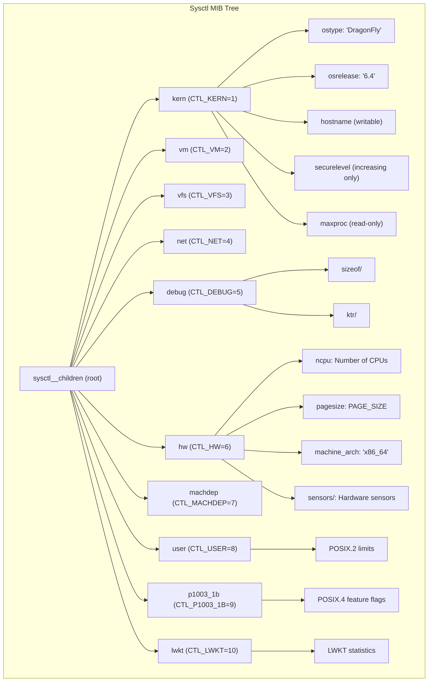

# Sysctl Framework

The sysctl framework provides a hierarchical namespace for kernel
parameters that can be queried and modified by user programs. It is
the primary interface for runtime kernel configuration in DragonFly BSD.

## Source Files

| File | Lines | Description |
|------|-------|-------------|
| `kern_sysctl.c` | 1,661 | Core sysctl implementation |
| `kern_mib.c` | 286 | Standard MIB definitions |
| `kern_posix4_mib.c` | 107 | POSIX.4 (1003.1b) MIBs |
| `kern_kinfo.c` | 333 | Process/LWP info structures |
| `sys/sysctl.h` | 849 | Data structures and macros |

---

## Architecture Overview



---

## Data Structures

### sysctl_oid (`sys/sysctl.h:157`)

Each node in the MIB tree is represented by a `sysctl_oid`:

```c
struct sysctl_oid {
    struct sysctl_oid_list *oid_parent;  /* parent's list */
    SLIST_ENTRY(sysctl_oid) oid_link;    /* sibling linkage */
    int         oid_number;              /* numeric OID component */
    int         oid_kind;                /* type + flags */
    void       *oid_arg1;                /* data pointer or children */
    int         oid_arg2;                /* secondary data (size, etc.) */
    const char *oid_name;                /* string name */
    int        (*oid_handler)(SYSCTL_HANDLER_ARGS);  /* handler function */
    const char *oid_fmt;                 /* format string */
    int         oid_refcnt;              /* reference count */
    u_int       oid_running;             /* handlers currently running */
    const char *oid_descr;               /* description */
    struct lock oid_lock;                /* per-node lock */
};
```

### sysctl_req (`sys/sysctl.h:136`)

Request context passed to handlers:

```c
struct sysctl_req {
    struct thread *td;       /* requesting thread */
    int         lock;        /* wiring state */
    void       *oldptr;      /* output buffer (user/kernel) */
    size_t      oldlen;      /* output buffer size */
    size_t      oldidx;      /* current output position */
    int       (*oldfunc)();  /* output transfer function */
    void       *newptr;      /* input buffer */
    size_t      newlen;      /* input buffer size */
    size_t      newidx;      /* current input position */
    int       (*newfunc)();  /* input transfer function */
    size_t      validlen;    /* valid output length */
    int         flags;       /* request flags */
};
```

---

## OID Types and Flags

### Type Codes (`sys/sysctl.h:69`)

| Type | Value | Description |
|------|-------|-------------|
| `CTLTYPE_NODE` | 0x01 | Interior node with children |
| `CTLTYPE_INT` | 0x02 | 32-bit signed integer |
| `CTLTYPE_STRING` | 0x03 | NUL-terminated string |
| `CTLTYPE_S64` | 0x04 | 64-bit signed integer |
| `CTLTYPE_OPAQUE` | 0x05 | Opaque binary data |
| `CTLTYPE_UINT` | 0x06 | 32-bit unsigned integer |
| `CTLTYPE_LONG` | 0x07 | Native long |
| `CTLTYPE_ULONG` | 0x08 | Native unsigned long |
| `CTLTYPE_U64` | 0x09 | 64-bit unsigned integer |
| `CTLTYPE_U8` | 0x0a | 8-bit unsigned |
| `CTLTYPE_U16` | 0x0b | 16-bit unsigned |
| `CTLTYPE_S8` | 0x0c | 8-bit signed |
| `CTLTYPE_S16` | 0x0d | 16-bit signed |
| `CTLTYPE_S32` | 0x0e | 32-bit signed |
| `CTLTYPE_U32` | 0x0f | 32-bit unsigned |
| `CTLTYPE_BIT32(n)` | 0x10 | Bit n in uint32_t |
| `CTLTYPE_BIT64(n)` | 0x11 | Bit n in uint64_t |

### Access Flags (`sys/sysctl.h:92`)

| Flag | Value | Description |
|------|-------|-------------|
| `CTLFLAG_RD` | 0x80000000 | Readable |
| `CTLFLAG_WR` | 0x40000000 | Writable |
| `CTLFLAG_RW` | (RD\|WR) | Read-write |
| `CTLFLAG_ANYBODY` | 0x10000000 | Any user can write |
| `CTLFLAG_SECURE` | 0x08000000 | securelevel <= 0 to write |
| `CTLFLAG_PRISON` | 0x04000000 | Jail root can modify |
| `CTLFLAG_DYN` | 0x02000000 | Dynamically allocated |
| `CTLFLAG_SKIP` | 0x01000000 | Skip when listing |
| `CTLFLAG_DYING` | 0x00010000 | Being removed |
| `CTLFLAG_SHLOCK` | 0x00008000 | Shared lock on write |
| `CTLFLAG_EXLOCK` | 0x00004000 | Exclusive lock on read |
| `CTLFLAG_NOLOCK` | 0x00002000 | No per-oid lock |

---

## Defining Static Sysctls

### Node Declaration

```c
/* Declare a node with children */
SYSCTL_NODE(parent, nbr, name, access, handler, descr)

/* Example: Create _kern_ipc node */
SYSCTL_NODE(_kern, OID_AUTO, ipc, CTLFLAG_RW, 0, "IPC parameters");
```

### Leaf Values

```c
/* Integer (32-bit) */
SYSCTL_INT(_kern, KERN_MAXPROC, maxproc, CTLFLAG_RD,
    &maxproc, 0, "Maximum number of processes");

/* String */
SYSCTL_STRING(_kern, KERN_OSTYPE, ostype, CTLFLAG_RD | CTLFLAG_NOLOCK,
    ostype, 0, "Operating system type");

/* Long */
SYSCTL_LONG(_hw, OID_AUTO, physmem, CTLFLAG_RD,
    &physmem, 0, "Physical memory");

/* Opaque structure */
SYSCTL_STRUCT(_kern, KERN_CLOCKRATE, clockrate, CTLFLAG_RD,
    &clockrate, clockinfo, "Clock rate info");

/* Custom handler */
SYSCTL_PROC(_kern, KERN_HOSTNAME, hostname,
    CTLTYPE_STRING | CTLFLAG_RW | CTLFLAG_PRISON | CTLFLAG_NOLOCK,
    0, 0, sysctl_hostname, "A", "Hostname");
```

### Bit Fields

```c
/* Single bit in uint32_t */
SYSCTL_BIT32(_debug, OID_AUTO, flag, CTLFLAG_RW,
    &debug_flags, 0, 5, "Debug flag bit 5");

/* Single bit in uint64_t */
SYSCTL_BIT64(_debug, OID_AUTO, flag64, CTLFLAG_RW,
    &debug_flags64, 0, 42, "Debug flag bit 42");
```

---

## Handler Functions

### Standard Handlers

The framework provides built-in handlers for common types:

| Handler | Types |
|---------|-------|
| `sysctl_handle_int` | int, uint |
| `sysctl_handle_long` | long, ulong |
| `sysctl_handle_quad` | int64, uint64 |
| `sysctl_handle_8` | int8, uint8 |
| `sysctl_handle_16` | int16, uint16 |
| `sysctl_handle_32` | int32, uint32 |
| `sysctl_handle_64` | int64, uint64 |
| `sysctl_handle_string` | strings |
| `sysctl_handle_opaque` | binary data |
| `sysctl_handle_bit32` | bit in uint32_t |
| `sysctl_handle_bit64` | bit in uint64_t |

### Custom Handler Example (`kern_mib.c:165`)

```c
static int
sysctl_hostname(SYSCTL_HANDLER_ARGS)
{
    struct proc *p = req->td->td_proc;
    struct prison *pr = p->p_ucred->cr_prison;
    int error;

    /* Upgrade to exclusive lock for writes */
    if (req->newptr) {
        SYSCTL_SUNLOCK();
        SYSCTL_XLOCK();
    }
    
    /* Jail-aware hostname handling */
    if (pr) {
        if (!PRISON_CAP_ISSET(pr->pr_caps,
            PRISON_CAP_SYS_SET_HOSTNAME) && req->newptr)
            return EPERM;
        error = sysctl_handle_string(oidp,
            pr->pr_host, sizeof(pr->pr_host), req);
    } else {
        error = sysctl_handle_string(oidp,
            hostname, sizeof(hostname), req);
    }
    
    if (req->newptr) {
        SYSCTL_XUNLOCK();
        SYSCTL_SLOCK();
    }
    return error;
}
```

### Data Transfer Macros

```c
/* Read data from handler to user */
#define SYSCTL_OUT(req, p, l)  (req->oldfunc)(req, p, l)

/* Write data from user to handler */
#define SYSCTL_IN(req, p, l)   (req->newfunc)(req, p, l)
```

---

## Dynamic Sysctl API

For kernel modules that need to register sysctls at runtime:

### Context Management

```c
struct sysctl_ctx_list ctx;

/* Initialize context */
sysctl_ctx_init(&ctx);

/* Add sysctls to context */
SYSCTL_ADD_INT(&ctx, SYSCTL_STATIC_CHILDREN(_debug),
    OID_AUTO, "myvalue", CTLFLAG_RW, &myvalue, 0, "My value");

SYSCTL_ADD_NODE(&ctx, SYSCTL_STATIC_CHILDREN(_kern),
    OID_AUTO, "mymod", CTLFLAG_RW, NULL, "My module");

/* Free all sysctls in context */
sysctl_ctx_free(&ctx);
```

### Direct Registration (`kern_sysctl.c:434`)

```c
struct sysctl_oid *
sysctl_add_oid(struct sysctl_ctx_list *clist,
    struct sysctl_oid_list *parent,
    int number,                    /* OID_AUTO for auto-assign */
    const char *name,
    int kind,                      /* type | flags */
    void *arg1,                    /* data pointer */
    int arg2,                      /* secondary arg (size) */
    int (*handler)(SYSCTL_HANDLER_ARGS),
    const char *fmt,               /* format string */
    const char *descr);            /* description */
```

### OID Removal

```c
/* Remove an OID */
int sysctl_remove_oid(struct sysctl_oid *oidp, int del, int recurse);

/* Remove by name */
int sysctl_remove_name(struct sysctl_oid *parent, const char *name,
    int del, int recurse);
```

---

## Locking Strategy

### Per-CPU Shared Lock

The sysctl tree uses a per-CPU shared/exclusive lock design for
scalability:

```c
/* Shared lock for reads (per-CPU) */
#define SYSCTL_SLOCK()   lockmgr(&mycpu->gd_sysctllock, LK_SHARED)
#define SYSCTL_SUNLOCK() lockmgr(&mycpu->gd_sysctllock, LK_RELEASE)

/* Exclusive lock for topology changes (all CPUs) */
#define SYSCTL_XLOCK()   _sysctl_xlock()
#define SYSCTL_XUNLOCK() _sysctl_xunlock()
```

### Exclusive Lock Implementation (`kern_sysctl.c:1639`)

```c
void _sysctl_xlock(void)
{
    globaldata_t gd;
    int i;

    /* Lock all per-CPU locks */
    for (i = 0; i < ncpus; ++i) {
        gd = globaldata_find(i);
        lockmgr(&gd->gd_sysctllock, LK_EXCLUSIVE);
    }
}
```

### Per-OID Locking (`kern_sysctl.c:1458`)

Each OID has its own lock for handler serialization:

```c
/* Default: exclusive for writes, shared for reads */
if ((oid->oid_kind & CTLFLAG_NOLOCK) == 0) {
    lktype = (req->newptr != NULL) ? LK_EXCLUSIVE : LK_SHARED;
    if (oid->oid_kind & CTLFLAG_SHLOCK)
        lktype = LK_SHARED;
    if (oid->oid_kind & CTLFLAG_EXLOCK)
        lktype = LK_EXCLUSIVE;
    lockmgr(&oid->oid_lock, lktype);
}
```

---

## System Calls

### sys___sysctl (`kern_sysctl.c:1488`)

```c
int sys___sysctl(struct sysmsg *sysmsg, const struct sysctl_args *uap);

struct sysctl_args {
    int    *name;      /* MIB path (array of ints) */
    u_int   namelen;   /* path length (max CTL_MAXNAME=12) */
    void   *old;       /* output buffer */
    size_t *oldlenp;   /* output size (in/out) */
    void   *new;       /* input buffer */
    size_t  newlen;    /* input size */
};
```

### MIB Lookup Flow

1. `sys___sysctl()` copies MIB from userspace
2. `userland_sysctl()` sets up request context
3. `sysctl_root()` traverses MIB tree
4. Handler invoked with appropriate locking
5. Data transferred via `sysctl_old_user()`/`sysctl_new_user()`

---

## Meta-Sysctls (sysctl.*)

The `sysctl` top-level node provides tree introspection:

| OID | Function |
|-----|----------|
| `sysctl.debug` | Dump entire MIB tree |
| `sysctl.name` | Get string name from OID |
| `sysctl.next` | Get next OID in tree |
| `sysctl.name2oid` | Convert name to OID array |
| `sysctl.oidfmt` | Get OID type and format |
| `sysctl.oiddescr` | Get OID description |

### name2oid Example (`kern_sysctl.c:799`)

```c
static int
name2oid(char *name, int *oid, int *len, struct sysctl_oid **oidpp)
{
    struct sysctl_oid_list *lsp = &sysctl__children;
    char *p;

    for (*len = 0; *len < CTL_MAXNAME;) {
        p = strsep(&name, ".");
        /* Find matching child */
        SLIST_FOREACH(oidp, lsp, oid_link) {
            if (strcmp(p, oidp->oid_name) == 0)
                break;
        }
        if (oidp == NULL)
            return ENOENT;
        *oid++ = oidp->oid_number;
        (*len)++;
        /* Descend into children */
        if ((oidp->oid_kind & CTLTYPE) == CTLTYPE_NODE)
            lsp = SYSCTL_CHILDREN(oidp);
    }
    return 0;
}
```

---

## Standard MIBs (kern_mib.c)

### Top-Level Nodes

```c
SYSCTL_NODE(, CTL_KERN,   kern,    CTLFLAG_RW, 0, "High kernel");
SYSCTL_NODE(, CTL_VM,     vm,      CTLFLAG_RW, 0, "Virtual memory");
SYSCTL_NODE(, CTL_VFS,    vfs,     CTLFLAG_RW, 0, "File system");
SYSCTL_NODE(, CTL_NET,    net,     CTLFLAG_RW, 0, "Network");
SYSCTL_NODE(, CTL_DEBUG,  debug,   CTLFLAG_RW, 0, "Debugging");
SYSCTL_NODE(, CTL_HW,     hw,      CTLFLAG_RW, 0, "Hardware");
SYSCTL_NODE(, CTL_MACHDEP,machdep, CTLFLAG_RW, 0, "Machine dependent");
SYSCTL_NODE(, CTL_USER,   user,    CTLFLAG_RW, 0, "User-level");
SYSCTL_NODE(, CTL_LWKT,   lwkt,    CTLFLAG_RW, 0, "LWKT threads");
```

### Key Kernel Parameters

| Sysctl | Type | Description |
|--------|------|-------------|
| `kern.ostype` | string | "DragonFly" |
| `kern.osrelease` | string | OS version string |
| `kern.version` | string | Full version/build info |
| `kern.hostname` | string | System hostname |
| `kern.securelevel` | int | Security level (-1 to 2) |
| `kern.maxproc` | int | Max processes |
| `kern.maxfiles` | int | Max open files |
| `hw.ncpu` | int | Number of CPUs |
| `hw.pagesize` | int | Memory page size |
| `hw.physmem` | long | Physical memory |

### Securelevel (`kern_mib.c:204`)

```c
static int
sysctl_kern_securelvl(SYSCTL_HANDLER_ARGS)
{
    int error, level;

    level = securelevel;
    error = sysctl_handle_int(oidp, &level, 0, req);
    if (error || !req->newptr)
        return error;
    
    /* Can only increase securelevel */
    if (level < securelevel)
        return EPERM;
    
    securelevel = level;
    return 0;
}
```

---

## kinfo Structures (kern_kinfo.c)

The kinfo subsystem provides structured process information via sysctl:

### fill_kinfo_proc (`kern_kinfo.c:116`)

Populates `struct kinfo_proc` from a process:

```c
void fill_kinfo_proc(struct proc *p, struct kinfo_proc *kp)
{
    kp->kp_paddr = (uintptr_t)p;
    kp->kp_flags = p->p_flags;
    kp->kp_stat = p->p_stat;
    kp->kp_pid = p->p_pid;
    kp->kp_ppid = p->p_pptr ? p->p_pptr->p_pid : -1;
    
    /* Credentials */
    if (p->p_ucred) {
        kp->kp_uid = p->p_ucred->cr_uid;
        kp->kp_ruid = p->p_ucred->cr_ruid;
        /* ... */
    }
    
    /* VM statistics */
    if ((vm = p->p_vmspace) != NULL) {
        kp->kp_vm_map_size = vm->vm_map.size;
        kp->kp_vm_rssize = vmspace_resident_count(vm);
        /* ... */
    }
    
    /* Jail */
    if (p->p_ucred && jailed(p->p_ucred))
        kp->kp_jailid = p->p_ucred->cr_prison->pr_id;
}
```

### fill_kinfo_lwp (`kern_kinfo.c:225`)

Populates `struct kinfo_lwp` from an LWP:

```c
void fill_kinfo_lwp(struct lwp *lwp, struct kinfo_lwp *kl)
{
    kl->kl_pid = lwp->lwp_proc->p_pid;
    kl->kl_tid = lwp->lwp_tid;
    kl->kl_flags = lwp->lwp_flags;
    kl->kl_stat = lwp->lwp_stat;
    
    /* CPU time */
    kl->kl_uticks = lwp->lwp_thread->td_uticks;
    kl->kl_sticks = lwp->lwp_thread->td_sticks;
    kl->kl_cpuid = lwp->lwp_thread->td_gd->gd_cpuid;
    
    /* Wait channel */
    kl->kl_wchan = (uintptr_t)lwp->lwp_thread->td_wchan;
    if (lwp->lwp_thread->td_wmesg)
        strncpy(kl->kl_wmesg, lwp->lwp_thread->td_wmesg, WMESGLEN);
}
```

---

## Initialization

### Registration Order

```c
/* Static OIDs registered at boot (kern_sysctl.c:524) */
SYSINIT(sysctl, SI_BOOT1_POST, SI_ORDER_ANY, sysctl_register_all, 0);

static void
sysctl_register_all(void *arg)
{
    struct sysctl_oid **oidp;

    SYSCTL_XLOCK();
    SET_FOREACH(oidp, sysctl_set)
        sysctl_register_oid(*oidp);
    SYSCTL_XUNLOCK();
}
```

OIDs are collected into the `sysctl_set` linker set via `DATA_SET()`.

---

## Kernel API

### kernel_sysctl (`kern_sysctl.c:1242`)

Kernel-internal sysctl access:

```c
int kernel_sysctl(int *name, u_int namelen,
    void *old, size_t *oldlenp,
    void *new, size_t newlen, size_t *retval);
```

### kernel_sysctlbyname (`kern_sysctl.c:1295`)

Access by string name:

```c
int kernel_sysctlbyname(char *name,
    void *old, size_t *oldlenp,
    void *new, size_t newlen, size_t *retval);
```

---

## Usage Examples

### Reading a Sysctl from Userspace

```c
#include <sys/sysctl.h>

int ncpu;
size_t len = sizeof(ncpu);
sysctlbyname("hw.ncpu", &ncpu, &len, NULL, 0);
```

### Writing a Sysctl

```c
int new_maxproc = 2000;
sysctlbyname("kern.maxprocperuid", NULL, NULL,
    &new_maxproc, sizeof(new_maxproc));
```

### Listing Sysctls (sysctl -a)

```c
int mib[2] = { CTL_SYSCTL, CTL_SYSCTL_NEXT };
int next[CTL_MAXNAME];
size_t len;

while (sysctl(mib, 2, next, &len, name, namelen) == 0) {
    /* Process 'next', then use it as new 'name' */
}
```

---

## See Also

- [Tracing](tracing.md) - KTR uses sysctl for enable masks
- [Processes](processes.md) - Process info via kinfo
- [Security](security.md) - securelevel, jails, and sysctl access
