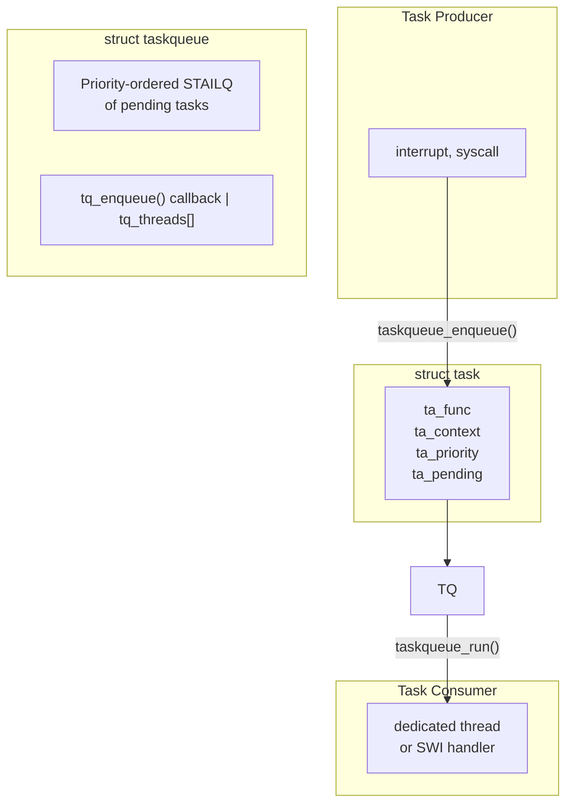

# Task Queues

Task queues provide a mechanism for deferring work execution to a dedicated
thread or software interrupt context. They are used throughout the kernel
for asynchronous processing, interrupt deferral, and work serialization.

DragonFly BSD provides two task queue implementations:

1. **Traditional taskqueue** - Priority-based task scheduling with coalescing
2. **Group taskqueue (gtaskqueue)** - CPU-affinity aware queues for device drivers

**Source files:**

- `sys/kern/subr_taskqueue.c` - Traditional taskqueue implementation (675 lines)
- `sys/kern/subr_gtaskqueue.c` - Group taskqueue implementation (818 lines)
- `sys/sys/taskqueue.h` - Traditional taskqueue API (172 lines)
- `sys/sys/gtaskqueue.h` - Group taskqueue API (140 lines)

## Overview

### Purpose

Task queues solve several common kernel programming challenges:

| Problem | Solution |
|---------|----------|
| Interrupt latency | Defer work from interrupt to thread context |
| Lock ordering | Execute work in a known context |
| Serialization | Process work items sequentially |
| Resource constraints | Batch operations efficiently |

### Architecture



## Traditional Task Queue

### Data Structures

#### struct task

Represents a unit of work to be executed:

```c
/* sys/sys/taskqueue.h:58 */
struct task {
    STAILQ_ENTRY(task) ta_link;     /* link for queue */
    struct taskqueue *ta_queue;      /* taskqueue enqueued on */
    int     ta_pending;              /* count times queued */
    int     ta_priority;             /* priority of task in queue */
    task_fn_t *ta_func;              /* task handler */
    void    *ta_context;             /* argument for handler */
};
```

**Fields:**

| Field | Description |
|-------|-------------|
| `ta_link` | Queue linkage |
| `ta_queue` | Current taskqueue (set on enqueue) |
| `ta_pending` | Enqueue counter (coalescing) |
| `ta_priority` | Lower value = higher priority |
| `ta_func` | Function to execute |
| `ta_context` | Argument passed to function |

#### struct timeout_task

Task with delayed execution support:

```c
/* sys/sys/taskqueue.h:67 */
struct timeout_task {
    struct task t;          /* embedded task */
    struct callout c;       /* timer callout */
    int    f;               /* DT_CALLOUT_ARMED flag */
};
```

#### struct taskqueue

The queue management structure (internal):

```c
/* sys/kern/subr_taskqueue.c:49 */
struct taskqueue {
    STAILQ_ENTRY(taskqueue) tq_link;    /* global queue list */
    STAILQ_HEAD(, task)     tq_queue;   /* pending tasks */
    const char              *tq_name;   /* queue name */
    taskqueue_enqueue_fn    tq_enqueue; /* wakeup callback */
    void                    *tq_context;/* callback context */
    struct task             *tq_running;/* currently running task */
    struct spinlock         tq_lock;    /* queue lock */
    struct thread           **tq_threads;/* worker threads */
    int                     tq_tcount;  /* thread count */
    int                     tq_flags;   /* TQ_FLAGS_* */
    int                     tq_callouts;/* armed timeout count */
};
```

**Queue flags:**

```c
#define TQ_FLAGS_ACTIVE     (1 << 0)  /* queue is active */
#define TQ_FLAGS_BLOCKED    (1 << 1)  /* enqueue blocked */
#define TQ_FLAGS_PENDING    (1 << 2)  /* tasks pending while blocked */
```

### Task Function Signature

```c
typedef void task_fn_t(void *context, int pending);
```

**Parameters:**

- `context` - Value from `ta_context`
- `pending` - Number of times task was enqueued before execution

The `pending` count enables coalescing: if a task is enqueued multiple times
before execution, only one invocation occurs with `pending` indicating the
count.

### API Reference

#### Task Initialization

```c
/* Static initializer */
#define TASK_INITIALIZER(priority, func, context)

/* Runtime initialization */
#define TASK_INIT(task, priority, func, context)

/* Timeout task initialization */
void _timeout_task_init(struct taskqueue *queue,
    struct timeout_task *timeout_task, int priority,
    task_fn_t func, void *context);
#define TIMEOUT_TASK_INIT(queue, timeout_task, priority, func, context)
```

**Example:**

```c
struct task my_task;
TASK_INIT(&my_task, 0, my_handler, my_arg);
```

#### Queue Creation

```c
/* sys/kern/subr_taskqueue.c:114 */
struct taskqueue *
taskqueue_create(const char *name, int mflags,
                 taskqueue_enqueue_fn enqueue, void *context);
```

Creates a new taskqueue. The `enqueue` callback is called (with the queue
locked) when a task is added to wake up the consumer.

**Parameters:**

| Parameter | Description |
|-----------|-------------|
| `name` | Queue name (for debugging) |
| `mflags` | `kmalloc()` flags (M_WAITOK, M_NOWAIT) |
| `enqueue` | Callback to wake consumer |
| `context` | Argument for enqueue callback |

**Example:**

```c
/* Create queue with thread-based consumer */
struct taskqueue *tq;
tq = taskqueue_create("myqueue", M_WAITOK,
                      taskqueue_thread_enqueue, &tq);
```

#### Starting Worker Threads

```c
/* sys/kern/subr_taskqueue.c:547 */
int
taskqueue_start_threads(struct taskqueue **tqp, int count, int pri,
                        int ncpu, const char *fmt, ...);
```

Creates worker threads to service the queue.

**Parameters:**

| Parameter | Description |
|-----------|-------------|
| `tqp` | Pointer to taskqueue pointer |
| `count` | Number of threads to create |
| `pri` | Thread priority (TDPRI_*) |
| `ncpu` | CPU affinity (-1 = distribute across CPUs) |
| `fmt` | Thread name format string |

**Example:**

```c
taskqueue_start_threads(&tq, 1, TDPRI_KERN_DAEMON, -1, "myqueue");
```

#### Task Enqueue

```c
/* sys/kern/subr_taskqueue.c:246 */
int taskqueue_enqueue(struct taskqueue *queue, struct task *task);
```

Enqueues a task for execution. If already enqueued, increments `ta_pending`.

**Returns:** 0 on success, EPIPE if queue is being destroyed.

```c
/* sys/kern/subr_taskqueue.c:263 */
int taskqueue_enqueue_optq(struct taskqueue *queue,
                           struct taskqueue **qpp, struct task *task);
```

Enqueue with optional queue migration. Sets `*qpp` to the actual queue used.

```c
/* sys/kern/subr_taskqueue.c:340 */
int taskqueue_enqueue_timeout(struct taskqueue *queue,
                              struct timeout_task *timeout_task, int ticks);
```

Enqueue task after delay. If `ticks` is 0, enqueue immediately.

#### Task Cancellation

```c
/* sys/kern/subr_taskqueue.c:432 */
int taskqueue_cancel(struct taskqueue *queue, struct task *task, u_int *pendp);
```

Removes task from queue. Returns EBUSY if task is currently executing.
Sets `*pendp` to the pending count that was cancelled.

```c
/* sys/kern/subr_taskqueue.c:444 */
int taskqueue_cancel_simple(struct task *task);
```

Cancel task from any queue (uses task's recorded queue).

```c
/* sys/kern/subr_taskqueue.c:468 */
int taskqueue_cancel_timeout(struct taskqueue *queue,
                             struct timeout_task *timeout_task, u_int *pendp);
```

Cancel timeout task and stop its callout.

#### Drain Operations

```c
/* sys/kern/subr_taskqueue.c:489 */
void taskqueue_drain(struct taskqueue *queue, struct task *task);
```

Blocks until task completes (if running) and is no longer pending.

```c
/* sys/kern/subr_taskqueue.c:501 */
void taskqueue_drain_simple(struct task *task);
```

Drain task from any queue.

```c
/* sys/kern/subr_taskqueue.c:521 */
void taskqueue_drain_timeout(struct taskqueue *queue,
                             struct timeout_task *timeout_task);
```

Cancel callout and drain timeout task.

#### Queue Control

```c
/* sys/kern/subr_taskqueue.c:369 */
void taskqueue_block(struct taskqueue *queue);
```

Prevents new enqueues from triggering the wakeup callback. Tasks are still
queued but the consumer isn't notified.

```c
/* sys/kern/subr_taskqueue.c:377 */
void taskqueue_unblock(struct taskqueue *queue);
```

Re-enables enqueue notifications. If tasks were queued while blocked,
triggers the callback.

```c
/* sys/kern/subr_taskqueue.c:150 */
void taskqueue_free(struct taskqueue *queue);
```

Destroys a taskqueue. Runs remaining tasks and terminates worker threads.

```c
/* sys/kern/subr_taskqueue.c:168 */
struct taskqueue *taskqueue_find(const char *name);
```

Finds a taskqueue by name from the global list.

### Built-in Task Queues

DragonFly provides several pre-configured taskqueues:

#### taskqueue_swi

Software interrupt serviced queue. Runs in SWI context (not preemptible
by normal threads).

```c
TASKQUEUE_DECLARE(swi);

/* Usage */
taskqueue_enqueue(taskqueue_swi, &my_task);
```

Defined at `subr_taskqueue.c:644`:
```c
TASKQUEUE_DEFINE(swi, taskqueue_swi_enqueue, 0,
    register_swi(SWI_TQ, taskqueue_swi_run, NULL, "swi_taskq", NULL, -1));
```

#### taskqueue_swi_mp

MP-safe version of `taskqueue_swi`. Tasks may run concurrently on
different CPUs.

```c
TASKQUEUE_DECLARE(swi_mp);
```

#### taskqueue_thread[]

Per-CPU thread-based taskqueues:

```c
extern struct taskqueue *taskqueue_thread[];

/* Usage - enqueue to current CPU's queue */
taskqueue_enqueue(taskqueue_thread[mycpuid], &my_task);
```

Initialized at `subr_taskqueue.c:657`:
```c
for (cpu = 0; cpu < ncpus; cpu++) {
    taskqueue_thread[cpu] = taskqueue_create("thread", M_INTWAIT,
        taskqueue_thread_enqueue, &taskqueue_thread[cpu]);
    taskqueue_start_threads(&taskqueue_thread[cpu], 1,
        TDPRI_KERN_DAEMON, cpu, "taskq_cpu %d", cpu);
}
```

### Defining Custom Queues

The `TASKQUEUE_DEFINE` macro creates a taskqueue with automatic
initialization:

```c
/* sys/sys/taskqueue.h:137 */
#define TASKQUEUE_DEFINE(name, enqueue, context, init)

/* Thread-based queue shorthand */
#define TASKQUEUE_DEFINE_THREAD(name)
```

**Example:**

```c
/* Define a custom thread-based taskqueue */
TASKQUEUE_DEFINE_THREAD(mydriver);

/* Use it */
taskqueue_enqueue(taskqueue_mydriver, &task);
```

### Implementation Details

#### Priority Ordering

Tasks are inserted in priority order (lower value = higher priority):

```c
/* sys/kern/subr_taskqueue.c:214 */
prev = STAILQ_LAST(&queue->tq_queue, task, ta_link);
if (!prev || prev->ta_priority >= task->ta_priority) {
    STAILQ_INSERT_TAIL(&queue->tq_queue, task, ta_link);
} else {
    /* Find insertion point */
    for (ins = STAILQ_FIRST(&queue->tq_queue); ins;
         prev = ins, ins = STAILQ_NEXT(ins, ta_link))
        if (ins->ta_priority < task->ta_priority)
            break;
    /* Insert before 'ins' */
}
```

#### Task Coalescing

Multiple enqueues before execution are coalesced:

```c
/* sys/kern/subr_taskqueue.c:205 */
if (task->ta_pending) {
    KKASSERT(queue == task->ta_queue);
    task->ta_pending++;
    return 0;  /* Already queued, just increment count */
}
```

#### Thread Loop

Worker threads run this loop:

```c
/* sys/kern/subr_taskqueue.c:609 */
void
taskqueue_thread_loop(void *arg)
{
    struct taskqueue **tqp, *tq;

    tqp = arg;
    tq = *tqp;
    TQ_LOCK(tq);
    while ((tq->tq_flags & TQ_FLAGS_ACTIVE) != 0) {
        taskqueue_run(tq, 1);
        TQ_SLEEP(tq, tq, "tqthr");  /* Wait for work */
    }
    tq->tq_tcount--;
    TQ_UNLOCK(tq);
    wakeup_one(tq->tq_threads);
    lwkt_exit();
}
```

#### Locking

Taskqueues use spinlocks for synchronization:

```c
static __inline void TQ_LOCK(struct taskqueue *tq)
{
    spin_lock(&tq->tq_lock);
}

static __inline void TQ_UNLOCK(struct taskqueue *tq)
{
    spin_unlock(&tq->tq_lock);
}

static __inline void TQ_SLEEP(struct taskqueue *tq, void *ident, const char *wmesg)
{
    ssleep(ident, &tq->tq_lock, 0, wmesg, 0);
}
```

## Group Task Queues

Group taskqueues (gtaskqueue) provide CPU-affinity aware task scheduling,
primarily for device drivers and network processing.

### Key Differences from Traditional Taskqueue

| Feature | taskqueue | gtaskqueue |
|---------|-----------|------------|
| Priority | Numeric (lower = higher) | u_short priority |
| Coalescing | Via ta_pending count | TASK_ENQUEUED flag |
| Function signature | `(void*, int)` | `(void*)` |
| CPU binding | Per-queue threads | Per-CPU queue groups |
| IRQ affinity | Manual | Automatic |

### Data Structures

#### struct gtask

```c
/* sys/sys/gtaskqueue.h:54 */
struct gtask {
    STAILQ_ENTRY(gtask) ta_link;    /* link for queue */
    uint16_t ta_flags;               /* TASK_* flags */
    u_short ta_priority;             /* priority */
    gtask_fn_t *ta_func;             /* handler */
    void    *ta_context;             /* handler argument */
};
```

**Task flags:**

```c
#define TASK_ENQUEUED   0x1  /* currently on queue */
#define TASK_NOENQUEUE  0x2  /* blocked from enqueue */
#define TASK_NETWORK    0x4  /* network task (epoch handling) */
```

#### struct grouptask

Extended task with queue group metadata:

```c
/* sys/sys/gtaskqueue.h:68 */
struct grouptask {
    struct gtask            gt_task;        /* embedded gtask */
    void                    *gt_taskqueue;  /* assigned queue */
    LIST_ENTRY(grouptask)   gt_list;        /* group list linkage */
    void                    *gt_uniq;       /* unique identifier */
    char                    gt_name[GROUPTASK_NAMELEN];
    device_t                gt_dev;         /* associated device */
    struct resource         *gt_irq;        /* interrupt resource */
    int                     gt_cpu;         /* bound CPU */
};
```

#### struct taskqgroup

Manages a set of per-CPU queues:

```c
/* sys/kern/subr_gtaskqueue.c:573 */
struct taskqgroup {
    struct taskqgroup_cpu tqg_queue[MAXCPU];  /* per-CPU queues */
    struct lock     tqg_lock;                  /* group lock */
    const char *    tqg_name;                  /* group name */
    int             tqg_cnt;                   /* active queue count */
};

struct taskqgroup_cpu {
    LIST_HEAD(, grouptask) tgc_tasks;  /* tasks on this CPU */
    struct gtaskqueue *tgc_taskq;       /* the taskqueue */
    int         tgc_cnt;                /* task count */
    int         tgc_cpu;                /* CPU number */
};
```

### API Reference

#### Task Initialization

```c
#define GTASK_INIT(gtask, flags, priority, func, context)
#define GROUPTASK_INIT(gtask, priority, func, context)
```

**Example:**

```c
struct grouptask my_gtask;
GROUPTASK_INIT(&my_gtask, 0, my_handler, my_arg);
```

#### Queue Group Creation

```c
/* sys/kern/subr_gtaskqueue.c:782 */
struct taskqgroup *
taskqgroup_create(const char *name, int cnt, int stride);
```

Creates a taskqueue group with `cnt` queues distributed across CPUs
with `stride` spacing.

#### Attaching Tasks

```c
/* sys/kern/subr_gtaskqueue.c:643 */
void
taskqgroup_attach(struct taskqgroup *qgroup, struct grouptask *gtask,
    void *uniq, device_t dev, struct resource *irq, const char *name);
```

Attaches a grouptask to a queue group. Automatically selects the least
loaded queue that doesn't already serve `uniq`.

```c
/* sys/kern/subr_gtaskqueue.c:683 */
int
taskqgroup_attach_cpu(struct taskqgroup *qgroup, struct grouptask *gtask,
    void *uniq, int cpu, device_t dev, struct resource *irq, const char *name);
```

Attaches to a specific CPU's queue.

#### Enqueue

```c
/* sys/kern/subr_gtaskqueue.c:200 */
int grouptaskqueue_enqueue(struct gtaskqueue *queue, struct gtask *gtask);

/* Convenience macro */
#define GROUPTASK_ENQUEUE(gtask) \
    grouptaskqueue_enqueue((gtask)->gt_taskqueue, &(gtask)->gt_task)
```

Returns 0 on success, EAGAIN if blocked (TASK_NOENQUEUE).

#### Task Control

```c
/* sys/kern/subr_gtaskqueue.c:165 */
void grouptask_block(struct grouptask *grouptask);
```

Drains and blocks task from being enqueued.

```c
/* sys/kern/subr_gtaskqueue.c:183 */
void grouptask_unblock(struct grouptask *grouptask);
```

Allows task to be enqueued again.

#### Detaching

```c
/* sys/kern/subr_gtaskqueue.c:731 */
void taskqgroup_detach(struct taskqgroup *qgroup, struct grouptask *gtask);
```

Removes grouptask from queue group.

#### Drain Operations

```c
/* sys/kern/subr_gtaskqueue.c:406 */
void gtaskqueue_drain(struct gtaskqueue *queue, struct gtask *gtask);

/* sys/kern/subr_gtaskqueue.c:414 */
void gtaskqueue_drain_all(struct gtaskqueue *queue);

/* sys/kern/subr_gtaskqueue.c:806 */
void taskqgroup_drain_all(struct taskqgroup *tqg);
```

### Built-in Queue Group

#### qgroup_softirq

Pre-defined queue group for soft IRQ processing:

```c
/* sys/sys/gtaskqueue.h:137 */
TASKQGROUP_DECLARE(softirq);

/* Definition at subr_gtaskqueue.c:51 */
TASKQGROUP_DEFINE(softirq, ncpus, 1);
```

Creates one queue per CPU with stride 1.

### Defining Custom Queue Groups

```c
/* sys/sys/gtaskqueue.h:117 */
#define TASKQGROUP_DEFINE(name, cnt, stride)
```

**Example:**

```c
/* Define queue group with one queue per 2 CPUs */
TASKQGROUP_DEFINE(mydriver, ncpus/2, 2);

/* Attach a task */
taskqgroup_attach(qgroup_mydriver, &my_gtask, device,
                  dev, irq, "mydriver_task");
```

### Load Balancing

The `taskqgroup_find()` function implements load-aware queue selection:

```c
/* sys/kern/subr_gtaskqueue.c:604 */
static int
taskqgroup_find(struct taskqgroup *qgroup, void *uniq)
{
    /* Two passes:
     * 1. Find queue with least tasks not serving 'uniq'
     * 2. If all serve 'uniq', find queue with least tasks
     */
    for (idx = -1, mincnt = INT_MAX, strict = 1; mincnt == INT_MAX;
        strict = 0) {
        for (i = 0; i < qgroup->tqg_cnt; i++) {
            if (qgroup->tqg_queue[i].tgc_cnt > mincnt)
                continue;
            if (strict) {
                LIST_FOREACH(n, &qgroup->tqg_queue[i].tgc_tasks, gt_list)
                    if (n->gt_uniq == uniq)
                        break;
                if (n != NULL)
                    continue;
            }
            mincnt = qgroup->tqg_queue[i].tgc_cnt;
            idx = i;
        }
    }
    return (idx);
}
```

This ensures:
1. Tasks from same device spread across queues (strict pass)
2. Queue with least total tasks selected (load balancing)

### CPU Binding

After queue assignment, threads can be bound to specific CPUs:

```c
/* sys/kern/subr_gtaskqueue.c:760 */
void
taskqgroup_bind(struct taskqgroup *qgroup)
{
    struct taskq_bind_task *gtask;

    if (qgroup->tqg_cnt == 1)
        return;

    for (i = 0; i < qgroup->tqg_cnt; i++) {
        gtask = kmalloc(sizeof(*gtask), M_DEVBUF, M_WAITOK);
        GTASK_INIT(&gtask->bt_task, 0, 0, taskqgroup_binder, gtask);
        gtask->bt_cpuid = qgroup->tqg_queue[i].tgc_cpu;
        grouptaskqueue_enqueue(qgroup->tqg_queue[i].tgc_taskq,
                               &gtask->bt_task);
    }
}
```

The binder task migrates the worker thread to its assigned CPU:

```c
static void
taskqgroup_binder(void *ctx)
{
    struct taskq_bind_task *gtask = ctx;
    lwkt_migratecpu(gtask->bt_cpuid);
    kfree(gtask, M_DEVBUF);
}
```

## Usage Examples

### Simple Deferred Work

```c
#include <sys/taskqueue.h>

struct my_softc {
    struct task work_task;
    /* ... */
};

static void
my_work_handler(void *arg, int pending)
{
    struct my_softc *sc = arg;
    
    /* Process 'pending' accumulated work items */
    while (pending--) {
        /* Do work */
    }
}

static int
my_attach(device_t dev)
{
    struct my_softc *sc = device_get_softc(dev);
    
    TASK_INIT(&sc->work_task, 0, my_work_handler, sc);
    return (0);
}

static void
my_interrupt(void *arg)
{
    struct my_softc *sc = arg;
    
    /* Defer processing to taskqueue */
    taskqueue_enqueue(taskqueue_swi, &sc->work_task);
}

static int
my_detach(device_t dev)
{
    struct my_softc *sc = device_get_softc(dev);
    
    /* Ensure task completes before detach */
    taskqueue_drain(taskqueue_swi, &sc->work_task);
    return (0);
}
```

### Timeout Task

```c
struct my_softc {
    struct timeout_task delayed_task;
};

static void
my_delayed_handler(void *arg, int pending)
{
    /* Called after delay expires */
}

static int
my_attach(device_t dev)
{
    struct my_softc *sc = device_get_softc(dev);
    
    TIMEOUT_TASK_INIT(taskqueue_thread[0], &sc->delayed_task,
                      0, my_delayed_handler, sc);
    return (0);
}

static void
my_start_delayed(struct my_softc *sc)
{
    /* Execute in 1 second */
    taskqueue_enqueue_timeout(taskqueue_thread[0],
                              &sc->delayed_task, hz);
}

static int
my_detach(device_t dev)
{
    struct my_softc *sc = device_get_softc(dev);
    
    taskqueue_drain_timeout(taskqueue_thread[0], &sc->delayed_task);
    return (0);
}
```

### Device Driver with Group Taskqueue

```c
#include <sys/gtaskqueue.h>

struct my_softc {
    struct grouptask irq_task;
    device_t dev;
    struct resource *irq;
};

static void
my_irq_handler(void *arg)
{
    struct my_softc *sc = arg;
    
    /* Process interrupt work */
}

static int
my_attach(device_t dev)
{
    struct my_softc *sc = device_get_softc(dev);
    
    sc->dev = dev;
    sc->irq = bus_alloc_resource_any(dev, SYS_RES_IRQ, &rid, RF_ACTIVE);
    
    GROUPTASK_INIT(&sc->irq_task, 0, my_irq_handler, sc);
    taskqgroup_attach(qgroup_softirq, &sc->irq_task, sc,
                      dev, sc->irq, "my_irq");
    
    return (0);
}

static void
my_interrupt(void *arg)
{
    struct my_softc *sc = arg;
    
    /* Defer to CPU-local taskqueue */
    GROUPTASK_ENQUEUE(&sc->irq_task);
}

static int
my_detach(device_t dev)
{
    struct my_softc *sc = device_get_softc(dev);
    
    taskqgroup_detach(qgroup_softirq, &sc->irq_task);
    bus_release_resource(dev, SYS_RES_IRQ, rid, sc->irq);
    return (0);
}
```

### Custom Taskqueue

```c
/* Define a driver-specific taskqueue */
static struct taskqueue *my_taskqueue;

static void
my_init(void)
{
    my_taskqueue = taskqueue_create("mydriver", M_WAITOK,
                                    taskqueue_thread_enqueue,
                                    &my_taskqueue);
    taskqueue_start_threads(&my_taskqueue, 2, TDPRI_KERN_DAEMON,
                            -1, "mydriver_tq");
}

static void
my_uninit(void)
{
    taskqueue_free(my_taskqueue);
}
```

## Performance Considerations

### Choosing Queue Type

| Use Case | Recommended Queue |
|----------|-------------------|
| Simple deferred work | `taskqueue_swi` |
| Thread context needed | `taskqueue_thread[mycpuid]` |
| High-frequency driver work | `qgroup_softirq` |
| Custom serialization | Create dedicated queue |

### Avoiding Common Pitfalls

1. **Task structure lifetime** - Task must remain valid until drained
2. **Per-CPU tasks** - Don't share task structures across CPUs
3. **Blocking in handlers** - Consider thread-based queues for blocking work
4. **Priority inversion** - Lower priority values execute first

### Lock Ordering

Taskqueue locks should generally be acquired after device locks:

```
device lock → taskqueue lock (via enqueue/drain)
```

Avoid holding taskqueue locks while calling into the task handler.

## See Also

- [Synchronization](synchronization.md) - Kernel locking primitives
- [LWKT](lwkt.md) - Lightweight kernel threads
- [Scheduling](scheduling.md) - Thread scheduling
- [Devices](devices.md) - Device driver framework
- [kevent](kevent.md) - Event notification mechanism
