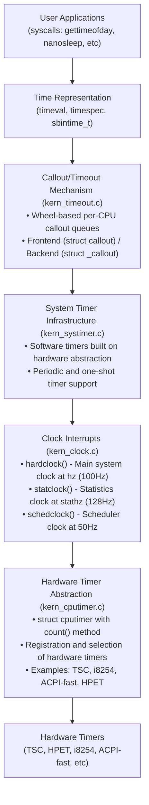
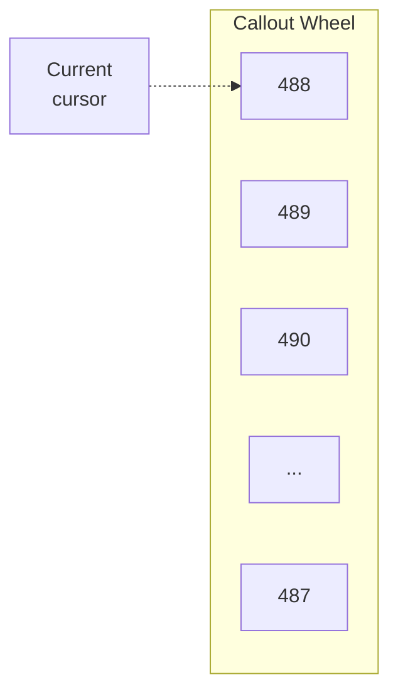

# Time and Timer Subsystems

## Overview

The DragonFly BSD kernel implements a sophisticated multi-layered timekeeping architecture that provides both system-wide and per-CPU timing facilities. The design separates hardware timer abstraction from software timer services, enabling flexible and efficient time management across different hardware platforms.

### Architecture Layers



### Key Source Files

| File | Lines | Purpose |
|------|-------|---------|
| `kern_clock.c` | 1866 | System clock interrupts, hardclock, statclock, schedclock, NTP adjustment |
| `kern_cputimer.c` | 673 | Hardware timer abstraction layer (cputimer) |
| `kern_systimer.c` | 418 | Software timer infrastructure built on cputimer |
| `kern_timeout.c` | 1153 | Callout/timeout mechanism with wheel-based implementation |
| `kern_time.c` | 1247 | Time-related system calls (gettimeofday, nanosleep, etc.) |
| `kern_ntptime.c` | 872 | NTP time adjustment with PLL/FLL |

### Design Principles

1. **Hardware Independence**: The cputimer abstraction allows the kernel to work with different hardware timer sources without modifying upper layers.

2. **Per-CPU Scalability**: Most timing facilities are per-CPU to minimize lock contention and cache line bouncing.

3. **Multiple Time Bases**: The kernel maintains several time representations:
   - **Realtime** (`gettimeofday`): Wall clock time, affected by NTP adjustments
   - **Monotonic** (`clock_gettime(CLOCK_MONOTONIC)`): Always increasing, not affected by time adjustments
   - **Uptime**: Time since boot, not affected by suspend/resume

4. **Lazy Updates**: Many time globals are updated passively to minimize overhead (e.g., `time_second`, `time_uptime`).

5. **NTP Integration**: Built-in support for Network Time Protocol adjustments using phase-locked loop (PLL) and frequency-locked loop (FLL) algorithms.

## Key Concepts

### Clock Types and Frequencies

DragonFly BSD uses three main periodic clock interrupts, each with a different frequency and purpose:

#### hardclock (Main System Clock)

- **Frequency**: `hz` (typically 100 Hz, configurable)
- **Function**: `hardclock()` in kern_clock.c:552
- **Purpose**: 
  - Updates master tick counter (`ticks`, `sbticks`)
  - Advances global time values (`time_second`, `time_uptime`)
  - Processes callouts (timeouts)
  - Handles NTP time adjustments
  - Per-CPU scheduling accounting
- **Per-CPU State**: `gd->gd_hardclock` (struct systimer)

The hardclock is the primary system heartbeat. It runs on each CPU and coordinates time advancement across the system.

```c
/*
 * Hardclock runs on each CPU at hz frequency (typically 100Hz).
 * Updates time, processes timeouts, and performs per-CPU bookkeeping.
 */
static void
hardclock(systimer_t info, int in_ipi, struct intrframe *frame)
{
    /* Update tick counters */
    ticks++;
    sbticks = mftb();
    
    /* Update passive time globals */
    gd->gd_time_seconds = basetime[0].tv_sec;
    
    /* Process callouts for this CPU */
    softclock(info, in_ipi, frame);
    
    /* Scheduling and accounting */
    ...
}
```

#### statclock (Statistics Clock)

- **Frequency**: `stathz` (typically 128 Hz, default; or profhz for profiling)
- **Function**: `statclock()` in kern_clock.c:892
- **Purpose**:
  - CPU usage statistics (user/system time)
  - Profiling support
  - Randomized to prevent synchronization with hardclock
  - Per-process and per-thread accounting
- **Per-CPU State**: `gd->gd_statclock` (struct systimer)

The statclock runs at a slightly different frequency than hardclock to provide statistical sampling that doesn't synchronize with the main clock. This prevents phase-locking artifacts in profiling data.

```c
/*
 * Statclock collects CPU usage statistics.
 * Frequency is randomized to prevent phase locking with hardclock.
 */
static void
statclock(systimer_t info, int in_ipi, struct intrframe *frame)
{
    struct thread *td = curthread;
    struct proc *p = td->td_proc;
    
    /* Account CPU time to current thread/process */
    if (CLKF_USERMODE(frame)) {
        p->p_uticks++;
        if (p->p_nice > NZERO)
            cp_time[CP_NICE]++;
        else
            cp_time[CP_USER]++;
    } else {
        p->p_sticks++;
        cp_time[CP_SYS]++;
    }
    
    /* Profiling support */
    if (p->p_profthreads)
        addupc_intr(p, CLKF_PC(frame), 1);
}
```

#### schedclock (Scheduler Clock)

- **Frequency**: 50 Hz (fixed)
- **Function**: `schedclock()` in kern_clock.c:1028
- **Purpose**:
  - Scheduler hint processing
  - Thread priority recalculation
  - Load balancing decisions
- **Per-CPU State**: `gd->gd_schedclock` (struct systimer)

The schedclock runs at a lower frequency than the other clocks, handling less time-critical scheduler operations.

### Timer Types

#### cputimer (Hardware Timer Abstraction)

The `cputimer` is a hardware abstraction that provides a consistent interface to various hardware timer sources.

**Key Operations**:
- `count()`: Read current timer value (monotonically increasing)
- `fromhz(hz)`: Convert frequency to timer units
- `fromus(us)`: Convert microseconds to timer units
- `fromnano(ns)`: Convert nanoseconds to timer units

**Common Hardware Timers**:
- **TSC** (Time Stamp Counter): Per-CPU cycle counter on x86
- **HPET** (High Precision Event Timer): Modern high-resolution timer
- **i8254**: Legacy PC timer (8254 PIT)
- **ACPI-fast**: ACPI power management timer

**Selection**: The kernel selects the best available cputimer based on quality rating (see `cputimer_register()` in kern_cputimer.c:291).

#### systimer (Software Timer)

The `systimer` builds software timer facilities on top of the hardware cputimer abstraction.

**Types**:
- **Periodic**: Fires at regular intervals (used by hardclock, statclock, schedclock)
- **One-shot**: Fires once at a specified time (used internally)

**Key Functions**:
- `systimer_init_periodic()` (kern_systimer.c:292): Create periodic timer
- `systimer_init_periodic_nq()` (kern_systimer.c:317): Create periodic timer without initial queue
- `systimer_add()`: Add timer to active queue
- `systimer_del()`: Remove timer from queue

Each CPU maintains its own systimer queue to avoid lock contention.

#### callout (Timeout Mechanism)

Callouts provide a high-level timeout mechanism for scheduling function calls in the future.

**Key Features**:
- **Wheel-based algorithm**: O(1) insertion and deletion using a timing wheel
- **Per-CPU wheels**: Separate callout wheels per CPU for scalability
- **Two-tier structure**:
  - **Frontend**: `struct callout` - Embedded in client structures
  - **Backend**: `struct _callout` - Actual queued element with wheel linkage
- **Flags support**: `CALLOUT_MPSAFE`, `CALLOUT_ACTIVE`, etc.

**Common Use Cases**:
- Network packet timeouts
- Device driver timeouts
- Timed events in kernel subsystems

### Time Bases and Representation

DragonFly maintains several time bases for different purposes:

#### Realtime (Wall Clock Time)

- **Source**: `basetime[]` FIFO in kern_clock.c
- **Representation**: `struct timespec` (seconds + nanoseconds)
- **Access**: `gettimeofday()`, `clock_gettime(CLOCK_REALTIME)`
- **Characteristics**: Can jump forward/backward with NTP adjustments

The `basetime` array is a FIFO that allows the NTP code to adjust time without holding locks during the entire hardclock interrupt.

```c
/*
 * basetime[] is a FIFO of 16 entries that stores real time.
 * NTP adjustments update the write pointer, hardclock reads
 * from the read pointer.
 */
static struct timespec basetime[BASETIME_ARYSIZE];  /* FIFO */
static int basetime_index;  /* Read pointer */
```

#### Monotonic Time

- **Source**: `gd->gd_cpuclock_base` + cputimer count
- **Access**: `clock_gettime(CLOCK_MONOTONIC)`, `nanouptime()`
- **Characteristics**: Always increases, never affected by time adjustments

Monotonic time is ideal for measuring intervals because it's immune to clock adjustments.

#### Uptime

- **Source**: `time_uptime` global, updated in hardclock
- **Access**: Direct global variable access (for kernel code)
- **Characteristics**: Seconds since boot, low-resolution

### Per-CPU Time State

Each CPU maintains timing state in its `globaldata` structure (see `sys/sys/globaldata.h`):

```c
struct globaldata {
    /* ... */
    
    /* Passive time values (updated in hardclock) */
    time_t          gd_time_seconds;    /* Cached time_second */
    time_t          gd_time_uptime;     /* Cached time_uptime */
    
    /* High-precision time base */
    sysclock_t      gd_cpuclock_base;   /* Monotonic base for this CPU */
    
    /* System clocks (periodic systimers) */
    struct systimer gd_hardclock;       /* Main clock at hz */
    struct systimer gd_statclock;       /* Stats clock at stathz */
    struct systimer gd_schedclock;      /* Scheduler clock at 50Hz */
    
    /* Callout wheel for this CPU */
    /* (see struct _callout_tailq in kern_timeout.c) */
    
    /* ... */
};
```

### NTP Time Adjustment

The kernel includes a sophisticated NTP implementation (`kern_ntptime.c`) that adjusts system time gradually to synchronize with network time sources.

**Key Components**:
- **PLL** (Phase-Locked Loop): Adjusts time based on phase error
- **FLL** (Frequency-Locked Loop): Adjusts frequency based on long-term drift
- **Adaptive switching**: Automatically switches between PLL and FLL based on conditions

**System Calls**:
- `ntp_adjtime()`: User-space interface to NTP adjustment (sys/timex.h)
- `adjtime()`: Legacy BSD interface for time adjustment

**Time Adjustment Variables**:
```c
long time_tick;              /* Nominal tick in us */
long time_adjtime;           /* Adjustment remaining (us) */
int64_t time_offset;         /* Current offset for NTP (ns scaled) */
long time_freq;              /* Frequency adjustment (scaled ppm) */
long time_maxerror;          /* Maximum error (us) */
long time_esterror;          /* Estimated error (us) */
int time_status;             /* Clock status flags */
```

The NTP code runs as part of hardclock and makes small adjustments to `basetime[]` to gradually bring the system clock in sync with the reference time source.

## Data Structures

### struct cputimer

**Location**: `sys/sys/systimer.h`

The `cputimer` structure provides a hardware-independent interface to various timer sources.

```c
struct cputimer {
    SLIST_ENTRY(cputimer) next;
    const char *name;           /* Timer name (e.g., "TSC", "HPET") */
    int pri;                    /* Priority for selection */
    int type;                   /* Timer type flags */
    uint64_t freq;              /* Timer frequency in Hz */
    sysclock_t (*count)(void);  /* Read current count */
    sysclock_t (*fromhz)(int);  /* Convert hz to timer units */
    sysclock_t (*fromus)(int);  /* Convert microseconds to timer units */
    sysclock_t (*fromnano)(int64_t); /* Convert nanoseconds to timer units */
    void (*construct)(struct cputimer *, sysclock_t); /* Constructor */
    void (*destruct)(struct cputimer *);              /* Destructor */
    sysclock_t freq64_count;    /* For high-precision scaling */
    int64_t freq64_nsec;        /* For nanosecond conversion */
};
```

**Key Fields**:

- **`name`**: Human-readable timer name (e.g., "TSC", "HPET", "i8254", "ACPI-fast")
- **`pri`**: Priority for automatic selection (higher = preferred)
  - `CPUTIMER_PRI_TSC` (1000) - TSC when synchronized
  - `CPUTIMER_PRI_HPET` (900) - HPET
  - `CPUTIMER_PRI_ACPI` (800) - ACPI PM timer
  - `CPUTIMER_PRI_8254` (100) - Legacy 8254 PIT
  - `CPUTIMER_PRI_DUMMY` (-1) - Placeholder
- **`freq`**: Timer frequency in Hz (used for time conversions)
- **`count()`**: Returns current monotonically-increasing timer count
- **`fromhz()`, `fromus()`, `fromnano()`**: Convert time units to timer ticks

**Global Variables**:
```c
struct cputimer *sys_cputimer;  /* Currently selected timer */
```

**Referenced in**: kern_cputimer.c:54

### struct systimer

**Location**: `sys/sys/systimer.h`

The `systimer` structure represents a software timer built on top of the cputimer hardware abstraction.

```c
struct systimer {
    TAILQ_ENTRY(systimer) node;     /* Queue linkage */
    sysclock_t time;                /* Next fire time (absolute) */
    sysclock_t periodic;            /* Period (0 = one-shot) */
    sysclock_t which;               /* For load distribution */
    systimer_func_t func;           /* Callback function */
    void *data;                     /* Callback argument */
    int flags;                      /* Flags (periodic, etc.) */
    struct globaldata *gd;          /* CPU this timer runs on */
    int freq;                       /* For periodic timers */
};

typedef void (*systimer_func_t)(struct systimer *, int, struct intrframe *);
```

**Key Fields**:

- **`time`**: Absolute time when timer should fire (in sysclock_t units)
- **`periodic`**: If non-zero, timer fires repeatedly at this interval
- **`func`**: Callback function invoked when timer fires
- **`data`**: Opaque data passed to callback
- **`gd`**: Pointer to globaldata - specifies which CPU owns this timer
- **`freq`**: For periodic timers, the desired frequency

**Timer Types**:
- **Periodic**: Used for hardclock, statclock, schedclock
- **One-shot**: Used internally for callout wheel advancement

**Per-CPU Queue**: Each CPU's `globaldata` contains a queue of active systimers.

**Referenced in**: kern_systimer.c:292, kern_clock.c:552

### struct callout and struct _callout

**Location**: `sys/sys/callout.h`

DragonFly uses a two-tier callout structure:

#### Frontend: struct callout

```c
struct callout {
    struct _callout *lh;        /* Link head (backend pointer) */
};
```

The frontend structure is embedded in client data structures (e.g., network mbuf, driver state). It's lightweight and only contains a pointer to the backend.

#### Backend: struct _callout

**Location**: kern_timeout.c:138 (internal structure)

```c
struct _callout {
    union {
        TAILQ_ENTRY(_callout) tq;       /* Wheel queue linkage */
        struct _callout *rq_next;       /* Free list linkage */
    } c_links;
    struct callout *c_lh;               /* Back-pointer to frontend */
    struct softclock_pcpu *c_base;      /* CPU this callout runs on */
    void (*c_func)(void *);             /* Callback function */
    void *c_arg;                        /* Callback argument */
    int c_time;                         /* Wheel position (ticks) */
    int c_flags;                        /* Flags (see below) */
};
```

**Key Fields**:

- **`c_links.tq`**: Queue linkage for timing wheel
- **`c_lh`**: Back-pointer to the frontend callout structure
- **`c_base`**: Per-CPU softclock structure (identifies which CPU)
- **`c_func`**: Function to call when timer expires
- **`c_arg`**: Argument passed to callback function
- **`c_time`**: Absolute tick count when callout should fire
- **`c_flags`**: Status and control flags

**Callout Flags** (defined in sys/sys/callout.h):
```c
#define CALLOUT_PENDING         0x0001  /* Callout is on wheel */
#define CALLOUT_ACTIVE          0x0002  /* Callout is active */
#define CALLOUT_MPSAFE          0x0008  /* Can run without Giant */
#define CALLOUT_DID_INIT        0x0010  /* callout_init() called */
#define CALLOUT_AUTOLOCK        0x0020  /* Automatic locking */
#define CALLOUT_WAITING         0x0040  /* Thread waiting for callout */
#define CALLOUT_EXECUTED        0x0080  /* Callout executed */
```

**Design Rationale**: The two-tier design allows:
1. **Lightweight embedding**: Client structures only need one pointer
2. **O(1) operations**: Checking if callout is pending is just a NULL check
3. **Efficient migration**: Backend can be moved between CPUs without updating client

**Referenced in**: kern_timeout.c:788 (callout_reset), kern_timeout.c:865 (callout_stop)

### Callout Wheel Structure

**Location**: kern_timeout.c:132

```c
struct softclock_pcpu {
    struct spinlock spin;               /* Protects callout wheel */
    struct colist callwheel[BUCKETS];   /* Timing wheel */
    struct colist calltodo;             /* Overflow list */
    struct colist *callcursor;          /* Current wheel position */
    struct _callout *running;           /* Currently executing callout */
    int softticks;                      /* Local tick counter */
    int curticks;                       /* Current tick being processed */
    int isrunning;                      /* Processing in progress */
    struct thread *thread;              /* Softclock thread */
};
```

**Key Fields**:

- **`callwheel[BUCKETS]`**: Circular array of callout queues (timing wheel)
  - Default `BUCKETS = 512` (can be tuned)
  - Each bucket represents one tick
  - Wheel covers 512 ticks (5.12 seconds at 100 Hz)
- **`calltodo`**: Overflow list for callouts beyond the wheel range
- **`callcursor`**: Points to current wheel bucket being processed
- **`running`**: Currently executing callout (for detecting recursion)
- **`softticks`**: Local tick counter for this CPU
- **`thread`**: Dedicated kernel thread for running callouts

**Wheel Algorithm**:
```
Bucket index = (current_tick + delta_ticks) % BUCKETS

Example at hz=100 (10ms per tick):
- Bucket 0: Callouts firing at tick 0, 512, 1024, ...
- Bucket 1: Callouts firing at tick 1, 513, 1025, ...
- Bucket N: Callouts firing at tick N, N+512, N+1024, ...
```

For callouts beyond 512 ticks, they're placed on the overflow list and moved to the wheel as time advances.

**Per-CPU Design**: Each CPU has its own `softclock_pcpu` structure to avoid lock contention.

**Referenced in**: kern_timeout.c:788, kern_clock.c:712 (softclock processing)

### Time Representation Types

DragonFly uses several time representation types:

#### struct timeval (Traditional BSD)

```c
struct timeval {
    time_t      tv_sec;     /* Seconds since epoch */
    suseconds_t tv_usec;    /* Microseconds [0, 999999] */
};
```

**Usage**: `gettimeofday()`, legacy interfaces
**Resolution**: Microsecond (1e-6 seconds)
**Range**: ~68 years (32-bit time_t) or ~292 billion years (64-bit time_t)

#### struct timespec (POSIX)

```c
struct timespec {
    time_t  tv_sec;         /* Seconds since epoch */
    long    tv_nsec;        /* Nanoseconds [0, 999999999] */
};
```

**Usage**: `clock_gettime()`, `nanosleep()`, modern interfaces
**Resolution**: Nanosecond (1e-9 seconds)
**Range**: Same as timeval but with nanosecond precision

#### sysclock_t (Internal Kernel)

```c
typedef int64_t sysclock_t;    /* System clock counter */
```

**Usage**: Internal timing, cputimer counts
**Resolution**: Depends on hardware timer frequency
**Range**: 2^63 ticks (effectively unlimited for reasonable frequencies)
**Characteristics**: Monotonic, never wraps in practice

#### sbintime_t (Signed Binary Time)

```c
typedef int64_t sbintime_t;    /* 2^-32 second units */
```

**Usage**: High-precision internal timing
**Resolution**: 2^-32 seconds (~233 picoseconds)
**Range**: ~68 years with picosecond precision
**Characteristics**: Fast binary arithmetic, no division needed

**Conversion**:
```c
#define SBT_1S  ((sbintime_t)1 << 32)  /* One second */
#define SBT_1MS (SBT_1S / 1000)         /* One millisecond */
#define SBT_1US (SBT_1S / 1000000)      /* One microsecond */
#define SBT_1NS (SBT_1S / 1000000000)   /* One nanosecond */
```

### Global Time Variables

**Location**: kern_clock.c

```c
/* Master tick counters */
volatile int ticks;                     /* Tick counter at hz */
volatile int64_t sbticks;               /* Tick counter in sbintime_t */

/* Passive time globals (updated in hardclock) */
time_t time_second;                     /* Current realtime (seconds) */
time_t time_uptime;                     /* Uptime (seconds since boot) */

/* Real time FIFO for NTP */
#define BASETIME_ARYSIZE 16
static struct timespec basetime[BASETIME_ARYSIZE];
static volatile int basetime_index;     /* Read index (FIFO) */

/* Boot time reference */
struct timespec boottime;               /* Time at boot */

/* NTP adjustment state */
extern long time_tick;                  /* Nominal tick (us) */
extern long time_adjtime;               /* Adjustment remaining (us) */
extern int64_t time_offset;             /* NTP offset (scaled ns) */
extern long time_freq;                  /* Frequency adjustment (ppm) */
```

**Key Variables**:

- **`ticks`**: Global tick counter, incremented at `hz` frequency (typically 100 Hz)
  - Used for timeout calculations
  - Wraps after ~497 days at hz=100
- **`sbticks`**: High-precision tick counter in sbintime_t format
- **`time_second`**: Cached realtime in seconds (low overhead to read)
- **`time_uptime`**: Seconds since boot (monotonic)
- **`basetime[]`**: FIFO of realtime values (NTP adjusts write end, hardclock reads read end)
- **`boottime`**: Reference time when system booted

**Thread Safety**: Most time globals are updated atomically or use lock-free FIFO mechanisms (basetime).

## Key Functions

### Hardware Timer Registration and Selection

#### cputimer_register()

**Location**: kern_cputimer.c:291

```c
void cputimer_register(struct cputimer *timer);
```

Registers a hardware timer with the kernel. If the new timer has higher priority than the current timer, it becomes the active timer.

**Parameters**:
- `timer`: Pointer to initialized cputimer structure

**Selection Logic**:
```c
if (timer->pri > sys_cputimer->pri) {
    sys_cputimer = timer;  /* Switch to better timer */
}
```

**Common Priorities**:
- TSC (synchronized): 1000
- HPET: 900
- ACPI PM Timer: 800
- i8254 PIT: 100

#### cputimer_select()

**Location**: kern_cputimer.c:325

```c
void cputimer_select(struct cputimer *timer, int prio);
```

Explicitly selects a timer, optionally changing its priority.

### System Timer Operations

#### systimer_init_periodic()

**Location**: kern_systimer.c:292

```c
void systimer_init_periodic(systimer_t info, systimer_func_t func,
                            void *data, int freq);
```

Initializes a periodic software timer.

**Parameters**:
- `info`: Pointer to systimer structure to initialize
- `func`: Callback function to invoke on each timer expiration
- `data`: Opaque pointer passed to callback
- `freq`: Desired frequency in Hz

**Usage Example** (hardclock initialization in kern_clock.c:373):
```c
systimer_init_periodic(&gd->gd_hardclock, hardclock, NULL, hz);
```

#### systimer_init_periodic_nq()

**Location**: kern_systimer.c:317

```c
void systimer_init_periodic_nq(systimer_t info, systimer_func_t func,
                               void *data, int freq);
```

Same as `systimer_init_periodic()` but doesn't initially add the timer to the active queue. Must call `systimer_add()` to activate.

#### systimer_add()

**Location**: kern_systimer.c:342

```c
void systimer_add(systimer_t info);
```

Adds a systimer to the active queue for its CPU.

#### systimer_del()

**Location**: kern_systimer.c:368

```c
void systimer_del(systimer_t info);
```

Removes a systimer from the active queue.

### Callout Operations

#### callout_init()

**Location**: kern_timeout.c:636

```c
void callout_init(struct callout *c);
void callout_init_mp(struct callout *c);  /* MP-safe variant */
void callout_init_lk(struct callout *c, struct lock *lk);  /* With lock */
```

Initializes a callout structure. Must be called before using the callout.

**Variants**:
- `callout_init()`: Basic initialization
- `callout_init_mp()`: Marks callout as MP-safe (no Giant lock needed)
- `callout_init_lk()`: Associates a lock with the callout (automatic locking)

**Example**:
```c
struct callout my_callout;
callout_init_mp(&my_callout);
```

#### callout_reset()

**Location**: kern_timeout.c:788

```c
void callout_reset(struct callout *c, int ticks, void (*func)(void *), void *arg);
void callout_reset_bycpu(struct callout *c, int ticks, void (*func)(void *),
                         void *arg, int cpuid);
```

Schedules or reschedules a callout to fire after the specified number of ticks.

**Parameters**:
- `c`: Callout structure (must be initialized)
- `ticks`: Number of ticks until expiration (relative to current time)
- `func`: Callback function
- `arg`: Argument passed to callback

**Behavior**:
- If callout is already pending, it's cancelled and rescheduled
- Returns immediately; callback executes asynchronously
- Thread-safe; uses per-CPU locks

**Example**:
```c
/* Fire callback in 5 seconds (assuming hz=100) */
callout_reset(&my_callout, 5 * hz, my_timeout_func, my_data);
```

**CPU Assignment**:
- `callout_reset()`: Uses current CPU
- `callout_reset_bycpu()`: Explicitly specifies CPU

#### callout_stop()

**Location**: kern_timeout.c:865

```c
int callout_stop(struct callout *c);
int callout_stop_sync(struct callout *c);
```

Cancels a pending callout.

**Returns**:
- Non-zero if callout was pending (successfully cancelled)
- Zero if callout was not pending

**Variants**:
- `callout_stop()`: Basic stop, returns immediately
- `callout_stop_sync()`: Waits for callback to complete if currently executing

**Example**:
```c
if (callout_stop(&my_callout)) {
    /* Callout was pending and has been cancelled */
} else {
    /* Callout wasn't pending or already fired */
}
```

#### callout_terminate()

**Location**: kern_timeout.c:928

```c
void callout_terminate(struct callout *c);
```

Terminates a callout, stopping it and waiting for any in-progress execution to complete. Called during cleanup/shutdown.

### Time Retrieval Functions

#### getmicrotime() / getnanotime()

**Location**: kern_time.c:462, kern_time.c:478

```c
void getmicrotime(struct timeval *tvp);   /* Realtime, low precision */
void getnanotime(struct timespec *tsp);   /* Realtime, low precision */
```

Returns cached realtime with low overhead (no hardware timer read).

**Precision**: Updated only at hardclock frequency (typically 100 Hz, 10ms resolution)
**Use Case**: When exact time isn't critical (logging, coarse timestamps)

#### microtime() / nanotime()

**Location**: kern_time.c:494, kern_time.c:510

```c
void microtime(struct timeval *tvp);      /* Realtime, high precision */
void nanotime(struct timespec *tsp);      /* Realtime, high precision */
```

Returns precise realtime by reading the hardware timer.

**Precision**: Hardware timer resolution (nanosecond range for modern timers)
**Overhead**: Higher than getmicrotime/getnanotime (hardware read required)
**Use Case**: When accurate timestamps are needed

#### getmicrouptime() / getnanouptime()

**Location**: kern_time.c:526, kern_time.c:542

```c
void getmicrouptime(struct timeval *tvp);  /* Monotonic, low precision */
void getnanouptime(struct timespec *tsp);  /* Monotonic, low precision */
```

Returns cached monotonic uptime.

**Characteristics**: 
- Monotonically increasing
- Not affected by time adjustments
- Low overhead (no hardware read)

#### microuptime() / nanouptime()

**Location**: kern_time.c:558, kern_time.c:574

```c
void microuptime(struct timeval *tvp);     /* Monotonic, high precision */
void nanouptime(struct timespec *tsp);     /* Monotonic, high precision */
```

Returns precise monotonic uptime by reading hardware timer.

**Use Case**: Measuring time intervals accurately

### System Calls

#### sys_clock_gettime()

**Location**: kern_time.c:672

```c
int sys_clock_gettime(struct sysmsg *sysmsg,
                      const struct clock_gettime_args *uap);
```

POSIX clock_gettime() system call.

**Supported Clocks**:
- `CLOCK_REALTIME`: Realtime (can jump with NTP)
- `CLOCK_MONOTONIC`: Monotonic time (always increasing)
- `CLOCK_UPTIME`: Uptime since boot
- `CLOCK_VIRTUAL`: Per-process virtual time
- `CLOCK_PROF`: Per-process profiling time
- `CLOCK_SECOND`: Low-resolution second counter

#### sys_nanosleep()

**Location**: kern_time.c:823

```c
int sys_nanosleep(struct sysmsg *sysmsg,
                  const struct nanosleep_args *uap);
```

POSIX nanosleep() - sleep for specified time.

**Implementation**:
1. Converts timespec to ticks
2. Calls `tsleep()` with timeout
3. Handles early wakeup (signals)
4. Returns remaining time if interrupted

#### sys_gettimeofday()

**Location**: kern_time.c:273

```c
int sys_gettimeofday(struct sysmsg *sysmsg,
                     const struct gettimeofday_args *uap);
```

Traditional BSD gettimeofday() system call.

**Implementation**: Calls `microtime()` to get high-precision realtime.

#### sys_adjtime() / sys_ntp_adjtime()

**Location**: kern_time.c:370, kern_ntptime.c:260

```c
int sys_adjtime(struct sysmsg *sysmsg, const struct adjtime_args *uap);
int sys_ntp_adjtime(struct sysmsg *sysmsg, const struct ntp_adjtime_args *uap);
```

Adjust system time gradually (for time synchronization).

- `adjtime()`: Simple time adjustment (legacy BSD)
- `ntp_adjtime()`: Full NTP adjustment interface

## Code Flow Examples

### Example 1: Callout Lifecycle

Complete example of using callouts for a timeout:

```c
/* Device driver timeout example */

struct my_device {
    struct callout watchdog;
    int timeout_pending;
    /* ... other fields ... */
};

/* Initialize callout (in device attach) */
void
my_device_attach(struct my_device *dev)
{
    callout_init_mp(&dev->watchdog);
    dev->timeout_pending = 0;
}

/* Start operation with timeout */
void
my_device_start_operation(struct my_device *dev)
{
    /* Start hardware operation */
    my_device_hw_start(dev);
    
    /* Set 5-second watchdog timeout (hz = 100) */
    callout_reset(&dev->watchdog, 5 * hz, my_device_timeout, dev);
    dev->timeout_pending = 1;
}

/* Timeout callback (runs in softclock context) */
void
my_device_timeout(void *arg)
{
    struct my_device *dev = arg;
    
    kprintf("Device operation timed out!\n");
    dev->timeout_pending = 0;
    
    /* Reset hardware */
    my_device_hw_reset(dev);
}

/* Operation completed successfully */
void
my_device_operation_complete(struct my_device *dev)
{
    /* Cancel timeout */
    if (callout_stop(&dev->watchdog)) {
        /* Timeout was pending and successfully cancelled */
        dev->timeout_pending = 0;
    }
    
    /* Process completion */
    my_device_handle_completion(dev);
}

/* Cleanup (in device detach) */
void
my_device_detach(struct my_device *dev)
{
    /* Stop and wait for any in-progress timeout */
    callout_terminate(&dev->watchdog);
}
```

**Call Flow**:
```
1. Device attach
   ├─> callout_init_mp(&dev->watchdog)
   └─> Callout ready for use

2. Start operation
   ├─> my_device_hw_start()
   ├─> callout_reset(&dev->watchdog, 5*hz, callback, dev)
   │   ├─> Allocate backend _callout
   │   ├─> Calculate expiration: ticks + 5*hz
   │   ├─> Insert into callout wheel bucket
   │   └─> Mark as CALLOUT_PENDING
   └─> Return to caller

3a. Normal completion path:
    ├─> Operation completes
    ├─> callout_stop(&dev->watchdog)
    │   ├─> Remove from wheel
    │   ├─> Clear CALLOUT_PENDING
    │   └─> Return 1 (was pending)
    └─> Handle completion

3b. Timeout path:
    ├─> hardclock() runs at hz frequency
    ├─> softclock() processes callout wheel
    ├─> Finds expired callout
    ├─> Calls my_device_timeout(dev)
    │   ├─> Log timeout
    │   └─> Reset hardware
    └─> Clear CALLOUT_PENDING

4. Device detach
   ├─> callout_terminate(&dev->watchdog)
   ├─> Stop callout
   └─> Wait for completion if running
```

### Example 2: Hardclock Processing Flow

**Location**: kern_clock.c:552

```c
/*
 * Hardclock runs on each CPU at hz frequency.
 * This is the primary system heartbeat.
 */
static void
hardclock(systimer_t info, int in_ipi, struct intrframe *frame)
{
    globaldata_t gd = mycpu();
    thread_t td = curthread;
    
    /* Step 1: Update global tick counters */
    ++ticks;                        /* Increment master tick counter */
    sbticks = mftb();               /* Read timebase for sbintime */
    
    /* Step 2: Update passive time globals from basetime FIFO */
    gd->gd_time_seconds = basetime[basetime_index].tv_sec;
    time_second = gd->gd_time_seconds;
    time_uptime = (int)(systimer_count() - systimer_offset) / sys_cputimer->freq;
    
    /* Step 3: Handle NTP adjustments (on CPU 0 only) */
    if (gd->gd_cpuid == 0) {
        ntp_update_second(&basetime[basetime_index], ticks);
    }
    
    /* Step 4: Process callouts (timeouts) */
    softclock(info, in_ipi, frame);
    
    /* Step 5: Per-thread accounting */
    if (td != &gd->gd_idlethread) {
        td->td_wakefromcpu = -1;
        if (CLKF_USERMODE(frame)) {
            ++td->td_uticks;        /* User mode */
        } else {
            ++td->td_sticks;        /* System mode */
        }
    }
    
    /* Step 6: Scheduler operations (every 10 ticks on DragonFly) */
    if ((ticks % 10) == 0) {
        scheduler_tick(td, frame);
    }
}
```

**Flow Diagram**:
```
Hardware Timer Interrupt
        ↓
systimer_intr() [kern_systimer.c:69]
        ↓
hardclock() [kern_clock.c:552]
        ├─> Update ticks, sbticks
        ├─> Update time_second, time_uptime (from basetime FIFO)
        ├─> CPU 0: ntp_update_second()
        │           ├─> Apply PLL/FLL adjustments
        │           └─> Update basetime[] write index
        ├─> softclock() [kern_clock.c:712]
        │   └─> Process callout wheel
        │       ├─> Advance wheel cursor
        │       ├─> For each expired callout:
        │       │   ├─> Remove from wheel
        │       │   ├─> Mark as executing
        │       │   ├─> Call callback function
        │       │   └─> Mark as executed
        │       └─> Check overflow list (calltodo)
        ├─> Thread accounting (td_uticks/td_sticks)
        └─> Every 10 ticks: scheduler_tick()
```

### Example 3: Callout Wheel Operation

**Wheel Structure** (BUCKETS = 512):

Current ticks = 1000, Wheel bucket index = ticks % BUCKETS = 1000 % 512 = 488



When `callout_reset(&c, 50, func, arg)` is called:

- Expiration tick = 1000 + 50 = 1050
- Bucket = 1050 % 512 = 26
- Insert callout into bucket 26

When ticks reaches 1050:

- Cursor advances to bucket 26
- Callout found and executed

**Insertion Algorithm**:
```c
void
callout_reset(struct callout *c, int ticks, void (*func)(void *), void *arg)
{
    struct softclock_pcpu *sc = &softclock_pcpu_ary[mycpuid];
    struct _callout *cc;
    int expire_tick;
    int bucket;
    
    spin_lock(&sc->spin);
    
    /* Calculate absolute expiration */
    expire_tick = sc->softticks + ticks;
    
    /* Allocate backend if needed */
    if (c->lh == NULL) {
        cc = callout_alloc(sc);
        c->lh = cc;
        cc->c_lh = c;
    } else {
        cc = c->lh;
        /* Remove from current position if pending */
        if (cc->c_flags & CALLOUT_PENDING) {
            TAILQ_REMOVE(&sc->callwheel[cc->c_time % BUCKETS], cc, c_links.tq);
        }
    }
    
    /* Setup callout */
    cc->c_func = func;
    cc->c_arg = arg;
    cc->c_time = expire_tick;
    cc->c_flags = CALLOUT_PENDING | CALLOUT_ACTIVE;
    
    /* Insert into appropriate bucket */
    if (ticks < BUCKETS) {
        /* Within wheel range */
        bucket = expire_tick % BUCKETS;
        TAILQ_INSERT_TAIL(&sc->callwheel[bucket], cc, c_links.tq);
    } else {
        /* Beyond wheel range - use overflow list */
        TAILQ_INSERT_TAIL(&sc->calltodo, cc, c_links.tq);
    }
    
    spin_unlock(&sc->spin);
}
```

**Processing Algorithm** (in softclock):
```c
void
softclock(systimer_t info, int in_ipi, struct intrframe *frame)
{
    struct softclock_pcpu *sc = &softclock_pcpu_ary[mycpuid];
    struct _callout *cc;
    int curticks;
    
    spin_lock(&sc->spin);
    
    /* Process all ticks since last run */
    while (sc->softticks != ticks) {
        sc->curticks = ++sc->softticks;
        curticks = sc->curticks;
        
        /* Advance cursor to current bucket */
        sc->callcursor = &sc->callwheel[curticks % BUCKETS];
        
        /* Process all callouts in current bucket */
        while ((cc = TAILQ_FIRST(sc->callcursor)) != NULL) {
            if (cc->c_time != curticks) {
                /* Not expired yet (wheel wrapped) */
                break;
            }
            
            /* Remove from wheel */
            TAILQ_REMOVE(sc->callcursor, cc, c_links.tq);
            cc->c_flags &= ~CALLOUT_PENDING;
            
            /* Mark as running */
            sc->running = cc;
            
            spin_unlock(&sc->spin);
            
            /* Execute callback */
            cc->c_func(cc->c_arg);
            
            spin_lock(&sc->spin);
            
            /* Mark completed */
            sc->running = NULL;
            cc->c_flags |= CALLOUT_EXECUTED;
        }
        
        /* Move callouts from overflow list to wheel if in range */
        migrate_callouts_from_overflow(sc);
    }
    
    spin_unlock(&sc->spin);
}
```

### Example 4: NTP Time Adjustment Flow

**Location**: kern_ntptime.c, kern_clock.c

```c
/*
 * NTP adjustment happens in hardclock on CPU 0
 */
void
ntp_update_second(struct timespec *btp, int ticks)
{
    int64_t time_adj;
    
    /* Phase-Locked Loop (PLL) adjustment */
    if (time_status & STA_PLL) {
        time_adj = time_offset / 1000;  /* Scale down */
        
        /* Apply adjustment limit */
        if (time_adj > MAXPHASE)
            time_adj = MAXPHASE;
        else if (time_adj < -MAXPHASE)
            time_adj = -MAXPHASE;
            
        /* Apply adjustment to current second */
        btp->tv_nsec += time_adj;
        
        /* Reduce offset */
        time_offset -= time_adj * 1000;
    }
    
    /* Frequency-Locked Loop (FLL) adjustment */
    if (time_status & STA_FLL) {
        /* Adjust frequency based on long-term drift */
        time_freq += (time_offset / (1LL << 32));
    }
    
    /* Normalize timespec */
    if (btp->tv_nsec >= 1000000000) {
        btp->tv_nsec -= 1000000000;
        btp->tv_sec++;
    } else if (btp->tv_nsec < 0) {
        btp->tv_nsec += 1000000000;
        btp->tv_sec--;
    }
    
    /* Update basetime FIFO write pointer */
    basetime_index = (basetime_index + 1) % BASETIME_ARYSIZE;
    basetime[basetime_index] = *btp;
}
```

**Flow**:
```
NTP Daemon (ntpd in userspace)
        ↓
sys_ntp_adjtime() [kern_ntptime.c:260]
        ├─> Lock ntp_lock
        ├─> Update time_offset, time_freq
        ├─> Set time_status (PLL/FLL mode)
        └─> Unlock ntp_lock
        
Every hardclock on CPU 0:
        ↓
hardclock() [kern_clock.c:552]
        ├─> Read basetime[read_index]
        ├─> ntp_update_second(&basetime[write_index])
        │   ├─> Calculate adjustment based on time_offset
        │   ├─> Apply PLL correction (phase)
        │   ├─> Apply FLL correction (frequency)
        │   ├─> Adjust tv_nsec by small amount
        │   ├─> Normalize timespec
        │   └─> Increment write_index
        └─> Update time_second from basetime[read_index]

Result: Time gradually converges to NTP reference
```

**Basetime FIFO**:
```
basetime[16] = FIFO of timespec values

Write end (NTP adjusts):     Read end (hardclock uses):
        ↓                             ↓
[0][1][2][3][4][5][6][7][8][9][10][11][12][13][14][15]

- NTP code writes adjusted time to write_index
- hardclock reads from read_index
- FIFO provides lock-free communication
- 16 entries give ~160ms buffer at hz=100
```

## Best Practices

### Choosing Timer Facilities

**Use callouts when**:
- Need to schedule a callback in the future
- Timeout needed for asynchronous operations
- Per-device or per-connection timers

**Use systimers when**:
- Need periodic system-wide events
- Implementing new clock types
- Low-level kernel timing infrastructure

**Use sleep/tsleep when**:
- Need to block a thread for a duration
- Waiting for an event with timeout
- User-space style blocking

### Callout Usage Guidelines

1. **Always initialize**: Call `callout_init()` or variant before use
2. **MP-safe by default**: Use `callout_init_mp()` for new code
3. **Cancel on cleanup**: Use `callout_terminate()` during shutdown
4. **Check return values**: `callout_stop()` returns whether callout was pending
5. **Avoid long callbacks**: Callouts run in softclock context; keep them brief
6. **Use appropriate CPU**: Consider `callout_reset_bycpu()` for load distribution

### Time Retrieval Guidelines

**For logging/coarse timestamps**:
```c
getmicrotime(&tv);    /* Low overhead, ~10ms resolution */
```

**For accurate timestamps**:
```c
microtime(&tv);       /* Higher overhead, hardware precision */
```

**For measuring intervals**:
```c
microuptime(&tv1);
/* ... operation ... */
microuptime(&tv2);
timevalsub(&tv2, &tv1);  /* tv2 now contains elapsed time */
```

**Why use *uptime variants for intervals?**:
- Not affected by NTP adjustments
- Monotonically increasing
- Accurate for performance measurements

### NTP Considerations

- NTP adjustments are gradual (typically <500ppm frequency adjustment)
- Realtime can jump backward with `settimeofday()` but not with NTP
- For intervals, always use monotonic time (*uptime functions)
- Maximum NTP adjustment: ±500ms with PLL, more with FLL

## See Also

- [LWKT (Lightweight Kernel Threads)](lwkt.md) - Thread scheduling and execution
- [Synchronization Primitives](synchronization.md) - Locks and synchronization used by timers
- [Memory Management](memory.md) - Memory allocation for timer structures

## References

- `sys/kern/kern_clock.c` - System clock implementation
- `sys/kern/kern_timeout.c` - Callout/timeout mechanism
- `sys/kern/kern_systimer.c` - Software timer infrastructure
- `sys/kern/kern_cputimer.c` - Hardware timer abstraction
- `sys/kern/kern_time.c` - Time-related system calls
- `sys/kern/kern_ntptime.c` - NTP time adjustment
- `sys/sys/systimer.h` - Timer data structure definitions
- `sys/sys/callout.h` - Callout API definitions
- `sys/sys/time.h` - Time representation types

