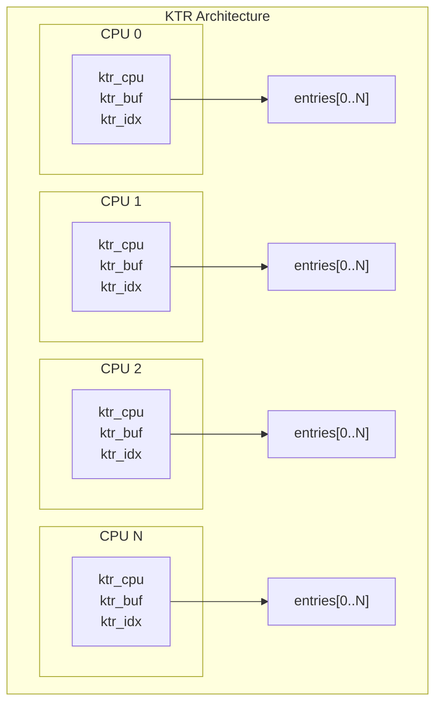
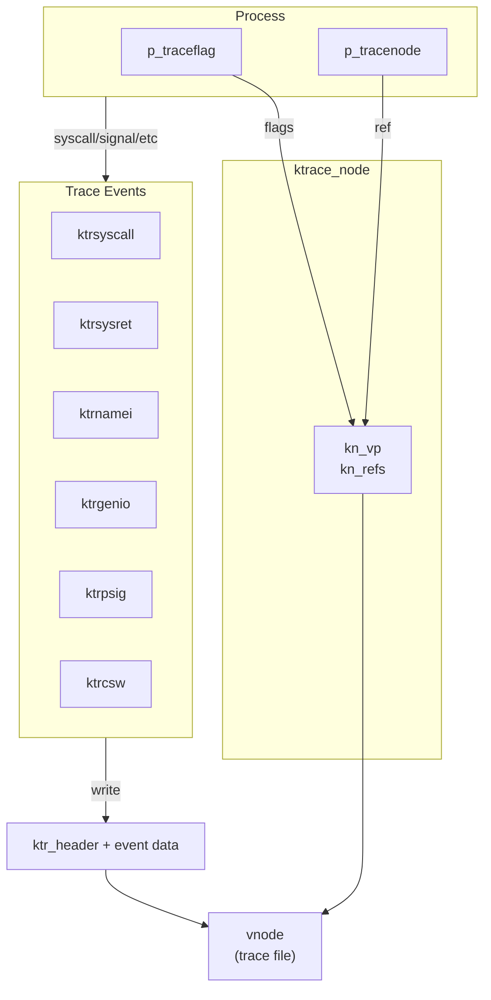

# Kernel Tracing and Debugging

DragonFly BSD provides two distinct tracing facilities for kernel
debugging and process monitoring:

1. **KTR** (Kernel Trace) - High-performance in-kernel event logging
2. **ktrace** - Process-level system call tracing to files

## Source Files

| File | Lines | Description |
|------|-------|-------------|
| `kern_ktr.c` | 682 | KTR ring buffer implementation |
| `kern_ktrace.c` | 687 | ktrace system call tracing |
| `kern_debug.c` | 100 | Debugging utilities |
| `sys/ktr.h` | 235 | KTR data structures and macros |
| `sys/ktrace.h` | 228 | ktrace data structures |

---

## KTR: Kernel Trace Buffer

KTR provides a lightweight, per-CPU ring buffer for recording kernel
events. It is designed for minimal overhead and is used extensively
throughout the kernel for debugging and performance analysis.

### Architecture



Each CPU maintains its own trace buffer to avoid lock contention.
The default buffer size is 2048 entries per CPU (`KTR_ENTRIES`),
configurable at compile time.

### Data Structures

#### ktr_entry (`sys/ktr.h:78`)

```c
struct ktr_entry {
    u_int64_t ktr_timestamp;        /* TSC or time_t */
    struct ktr_info *ktr_info;      /* event metadata */
    const char *ktr_file;           /* source file */
    void *ktr_caller1;              /* return address 1 */
    void *ktr_caller2;              /* return address 2 */
    int32_t ktr_line;               /* source line number */
    int32_t ktr_unused;
    int32_t ktr_data[KTR_BUFSIZE/4]; /* event-specific data (192 bytes) */
};
```

#### ktr_info (`sys/ktr.h:71`)

```c
struct ktr_info {
    const char *kf_name;            /* subsystem name (e.g., "tokens_acq") */
    int32_t *kf_master_enable;      /* pointer to enable bitmask */
    const char *kf_format;          /* printf-style format string */
    int kf_data_size;               /* size of event arguments */
};
```

#### ktr_cpu (`sys/ktr.h:94`)

```c
struct ktr_cpu {
    struct ktr_cpu_core core;
} __cachealign;                     /* cache-aligned to avoid false sharing */

struct ktr_cpu_core {
    struct ktr_entry *ktr_buf;      /* ring buffer */
    int ktr_idx;                    /* next write index */
};
```

### Defining Trace Points

KTR uses a macro-based system to define trace points with compile-time
type checking:

```c
/* Declare a master enable variable */
KTR_INFO_MASTER(tokens);

/* Define individual trace points */
KTR_INFO(KTR_TOKENS, tokens, acquire, 0,
    "acquire %p by %p",
    struct lwkt_token *tok, struct thread *td);

KTR_INFO(KTR_TOKENS, tokens, release, 1,
    "release %p by %p",
    struct lwkt_token *tok, struct thread *td);
```

The `KTR_INFO` macro:
1. Creates a bitmask for enabling/disabling the trace point
2. Generates a packed struct for the arguments
3. Creates a type-checking wrapper function
4. Registers sysctl nodes under `debug.ktr.<master>`

### Logging Events

```c
/* Log an event */
KTR_LOG(tokens_acquire, tok, curthread);

/* Conditional logging */
KTR_COND_LOG(tokens_acquire, some_condition, tok, curthread);
```

### Implementation Details

#### Entry Recording (`kern_ktr.c:496`)

```c
struct ktr_entry *
ktr_begin_write_entry(struct ktr_info *info, const char *file, int line)
{
    struct ktr_cpu_core *kcpu;
    struct ktr_entry *entry;
    int cpu;

    cpu = mycpu->gd_cpuid;
    kcpu = &ktr_cpu[cpu].core;
    
    if (panicstr)           /* stop logging during panic */
        return NULL;
    if (kcpu->ktr_buf == NULL)  /* too early in boot */
        return NULL;

    crit_enter();
    entry = kcpu->ktr_buf + (kcpu->ktr_idx & ktr_entries_mask);
    ++kcpu->ktr_idx;
    
    /* Timestamp using TSC if available */
    if (cpu_feature & CPUID_TSC) {
        entry->ktr_timestamp = rdtsc() - tsc_offsets[cpu];
    } else {
        entry->ktr_timestamp = get_approximate_time_t();
    }
    
    entry->ktr_info = info;
    entry->ktr_file = file;
    entry->ktr_line = line;
    crit_exit();
    
    return entry;
}
```

Key design points:
- Uses critical section (not locks) for minimal overhead
- Per-CPU buffers eliminate cross-CPU contention
- Ring buffer overwrites oldest entries when full
- TSC timestamps provide nanosecond-resolution timing

#### TSC Synchronization (`kern_ktr.c:249`)

On SMP systems, TSC values may drift between CPUs. KTR provides
optional resynchronization:

```c
/* Enabled via sysctl debug.ktr.resynchronize=1 */
static void
ktr_resync_callback(void *dummy)
{
    lwkt_cpusync_init(&cs, smp_active_mask, ktr_resync_remote, ...);
    lwkt_cpusync_interlock(&cs);
    ktr_sync_tsc = rdtsc();
    lwkt_cpusync_deinterlock(&cs);
}
```

This runs every 100ms when enabled, using LWKT CPU synchronization
to measure TSC offsets across all CPUs.

### Sysctl Interface

| Sysctl | Description |
|--------|-------------|
| `debug.ktr.entries` | Number of entries per CPU (read-only) |
| `debug.ktr.version` | KTR format version |
| `debug.ktr.stacktrace` | Include caller addresses |
| `debug.ktr.resynchronize` | Enable TSC resync (10Hz) |
| `debug.ktr.<master>_enable` | Bitmask for subsystem |
| `debug.ktr.<master>.<event>_mask` | Bit value for event |

### DDB Integration

The `show ktr` command in DDB displays trace entries:

```
db> show ktr
cpu0 1234: tokens_acquire  from(0xffffffff80123456,0xffffffff80234567)
cpu1 1235: tokens_release  from(0xffffffff80345678,0xffffffff80456789)
```

Modifiers:
- `v` - Verbose output with timestamps and file:line
- `a` - Auto-scroll (continuous display)
- `c<N>` - Filter by CPU number

### Early Boot Support

KTR provides static buffers for CPU 0 during early boot before
memory allocation is available:

```c
/* 256-entry static buffer for boot (kern_ktr.c:205) */
static struct ktr_entry ktr_buf0[KTR_ENTRIES_BOOT0];

struct ktr_cpu ktr_cpu[MAXCPU] = {
    { .core.ktr_buf = &ktr_buf0[0] }
};
```

Full-sized buffers are allocated at `SI_BOOT2_KLD` priority.

---

## ktrace: Process System Call Tracing

ktrace provides per-process tracing of system calls, signals, I/O,
and context switches. Traces are written to files for offline analysis
with `kdump(1)`.

### Architecture



### Data Structures

#### ktrace_node (`sys/ktrace.h:48`)

```c
struct ktrace_node {
    struct vnode *kn_vp;    /* trace file vnode */
    int kn_refs;            /* reference count */
};
```

Multiple processes can share a trace file through reference counting.

#### ktr_header (`sys/ktrace.h:71`)

```c
struct ktr_header {
    int     ktr_len;        /* length of following data */
    short   ktr_type;       /* record type */
    short   ktr_flags;      /* KTRH_THREADED, CPU ID */
    pid_t   ktr_pid;        /* process ID */
    lwpid_t ktr_tid;        /* LWP/thread ID */
    char    ktr_comm[MAXCOMLEN+1];  /* command name */
    struct  timeval ktr_time;       /* timestamp */
    caddr_t ktr_buf;        /* pointer to data (kernel only) */
};
```

### Record Types

| Type | Constant | Structure | Description |
|------|----------|-----------|-------------|
| 1 | `KTR_SYSCALL` | `ktr_syscall` | System call entry |
| 2 | `KTR_SYSRET` | `ktr_sysret` | System call return |
| 3 | `KTR_NAMEI` | (string) | Path name lookup |
| 4 | `KTR_GENIO` | `ktr_genio` | Generic I/O data |
| 5 | `KTR_PSIG` | `ktr_psig` | Signal delivery |
| 6 | `KTR_CSW` | `ktr_csw` | Context switch |
| 7 | `KTR_USER` | (user data) | User-defined trace |
| 9 | `KTR_SYSCTL` | (string) | Sysctl MIB name |

### Trace Functions

#### ktrsyscall (`kern_ktrace.c:110`)

Records system call entry with arguments:

```c
void
ktrsyscall(struct lwp *lp, int code, int narg, union sysunion *uap)
{
    struct ktr_header kth;
    struct ktr_syscall *ktp;
    
    lp->lwp_traceflag |= KTRFAC_ACTIVE;  /* prevent recursion */
    ktrgetheader(&kth, KTR_SYSCALL);
    
    ktp = ktrgetsyscall(&kth, &ktp_cache, narg);
    ktp->ktr_code = code;
    ktp->ktr_narg = narg;
    /* Copy arguments */
    for (i = 0; i < narg; i++)
        ktp->ktr_args[i] = args[i];
        
    ktrwrite(lp, &kth, NULL);
    lp->lwp_traceflag &= ~KTRFAC_ACTIVE;
}
```

#### ktrwrite (`kern_ktrace.c:592`)

Writes trace records to the file:

```c
static void
ktrwrite(struct lwp *lp, struct ktr_header *kth, struct uio *uio)
{
    ktrace_node_t tracenode;
    
    tracenode = ktrinherit(lp->lwp_proc->p_tracenode);
    
    /* Lock vnode to ensure timestamp ordering */
    vn_lock(tracenode->kn_vp, LK_EXCLUSIVE | LK_RETRY);
    microtime(&kth->ktr_time);  /* timestamp after lock */
    
    error = VOP_WRITE(tracenode->kn_vp, &auio, IO_UNIT | IO_APPEND, cred);
    
    if (error) {
        /* Disable tracing for all processes using this file */
        allproc_scan(ktrace_clear_callback, &info, 0);
    }
    
    vn_unlock(tracenode->kn_vp);
    ktrdestroy(&tracenode);
}
```

### System Calls

#### sys_ktrace (`kern_ktrace.c:288`)

```c
int sys_ktrace(struct sysmsg *sysmsg, const struct ktrace_args *uap);

struct ktrace_args {
    const char *fname;  /* trace file path */
    int ops;            /* operation (set/clear/clearfile) */
    int facs;           /* facilities bitmask */
    pid_t pid;          /* target process or process group */
};
```

Operations:
- `KTROP_SET` - Enable tracing for specified facilities
- `KTROP_CLEAR` - Disable tracing for specified facilities
- `KTROP_CLEARFILE` - Stop all tracing to the file

Flags:
- `KTRFLAG_DESCEND` - Apply to all descendants

#### sys_utrace (`kern_ktrace.c:439`)

Allows user programs to inject custom trace records:

```c
int sys_utrace(struct sysmsg *sysmsg, const struct utrace_args *uap);

struct utrace_args {
    const void *addr;   /* user data */
    size_t len;         /* data length (max 2048) */
};
```

### Permission Checking

ktrace enforces strict permission checks (`kern_ktrace.c:667`):

```c
static int
ktrcanset(struct thread *calltd, struct proc *targetp)
{
    /* Jail check */
    if (!PRISON_CHECK(caller, target))
        return (0);
        
    /* UID/GID matching or root */
    if ((caller->cr_uid == target->cr_ruid &&
         target->cr_ruid == target->cr_svuid &&
         caller->cr_rgid == target->cr_rgid &&
         target->cr_rgid == target->cr_svgid &&
         (targetp->p_traceflag & KTRFAC_ROOT) == 0 &&
         (targetp->p_flags & P_SUGID) == 0) ||
         caller->cr_uid == 0)
        return (1);
        
    return (0);
}
```

Key restrictions:
- Cannot trace across jail boundaries
- Cannot trace setuid/setgid processes (unless root)
- `KTRFAC_ROOT` flag prevents non-root from modifying traces set by root

### Trace Inheritance

When a process forks, it can inherit tracing:

```c
ktrace_node_t
ktrinherit(ktrace_node_t tracenode)
{
    if (tracenode) {
        atomic_add_int(&tracenode->kn_refs, 1);
    }
    return tracenode;
}
```

The `KTRFAC_INHERIT` flag in `p_traceflag` controls whether children
inherit the trace settings.

---

## Debugging Utilities

`kern_debug.c` provides minimal debugging support:

### Stack Trace

```c
void print_backtrace(int count)
```

Prints a kernel stack backtrace. Requires `DDB` kernel option;
otherwise prints an error message.

### Debug Sysctls

Test sysctls for bit manipulation:

```c
SYSCTL_BIT32(_debug, OID_AUTO, b32_0, ...);   /* bit 0 of 32-bit */
SYSCTL_BIT32(_debug, OID_AUTO, b32_31, ...);  /* bit 31 of 32-bit */
SYSCTL_BIT64(_debug, OID_AUTO, b64_0, ...);   /* bit 0 of 64-bit */
SYSCTL_BIT64(_debug, OID_AUTO, b64_63, ...);  /* bit 63 of 64-bit */
```

---

## Comparison: KTR vs ktrace

| Feature | KTR | ktrace |
|---------|-----|--------|
| **Purpose** | Kernel debugging | Process tracing |
| **Overhead** | Very low | Moderate (file I/O) |
| **Output** | In-memory ring buffer | File |
| **Scope** | Kernel-wide | Per-process |
| **Analysis** | DDB, ktrdump | kdump(1) |
| **Persistence** | Lost on reboot | Persistent |
| **User Access** | sysctl only | ktrace(1), kdump(1) |
| **Compile-time** | Optional (KTR option) | Optional (KTRACE option) |

---

## Usage Examples

### KTR: Enable Token Tracing

```sh
# Enable all token-related traces
sysctl debug.ktr.tokens_enable=-1

# View in DDB
db> show ktr/v
```

### ktrace: Trace a Process

```sh
# Start tracing
ktrace -f /tmp/trace.out -p 1234

# Or trace a command
ktrace -f /tmp/trace.out ls -la

# Analyze
kdump -f /tmp/trace.out
```

### User Trace from Application

```c
#include <sys/ktrace.h>

void log_event(const char *msg) {
    utrace(msg, strlen(msg) + 1);
}
```

---

## See Also

- [LWKT Threading](lwkt.md) - Token and thread tracing
- [System Calls](syscalls.md) - Syscall dispatch and tracing hooks
- [Processes](processes.md) - Process structure and tracing flags
