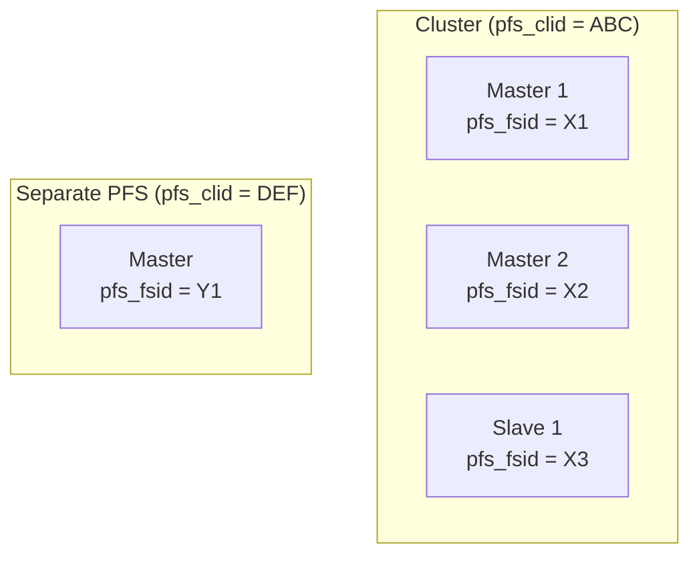
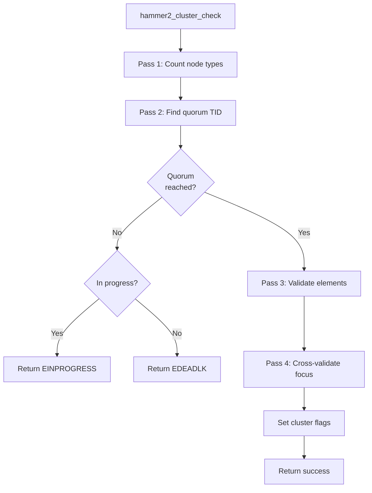
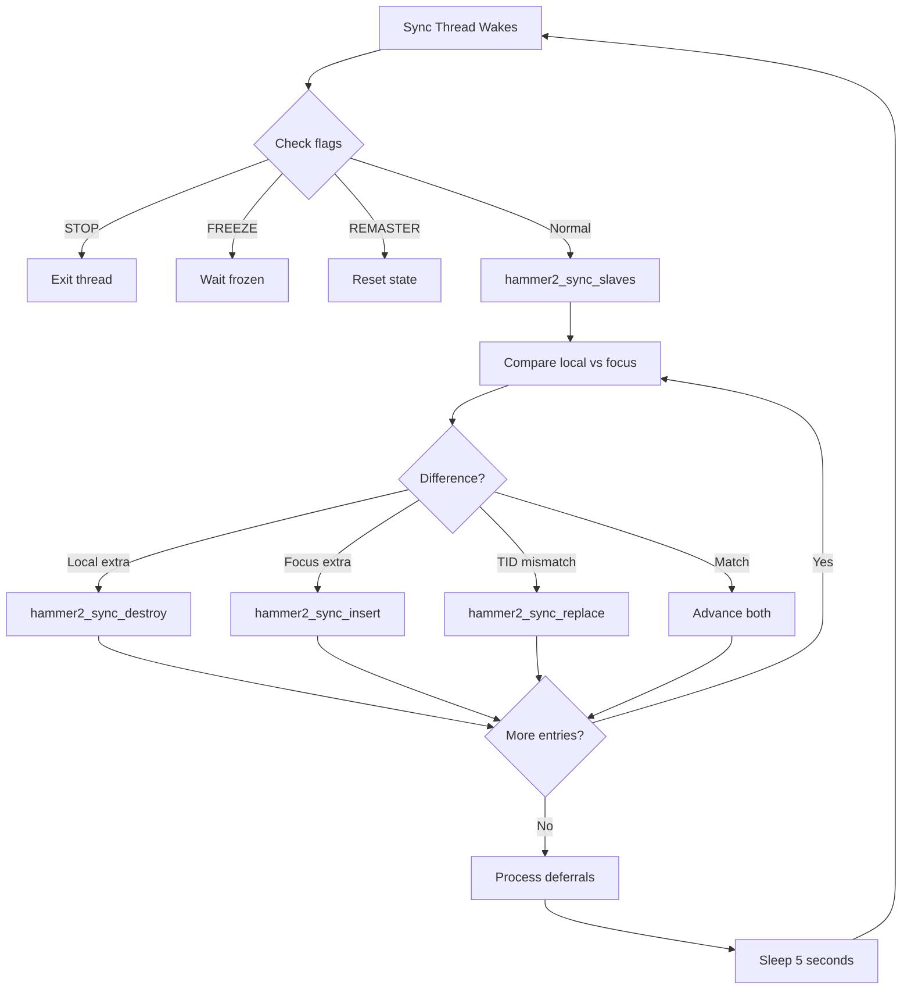

# HAMMER2 Clustering

This document describes HAMMER2's clustering architecture, which enables
multi-master replication and distributed filesystem operations across
multiple storage nodes.

## Overview

HAMMER2 was designed from the ground up with clustering capabilities, allowing
multiple storage nodes to participate in a single logical filesystem. The
clustering model supports:

- **Multi-master replication** — Multiple authoritative copies with quorum-based writes
- **Master-slave hierarchies** — Read-only slaves synchronized from masters
- **Soft mounts** — Local caching with network backing
- **Automatic synchronization** — Background threads keep nodes in sync

Each node in a cluster maintains independent chains that represent the same
logical data. A cluster abstraction layer aggregates these chains and resolves
conflicts using transaction IDs and quorum rules.

!!! note "Implementation Status"
    While the clustering infrastructure is extensively implemented in the kernel,
    network clustering features are not fully operational. Local multi-device
    clustering (multiple masters on local media) works, but network-based
    clustering via dmsg is incomplete.

**Source files:**

| File | Description |
|------|-------------|
| `hammer2_cluster.c` | Cluster management and quorum operations |
| `hammer2_synchro.c` | Synchronization thread implementation |
| `hammer2_vfsops.c` | Cluster assembly during mount |
| `hammer2.h` | Cluster data structures |
| `hammer2_disk.h` | PFS type definitions |

## Cluster Architecture

### Cluster Identification

PFSes are grouped into clusters using the `pfs_clid` (cluster ID) UUID:

```c
/* hammer2_disk.h:975 */
uuid_t      pfs_clid;       /* (if PFSROOT) cluster uuid */
```

All PFS inodes sharing the same `pfs_clid` belong to the same cluster. Each
PFS also has a unique `pfs_fsid` that distinguishes it from other nodes in
the same cluster.



### Maximum Cluster Size

A cluster can contain up to `HAMMER2_MAXCLUSTER` (8) nodes:

```c
/* hammer2.h:561 */
#define HAMMER2_MAXCLUSTER  8
```

This limit applies to directly-accessible nodes. Remote nodes accessed
via network connections can extend beyond this limit but are not directly
incorporated into the cluster array.

## PFS Types

Each PFS has a type that determines its role within the cluster:

| Type | Value | Description |
|------|-------|-------------|
| `PFSTYPE_MASTER` | 0x06 | Authoritative read-write node |
| `PFSTYPE_SLAVE` | 0x03 | Read-only synchronized copy |
| `PFSTYPE_SOFT_MASTER` | 0x05 | Local writable cache with network backing |
| `PFSTYPE_SOFT_SLAVE` | 0x04 | Local read-only cache with network backing |
| `PFSTYPE_CACHE` | 0x01 | Non-authoritative local cache |
| `PFSTYPE_SUPROOT` | 0x08 | Super-root (device-level, not cluster) |
| `PFSTYPE_DUMMY` | 0x09 | Placeholder for network mounts |

### Type Transitions

PFS types can be upgraded or downgraded. The high 4 bits of `pfs_type`
encode the transition target:

```c
/* hammer2_disk.h:1086-1088 */
#define HAMMER2_PFS_DEC(n)              ((n) & 0x0F)
#define HAMMER2_PFS_DEC_TRANSITION(n)   (((n) >> 4) & 0x0F)
#define HAMMER2_PFS_ENC_TRANSITION(n)   (((n) & 0x0F) << 4)
```

Rules for transitions:

- **MASTER → SLAVE**: Cannot complete until all masters update `pfs_nmasters`
- **SLAVE → MASTER**: Cannot complete until the new master is fully synchronized

## Cluster Data Structures

### hammer2_cluster

The `hammer2_cluster` structure represents a working set of chains from
different cluster nodes:

```c
/* hammer2.h:590-602 */
struct hammer2_cluster {
    int                     refs;           /* track for deallocation */
    int                     ddflag;
    struct hammer2_pfs      *pmp;
    uint32_t                flags;
    int                     nchains;
    int                     error;          /* error code valid on lock */
    int                     focus_index;
    hammer2_chain_t         *focus;         /* current focus (or mod) */
    hammer2_cluster_item_t  array[HAMMER2_MAXCLUSTER];
};
```

Key fields:

| Field | Description |
|-------|-------------|
| `nchains` | Number of chains in the cluster |
| `focus` | The chain currently selected for reads |
| `focus_index` | Index of the focus chain in array |
| `array[]` | Per-node chain references and status |
| `flags` | Cluster status flags |

### Cluster Item

Each element in the cluster array tracks a single node:

```c
/* hammer2.h:570-576 */
struct hammer2_cluster_item {
    hammer2_chain_t     *chain;
    int                 error;
    uint32_t            flags;
};
```

Item flags:

| Flag | Description |
|------|-------------|
| `HAMMER2_CITEM_INVALID` | Not part of synchronized set |
| `HAMMER2_CITEM_FEMOD` | Front-end can modify this entry |
| `HAMMER2_CITEM_NULL` | Explicitly NULL (vs. not-yet-resolved) |

### Cluster Status Flags

```c
/* hammer2.h:639-668 */
#define HAMMER2_CLUSTER_INODE   0x00000001  /* embedded in inode struct */
#define HAMMER2_CLUSTER_LOCKED  0x00000004  /* cluster locks not recursive */
#define HAMMER2_CLUSTER_WRHARD  0x00000100  /* hard-mount can write */
#define HAMMER2_CLUSTER_RDHARD  0x00000200  /* hard-mount can read */
#define HAMMER2_CLUSTER_UNHARD  0x00000400  /* unsynchronized masters */
#define HAMMER2_CLUSTER_NOHARD  0x00000800  /* no masters visible */
#define HAMMER2_CLUSTER_WRSOFT  0x00001000  /* soft-mount can write */
#define HAMMER2_CLUSTER_RDSOFT  0x00002000  /* soft-mount can read */
#define HAMMER2_CLUSTER_UNSOFT  0x00004000  /* unsynchronized slaves */
#define HAMMER2_CLUSTER_NOSOFT  0x00008000  /* no slaves visible */
#define HAMMER2_CLUSTER_MSYNCED 0x00010000  /* all masters synchronized */
#define HAMMER2_CLUSTER_SSYNCED 0x00020000  /* known slaves synchronized */
```

## Quorum Operations

### Quorum Calculation

Write operations require a quorum of masters to agree:

```c
/* hammer2_cluster.c:348 */
nquorum = pmp ? pmp->pfs_nmasters / 2 + 1 : 0;
```

For a cluster with N masters, quorum requires `(N/2 + 1)` agreeing nodes.

| Masters | Quorum Required |
|---------|-----------------|
| 1 | 1 |
| 2 | 2 |
| 3 | 2 |
| 4 | 3 |
| 5 | 3 |

### Cluster Check

The `hammer2_cluster_check()` function validates cluster state and resolves
the focus chain:



Return values:

| Error | Meaning |
|-------|---------|
| 0 | Quorum agreement, operation can proceed |
| `ENOENT` | Quorum agreement, end of scan |
| `ESRCH` | Quorum agreement, key invalid (skip) |
| `EIO` | Quorum agreement but all elements errored |
| `EDEADLK` | No quorum possible, repair needed |
| `EINPROGRESS` | Quorum not yet reached, wait for more responses |

### Transaction ID Agreement

Quorum is determined by matching `modify_tid` values across masters.
The algorithm finds the highest TID that achieves quorum:

```c
/* hammer2_cluster.c:439-512 */
while (nmasters < nquorum && last_best_quorum_tid != 0) {
    /* Find highest TID with quorum agreement */
    for (i = 0; i < cluster->nchains; ++i) {
        if (chain->bref.modify_tid < last_best_quorum_tid &&
            quorum_tid < chain->bref.modify_tid) {
            quorum_tid = chain->bref.modify_tid;
        }
        if (quorum_tid == chain->bref.modify_tid) {
            ++nmasters;
        }
    }
    last_best_quorum_tid = quorum_tid;
}
```

## Synchronization

### Sync Thread Architecture

Each cluster element that needs synchronization has a dedicated thread:

```c
/* hammer2.h:1241 */
hammer2_thread_t    sync_thrs[HAMMER2_MAXCLUSTER];
```

The primary sync thread (`hammer2_primary_sync_thread`) handles:

- Remastering operations
- Slave synchronization
- Deferred inode processing

### Synchronization Flow



### Sync Operations

The synchronization thread performs three types of operations:

**1. Destroy** — Remove extraneous local data:

```c
/* hammer2_synchro.c:78-80 */
static int hammer2_sync_destroy(hammer2_thread_t *thr,
            hammer2_chain_t **parentp, hammer2_chain_t **chainp,
            hammer2_tid_t mtid, int idx);
```

**2. Insert** — Create missing local data from focus:

```c
/* hammer2_synchro.c:74-77 */
static int hammer2_sync_insert(hammer2_thread_t *thr,
            hammer2_chain_t **parentp, hammer2_chain_t **chainp,
            hammer2_tid_t modify_tid, int idx,
            hammer2_xop_head_t *xop, hammer2_chain_t *focus);
```

**3. Replace** — Update local data to match focus:

```c
/* hammer2_synchro.c:81-85 */
static int hammer2_sync_replace(hammer2_thread_t *thr,
            hammer2_chain_t *parent, hammer2_chain_t *chain,
            hammer2_tid_t mtid, int idx,
            hammer2_xop_head_t *xop, hammer2_chain_t *focus,
            int isroot);
```

### Deferred Processing

Directory synchronization may require deferred processing to avoid
holding XOP resources too long:

```c
/* hammer2_synchro.c:52-60 */
typedef struct hammer2_deferred_ip {
    struct hammer2_deferred_ip *next;
    hammer2_inode_t *ip;
} hammer2_deferred_ip_t;

typedef struct hammer2_deferred_list {
    hammer2_deferred_ip_t   *base;
    int                     count;
} hammer2_deferred_list_t;
```

When synchronizing a directory containing subdirectories, the subdirectories
are added to a deferral list for bottom-up processing.

## Cluster Assembly

### PFS Allocation

When mounting, `hammer2_pfsalloc()` assembles the cluster by matching
`pfs_clid`:

```c
/* hammer2_vfsops.c:398-410 */
TAILQ_FOREACH(pmp, &hammer2_pfslist, mntentry) {
    if (force_local != pmp->force_local)
        continue;
    if (force_local == NULL &&
        bcmp(&pmp->pfs_clid, &ripdata->meta.pfs_clid,
             sizeof(pmp->pfs_clid)) == 0) {
        break;  /* Found matching cluster */
    }
}
```

### Adding Nodes to Cluster

Each discovered PFS chain is added to the cluster's iroot:

```c
/* hammer2_vfsops.c:487-499 */
chain->pmp = pmp;
hammer2_chain_ref(chain);
iroot->cluster.array[j].chain = chain;
pmp->pfs_types[j] = ripdata->meta.pfs_type;
pmp->pfs_names[j] = kstrdup(ripdata->filename, M_HAMMER2);
pmp->pfs_hmps[j] = chain->hmp;
pmp->pfs_iroot_blocksets[j] = chain->data->ipdata.u.blockset;
```

### Master Count Tracking

The number of masters is tracked for quorum calculations:

```c
/* hammer2_vfsops.c:527-542 */
if (ripdata && pmp->pfs_nmasters < ripdata->meta.pfs_nmasters) {
    pmp->pfs_nmasters = ripdata->meta.pfs_nmasters;
}

/* Count visible masters */
count = 0;
for (i = 0; i < iroot->cluster.nchains; ++i) {
    if (pmp->pfs_types[i] == HAMMER2_PFSTYPE_MASTER)
        ++count;
}
if (pmp->pfs_nmasters < count)
    pmp->pfs_nmasters = count;
```

## Per-PFS Structure

The `hammer2_pfs` structure manages a mounted PFS and its cluster:

```c
/* hammer2.h:1202-1246 (key fields) */
struct hammer2_pfs {
    struct mount        *mp;
    uuid_t              pfs_clid;           /* cluster identifier */
    hammer2_inode_t     *iroot;             /* PFS root inode */
    uint8_t             pfs_types[HAMMER2_MAXCLUSTER];
    char                *pfs_names[HAMMER2_MAXCLUSTER];
    hammer2_dev_t       *pfs_hmps[HAMMER2_MAXCLUSTER];
    hammer2_blockset_t  pfs_iroot_blocksets[HAMMER2_MAXCLUSTER];
    uint8_t             pfs_nmasters;       /* total masters */
    uint8_t             pfs_mode;           /* operating mode */
    hammer2_thread_t    sync_thrs[HAMMER2_MAXCLUSTER];
    uint32_t            cluster_flags;      /* cached cluster flags */
    /* ... */
};
```

## Local Mode

For debugging, HAMMER2 supports a "local" mount mode where each PFS is
treated independently regardless of `pfs_clid`:

```c
/* hammer2_vfsops.c:491-492 */
if (force_local)
    pmp->pfs_types[j] = HAMMER2_PFSTYPE_MASTER;
```

In local mode:

- All PFSes are treated as independent single-master filesystems
- Cluster matching by `pfs_clid` is disabled
- Matching is done by PFS name instead

## Inode Cluster Embedding

Each inode embeds a cluster for tracking its chain instances:

```c
/* hammer2.h:699-702 */
hammer2_spin_t          cluster_spin;   /* update cluster */
hammer2_cluster_t       cluster;
hammer2_cluster_item_t  ccache[HAMMER2_MAXCLUSTER];
int                     ccache_nchains;
```

The embedded cluster caches the chain state but cannot be directly locked.
Operations use temporary cluster copies for locking.

## Error Handling

### Cluster Errors

Errors are tracked per-cluster-item and rolled up:

```c
/* hammer2.h:407-429 */
#define HAMMER2_ERROR_NONE          0x00000000
#define HAMMER2_ERROR_EIO           0x00000001  /* I/O error */
#define HAMMER2_ERROR_CHECK         0x00000002  /* Check code error */
#define HAMMER2_ERROR_INCOMPLETE    0x00000004  /* Cluster incomplete */
#define HAMMER2_ERROR_ENOENT        0x00000008  /* Entry not found */
#define HAMMER2_ERROR_EDEADLK       0x00000020  /* Deadlock / no quorum */
#define HAMMER2_ERROR_EINPROGRESS   0x00000040  /* Operation in progress */
#define HAMMER2_ERROR_ESRCH         0x00000080  /* Search failed */
#define HAMMER2_ERROR_EAGAIN        0x00001000  /* Retry needed */
```

### Node Failure Handling

When a cluster node fails:

1. Operations continue if quorum is maintained
2. Failed node is marked `HAMMER2_CITEM_INVALID`
3. Sync thread attempts recovery when node returns
4. Manual intervention may be required for permanent failures

## XOP Integration

Cluster operations are dispatched through the XOP (Extended Operation)
system:

```c
/* hammer2.h:911-912 */
hammer2_xop_fifo_t      collect[HAMMER2_MAXCLUSTER];
hammer2_cluster_t       cluster;        /* help collections */
```

XOPs issue operations to all cluster nodes in parallel and collect results
for quorum determination.

## Limitations and Future Work

Current limitations:

1. **Network clustering incomplete** — The dmsg-based network transport
   is not fully functional
2. **No automatic failover** — Manual intervention required for permanent
   node failures  
3. **Limited to 8 nodes** — `HAMMER2_MAXCLUSTER` restricts direct cluster size
4. **Single-master common** — Most deployments use single-master PFSes

The infrastructure exists for:

- Network-transparent clustering via dmsg
- Automatic node discovery via LNK_SPAN messages
- Soft master/slave configurations for local caching

## See Also

- [HAMMER2 Overview](index.md) — General architecture
- [XOP System](xop-system.md) — Extended operation dispatch
- [Chain Layer](chain-layer.md) — Chain operations underlying clusters
- [VFS Integration](vfs-integration.md) — Mount and PFS management
- [Distributed Messaging](../../kern/dmsg.md) — dmsg communication layer
