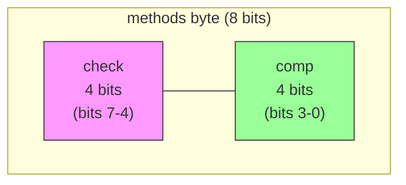
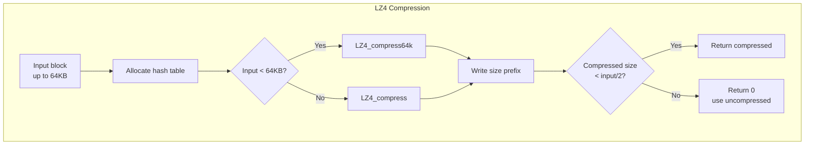
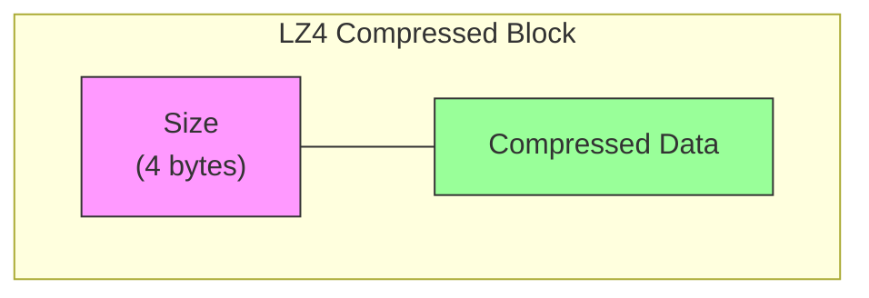
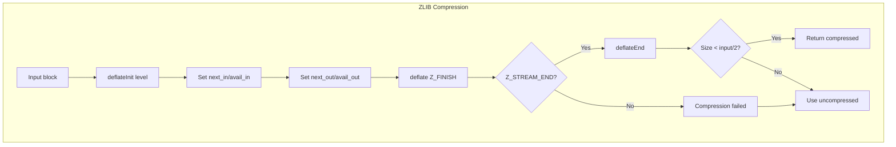
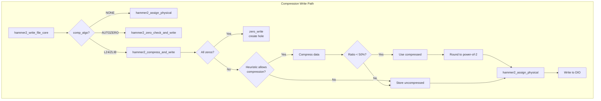
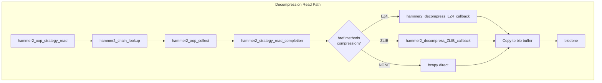
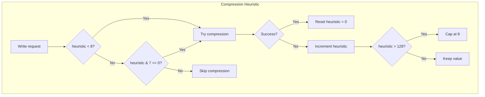
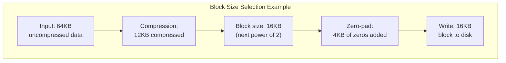

# HAMMER2 Compression

This document describes HAMMER2's transparent block-level compression, which
reduces storage requirements by compressing file data using LZ4 or ZLIB
algorithms.

## Overview

HAMMER2 supports transparent compression at the file data block level:

- **Per-file control** — Compression algorithm set via `comp_algo` in inode metadata
- **Block-level granularity** — Each data block compressed independently
- **Variable output sizes** — Compressed blocks use 1KB–32KB storage
- **Automatic fallback** — Falls back to uncompressed if compression doesn't help
- **Zero-block optimization** — All-zero blocks stored as holes (no storage)

Key characteristics:

| Feature | Description |
|---------|-------------|
| Default algorithm | LZ4 |
| Minimum block size | 1KB |
| Maximum input size | 64KB (PBUFSIZE) |
| Compression ratio target | 50% or better |
| Check code integration | Computed on compressed data |

## Compression Algorithms

### Algorithm Constants

```c
#define HAMMER2_COMP_NONE       0   /* No compression */
#define HAMMER2_COMP_AUTOZERO   1   /* Zero-check only */
#define HAMMER2_COMP_LZ4        2   /* LZ4 (default) */
#define HAMMER2_COMP_ZLIB       3   /* ZLIB/deflate */

#define HAMMER2_COMP_DEFAULT    HAMMER2_COMP_LZ4
```

Source: `hammer2_disk.h:741-746`

### Encoding in Blockrefs

The compression method is stored in `bref.methods`:

```c
#define HAMMER2_ENC_COMP(n)     ((n) & 15)        /* Encode compression */
#define HAMMER2_DEC_COMP(n)     ((n) & 15)        /* Decode compression */
#define HAMMER2_ENC_CHECK(n)    (((n) & 15) << 4) /* Encode check code */
#define HAMMER2_DEC_CHECK(n)    (((n) >> 4) & 15) /* Decode check code */
```

The `methods` byte layout:



Source: `hammer2_disk.h:752-755`

### Per-Inode Settings

Each inode stores compression preferences:

```c
struct hammer2_inode_meta {
    ...
    uint8_t     comp_algo;      /* Compression algorithm + level */
    uint8_t     check_algo;     /* Check code algorithm */
    ...
};

/* Encode/decode algorithm and level */
#define HAMMER2_ENC_ALGO(n)     (n)
#define HAMMER2_DEC_ALGO(n)     ((n) & 15)
#define HAMMER2_ENC_LEVEL(n)    ((n) << 4)
#define HAMMER2_DEC_LEVEL(n)    (((n) >> 4) & 15)
```

Source: `hammer2_disk.h:761-764`

## LZ4 Compression

LZ4 is the default compression algorithm, optimized for speed over compression
ratio.

### LZ4 Characteristics

| Property | Value |
|----------|-------|
| Type | Block-based LZ77 variant |
| Speed | Very fast (GB/s range) |
| Ratio | Moderate (typically 2:1) |
| Memory | 16KB hash table |
| Implementation | `hammer2_lz4.c` |

### LZ4 API

```c
/* Compression */
int LZ4_compress_limitedOutput(char* source, char* dest,
                               int inputSize, int maxOutputSize);

/* Decompression */
int LZ4_decompress_safe(char* source, char* dest,
                        int inputSize, int maxOutputSize);
```

Source: `hammer2_lz4.h:50-89`

### LZ4 Memory Management

LZ4 uses a heap-allocated hash table:

```c
#define MEMORY_USAGE 14                     /* 2^14 = 16KB */
#define HASHTABLESIZE (1 << MEMORY_USAGE)   /* 16KB hash table */

void* LZ4_create(void)
{
    return kmalloc(HASHTABLESIZE, C_HASHTABLE, M_INTWAIT);
}

int LZ4_free(void* ctx)
{
    kfree(ctx, C_HASHTABLE);
    return 0;
}
```

Source: `hammer2_lz4.c:47`, `162`, `330-341`

### LZ4 Compression Flow



### LZ4 Data Format

Compressed LZ4 blocks include a size prefix:



```c
/* Compression stores size prefix */
*(int *)comp_buffer = comp_size;
comp_size += sizeof(int);

/* Decompression reads size prefix */
compressed_size = *(const int *)data;
result = LZ4_decompress_safe(&data[sizeof(int)],
                             compressed_buffer,
                             compressed_size,
                             bp->b_bufsize);
```

Source: `hammer2_strategy.c:969-976`, `198-205`

### LZ4 Algorithm Internals

The LZ4 algorithm uses a sliding window with hash-based matching:

```c
#define MINMATCH        4       /* Minimum match length */
#define MAX_DISTANCE    65535   /* Maximum back-reference distance */
#define COPYLENGTH      8       /* Copy granularity */
#define LASTLITERALS    5       /* Literals at end of block */
```

The compression loop:

1. Hash 4 bytes at current position
2. Look up hash table for matching position
3. If match found and within distance, emit back-reference
4. Otherwise emit literal
5. Update hash table with current position

Source: `hammer2_lz4.c:164-182`, `hammer2_lz4_encoder.h`

## ZLIB Compression

ZLIB provides better compression ratios at the cost of higher CPU usage.

### ZLIB Characteristics

| Property | Value |
|----------|-------|
| Type | Deflate (LZ77 + Huffman) |
| Speed | Moderate |
| Ratio | Good (typically 3:1 or better) |
| Levels | 1-9 (6 is default) |
| Implementation | `zlib/` directory |

### ZLIB API

```c
/* Initialize compression stream */
int deflateInit(z_streamp strm, int level);

/* Compress data */
int deflate(z_streamp strm, int flush);

/* Clean up */
int deflateEnd(z_streamp strm);

/* Initialize decompression stream */
int inflateInit(z_streamp strm);

/* Decompress data */
int inflate(z_streamp strm, int flush);

/* Clean up */
int inflateEnd(z_streamp strm);
```

Source: `zlib/hammer2_zlib.h:195-483`

### ZLIB Stream Structure

```c
typedef struct z_stream_s {
    z_const Bytef *next_in;     /* Next input byte */
    uInt     avail_in;          /* Bytes available at next_in */
    uLong    total_in;          /* Total input bytes read */

    Bytef    *next_out;         /* Next output byte location */
    uInt     avail_out;         /* Free space at next_out */
    uLong    total_out;         /* Total bytes output */

    z_const char *msg;          /* Error message */
    struct internal_state *state; /* Internal state */
    ...
} z_stream;
```

Source: `zlib/hammer2_zlib.h:84-99`

### ZLIB Compression Flow



### ZLIB Compression Levels

```c
comp_level = HAMMER2_DEC_LEVEL(comp_algo);
if (comp_level == 0)
    comp_level = 6;     /* Default zlib compression */
else if (comp_level < 6)
    comp_level = 6;     /* Minimum useful level */
else if (comp_level > 9)
    comp_level = 9;     /* Maximum compression */

ret = deflateInit(&strm_compress, comp_level);
```

| Level | Description |
|-------|-------------|
| 1 | Best speed |
| 6 | Default (balanced) |
| 9 | Best compression |

Source: `hammer2_strategy.c:979-987`

## Compression Integration

### Write Path

Compression occurs in `hammer2_compress_and_write()`:



Source: `hammer2_strategy.c:826-898`, `910-1188`

### Read Path

Decompression occurs in `hammer2_strategy_read_completion()`:



Source: `hammer2_strategy.c:441-502`

### Decompression Callbacks

**LZ4 Decompression:**

```c
void hammer2_decompress_LZ4_callback(const char *data, u_int bytes,
                                     struct bio *bio)
{
    bp = bio->bio_buf;
    
    /* Read compressed size from prefix */
    compressed_size = *(const int *)data;
    KKASSERT((uint32_t)compressed_size <= bytes - sizeof(int));
    
    /* Decompress */
    compressed_buffer = objcache_get(cache_buffer_read, M_INTWAIT);
    result = LZ4_decompress_safe(&data[sizeof(int)],
                                 compressed_buffer,
                                 compressed_size,
                                 bp->b_bufsize);
    
    /* Copy to destination and zero remainder */
    bcopy(compressed_buffer, bp->b_data, bp->b_bufsize);
    if (result < bp->b_bufsize)
        bzero(bp->b_data + result, bp->b_bufsize - result);
    
    objcache_put(cache_buffer_read, compressed_buffer);
}
```

Source: `hammer2_strategy.c:180-220`

**ZLIB Decompression:**

```c
void hammer2_decompress_ZLIB_callback(const char *data, u_int bytes,
                                      struct bio *bio)
{
    bp = bio->bio_buf;
    
    /* Initialize decompressor */
    bzero(&strm_decompress, sizeof(strm_decompress));
    ret = inflateInit(&strm_decompress);
    
    /* Decompress */
    compressed_buffer = objcache_get(cache_buffer_read, M_INTWAIT);
    strm_decompress.next_in = data;
    strm_decompress.avail_in = bytes;
    strm_decompress.next_out = compressed_buffer;
    strm_decompress.avail_out = bp->b_bufsize;
    
    ret = inflate(&strm_decompress, Z_FINISH);
    
    /* Copy to destination */
    bcopy(compressed_buffer, bp->b_data, bp->b_bufsize);
    result = bp->b_bufsize - strm_decompress.avail_out;
    if (result < bp->b_bufsize)
        bzero(bp->b_data + result, strm_decompress.avail_out);
    
    objcache_put(cache_buffer_read, compressed_buffer);
    inflateEnd(&strm_decompress);
}
```

Source: `hammer2_strategy.c:227-271`

## Compression Heuristic

A per-inode heuristic avoids wasting CPU on incompressible data.

### Heuristic Algorithm

```c
/* In hammer2_inode */
int comp_heuristic;     /* Compression heuristic counter */

/* Check heuristic before compression attempt */
if (ip->comp_heuristic < 8 ||
    (ip->comp_heuristic & 7) == 0 ||
    hammer2_always_compress) {
    /* Try compression */
}

/* Update heuristic based on result */
if (comp_size == 0) {
    /* Compression failed, increment counter */
    if (++ip->comp_heuristic > 128)
        ip->comp_heuristic = 8;
} else {
    /* Compression succeeded, reset counter */
    ip->comp_heuristic = 0;
}
```

Source: `hammer2_strategy.c:949-1021`

### Heuristic Behavior



The heuristic ensures:
- First 8 writes always try compression
- After failures, only every 8th write tries compression
- Successful compression resets the counter
- Maximum counter value is 128

## Compressed Block Sizes

Compressed data is stored in power-of-2 sized blocks:

```c
if (comp_size <= 1024)
    comp_block_size = 1024;
else if (comp_size <= 2048)
    comp_block_size = 2048;
else if (comp_size <= 4096)
    comp_block_size = 4096;
else if (comp_size <= 8192)
    comp_block_size = 8192;
else if (comp_size <= 16384)
    comp_block_size = 16384;
else if (comp_size <= 32768)
    comp_block_size = 32768;
```

Source: `hammer2_strategy.c:1027-1044`

### Block Size Selection



Padding is required for deduplication to work correctly:

```c
/* Zero the remainder for dedup matching */
if (comp_size < comp_block_size) {
    bzero(comp_buffer + comp_size,
          comp_block_size - comp_size);
}
```

Source: `hammer2_strategy.c:1050-1053`

## Zero-Block Optimization

All-zero blocks are stored as holes (no physical storage):

### Zero Detection

```c
int test_block_zeros(const char *buf, size_t bytes)
{
    size_t i;
    
    for (i = 0; i < bytes; i += sizeof(long)) {
        if (*(const long *)(buf + i) != 0)
            return (0);     /* Not all zeros */
    }
    return (1);             /* All zeros */
}
```

Source: `hammer2_strategy.c:1251-1262`

### Zero Write Handling

```c
void zero_write(char *data, hammer2_inode_t *ip,
                hammer2_chain_t **parentp,
                hammer2_key_t lbase, hammer2_tid_t mtid, int *errorp)
{
    /* Look up existing chain */
    chain = hammer2_chain_lookup(parentp, &key_dummy,
                                 lbase, lbase, errorp, ...);
    
    if (chain) {
        if (chain->bref.type == HAMMER2_BREF_TYPE_INODE) {
            /* Zero embedded data */
            bzero(wipdata->u.data, HAMMER2_EMBEDDED_BYTES);
        } else {
            /* Delete the data chain - creates a hole */
            hammer2_chain_delete(*parentp, chain, mtid,
                                 HAMMER2_DELETE_PERMANENT);
        }
    }
    /* No chain = already a hole, nothing to do */
}
```

Source: `hammer2_strategy.c:1269-1309`

## Buffer Caching

Compression uses object caches for temporary buffers:

```c
struct objcache *cache_buffer_read;     /* Decompression buffers */
struct objcache *cache_buffer_write;    /* Compression buffers */

/* Get buffer for compression/decompression */
comp_buffer = objcache_get(cache_buffer_write, M_INTWAIT);

/* Return buffer after use */
objcache_put(cache_buffer_write, comp_buffer);
```

Source: `hammer2_strategy.c:60-61`, `967-968`, `1187`

## Check Code Integration

Check codes (CRC/hash) are computed on **compressed** data:

```c
/* After compression, set check code on compressed data */
if (comp_size) {
    chain->bref.methods = HAMMER2_ENC_COMP(comp_algo) +
                          HAMMER2_ENC_CHECK(check_algo);
    hammer2_chain_setcheck(chain, comp_buffer);
} else {
    chain->bref.methods = HAMMER2_ENC_COMP(HAMMER2_COMP_NONE) +
                          HAMMER2_ENC_CHECK(check_algo);
    hammer2_chain_setcheck(chain, data);
}
```

Source: `hammer2_strategy.c:1129-1146`

This ensures:
- Check code validates on-disk data integrity
- Decompression can verify data before expanding
- Deduplication works on compressed blocks

## Performance Considerations

### CPU vs I/O Tradeoff

| Algorithm | CPU Cost | I/O Savings | Best For |
|-----------|----------|-------------|----------|
| NONE | None | None | SSDs, incompressible data |
| AUTOZERO | Minimal | Variable | Sparse files |
| LZ4 | Low | Moderate | General use (default) |
| ZLIB | Moderate | High | Archival, slow storage |

### Compression Ratio Target

HAMMER2 only stores compressed data if it achieves ≥50% reduction:

```c
/* Target: 50% compression or better */
comp_size = LZ4_compress_limitedOutput(
    data,
    &comp_buffer[sizeof(int)],
    pblksize,
    pblksize / 2 - sizeof(int64_t));  /* Max output = input/2 */
```

Source: `hammer2_strategy.c:969-973`

### Memory Usage

| Component | Memory | Notes |
|-----------|--------|-------|
| LZ4 hash table | 16KB | Per compression call |
| Read buffer | 64KB | Object cached |
| Write buffer | 64KB | Object cached |
| ZLIB state | ~256KB | Internal state |

## Configuration

### Mount Options

Compression can be configured at mount time or per-file via `hammer2` utility.

### Sysctl Tuning

```c
int hammer2_always_compress;    /* Override heuristic */
```

Setting `hammer2_always_compress` to 1 disables the compression heuristic,
forcing compression attempts on every write.

## See Also

- [HAMMER2 Overview](index.md) — Filesystem architecture
- [I/O Subsystem](io-subsystem.md) — Compression in the I/O path
- [On-Disk Format](on-disk-format.md) — `bref.methods` encoding
- [Chain Layer](chain-layer.md) — Data chain handling
