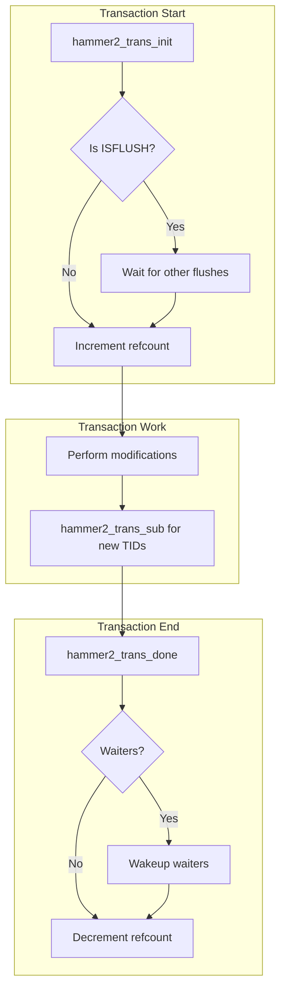
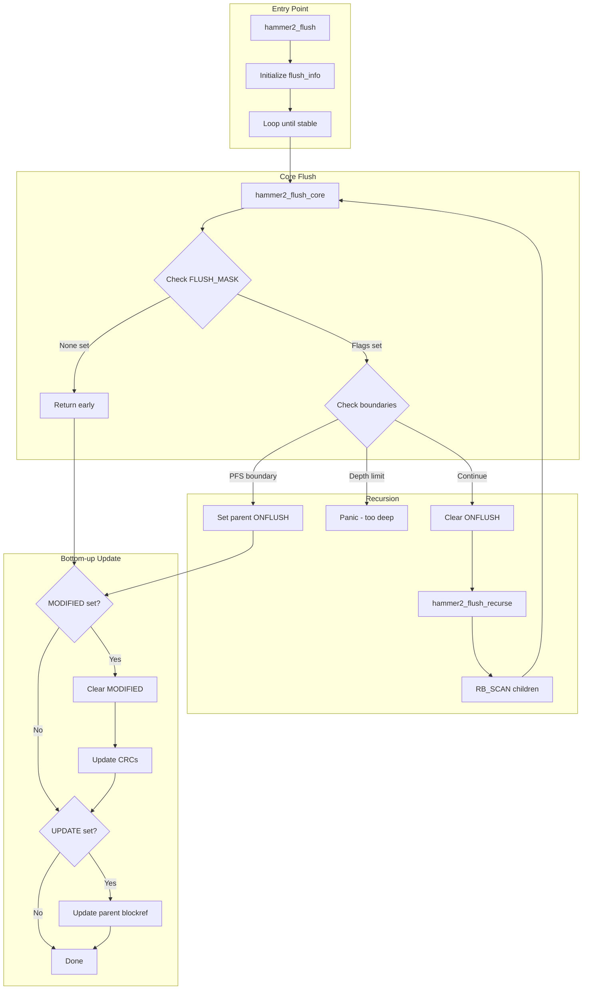
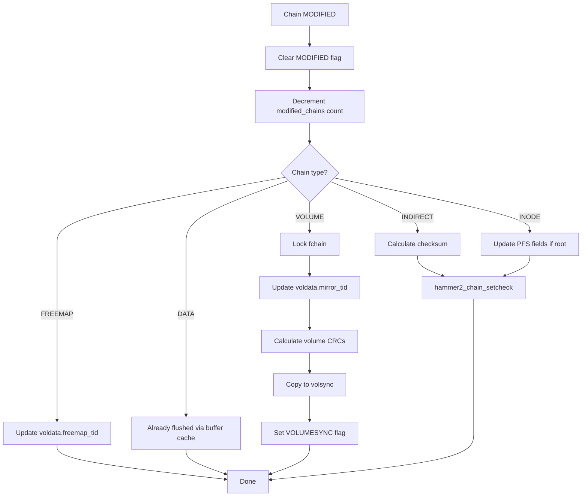
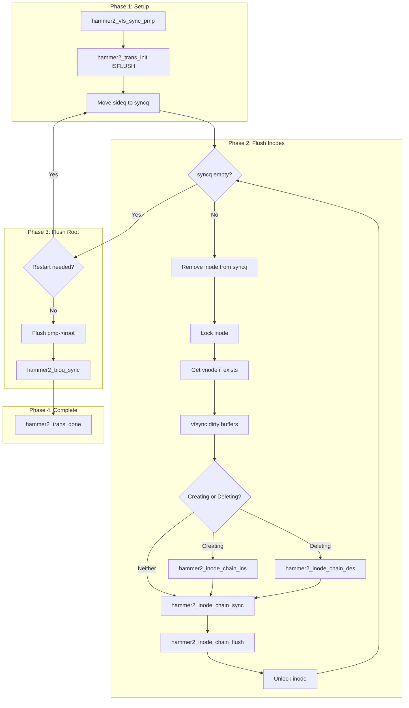
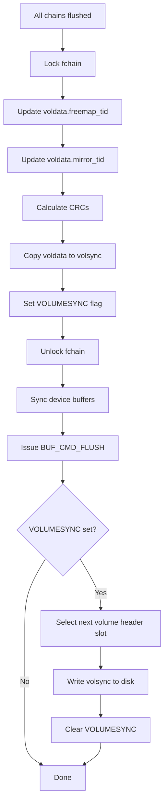
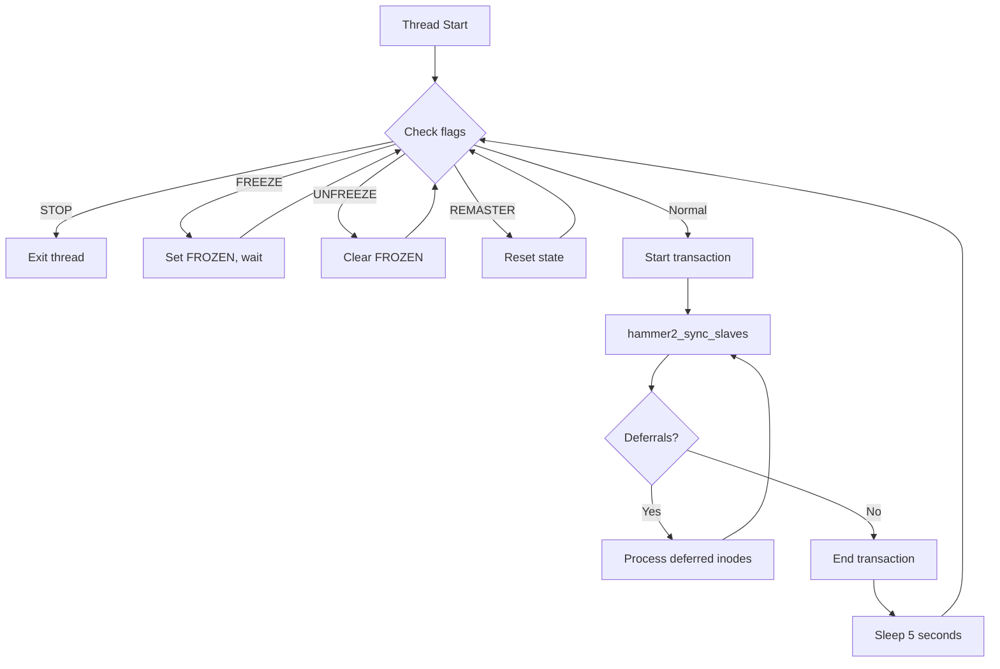

# HAMMER2 Flush & Sync

This document describes HAMMER2's transaction management and flush mechanisms, which
ensure that modified chains are written to disk while maintaining filesystem consistency.

## Overview

HAMMER2 uses a **copy-on-write** model where modifications create new blocks rather than
overwriting existing ones. The flush system is responsible for:

1. **Transaction Management** — Coordinating concurrent modifications
2. **Chain Flushing** — Writing modified chains to disk in dependency order
3. **Filesystem Sync** — Coordinating inode flushes during VFS_SYNC
4. **Volume Header Updates** — Atomically updating the root of the filesystem

The flush architecture uses a two-phase approach:

- **Top-down scan** — Finds chains needing flush via `ONFLUSH` flags
- **Bottom-up propagation** — Updates block references from leaves to root

## Transaction Management

Transactions serialize modifications within a PFS (Per-Filesystem Structure) and
coordinate with flush operations.

### Transaction Structure

Each PFS maintains transaction state in `hammer2_trans`:

| Field | Description |
|-------|-------------|
| `flags` | Transaction type and state flags |
| `sync_wait` | Waiters for flush completion |

Source: `hammer2.h:779-785`

### Transaction Flags

```c
#define HAMMER2_TRANS_ISFLUSH       0x80000000  /* Flush transaction */
#define HAMMER2_TRANS_BUFCACHE      0x40000000  /* Buffer cache I/O */
#define HAMMER2_TRANS_SIDEQ         0x20000000  /* Process sideq */
#define HAMMER2_TRANS_WAITING       0x08000000  /* Thread waiting */
#define HAMMER2_TRANS_RESCAN        0x04000000  /* Rescan sideq */
#define HAMMER2_TRANS_MASK          0x00FFFFFF  /* Reference count */
```

### Transaction Lifecycle



### Key Functions

**`hammer2_trans_init(pmp, flags)`** — `hammer2_flush.c:68`

Starts a transaction. For flush transactions (`HAMMER2_TRANS_ISFLUSH`), waits until
no other flush is active. Normal transactions can proceed concurrently with each other
but are serialized against flush transactions.

```c
void hammer2_trans_init(hammer2_pfs_t *pmp, uint32_t flags)
{
    /* Flush transactions must wait for exclusive access */
    if (flags & HAMMER2_TRANS_ISFLUSH) {
        while (pmp->trans.flags & HAMMER2_TRANS_ISFLUSH) {
            /* Wait for current flush to complete */
        }
    }
    atomic_add_int(&pmp->trans.flags, 1);  /* Increment refcount */
}
```

**`hammer2_trans_done(pmp, flags)`** — `hammer2_flush.c:189`

Completes a transaction. Decrements the reference count and wakes any waiting threads
if this was the last transaction in a flush cycle.

**`hammer2_trans_sub(pmp)`** — `hammer2_flush.c:155`

Returns a new `modify_tid` for sub-transactions. This allows multiple modifications
within a single flush cycle to have distinct transaction IDs for ordering.

## Flush Architecture

The flush mechanism writes modified chains to disk while maintaining consistency.

### Flush Flags

```c
#define HAMMER2_FLUSH_TOP           0x0001  /* Top of flush recursion */
#define HAMMER2_FLUSH_ALL           0x0002  /* Flush across PFS boundaries */
#define HAMMER2_FLUSH_INODE_STOP    0x0004  /* Stop at inode boundaries */
#define HAMMER2_FLUSH_FSSYNC        0x0008  /* Part of filesystem sync */
```

### Chain Flags for Flush

Chains use several flags to track flush state:

| Flag | Description |
|------|-------------|
| `MODIFIED` | Chain data has been modified |
| `UPDATE` | Parent blockref needs updating |
| `ONFLUSH` | Chain or descendant needs flush |
| `DESTROY` | Chain is being deleted |

The combination of these flags is checked via `HAMMER2_CHAIN_FLUSH_MASK`:

```c
#define HAMMER2_CHAIN_FLUSH_MASK    (HAMMER2_CHAIN_MODIFIED |     \
                                     HAMMER2_CHAIN_UPDATE |       \
                                     HAMMER2_CHAIN_ONFLUSH |      \
                                     HAMMER2_CHAIN_DESTROY)
```

### Flush Flow



### Top-Down Scan

The flush begins at a specified chain and scans downward looking for chains with
`ONFLUSH` or `DESTROY` set. This uses an RB-tree scan:

```c
/* hammer2_flush.c:610-617 */
hammer2_spin_ex(&chain->core.spin);
RB_SCAN(hammer2_chain_tree, &chain->core.rbtree,
        NULL, hammer2_flush_recurse, info);
if (chain->flags & HAMMER2_CHAIN_ONFLUSH) {
    atomic_clear_int(&chain->flags, HAMMER2_CHAIN_ONFLUSH);
    RB_SCAN(hammer2_chain_tree, &chain->core.rbtree,
            NULL, hammer2_flush_recurse, info);
}
hammer2_spin_unex(&chain->core.spin);
```

The scan may run twice if `ONFLUSH` gets re-set during the first pass (due to
indirect block maintenance).

### Bottom-Up Propagation

After recursing to children, the flush propagates changes upward:

1. **Clear MODIFIED** — Mark chain as no longer dirty
2. **Calculate checksums** — Update `bref.check` field
3. **Update parent blockref** — Write new blockref to parent's block table
4. **Propagate modify_tid** — Ensure parent has highest child TID

## Chain Flush Process

### Handling MODIFIED Chains

When a chain has `MODIFIED` set (`hammer2_flush_core:707-946`):



### Handling UPDATE Flag

The `UPDATE` flag indicates the parent's blockref needs updating (`hammer2_flush_core:998-1135`):

1. **Clear UPDATE** on the chain
2. **Modify parent** via `hammer2_chain_modify()`
3. **Locate blockref** in parent's block table
4. **Delete old entry** if `BLKMAPUPD` set
5. **Insert new entry** via `hammer2_base_insert()`

### Indirect Block Maintenance

During flush, empty indirect blocks are deleted and sparse indirect blocks may be
collapsed into their parent (`hammer2_flush_core:1039-1042`):

```c
if (chain->bref.type == HAMMER2_BREF_TYPE_INDIRECT) {
    if (hammer2_chain_indirect_maintenance(parent, chain))
        goto skipupdate;
}
```

### Parent Relationship Changes

The flush must handle chains whose parent changes during the flush (due to concurrent
operations). This is detected by comparing `chain->parent` with the expected parent:

```c
/* hammer2_flush_core:681-690 */
if (chain->parent != parent) {
    /* Parent changed, must retry */
    hammer2_chain_unlock(parent);
    retry = 1;
    goto done;
}
```

## VFS Sync

The `hammer2_vfs_sync()` function coordinates filesystem synchronization, called by
the system syncer or user `sync` command.

### Inode Queues

HAMMER2 maintains queues for tracking dirty inodes:

| Queue | Purpose |
|-------|---------|
| `sideq` | Newly dirtied inodes waiting for flush |
| `syncq` | Inodes currently being flushed |
| `depq` | Dependency tracking between inodes |

### Sync Flow



### SYNCQ Processing

Inodes are processed from `syncq` one at a time (`hammer2_vfs_sync_pmp:2546-2739`):

1. **Remove from syncq** — Transfer reference to flush code
2. **Lock inode** — Exclusive lock for modification
3. **Acquire vnode** — If attached, lock with `LK_NOWAIT` to avoid deadlock
4. **Sync buffers** — `vfsync()` flushes dirty file data
5. **Chain operations** — Insert/delete/sync the inode chain
6. **Flush chain** — `hammer2_inode_chain_flush()` with appropriate flags

### Deadlock Avoidance

The sync code must avoid deadlocks between vnode and inode locks. If `vget()` fails
with `LK_NOWAIT`, the inode is moved back to `sideq` with `PASS2` set for retry:

```c
/* hammer2_vfs_sync_pmp:2609-2634 */
if (vget(vp, LK_EXCLUSIVE|LK_NOWAIT)) {
    vp = NULL;
    dorestart |= 1;
    hammer2_inode_delayed_sideq(ip);
    hammer2_mtx_unlock(&ip->lock);
    hammer2_inode_drop(ip);
    if (pass2 & HAMMER2_INODE_SYNCQ_PASS2)
        dorestart |= 2;  /* Possible loop, add delay */
    continue;
}
```

### Inode Chain Flush XOP

The actual chain flush runs as an XOP (`hammer2_xop_inode_flush:1292-1538`):

1. **Get chain** for the inode at this cluster index
2. **Call hammer2_flush()** with appropriate flags
3. **Update blocksets** for PFS root inodes
4. **Flush volume** if `HAMMER2_XOP_VOLHDR` requested

## Volume Header Updates

The volume header is the root of trust for the filesystem. It is updated atomically
after all other data has been flushed.

### Volume Header Sequence



### Volume Header Rotation

HAMMER2 maintains multiple volume header copies for crash recovery:

```c
/* hammer2_flush.c:1504-1512 */
j = hmp->volhdrno + 1;
if (j < 0)
    j = 0;
if (j >= HAMMER2_NUM_VOLHDRS)
    j = 0;
if (j * HAMMER2_ZONE_BYTES64 + HAMMER2_SEGSIZE > hmp->volsync.volu_size)
    j = 0;
```

The next slot is selected and written, then `volhdrno` is updated. On mount,
HAMMER2 selects the volume header with the highest valid `mirror_tid`.

### CRC Calculation

The volume header uses layered CRCs for integrity (`hammer2_flush_core:829-843`):

```c
/* Section 1 CRC */
hmp->voldata.icrc_sects[HAMMER2_VOL_ICRC_SECT1] =
    hammer2_icrc32((char *)&hmp->voldata + HAMMER2_VOLUME_ICRC1_OFF,
                   HAMMER2_VOLUME_ICRC1_SIZE);

/* Section 0 CRC (includes Section 1 CRC) */
hmp->voldata.icrc_sects[HAMMER2_VOL_ICRC_SECT0] =
    hammer2_icrc32((char *)&hmp->voldata + HAMMER2_VOLUME_ICRC0_OFF,
                   HAMMER2_VOLUME_ICRC0_SIZE);

/* Full header CRC */
hmp->voldata.icrc_volheader =
    hammer2_icrc32((char *)&hmp->voldata + HAMMER2_VOLUME_ICRCVH_OFF,
                   HAMMER2_VOLUME_ICRCVH_SIZE);
```

## Cluster Synchronization

For multi-master configurations, HAMMER2 includes a cluster synchronization thread
that keeps nodes in sync.

### Sync Thread

Each cluster node runs `hammer2_primary_sync_thread()` (`hammer2_synchro.c:100-260`):



### Synchronization Algorithm

The sync thread compares local chains with the cluster focus (`hammer2_sync_slaves:357-707`):

1. **XOP scan** — Issue all-nodes scan excluding local index
2. **Local scan** — Iterate local chains in parallel
3. **Compare** — Match by key to find differences
4. **Sync operations**:
   - `n < 0`: Delete extraneous local data
   - `n == 0, TID differs`: Replace local data
   - `n > 0`: Insert missing data from focus

### Sync Operations

**Insert** (`hammer2_sync_insert:717-848`) — Creates missing chains by copying from focus:

```c
error = hammer2_chain_create(parentp, &chain, NULL, thr->pmp,
                             focus->bref.methods,
                             focus->bref.key, focus->bref.keybits,
                             focus->bref.type, focus->bytes,
                             mtid, 0, 0);
/* Copy data from focus to new chain */
```

**Destroy** (`hammer2_sync_destroy:860-908`) — Deletes extraneous local chains:

```c
hammer2_chain_delete(*parentp, chain, mtid, HAMMER2_DELETE_PERMANENT);
```

**Replace** (`hammer2_sync_replace:916-1069`) — Updates local chain to match focus:

```c
error = hammer2_chain_modify(chain, mtid, 0, 0);
/* Copy blockref fields and data from focus */
```

### Deferred Inode Processing

When the sync encounters an inode, it cannot recurse immediately (the XOP is still
running). Instead, inodes are deferred for later processing:

```c
/* hammer2_synchro.c:592-615 */
defer = kmalloc(sizeof(*defer), M_HAMMER2, M_WAITOK | M_ZERO);
nip = hammer2_inode_get(pmp, &xop->head, -1, idx);
hammer2_inode_ref(nip);
defer->next = list->base;
defer->ip = nip;
list->base = defer;
++list->count;
```

## Error Handling

### Flush Errors

Flush errors (typically `ENOSPC`) are accumulated in `info->error` and propagated
upward. The flush continues despite errors to clean as much as possible:

```c
/* hammer2_flush_core:1057-1065 */
save_error = hammer2_chain_modify(parent, 0, 0, 0);
if (save_error) {
    info->error |= save_error;
    atomic_set_int(&chain->flags, HAMMER2_CHAIN_UPDATE);
    goto skipupdate;  /* Continue with other chains */
}
```

### Parent Loss

If a chain's parent changes during flush, the operation is retried:

```c
/* hammer2_flush.c:399-408 */
if (info.parent != chain->parent) {
    hammer2_chain_drop(info.parent);
    info.parent = chain->parent;
    hammer2_chain_ref(info.parent);
}
if (hammer2_flush_core(&info, chain, flags) == 0)
    break;  /* Success */
/* Retry on non-zero return */
```

## Performance Considerations

### Memory Pressure

The flush system monitors dirty chain memory and can wake blocked threads when
memory is freed:

```c
/* hammer2_flush_core:717-718 */
if (chain->pmp)
    hammer2_pfs_memory_wakeup(chain->pmp, -1);
```

### Avoiding Unnecessary I/O

When chains are destroyed, the flush attempts to avoid writing data that will be
immediately freed:

```c
/* hammer2_flush_core:924-929 */
if (chain->flags & HAMMER2_CHAIN_DESTROY) {
    hammer2_io_dedup_delete(hmp,
                            chain->bref.type,
                            chain->bref.data_off,
                            chain->bytes);
}
```

## See Also

- [HAMMER2 Overview](index.md) — Filesystem architecture
- [Chain Layer](chain-layer.md) — Chain modification and locking
- [VFS Integration](vfs-integration.md) — VFS operations that trigger flush
- [Freemap](freemap.md) — Block allocation (flushed separately)
- [I/O Subsystem](io-subsystem.md) — Buffer cache integration
