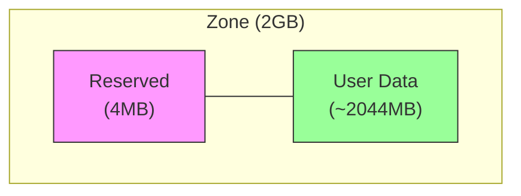
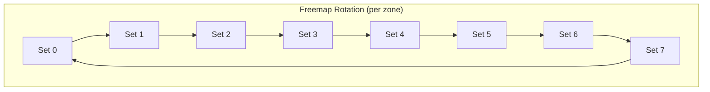
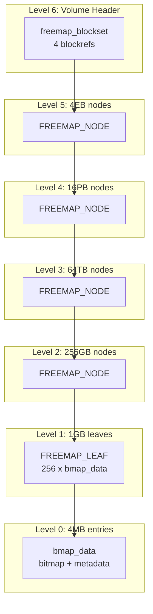
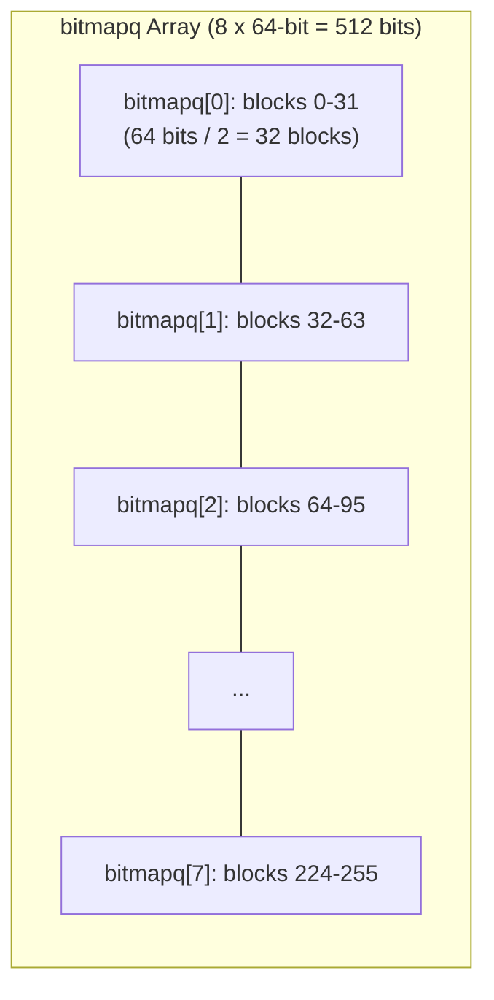
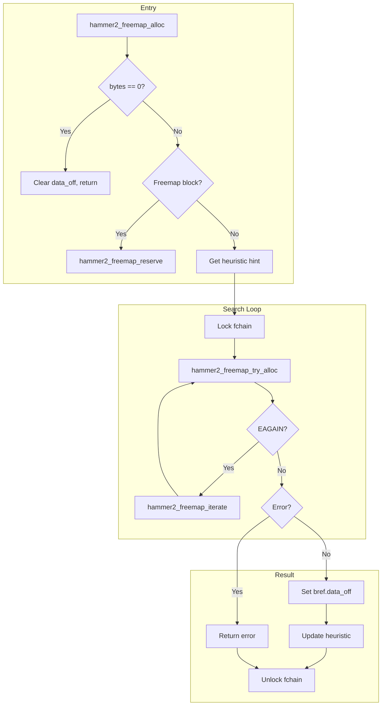
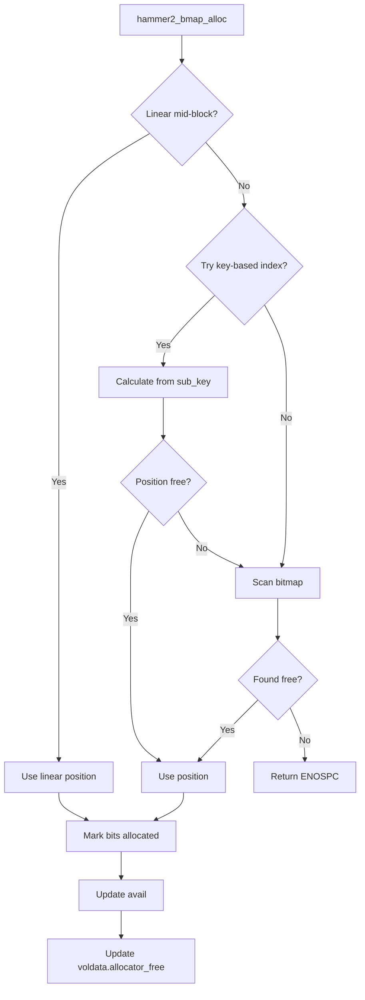
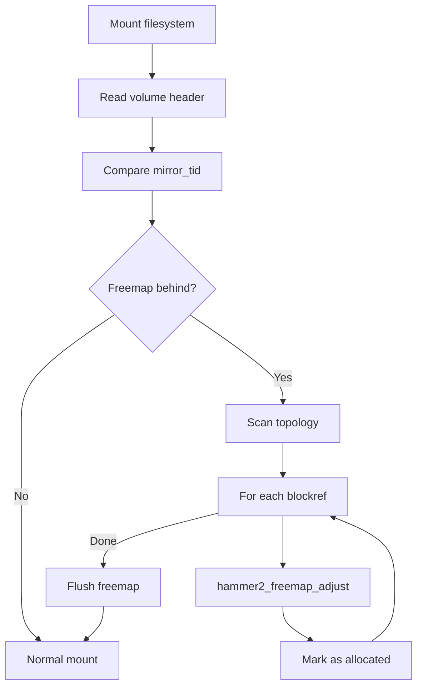

# HAMMER2 Freemap

This document describes HAMMER2's freemap, a hierarchical structure that manages
free space allocation across the filesystem.

## Overview

The freemap is a radix tree that tracks which blocks are allocated or free. Key
characteristics:

- **Copy-on-write** — Freemap blocks themselves use copy-on-write with 8-way rotation
- **Hierarchical** — 6 levels covering from 16KB blocks to 16EB total
- **Reserved area** — Each 2GB zone reserves 4MB for freemap metadata
- **Bitmap-based** — Leaf nodes use 2-bit entries per 16KB block
- **Lazy freeing** — Blocks transition through staged states before final free

The freemap is rooted at `hmp->fchain` and flushed independently of the main
topology (though coordinated via `mirror_tid`).

## Zone Layout

HAMMER2 divides storage into 2GB zones. Each zone reserves the first 4MB for
metadata including freemap blocks.

### Zone Structure



The reserved 4MB area contains:

| Offset (64KB blocks) | Content |
|---------------------|---------|
| 0 | Volume header (one of 4 copies) |
| 1-5 | Freemap set 0 (levels 1-5) |
| 6-10 | Freemap set 1 |
| 11-15 | Freemap set 2 |
| 16-20 | Freemap set 3 |
| 21-25 | Freemap set 4 |
| 26-30 | Freemap set 5 |
| 31-35 | Freemap set 6 |
| 36-40 | Freemap set 7 |
| 41-63 | Reserved/unused |

Source: `hammer2_disk.h:277-313`

```c
#define HAMMER2_ZONE_BYTES64        (2LLU * 1024 * 1024 * 1024)
#define HAMMER2_ZONE_SEG            (4 * 1024 * 1024)
#define HAMMER2_NFREEMAPS           8   /* 8 freemap rotation sets */

#define HAMMER2_ZONE_VOLHDR         0   /* Volume header */
#define HAMMER2_ZONE_FREEMAP_00     1   /* Freemap set 0 */
#define HAMMER2_ZONE_FREEMAP_INC    5   /* 5 blocks per set */
```

### Freemap Block Rotation

Freemap blocks rotate through 8 copies (sets 0-7) on each modification. This
provides crash recovery capability — on mount, the filesystem can fall back to
an older freemap if the latest is corrupted.



The rotation is calculated in `hammer2_freemap_reserve()` (`hammer2_freemap.c:76-168`):

```c
/* Calculate next rotation index */
if ((bref->data_off & ~HAMMER2_OFF_MASK_RADIX) == 0) {
    index = 0;  /* First allocation */
} else {
    /* Extract current index from data_off, increment */
    index = (current_index + 1) % HAMMER2_NFREEMAPS;
}
```

## Freemap Tree Structure

The freemap is organized as a 6-level radix tree, with each level covering
progressively larger address ranges.

### Level Hierarchy

| Level | Radix | Coverage | Block Type |
|-------|-------|----------|------------|
| 6 | 64 | 16EB | Volume header blockset |
| 5 | 62 | 4EB | `FREEMAP_NODE` |
| 4 | 54 | 16PB | `FREEMAP_NODE` |
| 3 | 46 | 64TB | `FREEMAP_NODE` |
| 2 | 38 | 256GB | `FREEMAP_NODE` |
| 1 | 30 | 1GB | `FREEMAP_LEAF` |
| 0 | 22 | 4MB | Bitmap entry (within leaf) |

Source: `hammer2_disk.h:335-356`

```c
#define HAMMER2_FREEMAP_LEVEL6_RADIX    64  /* 16EB (root) */
#define HAMMER2_FREEMAP_LEVEL5_RADIX    62  /* 4EB */
#define HAMMER2_FREEMAP_LEVEL4_RADIX    54  /* 16PB */
#define HAMMER2_FREEMAP_LEVEL3_RADIX    46  /* 64TB */
#define HAMMER2_FREEMAP_LEVEL2_RADIX    38  /* 256GB */
#define HAMMER2_FREEMAP_LEVEL1_RADIX    30  /* 1GB */
#define HAMMER2_FREEMAP_LEVEL0_RADIX    22  /* 4MB */
```

### Tree Visualization



### Freemap Node/Leaf Size

All freemap nodes and leaves are 32KB:

```c
#define HAMMER2_FREEMAP_LEVELN_PSIZE    32768   /* 32KB */
```

A 32KB block holds 256 blockrefs (128 bytes each) for nodes, or 256 `bmap_data`
structures for leaves.

## Bitmap Organization

Each `FREEMAP_LEAF` contains 256 `hammer2_bmap_data_t` structures, with each
structure tracking a 4MB region.

### bmap_data Structure

```c
struct hammer2_bmap_data {
    int32_t     linear;         /* Linear allocation offset */
    uint16_t    class;          /* Allocation class */
    uint16_t    reserved;
    uint32_t    reserved2;
    hammer2_bitmap_t bitmapq[HAMMER2_BMAP_ELEMENTS];  /* 8 x 64-bit */
    hammer2_off_t    avail;     /* Available bytes in this 4MB region */
};
```

### Bitmap Encoding

Each 4MB region is divided into 256 x 16KB blocks. The bitmap uses 2 bits per
block:

| Value | State | Description |
|-------|-------|-------------|
| 00 | FREE | Block is available |
| 01 | Reserved | (Currently unused) |
| 10 | STAGED | Possibly free, pending bulkfree |
| 11 | ALLOCATED | Block is in use |

The 8 x 64-bit `bitmapq[]` array covers 256 blocks:



### Bitmap Constants

```c
#define HAMMER2_FREEMAP_BLOCK_RADIX     14      /* 16KB granularity */
#define HAMMER2_FREEMAP_BLOCK_SIZE      16384   /* 16KB */
#define HAMMER2_BMAP_ELEMENTS           8       /* 8 x 64-bit elements */
#define HAMMER2_BMAP_BITS_PER_ELEMENT   64
```

### Linear Allocator

The `linear` field in `bmap_data` tracks sub-16KB allocations. When allocating
blocks smaller than 16KB:

1. If `linear` is mid-block, allocate from the current position
2. Advance `linear` by the allocation size
3. When `linear` reaches a 16KB boundary, search bitmap for next free block

This allows efficient packing of small allocations (1KB minimum) within 16KB
blocks.

## Allocation Algorithm

Block allocation is performed by `hammer2_freemap_alloc()` (`hammer2_freemap.c:182-270`).

### Allocation Flow



### Heuristic Hints

The allocator uses per-type hints to improve locality:

```c
/* hammer2_freemap.c:229-238 */
hindex = HAMMER2_PBUFRADIX - HAMMER2_LBUFRADIX;
hindex += bref->type * HAMMER2_FREEMAP_HEUR_NRADIX;
iter.bpref = hmp->heur_freemap[hindex];
```

After allocation, the hint is updated to the next expected position.

### Try Allocation

`hammer2_freemap_try_alloc()` searches within a 1GB leaf (`hammer2_freemap.c:272-525`):

1. **Lookup leaf** — Find or create the `FREEMAP_LEAF` for the target address
2. **Check bigmask** — Skip if leaf indicates no space for requested size
3. **Scan bmap entries** — Search forward and backward from hint position
4. **Call bmap_alloc** — Allocate from matching bmap entry

### Bmap Allocation

`hammer2_bmap_alloc()` allocates within a 4MB region (`hammer2_freemap.c:543-798`):



### Class-Based Allocation

Allocations are grouped by class (block type + radix) to improve locality:

```c
class = (bref->type << 8) | HAMMER2_PBUFRADIX;
```

A bmap entry preferentially accepts allocations of the same class, unless in
"relaxed mode" (when space is tight).

### Relaxed Mode

When allocation fails in normal mode, the allocator enters relaxed mode:

```c
/* hammer2_freemap.c:897-902 */
if (++iter->loops >= 2) {
    if (iter->relaxed == 0)
        iter->relaxed = 1;  /* Enter relaxed mode */
    else
        return (HAMMER2_ERROR_ENOSPC);  /* Truly out of space */
}
```

In relaxed mode, allocations can use any bmap class, not just matching ones.

## Freemap Initialization

When a new 1GB region is first accessed, its freemap leaf is initialized by
`hammer2_freemap_init()` (`hammer2_freemap.c:801-873`):

```c
void hammer2_freemap_init(hammer2_dev_t *hmp, hammer2_key_t key,
                          hammer2_chain_t *chain)
{
    /* Mark reserved areas (first 4MB of each 2GB zone) as allocated */
    lokey = H2FMZONEBASE(key) + HAMMER2_ZONE_SEG64;
    
    /* Mark areas beyond volume end as allocated */
    hikey = min(key + HAMMER2_FREEMAP_LEVEL1_SIZE, hmp->total_size);
    
    for (count = 0; count < HAMMER2_FREEMAP_COUNT; ++count) {
        if (key < lokey || key >= hikey) {
            /* Mark as fully allocated */
            memset(bmap->bitmapq, -1, sizeof(bmap->bitmapq));
            bmap->avail = 0;
        } else {
            /* Mark as fully free */
            bmap->avail = HAMMER2_FREEMAP_LEVEL0_SIZE;
        }
    }
}
```

## Freemap Recovery

On mount, HAMMER2 may need to recover the freemap if blocks were allocated but
the freemap wasn't flushed before a crash.

### Recovery via Adjust

`hammer2_freemap_adjust()` marks blocks as allocated during recovery
(`hammer2_freemap.c:920-1214`):

```c
void hammer2_freemap_adjust(hammer2_dev_t *hmp, hammer2_blockref_t *bref,
                            int how)
{
    KKASSERT(how == HAMMER2_FREEMAP_DORECOVER);
    
    /* Find or create the freemap leaf */
    chain = hammer2_chain_lookup(...);
    if (chain == NULL) {
        hammer2_chain_create(...);  /* Create missing leaf */
        hammer2_freemap_init(hmp, key, chain);
    }
    
    /* Mark bits as allocated (11) */
    if ((*bitmap & bmmask11) != bmmask11) {
        *bitmap |= bmmask11;
        bmap->avail -= HAMMER2_FREEMAP_BLOCK_SIZE;
    }
}
```

### Recovery Flow



## Bulkfree Operation

Since HAMMER2 doesn't free blocks in real-time (due to snapshots and
copy-on-write complexity), it uses a background **bulkfree** scan to reclaim
space.

### Bulkfree Algorithm

The bulkfree process runs in three stages:

```
Stage 1: ALLOCATED (11) -> STAGED (10)
         Mark all potentially free blocks as staged

Stage 2: Scan topology
         STAGED (10) -> ALLOCATED (11) for blocks still in use

Stage 3: STAGED (10) -> FREE (00)
         Finalize blocks that remained staged
```

Source: `hammer2_freemap.c:1216-1251`

### Double-Transition Safety

The two-stage free (11 -> 10 -> 00) ensures crash safety:

- A crash between stage 1 and stage 2 leaves blocks as STAGED (10)
- On remount, STAGED blocks are treated as allocated
- Only after a complete bulkfree cycle do blocks become FREE

### Bulkfree Implementation

The bulkfree scan is implemented in `hammer2_bulkfree.c`:

```c
/* hammer2_bulkfree.c:414-423 */
/*
 * Bulkfree algorithm:
 * Repeat {
 *     Scan topology - build in-memory freemap (mark 11)
 *     Reconcile in-memory vs on-disk freemap:
 *         ondisk xx -> ondisk 11 (if allocated in-memory)
 *         ondisk 11 -> ondisk 10 (if free in-memory)
 *         ondisk 10 -> ondisk 00 (if free in-memory) - next pass
 * }
 */
```

### Bulkfree Info Structure

```c
typedef struct hammer2_bulkfree_info {
    hammer2_dev_t       *hmp;
    hammer2_bmap_data_t *bmap;      /* In-memory freemap */
    hammer2_off_t       sbase;      /* Current scan base */
    hammer2_off_t       sstop;      /* Current scan stop */
    long                count_10_00; /* Staged -> Free */
    long                count_11_10; /* Allocated -> Staged */
    hammer2_off_t       adj_free;   /* Free space adjustment */
    /* ... */
} hammer2_bulkfree_info_t;
```

### Memory-Bounded Scanning

Bulkfree uses bounded memory. Each 32KB of RAM represents 1GB of storage:

```c
/* hammer2_bulkfree.c:549-550 */
#define HAMMER2_FREEMAP_SIZEDIV \
    (HAMMER2_FREEMAP_LEVEL1_SIZE / HAMMER2_FREEMAP_LEVELN_PSIZE)
```

If memory is insufficient to cover the entire volume, multiple passes are made.

### Bulkfree Thread

A background thread periodically runs bulkfree (`hammer2_bulkfree.c:468-510`):

```c
static void hammer2_bulkfree_thread(void *arg)
{
    for (;;) {
        hammer2_thr_wait_any(thr, ..., hz * 60);  /* Wake every 60 sec */
        
        if (flags & HAMMER2_THREAD_REMASTER) {
            bfi.size = 8192 * 1024;  /* 8MB buffer */
            hammer2_bulkfree_pass(hmp, &bfi);
        }
    }
}
```

## Freemap and Volume Header

The freemap's state is recorded in the volume header:

| Field | Description |
|-------|-------------|
| `freemap_tid` | Transaction ID of last freemap flush |
| `allocator_free` | Total free space (bitmap granularity) |
| `allocator_beg` | Start of allocatable space |

### Freemap Flush Coordination

The freemap (`fchain`) is flushed before the volume chain (`vchain`) to ensure
consistency:

```c
/* hammer2_flush.c:1432-1441 */
if (hmp->fchain.flags & HAMMER2_CHAIN_FLUSH_MASK) {
    hammer2_voldata_modify(hmp);
    chain = &hmp->fchain;
    flush_error |= hammer2_flush(chain, HAMMER2_FLUSH_TOP);
}
/* Then flush vchain */
```

When flushing `fchain`, the volume header's `freemap_tid` is updated:

```c
/* hammer2_flush.c:766-768 */
case HAMMER2_BREF_TYPE_FREEMAP:
    hmp->voldata.freemap_tid = chain->bref.mirror_tid;
    break;
```

## Blockref Check Field

Freemap blockrefs use the check field to store hints:

```c
struct {
    uint32_t icrc32;    /* Integrity check */
    uint32_t bigmask;   /* Available radixes (bitmask) */
    uint64_t avail;     /* Available bytes */
    char reserved[48];
} freemap;
```

### Bigmask Optimization

The `bigmask` field indicates which allocation sizes might succeed:

```c
/* Bit N set = allocations of (1 << N) bytes might succeed */
chain->bref.check.freemap.bigmask = (uint32_t)-1;  /* All sizes possible */

/* Clear bit when a scan confirms no space for that size */
chain->bref.check.freemap.bigmask &= ~((size_t)1 << radix);
```

This allows quick rejection of allocations that cannot possibly succeed.

## Performance Considerations

### Allocation Locality

The allocator tries to maintain locality through:

1. **Heuristic hints** — Per-type next-allocation hints
2. **Class grouping** — Same-type allocations in same bmap entries
3. **Key-based indexing** — Data blocks indexed by file offset

### Avoiding Read-Before-Write

When allocating new blocks, the allocator may pre-initialize buffers to avoid
unnecessary reads:

```c
/* hammer2_freemap.c:702-732 */
if ((bmap->bitmapq[i] & pbmmask) == 0) {
    /* Entire physical buffer is new, skip read */
    hammer2_io_newnz(hmp, class >> 8, offset | pradix, psize, &dio);
    hammer2_io_putblk(&dio);
}
```

### Deduplication Integration

The freemap tracks deduplication candidates:

```c
/* hammer2_freemap.c:502-503 */
if (bref->type == HAMMER2_BREF_TYPE_DATA)
    hammer2_io_dedup_set(hmp, bref);
```

Dedup bits are cleared during bulkfree's 11->10 transition.

## See Also

- [HAMMER2 Overview](index.md) — Filesystem architecture
- [On-Disk Format](on-disk-format.md) — Volume header and blockref structures
- [Chain Layer](chain-layer.md) — Freemap chain management
- [Flush & Sync](flush-sync.md) — Freemap flush coordination
