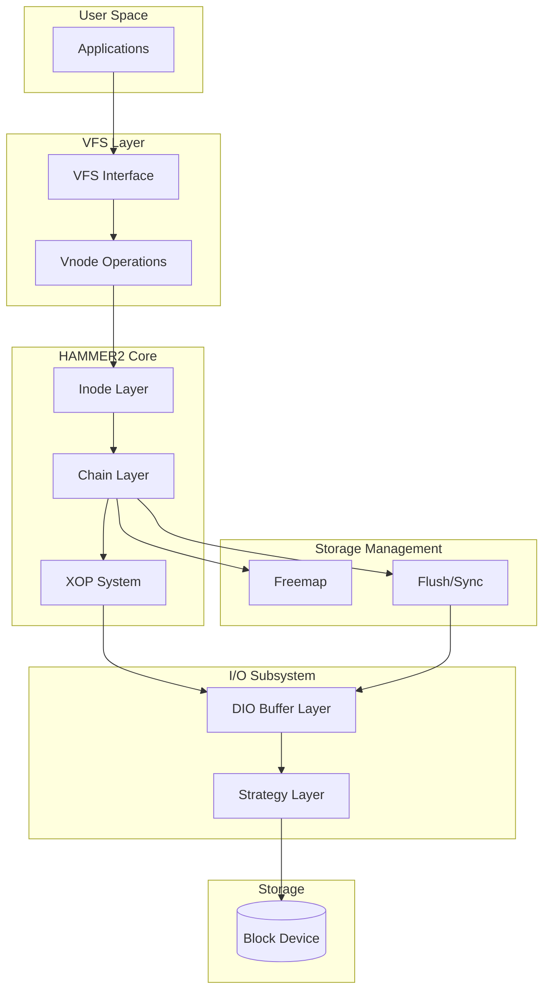

# HAMMER2 Filesystem

HAMMER2 is DragonFly BSD's modern native filesystem, designed by Matthew Dillon for contemporary storage requirements with advanced features including copy-on-write, clustering, and built-in compression.

## Overview

**Source Location**: `sys/vfs/hammer2/` (~33,400 lines across 28 files)

HAMMER2 represents a complete redesign from the original HAMMER filesystem, focusing on:

- **Copy-on-Write Architecture** — All modifications allocate new blocks, never overwriting existing data
- **Radix Tree Topology** — Dynamic radix trees for directories, files, and the freemap
- **Fat Block References** — 128-byte blockrefs that can embed small directory entries
- **Per-CPU Threading** — XOP (cross-operation) system for parallel backend I/O
- **Clustering Support** — Designed for multi-master replication
- **Built-in Compression** — LZ4 and ZLIB compression at the block level
- **Live Deduplication** — Detects and eliminates duplicate blocks during writes

## Architecture

## Key Characteristics

| Characteristic | Value |
|----------------|-------|
| Block Size | Variable: 1KB to 64KB |
| Inode Size | 1KB (can embed up to 512 bytes) |
| Blockref Size | 128 bytes |
| Max File Size | 2^64 bytes (theoretical) |
| Max Filesystem Size | 1 Exabyte |
| Compression | LZ4 (fast), ZLIB (better ratio) |
| Checksums | xxHash64, SHA192, Freemap CRC |

## Documentation Sections

| Section | Description |
|---------|-------------|
| [On-Disk Format](on-disk-format.md) | Volume headers, blockrefs, inodes, freemap layout |
| [Chain Layer](chain-layer.md) | In-memory block representation and management |
| [Inode Layer](inode-layer.md) | Inode management and directory operations |
| [I/O Subsystem](io-subsystem.md) | DIO layer and buffer cache abstraction |
| [Flush & Sync](flush-sync.md) | Transaction flush mechanism |
| [Freemap](freemap.md) | Space allocation and bulk free operations |
| [XOP System](xop-system.md) | Cross-operation threading for parallel I/O |
| [VFS Integration](vfs-integration.md) | VFS and vnode operations |
| [Compression](compression.md) | LZ4 and ZLIB compression |
| [Snapshots](snapshots.md) | Snapshot implementation |
| [Clustering](clustering.md) | Multi-master clustering support |

## Source File Organization

### Core Data Structures

| File | Lines | Purpose |
|------|-------|---------|
| `hammer2_disk.h` | ~1,323 | On-disk format definitions |
| `hammer2.h` | ~2,007 | In-memory structures and constants |
| `hammer2_chain.c` | ~5,938 | Chain (block reference) management |
| `hammer2_inode.c` | ~1,831 | Inode management |
| `hammer2_cluster.c` | ~736 | Cluster management |

### VFS Integration

| File | Lines | Purpose |
|------|-------|---------|
| `hammer2_vfsops.c` | ~3,127 | VFS operations (mount, unmount, sync) |
| `hammer2_vnops.c` | ~2,548 | Vnode operations (open, read, write) |

### I/O Subsystem

| File | Lines | Purpose |
|------|-------|---------|
| `hammer2_io.c` | ~963 | Buffer cache abstraction (DIO) |
| `hammer2_strategy.c` | ~1,623 | Read/write strategy |
| `hammer2_flush.c` | ~1,538 | Flush/sync mechanism |

### Space Management

| File | Lines | Purpose |
|------|-------|---------|
| `hammer2_freemap.c` | ~1,251 | Free space allocation |
| `hammer2_bulkfree.c` | ~1,447 | Bulk free scanning |

### XOP System

| File | Lines | Purpose |
|------|-------|---------|
| `hammer2_xops.c` | ~1,686 | Cross-operation backends |
| `hammer2_admin.c` | ~1,262 | Thread management |
| `hammer2_synchro.c` | ~1,069 | Synchronization threads |

### Other Components

| File | Lines | Purpose |
|------|-------|---------|
| `hammer2_ioctl.c` | ~1,450 | ioctl interface |
| `hammer2_ondisk.c` | ~740 | Volume/device management |
| `hammer2_subr.c` | ~473 | Utility functions |
| `hammer2_lz4.c` | ~525 | LZ4 compression |
| `hammer2_ccms.c` | ~311 | Cache coherency (stub) |
| `hammer2_iocom.c` | ~387 | Cluster communication |
| `hammer2_msgops.c` | ~87 | Message operations |

## Design Documents

The HAMMER2 source tree includes detailed design documents:

- `sys/vfs/hammer2/DESIGN` — Overall architecture and design rationale
- `sys/vfs/hammer2/FREEMAP` — Freemap allocation strategy

## See Also

- [HAMMER](../hammer.md) — Legacy HAMMER filesystem (predecessor)
- [VFS Core](../../kern/vfs/index.md) — VFS layer documentation
- [Buffer Cache](../../kern/vfs/buffer-cache.md) — Buffer cache that DIO wraps
- [VFS Operations](../../kern/vfs/vfs-operations.md) — VOP dispatch framework
