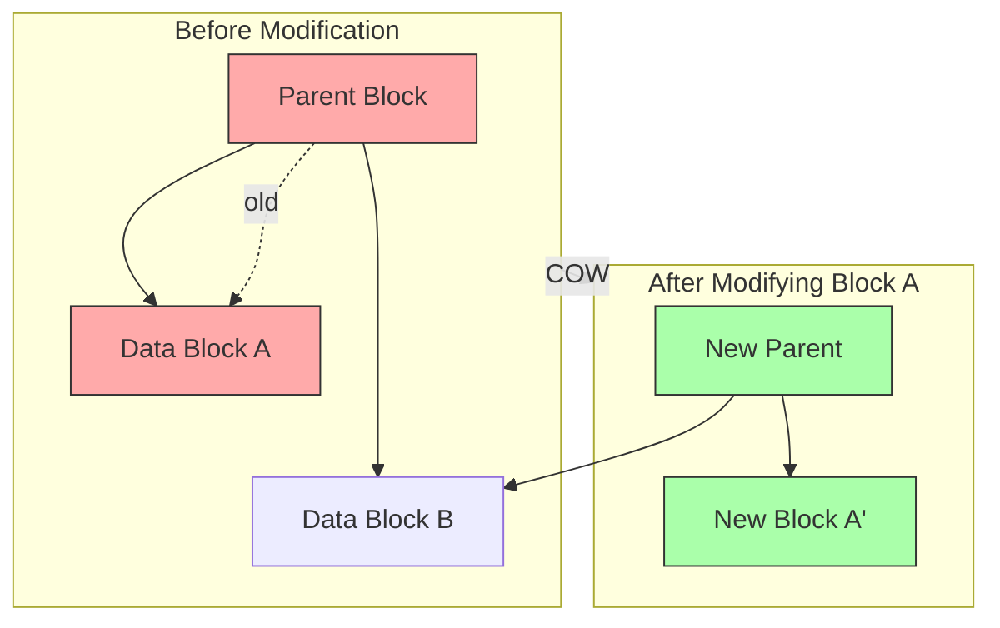
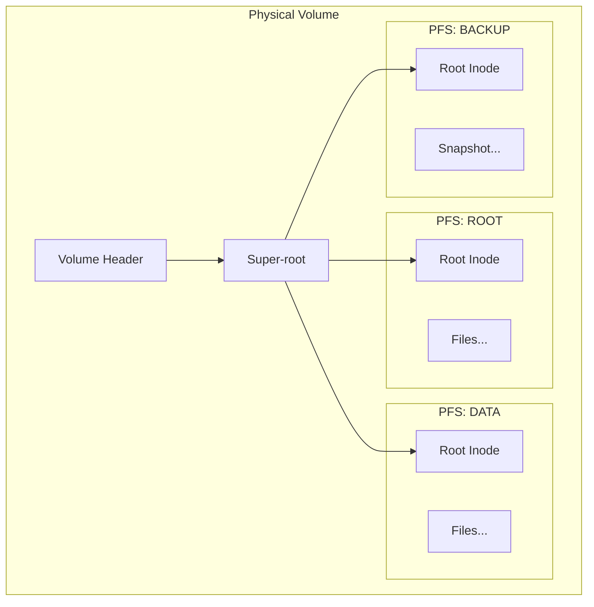
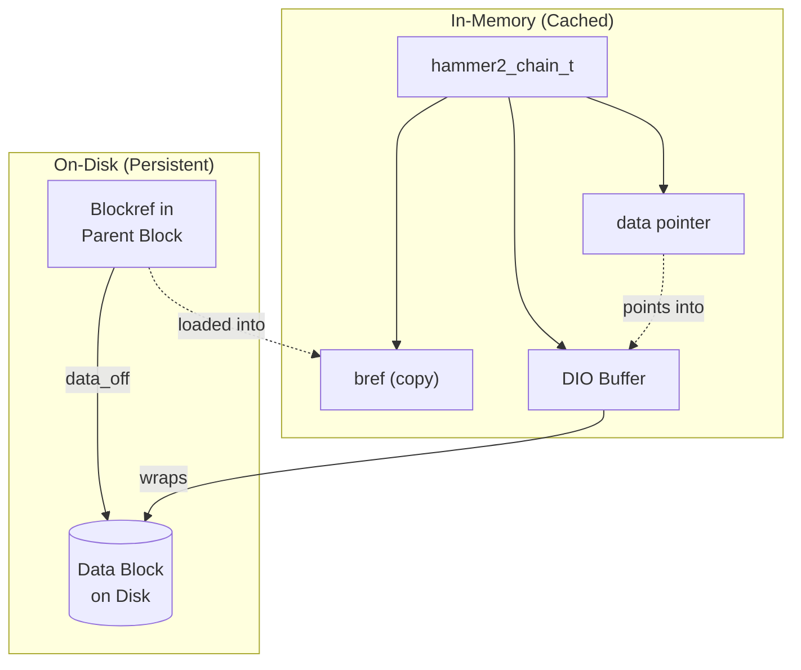
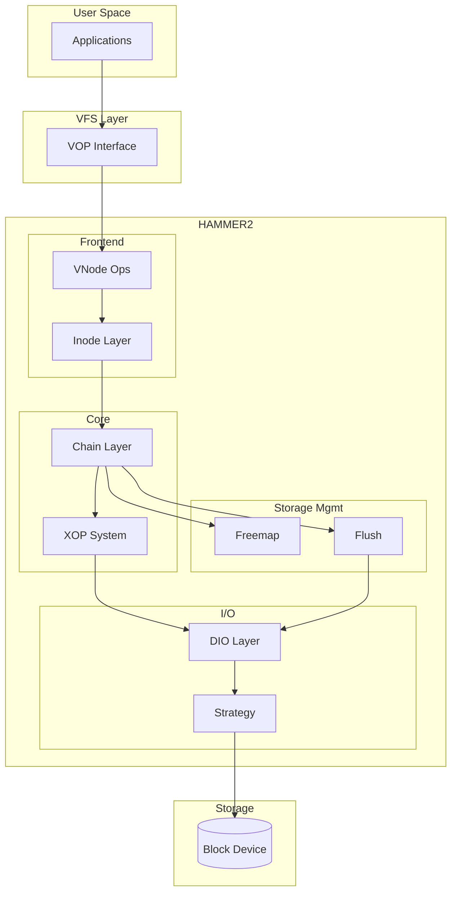
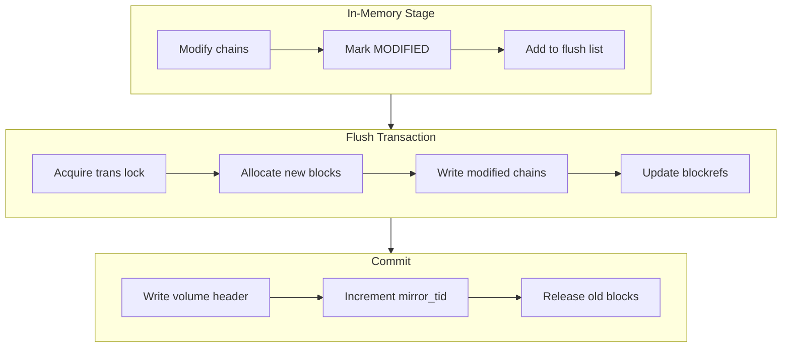
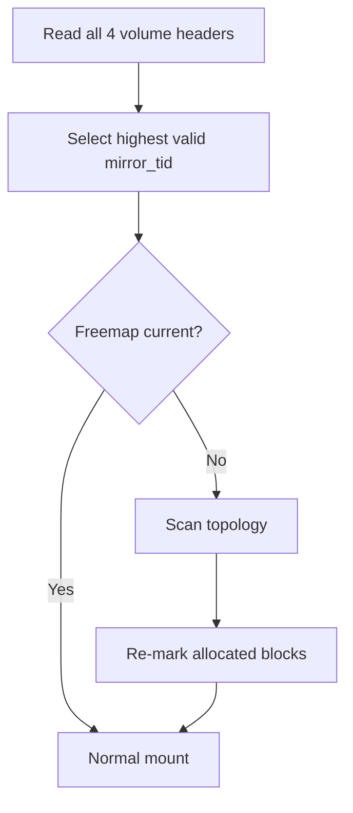
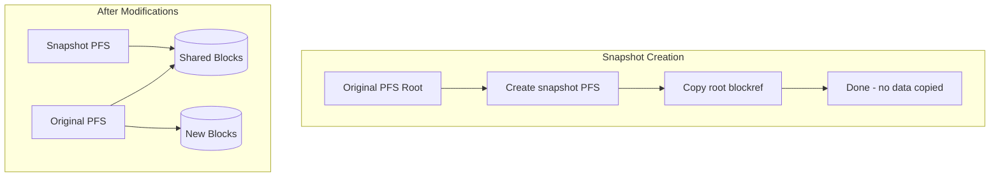

# HAMMER2 Filesystem

HAMMER2 is DragonFly BSD's modern copy-on-write filesystem, designed by Matthew Dillon as a complete redesign of the original HAMMER. It provides instant snapshots, built-in compression, live deduplication, and multi-master clustering support.

## Overview

**Source Location**: `sys/vfs/hammer2/` (~33,400 lines across 28 files)

HAMMER2 is built around several core design principles:

- **Copy-on-Write (COW)** — Modifications allocate new blocks; originals remain intact until explicitly freed
- **Block References (blockrefs)** — All data is referenced through 128-byte structures containing checksums and metadata
- **Radix Trees** — Directories, file data, and the freemap all use radix tree organization
- **Pseudo File Systems (PFS)** — Multiple independent filesystems share the same physical volume
- **Transactional Consistency** — All modifications are atomic at the flush boundary

## Key Characteristics

| Characteristic | Value | Notes |
|----------------|-------|-------|
| Block Size | 1KB – 64KB | Variable, power-of-2 |
| Inode Size | 1KB | Can embed up to 512 bytes of data |
| Blockref Size | 128 bytes | Contains checksum, type, key, offset |
| Max File Size | 2^64 bytes | Theoretical limit |
| Max Volume Size | 1 Exabyte | 16EB theoretical with clustering |
| Compression | LZ4, ZLIB | Per-file configurable |
| Checksums | xxHash64, SHA192 | Per-block integrity |
| Snapshots | Instant | Zero-cost creation via COW |

## Core Concepts

### Copy-on-Write Architecture

HAMMER2 never overwrites existing data. When a block is modified:



**Key points:**

- Block A is modified → new Block A' is allocated (green)
- Parent must update its blockref → new Parent is allocated (green)  
- Block B is unchanged → both old and new parent reference the same B
- Old blocks (red) remain valid for snapshots until explicitly freed

This propagates up the tree — modifying any block requires allocating new copies of all ancestor blocks up to the root. The old blocks remain valid for snapshots and crash recovery.

### Block References (Blockrefs)

The 128-byte blockref is HAMMER2's fundamental unit. Every piece of data — files, directories, indirect blocks, freemap nodes — is referenced through a blockref.

```
┌─────────────────────────────────────────────────────────────┐
│ Blockref (128 bytes)                                        │
├──────────────┬──────────────┬───────────────────────────────┤
│ type (1B)    │ methods (1B) │ check (1B) │ keybits (1B)     │
├──────────────┴──────────────┴───────────────────────────────┤
│ vradix (1B)  │ flags (1B)   │ leaf_count (2B)              │
├─────────────────────────────────────────────────────────────┤
│ key (8B) — lookup key (inode number, directory hash, etc.) │
├─────────────────────────────────────────────────────────────┤
│ mirror_tid (8B) — transaction ID for this subtree          │
├─────────────────────────────────────────────────────────────┤
│ modify_tid (8B) — transaction ID when block was modified   │
├─────────────────────────────────────────────────────────────┤
│ data_off (8B) — physical offset + radix (size encoding)    │
├─────────────────────────────────────────────────────────────┤
│ check (64B) — integrity check (xxHash64, SHA192, or CRC)   │
└─────────────────────────────────────────────────────────────┘
```

Small data (≤64 bytes) can be embedded directly in the blockref's check field, avoiding separate block allocation for tiny files and directory entries.

### Pseudo File Systems (PFS)

HAMMER2 supports multiple independent filesystems on a single volume through PFS:



Each PFS:

- Has its own inode namespace
- Can have independent mount points
- Shares storage with other PFS on the same volume
- Can be a snapshot of another PFS (sharing all unchanged blocks)

### Chains: In-Memory Block Representation

Chains (`hammer2_chain_t`) are the in-memory representation of blockrefs. They form a cached topology tree that mirrors the on-disk structure:



| On-Disk | In-Memory | Purpose |
|---------|-----------|---------|
| Blockref | Chain | Reference to any block |
| Inode block | Inode + Chain | File/directory metadata |
| Indirect block | Chain | Points to more blockrefs |
| Data block | Chain + DIO | Actual file content |

Chains provide:

- **Locking** — Shared/exclusive access control
- **Reference counting** — Prevents premature deallocation
- **Modification tracking** — Flags for flush coordination
- **Parent linkage** — Navigation through the topology

## Architecture



### Layer Responsibilities

| Layer | Responsibility |
|-------|---------------|
| **Inode Layer** | File/directory abstraction, vnode association, metadata caching |
| **Chain Layer** | Block topology, locking, COW operations, parent/child relationships |
| **XOP System** | Parallel cluster operations, frontend/backend decoupling |
| **DIO Layer** | Buffer cache abstraction, 64KB physical buffers |
| **Strategy Layer** | Read/write paths, compression, deduplication |
| **Freemap** | Block allocation, 2-bit bitmap tracking, zone management |
| **Flush/Sync** | Transaction boundaries, recursive chain flushing |

## Transaction Model

HAMMER2 uses a transaction-based model where modifications are staged in memory and atomically committed to disk:



Key transaction concepts:

- **mirror_tid** — Monotonically increasing transaction ID; the volume header's mirror_tid defines the consistent filesystem state
- **modify_tid** — Records when a specific block was last modified
- **Flush propagation** — Modified chains propagate FLUSH flags up to root
- **Freemap coordination** — Freemap flushes before main topology

## Crash Recovery

HAMMER2's COW design provides inherent crash safety:

1. **Volume Header Rotation** — Four volume headers at 0GB, 2GB, 4GB, 6GB offsets rotate on each flush
2. **Atomic Commit** — The filesystem state advances only when a volume header write completes
3. **Freemap Recovery** — If freemap is behind main topology, blocks are re-marked allocated on mount
4. **No fsck Required** — Mount always succeeds by using the most recent valid volume header



## Snapshots

Snapshots are instant and free due to COW:



- **Creation**: Copy the root blockref to a new PFS entry
- **Space**: Only divergent blocks consume additional space
- **Deletion**: Bulkfree reclaims blocks not referenced by any snapshot

## Space Reclamation

HAMMER2 uses lazy block freeing through the **bulkfree** process:

```
Block States (2-bit encoding):
  00 = FREE      — Available for allocation
  01 = Reserved  — (unused)
  10 = STAGED    — Possibly free, pending confirmation
  11 = ALLOCATED — In use

Bulkfree Cycle:
  Pass 1: ALLOCATED (11) → STAGED (10)
  Pass 2: Scan topology, STAGED → ALLOCATED for blocks still referenced
  Pass 3: STAGED (10) → FREE (00)
```

This two-phase approach ensures crash safety — a crash mid-bulkfree leaves blocks as STAGED (treated as allocated).

## Documentation Sections

### Core Components

| Section | Description |
|---------|-------------|
| [On-Disk Format](on-disk-format.md) | Volume headers, blockrefs, inode structures, media layout |
| [Chain Layer](chain-layer.md) | In-memory block representation, locking, COW operations |
| [Inode Layer](inode-layer.md) | File/directory management, vnode association |
| [VFS Integration](vfs-integration.md) | Mount/unmount, VOP implementations |

### I/O and Storage

| Section | Description |
|---------|-------------|
| [I/O Subsystem](io-subsystem.md) | DIO layer, buffer management, strategy |
| [Freemap](freemap.md) | Block allocation, bitmap management, zones |
| [Flush & Sync](flush-sync.md) | Transaction commit, recursive flushing |
| [Compression](compression.md) | LZ4 and ZLIB block compression |

### Advanced Features

| Section | Description |
|---------|-------------|
| [XOP System](xop-system.md) | Parallel cluster operations, thread pool |
| [Snapshots](snapshots.md) | Instant snapshot creation and management |
| [Clustering](clustering.md) | Multi-master replication, synchronization |

## Source File Organization

### Core Data Structures

| File | Lines | Purpose |
|------|-------|---------|
| `hammer2_disk.h` | ~1,323 | On-disk format definitions |
| `hammer2.h` | ~2,007 | In-memory structures and constants |
| `hammer2_chain.c` | ~5,938 | Chain (block reference) management |
| `hammer2_inode.c` | ~1,831 | Inode management |
| `hammer2_cluster.c` | ~736 | Cluster management |

### VFS Integration

| File | Lines | Purpose |
|------|-------|---------|
| `hammer2_vfsops.c` | ~3,127 | VFS operations (mount, unmount, sync) |
| `hammer2_vnops.c` | ~2,548 | Vnode operations (open, read, write) |

### I/O Subsystem

| File | Lines | Purpose |
|------|-------|---------|
| `hammer2_io.c` | ~963 | Buffer cache abstraction (DIO) |
| `hammer2_strategy.c` | ~1,623 | Read/write strategy, compression |
| `hammer2_flush.c` | ~1,538 | Flush/sync mechanism |

### Space Management

| File | Lines | Purpose |
|------|-------|---------|
| `hammer2_freemap.c` | ~1,251 | Free space allocation |
| `hammer2_bulkfree.c` | ~1,447 | Background space reclamation |

### XOP System

| File | Lines | Purpose |
|------|-------|---------|
| `hammer2_xops.c` | ~1,686 | Cross-operation backends |
| `hammer2_admin.c` | ~1,262 | Thread management |
| `hammer2_synchro.c` | ~1,069 | Synchronization threads |

### Other Components

| File | Lines | Purpose |
|------|-------|---------|
| `hammer2_ioctl.c` | ~1,450 | ioctl interface |
| `hammer2_ondisk.c` | ~740 | Volume/device management |
| `hammer2_subr.c` | ~473 | Utility functions |
| `hammer2_lz4.c` | ~525 | LZ4 compression |
| `hammer2_ccms.c` | ~311 | Cache coherency (stub) |
| `hammer2_iocom.c` | ~387 | Cluster communication |
| `hammer2_msgops.c` | ~87 | Message operations |

## Design Documents

The HAMMER2 source tree includes detailed design documents:

- `sys/vfs/hammer2/DESIGN` — Overall architecture and design rationale
- `sys/vfs/hammer2/FREEMAP` — Freemap allocation strategy

## See Also

- [HAMMER](../hammer.md) — Legacy HAMMER filesystem (predecessor)
- [VFS Core](../../kern/vfs/index.md) — VFS layer documentation
- [Buffer Cache](../../kern/vfs/buffer-cache.md) — Buffer cache that DIO wraps
- [VFS Operations](../../kern/vfs/vfs-operations.md) — VOP dispatch framework
