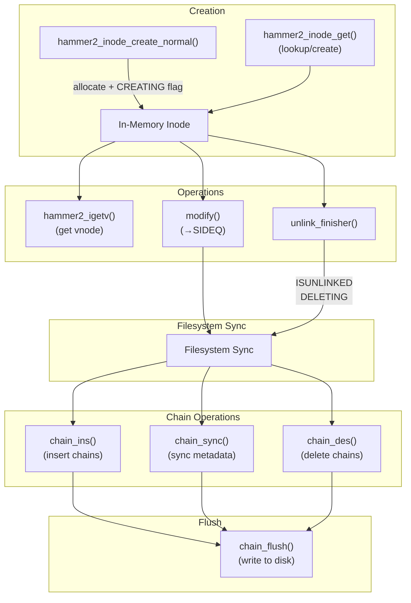

# HAMMER2 Inode Layer

!!! abstract "Source Reference"
    Primary source: `sys/vfs/hammer2/hammer2_inode.c`  
    Header definitions: `sys/vfs/hammer2/hammer2.h` (lines 673-767)

## Overview

The inode layer provides the high-level file and directory abstraction built on top of the [chain layer](chain-layer.md). It manages in-memory inode structures (`hammer2_inode_t`), their association with vnodes, reference counting, locking semantics, and synchronization with the underlying chain topology.

Key responsibilities:

- **Inode lifecycle management** — creation, lookup, reference counting, and destruction
- **Vnode association** — bridging between VFS vnodes and HAMMER2 inodes
- **Locking with SYNCQ semantics** — coordinating with the filesystem syncer
- **Flush dependency tracking** — ensuring related inodes are flushed together
- **Metadata synchronization** — propagating in-memory changes to on-disk chains

## Core Data Structures

### hammer2_inode_t

The main in-memory inode structure (`hammer2.h:690-710`):

```c
struct hammer2_inode {
    struct hammer2_inode *next;         /* hash chain linkage */
    TAILQ_ENTRY(hammer2_inode) entry;   /* SYNCQ/SIDEQ queue entry */
    hammer2_depend_t    *depend;        /* flush dependency (non-NULL if SIDEQ) */
    hammer2_depend_t    depend_static;  /* in-place allocation for depend */
    hammer2_mtx_t       lock;           /* inode lock */
    hammer2_mtx_t       truncate_lock;  /* prevent truncates during I/O */
    struct hammer2_pfs  *pmp;           /* PFS mount point */
    struct vnode        *vp;            /* associated vnode (may be NULL) */
    hammer2_spin_t      cluster_spin;   /* protects cluster updates */
    hammer2_cluster_t   cluster;        /* embedded cluster of chains */
    hammer2_cluster_item_t ccache[HAMMER2_MAXCLUSTER]; /* cached data chains */
    int                 ccache_nchains; /* number of cached chains */
    struct lockf        advlock;        /* advisory lock state */
    u_int               flags;          /* state flags */
    u_int               refs;           /* reference count */
    int                 ihash;          /* XOP worker distribution hash */
    uint8_t             comp_heuristic; /* compression heuristic */
    hammer2_inode_meta_t meta;          /* copy of on-disk metadata */
    hammer2_off_t       osize;          /* original size (for RESIZED) */
};
```

Key fields:

| Field | Purpose |
|-------|---------|
| `next` | Hash chain linkage for inode number lookup |
| `entry` | Queue entry for SYNCQ (sync in progress) or SIDEQ (dirty, needs sync) |
| `depend` | Flush dependency group pointer |
| `lock` | Primary inode lock (shared/exclusive) |
| `truncate_lock` | Prevents truncates during read/write operations |
| `pmp` | Back-pointer to the PFS mount structure |
| `vp` | Associated vnode (NULL if no vnode attached) |
| `cluster` | Embedded cluster linking to underlying chains |
| `flags` | State flags (see below) |
| `refs` | Reference count (includes vnode ref, flush refs) |
| `meta` | In-memory copy of on-disk inode metadata |

### Inode Flags

Defined in `hammer2.h:747-767`:

| Flag | Value | Description |
|------|-------|-------------|
| `HAMMER2_INODE_MODIFIED` | 0x0001 | Inode metadata has been modified |
| `HAMMER2_INODE_ONHASH` | 0x0008 | Inode is in the inum hash table |
| `HAMMER2_INODE_RESIZED` | 0x0010 | File size changed, requires chain sync |
| `HAMMER2_INODE_ISUNLINKED` | 0x0040 | Inode has been unlinked (nlinks → 0) |
| `HAMMER2_INODE_SIDEQ` | 0x0100 | On side processing queue (dirty, awaiting sync) |
| `HAMMER2_INODE_NOSIDEQ` | 0x0200 | Disable SIDEQ operations |
| `HAMMER2_INODE_DIRTYDATA` | 0x0400 | Has dirty data, interlocks flush |
| `HAMMER2_INODE_SYNCQ` | 0x0800 | Currently being synced (on sync queue) |
| `HAMMER2_INODE_DELETING` | 0x1000 | Marked for deletion during sync |
| `HAMMER2_INODE_CREATING` | 0x2000 | Chains not yet inserted into media topology |
| `HAMMER2_INODE_SYNCQ_WAKEUP` | 0x4000 | Wakeup requested when SYNCQ clears |
| `HAMMER2_INODE_SYNCQ_PASS2` | 0x8000 | Force retry delay during sync |

The `HAMMER2_INODE_DIRTY` macro combines flags indicating the inode needs flushing:
```c
#define HAMMER2_INODE_DIRTY  (HAMMER2_INODE_MODIFIED | \
                              HAMMER2_INODE_DIRTYDATA | \
                              HAMMER2_INODE_DELETING | \
                              HAMMER2_INODE_CREATING)
```

### hammer2_depend_t

Flush dependency structure (`hammer2.h:673-679`):

```c
struct hammer2_depend {
    TAILQ_ENTRY(hammer2_depend) entry;  /* pmp->depq linkage */
    struct inoq_head    sideq;          /* list of dependent inodes */
    long                count;          /* number of inodes in group */
    int                 pass2;          /* requires second pass */
    int                 unused01;
};
```

Dependencies group related inodes (e.g., directory and its entries) to ensure they are flushed together, maintaining filesystem consistency.

## Inode Hash Table

Inodes are indexed by inode number in a per-PFS hash table for fast lookup.

### Initialization

```c
void hammer2_inum_hash_init(hammer2_pfs_t *pmp);
```

Source: `hammer2_inode.c:50-60`

Initializes the inode hash table spinlocks for a PFS. Called during PFS mount.

### Lookup

```c
hammer2_inode_t *hammer2_inode_lookup(hammer2_pfs_t *pmp, hammer2_tid_t inum);
```

Source: `hammer2_inode.c:548-569`

Looks up an inode by inode number. Returns a referenced inode or NULL if not found in memory. The hash function uses the low bits of the inode number:

```c
static __inline hammer2_inum_hash_t *
inumhash(hammer2_pfs_t *pmp, hammer2_tid_t inum)
{
    int hv = (int)inum;
    return (&pmp->inumhash[hv & HAMMER2_INUMHASH_MASK]);
}
```

## Reference Counting

### Adding References

```c
void hammer2_inode_ref(hammer2_inode_t *ip);
```

Source: `hammer2_inode.c:577-585`

Atomically increments the reference count. The inode must already have at least one reference. Can be called with spinlocks held.

### Dropping References

```c
void hammer2_inode_drop(hammer2_inode_t *ip);
```

Source: `hammer2_inode.c:591-656`

Decrements the reference count. When the count reaches zero:

1. Acquires the hash bucket spinlock
2. Removes the inode from the hash table (if `ONHASH` flag set)
3. Cleans out the embedded cluster via `hammer2_inode_repoint(ip, NULL)`
4. Frees the inode structure

The transition to zero is protected by `atomic_cmpset_int()` to handle races.

## Locking

HAMMER2 provides shared and exclusive locks on inodes with special SYNCQ semantics.

### Basic Locking

```c
void hammer2_inode_lock(hammer2_inode_t *ip, int how);
void hammer2_inode_unlock(hammer2_inode_t *ip);
```

Source: `hammer2_inode.c:226-375`

The `how` parameter accepts flags:

| Flag | Effect |
|------|--------|
| `HAMMER2_RESOLVE_SHARED` | Acquire shared lock (no SYNCQ wait) |
| `HAMMER2_RESOLVE_ALWAYS` | Ensure inode metadata is resolved |
| `HAMMER2_RESOLVE_NEVER` | Don't require metadata resolution |

**SYNCQ Semantics**: When acquiring an exclusive lock, if the inode is on the SYNCQ (being synced), the caller must wait for the sync to complete. This prevents metadata dependencies from being split across flushes. To reduce stall time, the inode is moved to the head of the syncq before blocking:

```c
while ((ip->flags & HAMMER2_INODE_SYNCQ) && pmp) {
    /* Move to head of syncq and sleep */
    TAILQ_REMOVE(&pmp->syncq, ip, entry);
    TAILQ_INSERT_HEAD(&pmp->syncq, ip, entry);
    hammer2_mtx_unlock(&ip->lock);
    tsleep(&ip->flags, PINTERLOCKED, "h2sync", 0);
    hammer2_mtx_ex(&ip->lock);
}
```

### Multi-Inode Locking

```c
void hammer2_inode_lock4(hammer2_inode_t *ip1, hammer2_inode_t *ip2,
                         hammer2_inode_t *ip3, hammer2_inode_t *ip4);
```

Source: `hammer2_inode.c:281-358`

Exclusively locks up to four inodes simultaneously, establishing a flush dependency between them. Used for operations like rename that span multiple inodes. The function:

1. References and locks all inodes in order
2. Establishes flush dependencies via `hammer2_inode_setdepend_locked()`
3. If any inode is on SYNCQ, unlocks all and retries after sleeping

### Lock Upgrade/Downgrade

```c
int hammer2_inode_lock_upgrade(hammer2_inode_t *ip);
void hammer2_inode_lock_downgrade(hammer2_inode_t *ip, int wasexclusive);
```

Source: `hammer2_inode.c:508-533`

Upgrades a shared lock to exclusive, or downgrades back. The `wasexclusive` return value tracks whether the lock was already exclusive.

### Temporary Release/Restore

```c
hammer2_mtx_state_t hammer2_inode_lock_temp_release(hammer2_inode_t *ip);
void hammer2_inode_lock_temp_restore(hammer2_inode_t *ip, hammer2_mtx_state_t ostate);
```

Source: `hammer2_inode.c:487-497`

Temporarily releases a lock (to avoid deadlocks) and restores it later. Used by `hammer2_igetv()` when calling into the vnode layer.

## Vnode Association

### Getting a Vnode for an Inode

```c
struct vnode *hammer2_igetv(hammer2_inode_t *ip, int *errorp);
```

Source: `hammer2_inode.c:669-816`

Returns an exclusively locked vnode for the given inode, allocating one if necessary. The caller must hold the inode locked.

**Algorithm**:

1. If `ip->vp` is non-NULL, attempt to reuse the existing vnode via `vget()`
2. If vget fails (lost reclaim race), retry
3. If no vnode exists, allocate via `getnewvnode()`
4. Set vnode type based on `ip->meta.type`:
   - `HAMMER2_OBJTYPE_DIRECTORY` → `VDIR`
   - `HAMMER2_OBJTYPE_REGFILE` → `VREG` (with buffer cache)
   - `HAMMER2_OBJTYPE_SOFTLINK` → `VLNK`
   - `HAMMER2_OBJTYPE_CDEV/BDEV` → `VCHR/VBLK`
   - `HAMMER2_OBJTYPE_FIFO` → `VFIFO`
   - `HAMMER2_OBJTYPE_SOCKET` → `VSOCK`
5. Link vnode and inode: `vp->v_data = ip; ip->vp = vp;`
6. Add reference for vnode association

**Deadlock Avoidance**: The inode lock must be temporarily released during `vget()` to avoid deadlocking against vnode reclaim:

```c
vhold(vp);
ostate = hammer2_inode_lock_temp_release(ip);
if (vget(vp, LK_EXCLUSIVE)) { /* retry */ }
hammer2_inode_lock_temp_restore(ip, ostate);
vdrop(vp);
```

## Inode Creation

### Creating Normal Inodes

```c
hammer2_inode_t *
hammer2_inode_create_normal(hammer2_inode_t *pip, struct vattr *vap,
                            struct ucred *cred, hammer2_key_t inum,
                            int *errorp);
```

Source: `hammer2_inode.c:1121-1263`

Creates a new inode (file, directory, symlink, device, etc.) as a child of the parent inode `pip`. The function:

1. Allocates an in-memory inode via `hammer2_inode_get()`
2. Sets `HAMMER2_INODE_CREATING` flag (chains not yet in media topology)
3. Initializes metadata from `vattr` and parent attributes
4. Inherits compression/checksum algorithms from parent
5. Creates detached media chains via `hammer2_inode_create_det_desc` XOP
6. Associates chains with inode via `hammer2_inode_repoint()`

**Note**: The chains are created detached (not inserted into the on-disk tree). They will be inserted during the next filesystem sync when `hammer2_inode_chain_ins()` is called.

### Creating PFS Inodes

```c
hammer2_inode_t *
hammer2_inode_create_pfs(hammer2_pfs_t *spmp, const char *name,
                         size_t name_len, int *errorp);
```

Source: `hammer2_inode.c:988-1112`

Creates a PFS (Pseudo File System) root inode under the superroot. Unlike normal inodes, PFS inodes are inserted immediately (requires flush transaction).

### Creating Directory Entries

```c
int hammer2_dirent_create(hammer2_inode_t *dip, const char *name,
                          size_t name_len, hammer2_key_t inum,
                          uint8_t type);
```

Source: `hammer2_inode.c:1273-1352`

Creates a directory entry linking a name to an inode number. Handles hash collisions by scanning for an unused key in the collision space:

```c
lhc = hammer2_dirhash(name, name_len);
/* Scan for unused key if collision */
while (hammer2_xop_collect(&sxop->head, 0) == 0) {
    if (lhc != sxop->head.cluster.focus->bref.key)
        break;
    ++lhc;  /* Try next slot */
}
```

## Inode Lookup and Caching

### hammer2_inode_get

```c
hammer2_inode_t *
hammer2_inode_get(hammer2_pfs_t *pmp, hammer2_xop_head_t *xop,
                  hammer2_tid_t inum, int idx);
```

Source: `hammer2_inode.c:845-979`

Gets or creates an inode structure. If `xop` is provided, synchronizes the inode's cluster with the XOP's cluster. The function:

1. Looks up existing inode via `hammer2_inode_lookup()`
2. If found, repoints cluster chains and returns
3. If not found, allocates new `hammer2_inode_t`
4. Initializes cluster, metadata, locks
5. Attempts to insert into hash table (handles races)

## Cluster Repointing

### Full Cluster Repoint

```c
void hammer2_inode_repoint(hammer2_inode_t *ip, hammer2_cluster_t *cluster);
```

Source: `hammer2_inode.c:1364-1463`

Replaces all chains in the inode's embedded cluster with chains from the provided cluster. Also clears any cached data chains. Pass `NULL` to clean out all chains.

### Single Chain Repoint

```c
void hammer2_inode_repoint_one(hammer2_inode_t *ip, hammer2_cluster_t *cluster,
                               int idx);
```

Source: `hammer2_inode.c:1470-1529`

Repoints a single chain element. Used by synchronization threads for piecemeal updates.

## Modification and Synchronization

### Marking Inodes Modified

```c
void hammer2_inode_modify(hammer2_inode_t *ip);
```

Source: `hammer2_inode.c:1674-1682`

Marks an inode as modified:

1. Sets `HAMMER2_INODE_MODIFIED` flag
2. Marks associated vnode dirty via `vsetisdirty()`
3. Adds inode to SIDEQ via `hammer2_inode_delayed_sideq()` (unless NOSIDEQ)

Can be called with shared or exclusive lock.

### Syncing to Chains

```c
int hammer2_inode_chain_sync(hammer2_inode_t *ip);
```

Source: `hammer2_inode.c:1694-1736`

Synchronizes the inode's frontend state with the chain state. Called before explicit flush or strategy write. Uses the `hammer2_inode_chain_sync_desc` XOP to propagate metadata changes.

Handles `RESIZED` flag specially — if file grew past embedded bytes, clears `DIRECTDATA` flag.

### Inserting Chains

```c
int hammer2_inode_chain_ins(hammer2_inode_t *ip);
```

Source: `hammer2_inode.c:1742-1767`

Inserts the inode's chains into the on-media tree. Called during sync for inodes with `INODE_CREATING` flag. Clears the flag upon success.

### Deleting Chains

```c
int hammer2_inode_chain_des(hammer2_inode_t *ip);
```

Source: `hammer2_inode.c:1781-1806`

Removes the inode's chains from the media topology. Called during sync for inodes with `INODE_DELETING` flag. Clears both `DELETING` and `ISUNLINKED` flags.

### Flushing to Media

```c
int hammer2_inode_chain_flush(hammer2_inode_t *ip, int flags);
```

Source: `hammer2_inode.c:1816-1831`

Flushes the inode's chain and sub-topology to media. Clears `DIRTYDATA` flag before flush. Uses `hammer2_inode_flush_desc` XOP.

## Unlink Handling

### Finishing Unlink

```c
int hammer2_inode_unlink_finisher(hammer2_inode_t *ip, struct vnode **vprecyclep);
```

Source: `hammer2_inode.c:1567-1631`

Called after `xop_unlink` to decrement nlinks and handle final deletion:

1. If `nlinks > 1`, just decrement and update ctime
2. If `nlinks <= 1`:
   - Sets `ISUNLINKED` flag
   - If no vnode, sets `DELETING` and adds to SIDEQ
   - If vnode exists, defers vnode recycling to VOP completion
3. Updates metadata via `hammer2_inode_modify()`

### Vnode Recycling

```c
void hammer2_inode_vprecycle(struct vnode *vp);
```

Source: `hammer2_inode.c:1641-1652`

Aggressively recycles a vnode after file deletion. Called at the end of VOPs that remove files. Without this, deleted files can linger with nlinks==0 until random system activity reclaims the vnode.

## Flush Dependency Management

### SIDEQ and SYNCQ

Inodes that need flushing are managed through two queues:

- **SIDEQ** (Side Queue): Dirty inodes awaiting the next sync. Inodes without an attached vnode go here to ensure they're not missed by the vnode-based syncer.
- **SYNCQ** (Sync Queue): Inodes currently being synced. During sync, inodes are moved from SIDEQ to SYNCQ.

### Dependency Groups

Related inodes are grouped via `hammer2_depend_t` structures to ensure atomic flushing:

```c
void hammer2_inode_depend(hammer2_inode_t *ip1, hammer2_inode_t *ip2);
```

Source: `hammer2_inode.c:389-400`

Merges two inodes into a single dependency group. Used to ensure directory entries and their target inodes are flushed together.

### Adding to SIDEQ

```c
void hammer2_inode_delayed_sideq(hammer2_inode_t *ip);
```

Source: `hammer2_inode.c:176-189`

Adds a dirty inode to the SIDEQ. Called from `hammer2_inode_modify()` and other places that dirty an inode.

## Statistics

```c
hammer2_key_t hammer2_inode_data_count(const hammer2_inode_t *ip);
hammer2_key_t hammer2_inode_inode_count(const hammer2_inode_t *ip);
```

Source: `hammer2_inode.c:1531-1561`

Returns the maximum data/inode count across all chains in the inode's cluster. Used for filesystem statistics.

## Chain Access

```c
hammer2_chain_t *hammer2_inode_chain(hammer2_inode_t *ip, int clindex, int how);
```

Source: `hammer2_inode.c:407-427`

Selects and locks a chain from the inode's cluster. The inode doesn't need to be locked. Returns a referenced and locked chain.

```c
hammer2_chain_t *
hammer2_inode_chain_and_parent(hammer2_inode_t *ip, int clindex,
                               hammer2_chain_t **parentp, int how);
```

Source: `hammer2_inode.c:429-478`

Returns both a chain and its parent, properly locked. Handles lock ordering (parent before chain) and retries if the topology changes during locking.

## Lifecycle Summary



## See Also

- [HAMMER2 Overview](index.md) — Filesystem architecture
- [Chain Layer](chain-layer.md) — Underlying block management
- [VFS Integration](vfs-integration.md) — VFS operations implementation
- [XOP System](xop-system.md) — Cross-cluster operations
- [Flush and Sync](flush-sync.md) — Synchronization mechanisms
