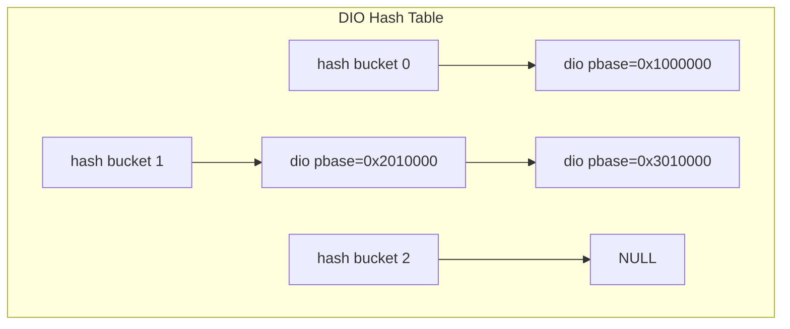
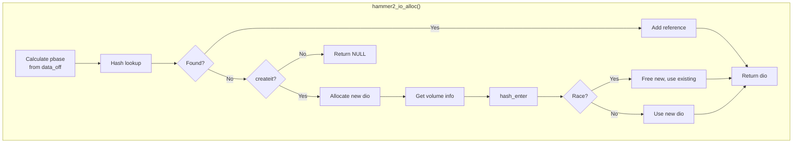
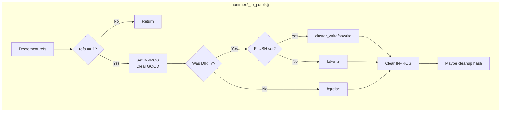
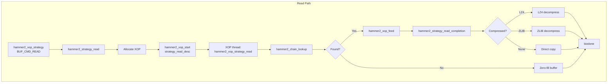
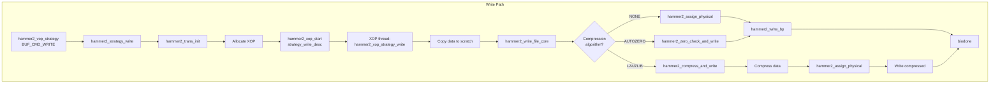
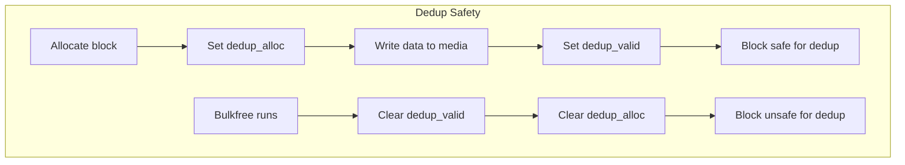
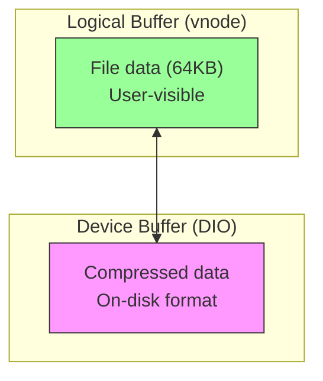

# HAMMER2 I/O Subsystem

This document describes HAMMER2's I/O subsystem, which provides buffer management
through the DIO (Device I/O) layer and implements read/write strategies for
file data.

## Overview

The I/O subsystem consists of two major components:

1. **DIO Layer** (`hammer2_io.c`) — An abstraction layer over the kernel buffer
   cache that allows larger physical buffers (64KB) to back smaller chain
   allocations without causing deadlocks.

2. **Strategy Layer** (`hammer2_strategy.c`) — Implements VFS read/write
   operations including compression, decompression, zero-block optimization,
   and live deduplication.

Key characteristics:

- **Double-buffering** — Logical buffers (file data) are separate from device
  buffers (DIO), allowing decompression and data transformation
- **64KB physical buffers** — All DIOs use `HAMMER2_PBUFSIZE` (64KB) granularity
- **Dedup tracking** — DIOs track which regions are valid for deduplication
- **Asynchronous I/O** — Strategy operations run via XOPs for parallelism

## DIO Layer

The DIO (Device I/O) layer provides an abstraction over kernel buffer cache
buffers, enabling multiple chains to share a single physical buffer.

### DIO Structure

```c
struct hammer2_io {
    struct hammer2_io  *next;       /* Hash chain linkage */
    struct hammer2_dev *hmp;        /* Associated HAMMER2 device */
    struct vnode       *devvp;      /* Device vnode */
    struct buf         *bp;         /* Kernel buffer cache buffer */
    off_t              dbase;       /* Device offset within volumes */
    off_t              pbase;       /* Physical base offset */
    uint64_t           refs;        /* Reference count + flags */
    int                psize;       /* Physical buffer size (64KB) */
    int                act;         /* Activity counter (LRU) */
    int                btype;       /* Approximate BREF_TYPE_* */
    int                ticks;       /* Last access timestamp */
    int                error;       /* I/O error code */
    uint64_t           dedup_valid; /* Valid regions for dedup */
    uint64_t           dedup_alloc; /* Allocated/dedupable regions */
};
```

Source: `hammer2.h:269-295`

### DIO Reference Flags

The `refs` field combines a reference count with state flags:

| Flag | Value | Description |
|------|-------|-------------|
| `HAMMER2_DIO_INPROG` | `0x80...` | Buffer I/O in progress |
| `HAMMER2_DIO_GOOD` | `0x40...` | Buffer is valid and stable |
| `HAMMER2_DIO_WAITING` | `0x20...` | Thread waiting for INPROG |
| `HAMMER2_DIO_DIRTY` | `0x10...` | Buffer needs flush on drop |
| `HAMMER2_DIO_FLUSH` | `0x08...` | Immediate flush requested |
| `HAMMER2_DIO_MASK` | `0x00FF...` | Reference count mask |

Source: `hammer2.h:306-312`

### DIO Hash Table

DIOs are cached in a hash table indexed by physical block address:



```c
void hammer2_io_hash_init(hammer2_dev_t *hmp)
{
    for (i = 0; i < HAMMER2_IOHASH_SIZE; ++i) {
        hash = &hmp->iohash[i];
        hammer2_spin_init(&hash->spin, "h2iohash");
    }
}
```

Source: `hammer2_io.c:59-69`

### DIO Operations

The DIO layer provides these primary operations:

| Function | Description |
|----------|-------------|
| `hammer2_io_getblk()` | Get/create a DIO, perform I/O if needed |
| `hammer2_io_putblk()` | Release DIO reference, flush if dirty |
| `hammer2_io_bread()` | Read data into a DIO |
| `hammer2_io_new()` | Create DIO for new zeroed block |
| `hammer2_io_newnz()` | Create DIO for new block (no zero) |
| `hammer2_io_bwrite()` | Synchronous write |
| `hammer2_io_bawrite()` | Asynchronous write |
| `hammer2_io_bdwrite()` | Delayed write |
| `hammer2_io_data()` | Get data pointer within DIO |

### DIO Allocation Flow



Source: `hammer2_io.c:98-170`

### Getting a Block

`hammer2_io_getblk()` is the core function for obtaining a DIO:

```c
hammer2_io_t *
hammer2_io_getblk(hammer2_dev_t *hmp, int btype, off_t lbase,
                  int lsize, int op)
{
    /* Allocate or lookup DIO */
    dio = hammer2_io_alloc(hmp, lbase, btype, 1, &isgood);
    
    for (;;) {
        orefs = dio->refs;
        
        /* If GOOD, buffer is ready */
        if (orefs & HAMMER2_DIO_GOOD) {
            switch(op) {
            case HAMMER2_DOP_NEW:
                bzero(hammer2_io_data(dio, lbase), lsize);
                /* fall through */
            case HAMMER2_DOP_NEWNZ:
                atomic_set_long(&dio->refs, HAMMER2_DIO_DIRTY);
                break;
            }
            return dio;
        }
        
        /* Try to acquire INPROG to perform I/O */
        if (orefs & HAMMER2_DIO_INPROG) {
            /* Wait for other thread */
            tsleep(dio, ...);
        } else {
            /* We do the I/O */
            nrefs = orefs | HAMMER2_DIO_INPROG;
            if (atomic_cmpset_64(&dio->refs, orefs, nrefs))
                break;
        }
    }
    
    /* Perform actual I/O */
    error = breadnx(dio->devvp, dev_pbase, dio->psize, ...);
    
    /* Clear INPROG, set GOOD */
    nrefs |= HAMMER2_DIO_GOOD;
    atomic_cmpset_64(&dio->refs, orefs, nrefs);
    
    return dio;
}
```

Source: `hammer2_io.c:176-379`

### Releasing a Block

On the last reference drop (1→0 transition), the buffer is handled:



Source: `hammer2_io.c:387-549`

### DIO Cleanup

Free DIOs are cached for reuse. When too many accumulate, cleanup runs:

```c
void hammer2_io_hash_cleanup(hammer2_dev_t *hmp, int dio_limit)
{
    /* Scan hash buckets */
    for (i = 0; i < HAMMER2_IOHASH_SIZE; ++i) {
        for each dio in bucket {
            /* Skip if referenced or I/O in progress */
            if (dio->refs & (HAMMER2_DIO_MASK | HAMMER2_DIO_INPROG))
                continue;
            
            /* Decay activity counter */
            if (dio->act > 0)
                dio->act -= (ticks - dio->ticks) / hz - 1;
            
            /* Free if inactive */
            if (dio->act == 0) {
                remove from hash;
                kfree(dio);
            }
        }
    }
}
```

Source: `hammer2_io.c:861-931`

## Strategy Layer

The strategy layer implements VFS read/write operations for file data.

### Strategy Entry Point

```c
int hammer2_vop_strategy(struct vop_strategy_args *ap)
{
    switch(bp->b_cmd) {
    case BUF_CMD_READ:
        return hammer2_strategy_read(ap);
    case BUF_CMD_WRITE:
        return hammer2_strategy_write(ap);
    }
}
```

Source: `hammer2_strategy.c:89-113`

### Read Strategy

Reads are handled asynchronously via XOPs:



Source: `hammer2_strategy.c:276-502`

### Read Completion

The completion handler processes the data based on compression:

```c
void hammer2_strategy_read_completion(hammer2_chain_t *focus,
                                      const char *data, struct bio *bio)
{
    switch (HAMMER2_DEC_COMP(focus->bref.methods)) {
    case HAMMER2_COMP_LZ4:
        hammer2_decompress_LZ4_callback(data, focus->bytes, bio);
        break;
    case HAMMER2_COMP_ZLIB:
        hammer2_decompress_ZLIB_callback(data, focus->bytes, bio);
        break;
    case HAMMER2_COMP_NONE:
        bcopy(data, bp->b_data, focus->bytes);
        break;
    }
}
```

Source: `hammer2_strategy.c:441-502`

### Write Strategy

Writes are more complex, handling compression and deduplication:



Source: `hammer2_strategy.c:536-686`

### Physical Storage Assignment

`hammer2_assign_physical()` allocates or reuses storage for data:

```c
hammer2_chain_t *
hammer2_assign_physical(hammer2_inode_t *ip, hammer2_chain_t **parentp,
                        hammer2_key_t lbase, int pblksize,
                        hammer2_tid_t mtid, char **datap, int *errorp)
{
    /* Lookup existing chain */
    chain = hammer2_chain_lookup(parentp, &key_dummy,
                                 lbase, lbase, errorp,
                                 HAMMER2_LOOKUP_NODATA);
    
    if (chain == NULL) {
        /* New allocation, check for dedup */
        dedup_off = hammer2_dedup_lookup(hmp, datap, pblksize);
        hammer2_chain_create(parentp, &chain, ..., dedup_off, ...);
    } else {
        /* Existing block, resize if needed */
        dedup_off = hammer2_dedup_lookup(hmp, datap, pblksize);
        if (chain->bytes != pblksize)
            hammer2_chain_resize(chain, mtid, dedup_off, pradix, ...);
        hammer2_chain_modify(chain, mtid, dedup_off, ...);
    }
    
    return chain;
}
```

Source: `hammer2_strategy.c:715-814`

### Zero-Block Optimization

Blocks containing all zeros are converted to holes:

```c
void zero_write(char *data, hammer2_inode_t *ip,
                hammer2_chain_t **parentp,
                hammer2_key_t lbase, hammer2_tid_t mtid, int *errorp)
{
    chain = hammer2_chain_lookup(parentp, &key_dummy,
                                 lbase, lbase, errorp, ...);
    if (chain) {
        if (chain->bref.type == HAMMER2_BREF_TYPE_INODE) {
            /* Zero embedded data */
            bzero(wipdata->u.data, HAMMER2_EMBEDDED_BYTES);
        } else {
            /* Delete the data chain (creates hole) */
            hammer2_chain_delete(*parentp, chain, mtid,
                                 HAMMER2_DELETE_PERMANENT);
        }
    }
}
```

Source: `hammer2_strategy.c:1269-1309`

## Compression

The strategy layer supports two compression algorithms.

### LZ4 Compression

LZ4 is the default compression algorithm, optimized for speed:

```c
/* Compression */
comp_buffer = objcache_get(cache_buffer_write, M_INTWAIT);
comp_size = LZ4_compress_limitedOutput(
    data,
    &comp_buffer[sizeof(int)],  /* Leave room for size prefix */
    pblksize,
    pblksize / 2 - sizeof(int64_t));  /* Target 50% compression */
*(int *)comp_buffer = comp_size;  /* Store compressed size */
```

```c
/* Decompression */
compressed_size = *(const int *)data;
result = LZ4_decompress_safe(&data[sizeof(int)],
                             compressed_buffer,
                             compressed_size,
                             bp->b_bufsize);
bcopy(compressed_buffer, bp->b_data, bp->b_bufsize);
```

Source: `hammer2_strategy.c:180-220`, `956-977`

### ZLIB Compression

ZLIB provides better compression ratios at higher CPU cost:

```c
/* Compression */
ret = deflateInit(&strm_compress, comp_level);
strm_compress.next_in = data;
strm_compress.avail_in = pblksize;
strm_compress.next_out = comp_buffer;
strm_compress.avail_out = pblksize / 2;
ret = deflate(&strm_compress, Z_FINISH);
```

```c
/* Decompression */
ret = inflateInit(&strm_decompress);
strm_decompress.next_in = data;
strm_decompress.next_out = compressed_buffer;
ret = inflate(&strm_decompress, Z_FINISH);
```

Source: `hammer2_strategy.c:227-271`, `978-1007`

### Compression Heuristic

A per-inode heuristic avoids wasting CPU on incompressible data:

```c
/* Skip compression if recent attempts failed */
if (ip->comp_heuristic < 8 || (ip->comp_heuristic & 7) == 0 ||
    hammer2_always_compress) {
    /* Try compression */
}

if (comp_size == 0) {
    /* Compression failed, increment heuristic */
    if (++ip->comp_heuristic > 128)
        ip->comp_heuristic = 8;
} else {
    /* Compression succeeded, reset heuristic */
    ip->comp_heuristic = 0;
}
```

Source: `hammer2_strategy.c:949-1021`

### Compressed Block Sizes

Compressed data is stored in power-of-2 blocks:

```c
if (comp_size <= 1024)
    comp_block_size = 1024;
else if (comp_size <= 2048)
    comp_block_size = 2048;
else if (comp_size <= 4096)
    comp_block_size = 4096;
/* ... up to 32KB */
```

Source: `hammer2_strategy.c:1027-1044`

## Live Deduplication

HAMMER2 performs live (inline) deduplication during writes.

### Dedup Heuristic Table

A hash table records recently written blocks:

```c
typedef struct hammer2_dedup {
    hammer2_off_t   data_off;   /* Media offset of data */
    uint64_t        data_crc;   /* CRC/hash of data */
    uint32_t        ticks;      /* Last access time */
} hammer2_dedup_t;

/* Table in hammer2_dev_t */
hammer2_dedup_t heur_dedup[HAMMER2_DEDUP_HEUR_SIZE];
```

### Recording Dedup Candidates

After writing data, it's recorded for potential future dedup:

```c
void hammer2_dedup_record(hammer2_chain_t *chain, hammer2_io_t *dio,
                          const char *data)
{
    /* Compute hash of data */
    crc = XXH64(data, chain->bytes, XXH_HAMMER2_SEED);
    
    /* Find slot in hash table (4-way set associative) */
    dedup = &hmp->heur_dedup[crc & (HAMMER2_DEDUP_HEUR_MASK & ~3)];
    for (i = 0; i < 4; ++i) {
        if (dedup[i].data_crc == crc) {
            best = i;
            break;
        }
        /* LRU replacement */
    }
    
    /* Record the block */
    dedup[best].data_off = chain->bref.data_off;
    dedup[best].data_crc = crc;
    dedup[best].ticks = ticks;
    
    /* Mark DIO as valid for dedup */
    mask = hammer2_dedup_mask(dio, chain->bref.data_off, chain->bytes);
    atomic_set_64(&dio->dedup_valid, mask);
}
```

Source: `hammer2_strategy.c:1416-1538`

### Dedup Lookup

Before allocating new storage, check for existing copy:

```c
hammer2_off_t
hammer2_dedup_lookup(hammer2_dev_t *hmp, char **datap, int pblksize)
{
    data = *datap;
    crc = XXH64(data, pblksize, XXH_HAMMER2_SEED);
    dedup = &hmp->heur_dedup[crc & (HAMMER2_DEDUP_HEUR_MASK & ~3)];
    
    for (i = 0; i < 4; ++i) {
        off = dedup[i].data_off;
        if (dedup[i].data_crc != crc)
            continue;
        
        /* Verify with actual data comparison */
        dio = hammer2_io_getquick(hmp, off, pblksize);
        if (dio) {
            dtmp = hammer2_io_data(dio, off);
            mask = hammer2_dedup_mask(dio, off, pblksize);
            
            /* Check both alloc and valid masks */
            if ((dio->dedup_alloc & mask) == mask &&
                (dio->dedup_valid & mask) == mask &&
                bcmp(data, dtmp, pblksize) == 0) {
                /* Dedup success! */
                *datap = NULL;  /* Signal dedup occurred */
                return off;
            }
            hammer2_io_putblk(&dio);
        }
    }
    return 0;  /* No dedup match */
}
```

Source: `hammer2_strategy.c:1540-1603`

### Dedup Validation

Two bitmasks in the DIO ensure safe deduplication:

```c
uint64_t dedup_alloc;   /* Bits set when block allocated */
uint64_t dedup_valid;   /* Bits set when data written */
```

Both must be set for a region before dedup can occur:

1. **dedup_alloc** — Set during `hammer2_freemap_alloc()` when storage is allocated
2. **dedup_valid** — Set after `hammer2_dedup_record()` confirms data is on media

This two-phase approach prevents races with bulkfree:



### Dedup Mask Calculation

```c
static __inline uint64_t
hammer2_dedup_mask(hammer2_io_t *dio, hammer2_off_t data_off, u_int bytes)
{
    int off = (data_off - dio->pbase) >> HAMMER2_FREEMAP_BLOCK_RADIX;
    int bits = bytes >> HAMMER2_FREEMAP_BLOCK_RADIX;
    return (((uint64_t)1 << bits) - 1) << off;
}
```

Source: `hammer2.h:1295-1300`

## Buffer Cache Integration

### Double-Buffering

HAMMER2 uses double-buffering to separate logical file buffers from
device buffers:



Benefits:
- Compression/decompression can transform data
- Smaller compressed blocks save disk space
- Kernel can cache more user data (decompressed)

### Cluster I/O

For read-ahead and write-behind, cluster I/O is used:

```c
if (hce > 0) {  /* hammer2_cluster_read setting */
    peof = (dio->pbase + HAMMER2_SEGMASK64) & ~HAMMER2_SEGMASK64;
    error = cluster_readx(dio->devvp, peof, dev_pbase,
                          dio->psize, bflags,
                          dio->psize, HAMMER2_PBUFSIZE * hce,
                          &dio->bp);
}
```

Source: `hammer2_io.c:279-311`

### B_NOTMETA Flag

File data buffers are marked `B_NOTMETA` to hint that logical buffers
should not be cached in swapcache (prefer caching device buffers):

```c
bp->b_flags |= B_NOTMETA;
```

Source: `hammer2_strategy.c:407`, `671`

## Performance Considerations

### Avoiding Read-Before-Write

For new allocations, `hammer2_io_newnz()` creates a buffer without reading:

```c
error = hammer2_io_newnz(chain->hmp,
                         chain->bref.type,
                         chain->bref.data_off,
                         chain->bytes, &dio);
```

This avoids unnecessary disk reads when the entire block will be overwritten.

### Write-Behind Buffering

By default, dirty buffers use `bdwrite()` for delayed writeback:

```c
if (orefs & HAMMER2_DIO_DIRTY) {
    if (dio->refs & HAMMER2_DIO_FLUSH) {
        /* Immediate flush requested */
        cluster_write(bp, peof, psize, hce);
    } else {
        /* Delayed write - allows cancellation */
        bdwrite(bp);
    }
}
```

Source: `hammer2_io.c:467-501`

### Activity-Based Caching

DIOs use an activity counter for LRU caching:

```c
dio->act = 5;           /* Initial activity */
if (dio->act < 10)
    ++dio->act;         /* Increment on use */

/* Decay over time during cleanup */
dio->act -= (ticks - dio->ticks) / hz - 1;
```

Source: `hammer2_io.c:152`, `166-167`, `895-896`

## See Also

- [HAMMER2 Overview](index.md) — Filesystem architecture
- [Chain Layer](chain-layer.md) — Chain-to-DIO relationship
- [Freemap](freemap.md) — Block allocation and dedup_alloc tracking
- [Flush & Sync](flush-sync.md) — Buffer flush coordination
- [Compression](compression.md) — Compression algorithms in detail
