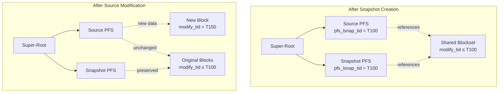
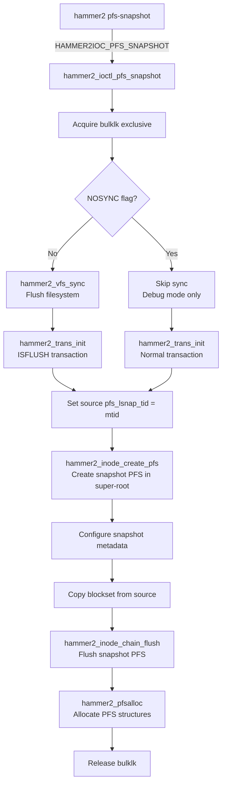
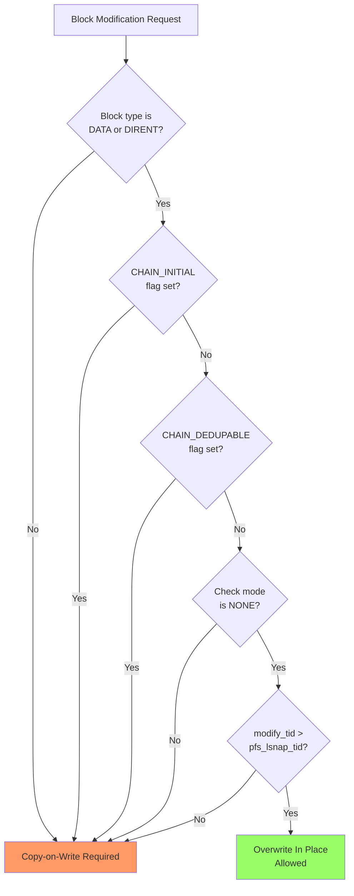
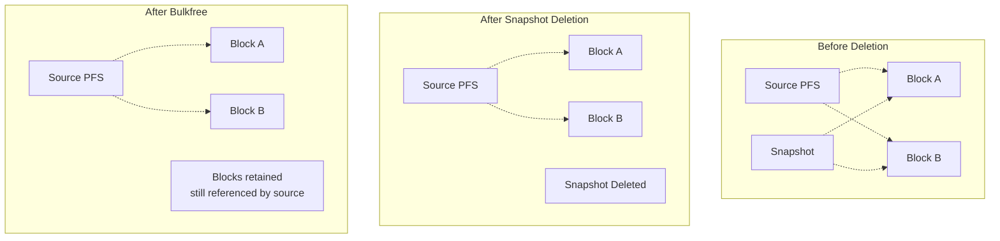

# HAMMER2 Snapshots

This document describes HAMMER2's snapshot implementation, which provides instant,
space-efficient point-in-time copies of filesystem state using copy-on-write semantics.

## Overview

HAMMER2 snapshots leverage the copy-on-write (COW) architecture to create instant
point-in-time copies of a PFS (pseudo-filesystem). Unlike traditional backup methods,
snapshots:

- Are created **instantaneously** regardless of filesystem size
- Share unchanged data blocks with the source PFS (space-efficient)
- Are **read-write** and can be mounted independently
- Are preserved through the COW mechanism until explicitly deleted

Each snapshot is a complete, self-contained PFS that appears in the super-root
alongside regular PFSes. The snapshot shares its entire block tree with the
source at creation time; subsequent modifications to either the source or
snapshot cause blocks to diverge through copy-on-write.

**Source files:**

| File | Description |
|------|-------------|
| `hammer2_ioctl.c` | Snapshot ioctl implementation |
| `hammer2_chain.c` | COW logic with snapshot preservation |
| `hammer2_disk.h` | On-disk structures (`pfs_lsnap_tid`) |
| `sbin/hammer2/cmd_snapshot.c` | Userland snapshot command |

## Snapshot Architecture

### PFS-Based Design

Snapshots are implemented as PFS inodes stored in the super-root:

```
Super-Root (SUPROOT)
├── ROOT                    (MASTER, pfs_subtype=NONE)
├── ROOT.20231215.143022    (MASTER, pfs_subtype=SNAPSHOT)
├── ROOT.20231220.091500    (MASTER, pfs_subtype=SNAPSHOT)
└── DATA                    (MASTER, pfs_subtype=NONE)
```

Each snapshot has:

- **Unique `pfs_fsid`** — Private filesystem identifier (generated at creation)
- **Unique `pfs_clid`** — Private cluster identifier (generated at creation)
- **`pfs_type = MASTER`** — Full read-write capability
- **`pfs_subtype = SNAPSHOT`** — Identifies it as a snapshot

### Transaction ID Tracking

The key field enabling snapshot preservation is `pfs_lsnap_tid` (last snapshot
transaction ID), stored in the PFS inode metadata:

```c
/* hammer2_disk.h:994 */
hammer2_tid_t   pfs_lsnap_tid;  /* 00D0 last snapshot tid */
```

This field records the transaction ID at which the most recent snapshot was taken.
It serves as a boundary marker for the copy-on-write decision logic.

### Block Sharing Model



## Snapshot Creation

### Userland Interface

Snapshots are created using the `hammer2` utility:

```bash
# Create snapshot with auto-generated name (PFS.YYYYMMDD.HHMMSS)
hammer2 pfs-snapshot /mountpoint

# Create snapshot with custom label
hammer2 pfs-snapshot /mountpoint mylabel
```

The naming convention for auto-generated snapshots is:
```
<pfs_name>.<YYYYMMDD>.<HHMMSS>
```

### Creation Flow

The snapshot creation process is handled by `hammer2_ioctl_pfs_snapshot()`:



### Key Implementation Details

**Step 1: Filesystem Synchronization** (`hammer2_ioctl.c:842-845`)

```c
if (pfs->pfs_flags & HAMMER2_PFSFLAGS_NOSYNC) {
    hammer2_trans_init(pmp, 0);
} else {
    hammer2_vfs_sync(pmp->mp, MNT_WAIT);
    hammer2_trans_init(pmp, HAMMER2_TRANS_ISFLUSH);
}
```

The filesystem is fully synchronized before snapshot creation to ensure
a consistent point-in-time image. The `NOSYNC` flag exists only for
debugging/testing purposes.

**Step 2: Record Snapshot Transaction ID** (`hammer2_ioctl.c:846-849`)

```c
mtid = hammer2_trans_sub(pmp);
hammer2_inode_lock(ip, 0);
hammer2_inode_modify(ip);
ip->meta.pfs_lsnap_tid = mtid;
```

The current transaction ID is recorded as `pfs_lsnap_tid` on the **source** PFS.
This marks the boundary for future COW decisions.

**Step 3: Create Snapshot PFS** (`hammer2_ioctl.c:874`)

```c
nip = hammer2_inode_create_pfs(hmp->spmp, pfs->name, name_len, &error);
```

A new PFS inode is created in the super-root with the specified name.

**Step 4: Configure Snapshot Metadata** (`hammer2_ioctl.c:890-911`)

```c
nip->meta.pfs_inum = starting_inum;
nip->meta.pfs_type = HAMMER2_PFSTYPE_MASTER;
nip->meta.pfs_subtype = HAMMER2_PFSSUBTYPE_SNAPSHOT;
nip->meta.op_flags |= HAMMER2_OPFLAG_PFSROOT;
nip->meta.pfs_lsnap_tid = mtid;

kern_uuidgen(&nip->meta.pfs_fsid, 1);
kern_uuidgen(&nip->meta.pfs_clid, 1);
```

The snapshot receives:

- Its own starting inode number range
- Type `MASTER` with subtype `SNAPSHOT`
- The same `pfs_lsnap_tid` as the source
- New unique UUIDs for `pfs_fsid` and `pfs_clid`

**Step 5: Copy Blockset** (`hammer2_ioctl.c:917-919`)

```c
wipdata->meta = nip->meta;
hammer2_spin_ex(&pmp->blockset_spin);
wipdata->u.blockset = pmp->pfs_iroot_blocksets[0];
hammer2_spin_unex(&pmp->blockset_spin);
```

The blockset (array of block references to the PFS root's children) is copied
from the source to the snapshot. This is the key operation that makes the
snapshot share all blocks with the source.

## Copy-on-Write Preservation

### The COW Decision

When modifying a block, HAMMER2 must decide whether to:

1. **Overwrite in place** — Reuse the existing block location
2. **Copy-on-write** — Allocate a new block, leaving the original intact

The decision is made in `hammer2_chain_modify()` based on `pfs_lsnap_tid`:

```c
/* hammer2_chain.c:1504-1538 */
if ((chain->bref.type == HAMMER2_BREF_TYPE_DATA ||
     chain->bref.type == HAMMER2_BREF_TYPE_DIRENT) &&
    (chain->flags & HAMMER2_CHAIN_INITIAL) == 0 &&
    (chain->flags & HAMMER2_CHAIN_DEDUPABLE) == 0 &&
    HAMMER2_DEC_CHECK(chain->bref.methods) == HAMMER2_CHECK_NONE &&
    chain->pmp &&
    chain->bref.modify_tid > chain->pmp->iroot->meta.pfs_lsnap_tid) {
        /* Overwrite in place allowed */
        newmod = 0;
} else {
        /* Must copy-on-write */
        newmod = 1;
}
```

### Decision Logic



### Snapshot Preservation Rules

| Condition | Result | Reason |
|-----------|--------|--------|
| `modify_tid > pfs_lsnap_tid` | May overwrite | Block created after last snapshot |
| `modify_tid <= pfs_lsnap_tid` | Must COW | Block may be referenced by snapshot |
| Check mode != NONE | Must COW | Data integrity verification required |
| DEDUPABLE flag set | Must COW | Block may be dedup source |

### Example Scenario

```
Timeline:
  T=100: Snapshot created, pfs_lsnap_tid = 100
  T=150: File modified

Block states:
  Block A: modify_tid = 80  → COW required (80 ≤ 100)
  Block B: modify_tid = 120 → May overwrite if CHECK_NONE (120 > 100)
```

When Block A is modified at T=150:

1. New block allocated at different location
2. New block gets `modify_tid = 150`
3. Original Block A preserved (snapshot still references it)
4. Parent chain updated to point to new block

## Emergency Mode

In emergency situations (e.g., filesystem nearly full), HAMMER2 can relax the
COW requirement using the `HMNT2_EMERG` flag:

```c
/* hammer2_chain.c:1517-1532 */
} else if ((hmp->hflags & HMNT2_EMERG) &&
           chain->pmp &&
           chain->bref.modify_tid > chain->pmp->iroot->meta.pfs_lsnap_tid) {
        /* Emergency: modify-in-place on any chain type */
        newmod = 0;
}
```

!!! warning "Emergency Mode Risks"
    Emergency mode modifications are **NOT SAFE**. A power failure, storage
    failure, or panic during emergency mode can corrupt the filesystem.
    This mode should only be used as a last resort when space is critically low.

## Accessing Snapshots

### Listing Snapshots

```bash
# List all PFSes including snapshots
hammer2 pfs-list /mountpoint

# Example output:
Type        ClusterId (pfs_clid)                 Label
MASTER      12345678-1234-1234-1234-123456789abc ROOT
SNAPSHOT    abcdef01-2345-6789-abcd-ef0123456789 ROOT.20231215.143022
SNAPSHOT    fedcba98-7654-3210-fedc-ba9876543210 ROOT.20231220.091500
```

### Mounting Snapshots

Snapshots can be mounted read-write as independent filesystems:

```bash
# Mount a specific snapshot
mount -t hammer2 /dev/serno/XXXX@ROOT.20231215.143022 /mnt/snapshot
```

Once mounted, the snapshot behaves like a normal filesystem. Any modifications
to the mounted snapshot trigger COW independently of the original PFS.

## Snapshot Deletion

### Deleting a Snapshot

```bash
# Delete a snapshot PFS
hammer2 pfs-delete ROOT.20231215.143022
```

Deleting a snapshot removes the PFS inode from the super-root. However, the
actual space is not immediately reclaimed.

### Space Reclamation

Space occupied by deleted snapshots is reclaimed through the **bulkfree** process:

```bash
# Run bulkfree to reclaim space
hammer2 bulkfree /mountpoint
```

The bulkfree pass:

1. Scans all PFS block trees to identify referenced blocks
2. Compares against the freemap to find unreferenced blocks
3. Marks unreferenced blocks as free

Blocks shared between snapshots are only freed when **no** PFS references them.



## PFS Subtypes

HAMMER2 defines snapshot-related PFS subtypes:

```c
/* hammer2_disk.h:1090-1092 */
#define HAMMER2_PFSSUBTYPE_NONE      0
#define HAMMER2_PFSSUBTYPE_SNAPSHOT  1  /* manual/managed snapshot */
#define HAMMER2_PFSSUBTYPE_AUTOSNAP  2  /* automatic snapshot */
```

| Subtype | Value | Description |
|---------|-------|-------------|
| `NONE` | 0 | Regular PFS (not a snapshot) |
| `SNAPSHOT` | 1 | Manually created snapshot |
| `AUTOSNAP` | 2 | Automatically created snapshot (reserved) |

The `AUTOSNAP` subtype is reserved for potential future automatic snapshot
functionality.

## Synchronization Considerations

During cluster synchronization, the `pfs_lsnap_tid` field is propagated to
ensure snapshot consistency across cluster members:

```c
/* hammer2_synchro.c:1005-1008 */
if (chain->data->ipdata.meta.pfs_lsnap_tid <
    data->ipdata.meta.pfs_lsnap_tid) {
        chain->data->ipdata.meta.pfs_lsnap_tid =
            data->ipdata.meta.pfs_lsnap_tid;
}
```

This ensures that all cluster members have consistent snapshot boundaries
for proper COW behavior.

## Data Structures

### Snapshot-Related Fields in `hammer2_inode_meta`

| Field | Offset | Description |
|-------|--------|-------------|
| `pfs_type` | 0x80 | PFS type (`HAMMER2_PFSTYPE_MASTER`) |
| `pfs_subtype` | 0x81 | PFS subtype (`HAMMER2_PFSSUBTYPE_SNAPSHOT`) |
| `pfs_clid` | 0x88 | Cluster ID (unique per snapshot) |
| `pfs_fsid` | 0x98 | Filesystem ID (unique per snapshot) |
| `pfs_lsnap_tid` | 0xD0 | Last snapshot transaction ID |

### Ioctl Structure

```c
typedef struct hammer2_ioc_pfs {
    hammer2_key_t   name_key;       /* super-root scan key */
    hammer2_key_t   name_next;      /* next key for iteration */
    uint8_t         pfs_type;       /* PFS type */
    uint8_t         pfs_subtype;    /* PFS subtype */
    uint8_t         reserved[6];
    uuid_t          pfs_fsid;       /* unique filesystem ID */
    uuid_t          pfs_clid;       /* cluster ID */
    char            name[NAME_MAX+1];
    uint32_t        pfs_flags;      /* HAMMER2_PFSFLAGS_* */
} hammer2_ioc_pfs_t;
```

## Implementation Notes

### Bulkfree Lock

Snapshot creation acquires the `bulklk` exclusively to prevent conflicts
with concurrent bulkfree operations:

```c
/* hammer2_ioctl.c:831 */
lockmgr(&hmp->bulklk, LK_EXCLUSIVE);
```

This serialization ensures that:

1. Bulkfree doesn't free blocks being snapshotted
2. Snapshot creation sees a consistent freemap state

### Inode Number Space

Each snapshot receives its own inode number starting point to avoid
collisions:

```c
/* hammer2_ioctl.c:890-891 */
starting_inum = ip->pmp->inode_tid + 1;
nip->meta.pfs_inum = starting_inum;
```

This allows snapshots to allocate new inodes independently.

## See Also

- [HAMMER2 Overview](index.md) — General HAMMER2 architecture
- [Chain Layer](chain-layer.md) — Copy-on-write chain operations
- [Freemap](freemap.md) — Block allocation and bulkfree
- [Flush and Sync](flush-sync.md) — Transaction and flush operations
- [On-Disk Format](on-disk-format.md) — PFS inode structure
