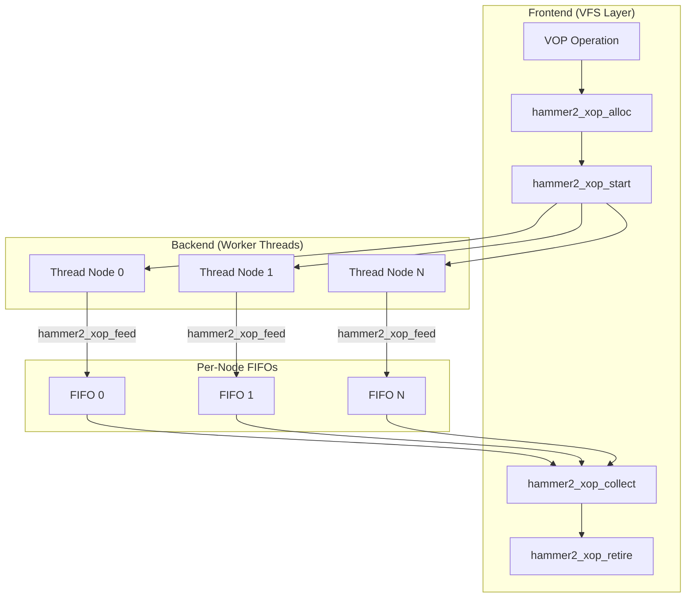
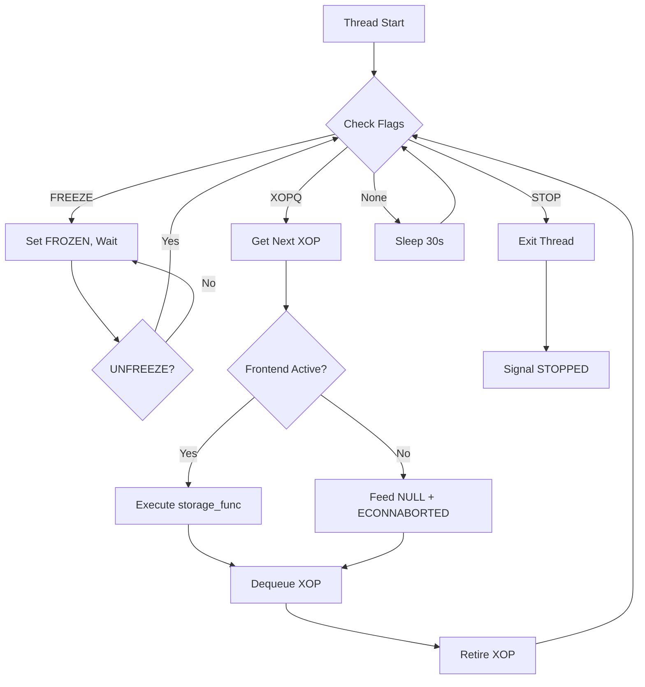

# HAMMER2 XOP System

!!! abstract "Source Reference"
    Primary sources: `sys/vfs/hammer2/hammer2_admin.c`, `sys/vfs/hammer2/hammer2_xops.c`  
    Header definitions: `sys/vfs/hammer2/hammer2.h` (lines 560-1060)

## Overview

The XOP (Cross-cluster OPeration) system provides a framework for executing filesystem operations across multiple cluster nodes in parallel. It decouples the VFS frontend from the storage backend, allowing operations to complete as soon as quorum requirements are met without waiting for slow or failed nodes.

Key features:

- **Parallel execution** — Operations run concurrently on all cluster nodes
- **Quorum-based completion** — Frontend returns when sufficient nodes respond
- **FIFO-based communication** — Per-node FIFOs pass results from backends to frontend
- **Thread pool management** — Dedicated worker threads per cluster node
- **Dependency tracking** — Serializes operations on the same inode

## Architecture



## Core Data Structures

### hammer2_xop_head_t

The common header for all XOP requests (`hammer2.h:894-914`):

```c
struct hammer2_xop_head {
    hammer2_xop_desc_t  *desc;          /* operation descriptor */
    hammer2_tid_t       mtid;           /* modify transaction id */
    struct hammer2_inode *ip1;          /* primary inode */
    struct hammer2_inode *ip2;          /* secondary inode (rename) */
    struct hammer2_inode *ip3;          /* tertiary inode (rename) */
    struct hammer2_inode *ip4;          /* quaternary inode (rename) */
    uint64_t            run_mask;       /* active backends + frontend */
    uint64_t            chk_mask;       /* backends that were started */
    int                 flags;          /* XOP flags */
    int                 state;          /* collection state */
    int                 error;          /* collected error */
    hammer2_key_t       collect_key;    /* key synchronization point */
    char                *name1;         /* primary name (lookup/create) */
    size_t              name1_len;
    char                *name2;         /* secondary name (rename) */
    size_t              name2_len;
    hammer2_xop_fifo_t  collect[HAMMER2_MAXCLUSTER]; /* per-node FIFOs */
    hammer2_cluster_t   cluster;        /* collected results */
    hammer2_io_t        *focus_dio;     /* focused DIO */
};
```

### hammer2_xop_fifo_t

Per-node result FIFO (`hammer2.h:879-889`):

```c
struct hammer2_xop_fifo {
    TAILQ_ENTRY(hammer2_xop_head) entry;  /* queue linkage */
    hammer2_chain_t     *array[HAMMER2_XOPFIFO];  /* chain results */
    int                 errors[HAMMER2_XOPFIFO];  /* error codes */
    int                 ri;             /* read index */
    int                 wi;             /* write index */
    int                 flags;          /* FIFO flags */
    hammer2_thread_t    *thr;           /* owning thread */
};
```

FIFO flags:

| Flag | Value | Description |
|------|-------|-------------|
| `HAMMER2_XOP_FIFO_RUN` | 0x0001 | XOP is currently executing |
| `HAMMER2_XOP_FIFO_STALL` | 0x0002 | Backend stalled on full FIFO |

### hammer2_xop_desc_t

Operation descriptor (`hammer2.h:870-877`):

```c
struct hammer2_xop_desc {
    hammer2_xop_func_t  storage_func;   /* backend function */
    hammer2_xop_func_t  dmsg_dispatch;  /* network dispatch (unused) */
    hammer2_xop_func_t  dmsg_process;   /* network processing (unused) */
    const char          *id;            /* operation name for debugging */
};
```

### hammer2_thread_t

Worker thread structure (`hammer2.h:815-824`):

```c
struct hammer2_thread {
    struct hammer2_pfs  *pmp;           /* PFS mount */
    struct hammer2_dev  *hmp;           /* device (for bulkfree) */
    hammer2_xop_list_t  xopq;           /* pending XOP queue */
    thread_t            td;             /* kernel thread */
    uint32_t            flags;          /* thread state flags */
    int                 clindex;        /* cluster element index */
    int                 repidx;         /* replication index */
    char                *scratch;       /* MAXPHYS scratch buffer */
};
```

Thread flags:

| Flag | Value | Description |
|------|-------|-------------|
| `HAMMER2_THREAD_UNMOUNTING` | 0x0001 | Unmount in progress |
| `HAMMER2_THREAD_DEV` | 0x0002 | Device thread, not PFS |
| `HAMMER2_THREAD_WAITING` | 0x0004 | Thread sleeping |
| `HAMMER2_THREAD_REMASTER` | 0x0008 | Remaster request |
| `HAMMER2_THREAD_STOP` | 0x0010 | Stop request |
| `HAMMER2_THREAD_FREEZE` | 0x0020 | Freeze request |
| `HAMMER2_THREAD_FROZEN` | 0x0040 | Thread is frozen |
| `HAMMER2_THREAD_XOPQ` | 0x0080 | Work pending on queue |
| `HAMMER2_THREAD_STOPPED` | 0x0100 | Thread has exited |
| `HAMMER2_THREAD_UNFREEZE` | 0x0200 | Unfreeze request |

### Run Mask Bits

The `run_mask` field tracks active participants (`hammer2.h:562-568`):

| Mask | Description |
|------|-------------|
| `HAMMER2_XOPMASK_CLUSTER` | Bits 0-7: One bit per cluster node |
| `HAMMER2_XOPMASK_VOP` | Bit 31: Frontend is active |
| `HAMMER2_XOPMASK_FIFOW` | Bit 30: Backend waiting on FIFO space |
| `HAMMER2_XOPMASK_WAIT` | Bit 29: Frontend waiting for results |
| `HAMMER2_XOPMASK_FEED` | Bit 32+: Feed counter |
| `HAMMER2_XOPMASK_ALLDONE` | VOP + CLUSTER combined |

## XOP Lifecycle

### 1. Allocation

```c
void *hammer2_xop_alloc(hammer2_inode_t *ip, int flags);
```

Source: `hammer2_admin.c:328-361`

Allocates an XOP from the object cache and initializes it:

1. Gets XOP structure from `cache_xops`
2. Sets `ip1` to the primary inode (adds reference)
3. Initializes `run_mask` with `HAMMER2_XOPMASK_VOP` (frontend active)
4. If `HAMMER2_XOP_MODIFYING`, allocates a transaction ID via `hammer2_trans_sub()`
5. Copies cluster chain count from inode

**XOP Flags:**

| Flag | Description |
|------|-------------|
| `HAMMER2_XOP_MODIFYING` | Operation modifies data |
| `HAMMER2_XOP_STRATEGY` | Strategy (read/write) operation |

### 2. Setup

Optional setup functions add parameters:

```c
void hammer2_xop_setname(hammer2_xop_head_t *xop, const char *name, size_t len);
void hammer2_xop_setname2(hammer2_xop_head_t *xop, const char *name, size_t len);
void hammer2_xop_setip2(hammer2_xop_head_t *xop, hammer2_inode_t *ip2);
void hammer2_xop_setip3(hammer2_xop_head_t *xop, hammer2_inode_t *ip3);
void hammer2_xop_setip4(hammer2_xop_head_t *xop, hammer2_inode_t *ip4);
```

### 3. Start

```c
void hammer2_xop_start(hammer2_xop_head_t *xop, hammer2_xop_desc_t *desc);
```

Source: `hammer2_admin.c:478-590`

Queues the XOP to worker threads:

1. Creates XOP helper threads if not already running
2. Selects worker thread group based on:
   - **Strategy ops**: Hash of inode + logical offset, uses dedicated strategy workers
   - **Single-node non-clustered**: CPU-local workers to reduce IPI overhead
   - **Clustered**: Hash-based to serialize same-inode operations
3. For each cluster node with a valid chain:
   - Sets bit in `run_mask` and `chk_mask`
   - Inserts XOP into thread's `xopq`
4. Signals all worker threads via `hammer2_thr_signal()`

### 4. Backend Execution

Worker threads execute `hammer2_primary_xops_thread()` (`hammer2_admin.c:1147-1262`):



The `hammer2_xop_next()` function (`hammer2_admin.c:1071-1115`) selects the next runnable XOP:

- Skips XOPs with dependencies on already-running XOPs (same inode)
- Skips XOPs already marked `HAMMER2_XOP_FIFO_RUN`
- Uses hash-based dependency tracking to allow parallelism

### 5. Feeding Results

```c
int hammer2_xop_feed(hammer2_xop_head_t *xop, hammer2_chain_t *chain,
                     int clindex, int error);
```

Source: `hammer2_admin.c:792-856`

Backend threads feed results to the frontend:

1. Check if frontend is still active (`HAMMER2_XOPMASK_VOP`)
2. If FIFO is full, set `HAMMER2_XOP_FIFO_STALL` and sleep
3. Add chain to FIFO (with ref+hold)
4. Increment write index
5. If frontend is waiting (`HAMMER2_XOPMASK_WAIT`), wake it up

### 6. Collection

```c
int hammer2_xop_collect(hammer2_xop_head_t *xop, int flags);
```

Source: `hammer2_admin.c:888-1022`

Frontend collects results from all backends:

1. Advance each FIFO that is behind `collect_key`
2. Find lowest key across all FIFOs
3. Call `hammer2_cluster_check()` to validate quorum
4. Return results:
   - `0` — Valid result, cluster populated
   - `HAMMER2_ERROR_ENOENT` — End of iteration
   - `HAMMER2_ERROR_EINPROGRESS` — Wait for more results

**Collection Flags:**

| Flag | Description |
|------|-------------|
| `HAMMER2_XOP_COLLECT_NOWAIT` | Don't block, poll only |
| `HAMMER2_XOP_COLLECT_WAITALL` | Wait for all backends |

### 7. Retirement

```c
void hammer2_xop_retire(hammer2_xop_head_t *xop, uint64_t mask);
```

Source: `hammer2_admin.c:596-759`

Called by both frontend and backends to retire from an XOP:

1. Atomically decrement `run_mask` by `mask`
2. If others remain:
   - Frontend retiring: Wake backends waiting on FIFO
   - Last backend retiring: Wake frontend
3. If last participant:
   - Cache cluster chains in inode's `ccache` for performance
   - Drop all chains in XOP cluster and FIFOs
   - Drop inode references
   - Free name buffers
   - Return XOP to object cache

## XOP Operations

### Directory Operations

| Operation | Descriptor | Description |
|-----------|------------|-------------|
| `hammer2_xop_readdir` | `hammer2_readdir_desc` | Read directory entries |
| `hammer2_xop_nresolve` | `hammer2_nresolve_desc` | Lookup name in directory |
| `hammer2_xop_unlink` | `hammer2_unlink_desc` | Remove directory entry |
| `hammer2_xop_nrename` | `hammer2_nrename_desc` | Rename file/directory |
| `hammer2_xop_scanlhc` | `hammer2_scanlhc_desc` | Scan for hash collisions |

### Inode Operations

| Operation | Descriptor | Description |
|-----------|------------|-------------|
| `hammer2_xop_ipcluster` | `hammer2_ipcluster_desc` | Synchronize inode cluster |
| `hammer2_xop_inode_mkdirent` | `hammer2_inode_mkdirent_desc` | Create directory entry |
| `hammer2_xop_inode_create` | `hammer2_inode_create_desc` | Create inode (attached) |
| `hammer2_xop_inode_create_det` | `hammer2_inode_create_det_desc` | Create inode (detached) |
| `hammer2_xop_inode_create_ins` | `hammer2_inode_create_ins_desc` | Insert detached inode |
| `hammer2_xop_inode_destroy` | `hammer2_inode_destroy_desc` | Destroy inode |
| `hammer2_xop_inode_chain_sync` | `hammer2_inode_chain_sync_desc` | Sync inode to chains |
| `hammer2_xop_inode_unlinkall` | `hammer2_inode_unlinkall_desc` | Unlink all entries |
| `hammer2_xop_inode_connect` | `hammer2_inode_connect_desc` | Connect inode |
| `hammer2_xop_inode_flush` | `hammer2_inode_flush_desc` | Flush inode to media |

### I/O Operations

| Operation | Descriptor | Description |
|-----------|------------|-------------|
| `hammer2_xop_strategy_read` | `hammer2_strategy_read_desc` | Read file data |
| `hammer2_xop_strategy_write` | `hammer2_strategy_write_desc` | Write file data |
| `hammer2_xop_bmap` | `hammer2_bmap_desc` | Block mapping |

### Utility Operations

| Operation | Descriptor | Description |
|-----------|------------|-------------|
| `hammer2_xop_lookup` | `hammer2_lookup_desc` | General chain lookup |
| `hammer2_xop_scanall` | `hammer2_scanall_desc` | Scan key range |
| `hammer2_xop_delete` | `hammer2_delete_desc` | Delete chain |

## Thread Management

### Thread Creation

```c
void hammer2_thr_create(hammer2_thread_t *thr, hammer2_pfs_t *pmp,
                        hammer2_dev_t *hmp, const char *id,
                        int clindex, int repidx, void (*func)(void *));
```

Source: `hammer2_admin.c:218-244`

Creates a worker thread:

1. Initializes thread structure
2. Allocates MAXPHYS scratch buffer
3. Creates kernel thread via `lwkt_create()`

### Thread Pool

```c
void hammer2_xop_helper_create(hammer2_pfs_t *pmp);
void hammer2_xop_helper_cleanup(hammer2_pfs_t *pmp);
```

Source: `hammer2_admin.c:425-470`

Each mounted PFS has a pool of XOP worker threads:

- `hammer2_xop_nthreads` threads per cluster node
- Threads are created on-demand at first XOP
- Separate thread groups for strategy vs. non-strategy operations

### Thread Signaling

```c
void hammer2_thr_signal(hammer2_thread_t *thr, uint32_t flags);
void hammer2_thr_signal2(hammer2_thread_t *thr, uint32_t posflags, uint32_t negflags);
void hammer2_thr_wait(hammer2_thread_t *thr, uint32_t flags);
void hammer2_thr_wait_neg(hammer2_thread_t *thr, uint32_t flags);
```

Atomic flag manipulation with wakeup support.

### Thread Lifecycle Control

```c
void hammer2_thr_freeze(hammer2_thread_t *thr);    /* Pause thread */
void hammer2_thr_unfreeze(hammer2_thread_t *thr);  /* Resume thread */
void hammer2_thr_delete(hammer2_thread_t *thr);    /* Stop and cleanup */
void hammer2_thr_remaster(hammer2_thread_t *thr);  /* Request remaster */
```

## XOP Type Definitions

All XOP types embed `hammer2_xop_head_t` as first member:

```c
struct hammer2_xop_readdir {
    hammer2_xop_head_t  head;
    hammer2_key_t       lkey;       /* starting directory key */
};

struct hammer2_xop_nresolve {
    hammer2_xop_head_t  head;
    hammer2_key_t       lhc;        /* name hash */
};

struct hammer2_xop_unlink {
    hammer2_xop_head_t  head;
    int                 isdir;      /* expect directory */
    int                 dopermanent; /* permanent delete flags */
};

struct hammer2_xop_create {
    hammer2_xop_head_t  head;
    hammer2_inode_meta_t meta;      /* initial metadata */
    hammer2_key_t       lhc;        /* hash/key */
    int                 flags;      /* creation flags */
};

struct hammer2_xop_strategy {
    hammer2_xop_head_t  head;
    hammer2_key_t       lbase;      /* logical offset */
    int                 finished;   /* completion flag */
    hammer2_mtx_t       lock;       /* synchronization */
    struct bio          *bio;       /* I/O request */
};

struct hammer2_xop_fsync {
    hammer2_xop_head_t  head;
    hammer2_inode_meta_t meta;      /* metadata to sync */
    hammer2_off_t       osize;      /* original size */
    u_int               ipflags;    /* inode flags */
    int                 clear_directdata;
};
```

The `hammer2_xop_t` union encompasses all types for allocation:

```c
union hammer2_xop {
    hammer2_xop_head_t      head;
    hammer2_xop_readdir_t   xop_readdir;
    hammer2_xop_nresolve_t  xop_nresolve;
    hammer2_xop_unlink_t    xop_unlink;
    hammer2_xop_create_t    xop_create;
    hammer2_xop_strategy_t  xop_strategy;
    /* ... other types ... */
};
```

## Data Access Functions

### Safe Data Access

```c
const hammer2_media_data_t *hammer2_xop_gdata(hammer2_xop_head_t *xop);
void hammer2_xop_pdata(hammer2_xop_head_t *xop);
```

Source: `hammer2.h:1967-2000`

These functions provide safe access to chain data from collected results:

- `hammer2_xop_gdata()` — Get data pointer, ensures I/O synchronization
- `hammer2_xop_pdata()` — Put data, releases synchronization

**Important:** Chains in the collected cluster are neither locked nor I/O synchronized. Always use these functions to access chain data safely.

## Example: Directory Lookup (nresolve)

```c
/* Frontend (VFS layer) */
hammer2_xop_nresolve_t *xop;

xop = hammer2_xop_alloc(dip, HAMMER2_XOP_MODIFYING);
hammer2_xop_setname(&xop->head, name, name_len);
hammer2_xop_start(&xop->head, &hammer2_nresolve_desc);

error = hammer2_xop_collect(&xop->head, 0);
if (error == 0) {
    /* Access result via xop->head.cluster */
    chain = xop->head.cluster.focus;
    /* ... process result ... */
}
hammer2_xop_retire(&xop->head, HAMMER2_XOPMASK_VOP);
```

```c
/* Backend (hammer2_xops.c:248-318) */
void hammer2_xop_nresolve(hammer2_xop_t *arg, void *scratch, int clindex)
{
    hammer2_xop_nresolve_t *xop = &arg->xop_nresolve;
    hammer2_chain_t *parent, *chain;
    
    /* Get parent chain for this cluster node */
    parent = hammer2_inode_chain(xop->head.ip1, clindex,
                                 HAMMER2_RESOLVE_ALWAYS |
                                 HAMMER2_RESOLVE_SHARED);
    
    /* Lookup directory entry by name hash */
    lhc = hammer2_dirhash(xop->head.name1, xop->head.name1_len);
    chain = hammer2_chain_lookup(&parent, &key_next,
                                 lhc, lhc + HAMMER2_DIRHASH_LOMASK,
                                 &error, HAMMER2_LOOKUP_SHARED);
    
    /* Find matching entry */
    while (chain) {
        if (hammer2_chain_dirent_test(chain, name, name_len))
            break;
        chain = hammer2_chain_next(...);
    }
    
    /* If directory entry, resolve to inode */
    if (chain && chain->bref.type == HAMMER2_BREF_TYPE_DIRENT) {
        error = hammer2_chain_inode_find(...);
    }
    
    /* Feed result to frontend */
    hammer2_xop_feed(&xop->head, chain, clindex, error);
    
    /* Cleanup */
    if (chain) hammer2_chain_drop(chain);
    if (parent) hammer2_chain_drop(parent);
}
```

## Performance Considerations

1. **Thread Affinity**: Strategy operations use CPU-local threads to reduce inter-processor interrupts (IPIs)

2. **Inode Serialization**: Non-strategy operations to the same inode are serialized to prevent race conditions in clustered configurations

3. **FIFO Flow Control**: Backends stall when FIFOs fill, preventing memory exhaustion

4. **Chain Caching**: Retired XOPs cache their chains in the inode's `ccache` to prevent expensive chain destruction

5. **Early Completion**: Frontend can return as soon as quorum is reached, without waiting for slow nodes

## See Also

- [HAMMER2 Overview](index.md) — Filesystem architecture
- [Inode Layer](inode-layer.md) — Inode management
- [Chain Layer](chain-layer.md) — Block management
- [VFS Integration](vfs-integration.md) — VFS operations
- [Flush and Sync](flush-sync.md) — Synchronization mechanisms
