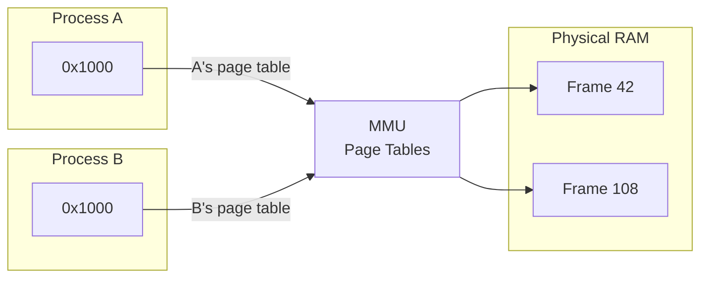
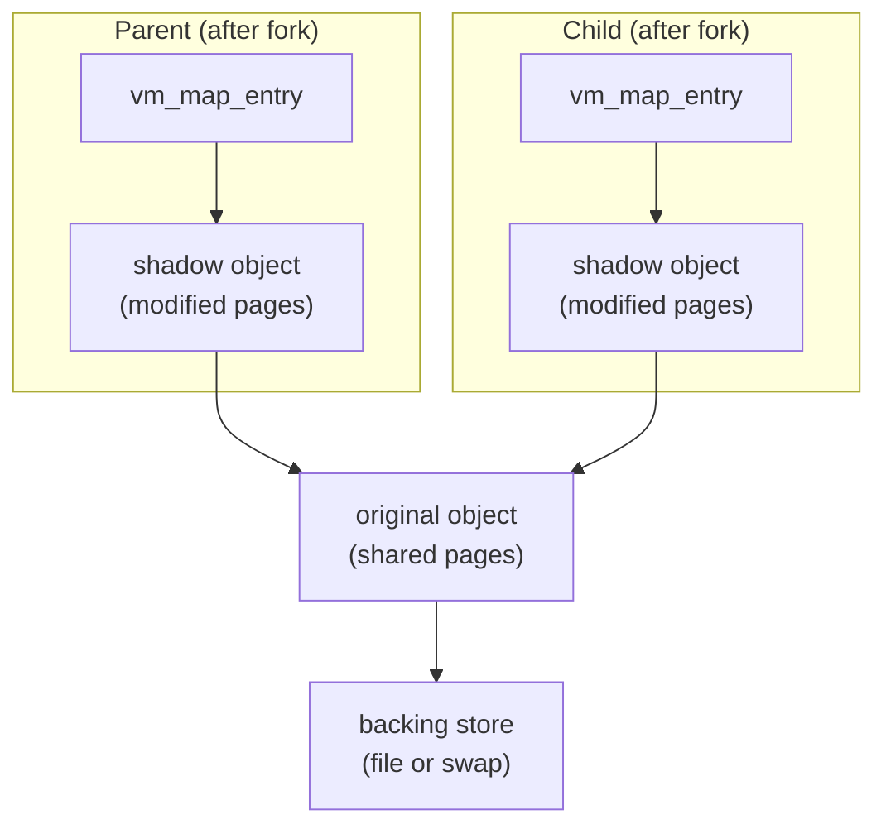

# Virtual Memory Concepts

This page provides foundational background on virtual memory for readers approaching DragonFly's VM subsystem. If you're already familiar with VM concepts and Mach VM heritage, skip to the [VM Subsystem Overview](index.md).

## What is Virtual Memory?

Virtual memory is an abstraction that gives each process its own private address space, isolated from other processes. When a program accesses memory at address `0x1000`, that address is *virtual*—it doesn't correspond directly to a location in physical RAM. Instead, the CPU's Memory Management Unit (MMU) translates virtual addresses to physical addresses using *page tables* maintained by the kernel.

This translation happens transparently on every memory access. The kernel controls what translations exist, enabling it to:

- Isolate processes from each other (different page tables, different views of memory)
- Map the same physical page into multiple address spaces (sharing)
- Delay allocation until memory is actually accessed (demand paging)
- Move pages to disk when RAM is scarce (swapping)



Both processes use the same virtual address `0x1000`, but they map to different physical frames. Neither process can access the other's memory.

## Why Virtual Memory?

| Benefit | Description |
|---------|-------------|
| **Isolation** | Processes cannot read or write each other's memory; a bug in one program cannot corrupt another |
| **Over-commitment** | The system can allocate more virtual memory than physical RAM exists, paging to disk as needed |
| **Sharing** | Read-only code (libraries, executables) can be shared across processes without duplication |
| **Simplicity** | Each process sees a simple, contiguous address space starting at zero |
| **Demand paging** | Pages are loaded from disk only when first accessed, reducing startup time and memory pressure |
| **Memory-mapped files** | Files can be accessed as memory (`mmap`), enabling efficient I/O and sharing |

## Core Concepts

### Virtual Address
An address in a process's address space. The CPU sees these addresses; the MMU translates them to physical addresses. Each process has its own virtual address space (typically 0 to 2^47 on amd64).

*See: [Wikipedia: Virtual address space](https://en.wikipedia.org/wiki/Virtual_address_space)*

### Physical Address
An actual location in RAM hardware. The kernel and MMU deal with physical addresses; user processes never see them directly.

*See: [Wikipedia: Physical address](https://en.wikipedia.org/wiki/Physical_address)*

### Page
The fundamental unit of memory management, typically 4KB on x86-64. Virtual and physical memory are divided into fixed-size pages. The MMU translates at page granularity—all addresses within a page share the same translation.

*See: [Wikipedia: Page (computer memory)](https://en.wikipedia.org/wiki/Page_(computer_memory))*

### Page Table
A data structure mapping virtual pages to physical frames. Maintained by the kernel, walked by the MMU hardware on every memory access. Modern systems use multi-level page tables (4 levels on x86-64) to handle sparse address spaces efficiently.

*See: [Wikipedia: Page table](https://en.wikipedia.org/wiki/Page_table)*

### Page Fault
A CPU exception triggered when accessing a virtual address with no valid translation. The kernel's fault handler determines why: the page may need to be loaded from disk, allocated and zero-filled, or the access may be illegal (segfault).

*See: [Wikipedia: Page fault](https://en.wikipedia.org/wiki/Page_fault)*

### Pager
A kernel component responsible for providing page contents. Different pagers handle different backing stores: the *vnode pager* reads from files, the *swap pager* reads from swap space, the *device pager* maps hardware memory.

### Demand Paging
Pages are not loaded until accessed. When a process first touches a page, a fault occurs, and the kernel loads the page from its backing store. This reduces memory usage and startup time.

*See: [Wikipedia: Demand paging](https://en.wikipedia.org/wiki/Demand_paging)*

### Copy-on-Write (COW)
An optimization for `fork()`. Parent and child initially share the same physical pages (marked read-only). When either writes, a fault occurs, and the kernel copies the page so each has a private copy. Most pages are never written, so sharing persists.

*See: [Wikipedia: Copy-on-write](https://en.wikipedia.org/wiki/Copy-on-write)*

### Working Set
The set of pages a process is actively using. Good VM performance requires keeping the working set resident in RAM; if it exceeds available memory, the system thrashes.

*See: [Wikipedia: Working set](https://en.wikipedia.org/wiki/Working_set)*

### Thrashing
A pathological state where the system spends more time paging than executing. Occurs when the combined working sets exceed physical memory, causing continuous page faults.

*See: [Wikipedia: Thrashing](https://en.wikipedia.org/wiki/Thrashing_(computer_science))*

---

## Mach VM Heritage

DragonFly's VM subsystem descends from the Mach VM architecture developed at Carnegie Mellon University (1985-1994). Mach introduced an object-oriented approach to virtual memory that was later adopted by 4.4BSD and inherited by FreeBSD, NetBSD, and DragonFly.

### Key Mach VM Concepts

**vm_object**: A container for pages representing a contiguous region of backing store. Objects can be backed by files (vnode), anonymous memory (swap), or devices. Multiple address space mappings can reference the same object.

**Shadow objects**: When a mapping needs copy-on-write semantics, a *shadow object* is interposed. The shadow starts empty; copied pages go into the shadow while unmodified pages are read from the original. Shadow chains can form during successive forks.



**Pager abstraction**: Objects delegate I/O to pagers. This separates memory management policy from I/O mechanism—the VM doesn't care whether pages come from a file, swap device, or network.

**Memory object**: In original Mach, external pagers could manage memory objects from user space. BSD simplified this to kernel-only pagers.

### BSD Adaptations

When BSD adopted Mach VM, it made several simplifications:

- Removed external pagers (user-space memory servers)
- Integrated tightly with the vnode layer for file mapping
- Added the unified buffer cache (UBC) for file I/O

---

## How DragonFly Evolved the Design

DragonFly inherited the FreeBSD 4.x VM but made significant changes for SMP scalability and integration with the LWKT threading system.

### vm_map_backing Chains

Traditional BSD attaches shadow objects directly to `vm_object`, creating chains shared across all mappings. DragonFly introduces `vm_map_backing`—a per-entry structure that forms its own chain:

```
vm_map_entry → vm_map_backing → vm_map_backing → vm_object
                (shadow info)    (shadow info)    (pages)
```

Benefits:

- Shadow relationships are per-entry, not shared across pmaps
- Easier to collapse and optimize chains
- Cleaner separation between mapping metadata and page storage

### LWKT Token Locking

Traditional BSD uses sleep locks (`lockmgr`) on VM objects. DragonFly uses LWKT tokens—soft serialization primitives that allow blocking while held. This enables:

- Multiple threads to block on I/O without lock contention
- Deadlock-free lock ordering (tokens can be acquired in any order)
- Better integration with the LWKT message-passing model

### Page Coloring

DragonFly organizes page queues into 1024 sub-queues based on physical address bits. This:

- Distributes lock contention across many queues
- Improves cache behavior by separating pages by color
- Enables parallel scanning during pageout

### Per-CPU Statistics

VM statistics (`vm_stat`) are cached per-CPU and only aggregated when read. This eliminates cache-line bouncing on the global stats structure during allocation/free.

### Fast Fault Bypass

For pages already resident and valid, DragonFly's `vm_fault_quick()` avoids the full fault path, directly wiring the page into the page table.

---

## Further Reading

### Textbooks

- **[Operating Systems: Three Easy Pieces](https://pages.cs.wisc.edu/~remzi/OSTEP/)** — Free online textbook with excellent VM chapters (13-23). Start here for foundational understanding.

- **The Design and Implementation of the FreeBSD Operating System** (McKusick et al.) — Chapter 5 covers BSD VM in detail. The 4.4BSD and FreeBSD editions are both relevant.

### Papers

- **[Machine-Independent Virtual Memory Management for Paged Uniprocessor and Multiprocessor Architectures](https://www.cs.cmu.edu/afs/cs/project/mach/public/www/doc/publications.html)** (Rashid et al., 1987) — The original Mach VM paper describing the object-oriented design.

### Quick Reference

- [Wikipedia: Virtual memory](https://en.wikipedia.org/wiki/Virtual_memory)
- [Wikipedia: Mach (kernel)](https://en.wikipedia.org/wiki/Mach_(kernel))
- [OSDev Wiki: Paging](https://wiki.osdev.org/Paging) — x86-specific page table details

---

## See Also

- [VM Subsystem Overview](index.md) — DragonFly's architecture and data structures
- [Physical Pages](vm_page.md) — Page allocation, queues, and coloring
- [VM Objects](vm_object.md) — Object lifecycle and page management
- [Page Faults](vm_fault.md) — Fault handling and COW implementation
- [Memory Allocation](../kern/memory.md) — Kernel memory (kmalloc, objcache)
