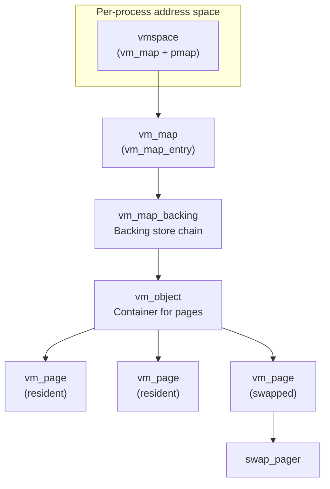
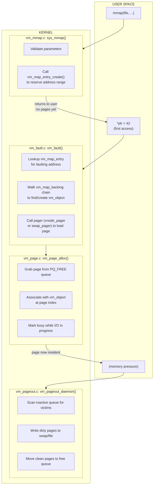

# Virtual Memory Subsystem

The DragonFly BSD virtual memory subsystem manages virtual address spaces, physical memory allocation, paging, and swap. It derives from the Mach VM architecture as adopted by BSD but has been extensively modified for better SMP scalability and LWKT integration.

## Introduction

Virtual memory is a fundamental operating system service that gives each process its own isolated address space and enables the system to use more memory than physically available through demand paging and swapping.

**New to virtual memory concepts?** Start with [Virtual Memory Concepts](concepts.md) for an introduction to VM theory, terminology, and the Mach VM heritage that DragonFly builds upon.

### DragonFly's VM Design

DragonFly's VM evolved from the Mach/BSD VM architecture with significant enhancements for SMP scalability and LWKT integration:

- **vm_map_backing chains** — Per-entry backing store chains (vs traditional shadow objects)
- **LWKT token locking** — Soft locks allowing blocking operations
- **Page coloring** — 1024-way queuing reduces lock contention
- **Per-CPU vmstats** — Cached statistics avoid global contention
- **Fast fault bypass** — Optimization path for resident pages

See [Concepts](concepts.md) for details on how DragonFly differs from traditional Mach VM.

## Architecture Overview

## Reading Guide

**Start here based on what you're trying to do:**

| If you want to... | Read this | Why |
|-------------------|-----------|-----|
| Learn VM fundamentals | [Concepts](concepts.md) | Theory primer and terminology |
| Understand how `mmap()` works | [Memory Mapping](vm_mmap.md) | Traces syscall to VM layer |
| Debug a page fault or crash | [Page Faults](vm_fault.md) | Explains fault handling and COW |
| Investigate memory pressure/OOM | [Pageout and Swap](vm_pageout.md) | Covers reclamation and OOM killer |
| Add a new memory mapping type | [Address Space](vm_map.md) | Shows map entry creation |
| Work with page allocation | [Physical Pages](vm_page.md) | Low-level page management |
| Implement a new pager | [VM Objects](vm_object.md) | Object-pager relationship |

**Recommended reading order for newcomers:**

1. [Concepts](concepts.md) (understand VM theory and terminology)
2. This overview (understand the DragonFly-specific hierarchy)
3. [Memory Mapping](vm_mmap.md) (see how userspace enters the VM)
4. [Page Faults](vm_fault.md) (see how pages get populated)
5. [Physical Pages](vm_page.md) (understand page lifecycle)

## How Operations Flow Through the VM

## Subsystem Documentation

| Document | Description |
|----------|-------------|
| [Physical Pages](vm_page.md) | Page allocation, queues, coloring, busy states |
| [VM Objects](vm_object.md) | Object lifecycle, reference counting, page management |
| [Address Space](vm_map.md) | Address space management, entries, backing chains |
| [Page Faults](vm_fault.md) | Fault handling, COW, fast path optimization |
| [Pageout and Swap](vm_pageout.md) | Memory reclamation, swap pager, OOM killer |
| [Memory Mapping](vm_mmap.md) | mmap syscalls, vnode pager, file-backed I/O |

## Key Data Structures

### vm_page

Physical page descriptor (128 bytes). Each page tracks its owning object, physical address, queue membership, and busy/dirty state.

Key fields: `object`, `pindex`, `phys_addr`, `queue`, `busy_count`, `wire_count`, `valid`, `dirty`

See [Physical Pages](vm_page.md) for details.

### vm_object

Container for pages with a specific backing store type. Objects can be anonymous (swap-backed), file-backed (vnode), or device-backed.

Key fields: `rb_memq` (page tree), `ref_count`, `type`, `size`, `backing_list`

See [VM Objects](vm_object.md) for details.

### vm_map

Virtual address space containing a red-black tree of `vm_map_entry` structures. Each process has its own map within a `vmspace`.

Key fields: `rb_root`, `pmap`, `min_addr`, `max_addr`, `nentries`

### vm_map_entry

Single address range mapping with protection, inheritance, and backing store information. Contains an embedded `vm_map_backing` structure.

### vm_map_backing (DragonFly-specific)

Backing store chain element. Unlike traditional BSD where entries point directly to objects, DragonFly interposes this structure for:

- Efficient shadow chains without modifying vm_object
- Per-entry backing relationships not shared across pmaps
- Cumulative offset calculation through the chain

## Page Queues

Pages are organized into queues based on state, with 1024 sub-queues per major queue for cache optimization:

| Queue | Description |
|-------|-------------|
| `PQ_FREE` | Available for allocation |
| `PQ_ACTIVE` | Recently referenced |
| `PQ_INACTIVE` | Candidates for reclamation |
| `PQ_CACHE` | Clean, quickly reclaimable |
| `PQ_HOLD` | Temporarily held |

## Locking Model

The VM subsystem uses several locking strategies:

| Lock Type | Usage |
|-----------|-------|
| LWKT Tokens | Soft locks on vm_objects (blocking allowed) |
| lockmgr | Hard locks on vm_map for structural changes |
| Spinlocks | Per-page and per-queue locks |
| Per-CPU stats | Cached vmstats avoid global contention |

## Source Files

| File | Lines | Description |
|------|-------|-------------|
| `vm_page.c` | ~4,200 | Physical page management |
| `vm_object.c` | ~2,000 | VM object management |
| `vm_map.c` | ~4,800 | Address space management |
| `vm_fault.c` | ~3,200 | Page fault handling |
| `vm_pageout.c` | ~2,900 | Pageout daemon |
| `swap_pager.c` | ~2,600 | Swap I/O |
| `vnode_pager.c` | ~800 | File-backed I/O |
| `vm_mmap.c` | ~1,500 | mmap() implementation |

## See Also

- [Memory Allocation](../kern/memory.md) - kmalloc/objcache
- [Buffer Cache](../kern/vfs/buffer-cache.md) - Filesystem buffers
- [Processes](../kern/processes.md) - Process and vmspace lifecycle
