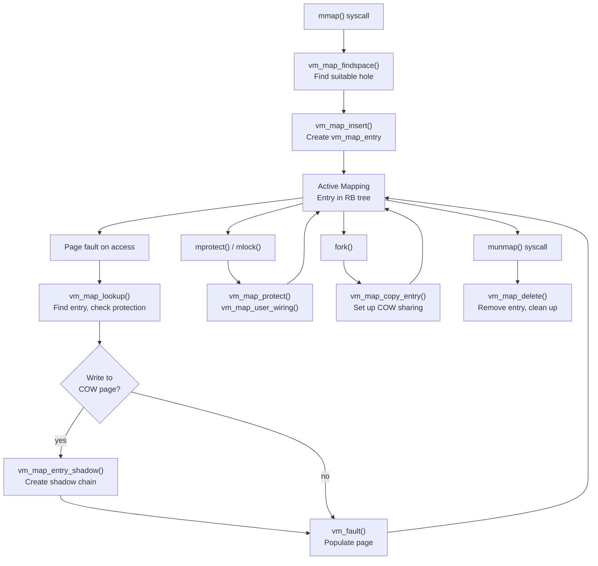
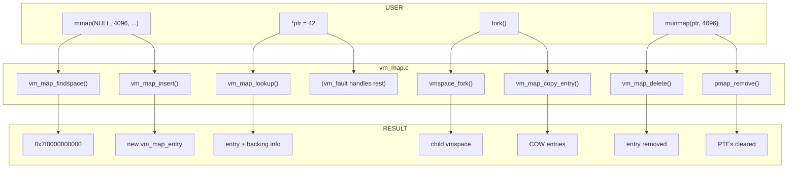

# Address Space Management

The VM map subsystem manages virtual address spaces in DragonFly BSD. It handles address range mappings, copy-on-write (COW), process forking, stack management, and the relationship between virtual addresses and backing objects.

**Source file:** `sys/vm/vm_map.c` (~4,781 lines)

---

## Why Address Space Management Matters

Every process sees its own private, contiguous address space—from address 0 to the maximum virtual address. But this is an illusion. Physical memory is fragmented, shared between processes, and far smaller than the virtual range. The VM map subsystem creates and maintains this illusion.

**How does the kernel know what's at a virtual address?**

When a process accesses address `0x7fff12340000`, the hardware triggers a page fault. The kernel must answer: Is this address valid? What protection does it have? Where does its data come from? The `vm_map` answers all these questions. It's a sorted tree of `vm_map_entry` structures, each describing a contiguous range with uniform properties.

**How does `fork()` create a child without copying gigabytes of memory?**

Copy-on-write (COW) is the answer, but implementing it efficiently is complex. The parent and child must share physical pages until one writes. DragonFly's `vm_map_backing` chains track these sharing relationships without modifying the underlying `vm_object`—a key architectural difference from traditional BSD.

**How do you efficiently find free space in a sparse address space?**

With thousands of mappings and huge address ranges, finding a suitable hole for `mmap()` could be expensive. DragonFly uses a freehint cache that provides O(1) lookup for common allocation patterns, falling back to RB tree traversal only when necessary.

**Why can multiple threads fault on different parts of the same mapping concurrently?**

Large anonymous mappings (like a process's heap) could serialize all faults through a single lock. DragonFly's 32MB entry partitioning allows different threads to fault on different partitions simultaneously, dramatically improving multi-threaded scalability.

---

## The Life of a Mapping

A mapping's journey from creation through active use to destruction:



**Key transitions:**

1. **Creation**: `mmap()` → `vm_map_findspace()` finds a hole → `vm_map_insert()` creates the entry. The mapping exists but has no pages yet.

2. **First Access**: A page fault triggers `vm_map_lookup()` which finds the entry and checks permissions. Then `vm_fault()` populates the page from the backing object or zero-fills it.

3. **COW Fault**: If a process writes to a shared page (after `fork()`), `vm_map_entry_shadow()` creates a shadow chain, and the write goes to a private copy.

4. **Destruction**: `munmap()` → `vm_map_delete()` removes pmap mappings, releases object references, and frees the entry.

---

## Key Design Principles

| Problem | Traditional Approach | DragonFly's Solution |
|---------|---------------------|---------------------|
| **COW tracking** | Modify vm_object shadow chains | `vm_map_backing` chains—objects unchanged when shadowed |
| **Finding free space** | O(n) scan or complex data structures | Freehint cache for O(1) common case, RB tree fallback |
| **Large mapping contention** | Single entry = single lock | 32MB partitioning for concurrent faults |
| **Process exit cleanup** | Synchronous, heavyweight | Two-stage termination (stage-1 while runnable) |
| **Entry allocation in fault path** | Zone allocator (may block) | Per-CPU entry cache, pre-reserved entries |
| **Shadow chain explosion** | Unbounded depth from repeated forks | `vm_map_backing_limit` (default 5) with auto-collapse |
| **Submap overhead** | Separate map structure | Embedded in entry via `VM_MAPTYPE_SUBMAP` |

---

## Common Operations

Understanding when this code runs helps navigate the 4,781 lines. Here's what happens for common scenarios:

| User Action | Syscall | Key Functions | What Happens |
|-------------|---------|---------------|--------------|
| `mmap()` | `sys_mmap` | `vm_map_find()` → `vm_map_insert()` | Creates vm_map_entry, may coalesce with previous |
| `munmap()` | `sys_munmap` | `vm_map_remove()` → `vm_map_delete()` | Clips entries, removes pmap mappings, frees objects |
| `mprotect()` | `sys_mprotect` | `vm_map_protect()` | Two-pass: validate then apply to entries and pmap |
| `mlock()` | `sys_mlock` | `vm_map_user_wiring()` | Faults in pages, sets USER_WIRED flag |
| `fork()` | `sys_fork` | `vmspace_fork()` → `vm_map_copy_entry()` | Clones entries, sets up COW sharing |
| Stack growth | (fault) | `vm_map_growstack()` | Expands stack entry into reserved space |
| Page fault | (trap) | `vm_map_lookup()` | Finds entry, handles COW, returns backing info |



---

## Overview

A virtual address space is represented by two key structures:

- **vmspace** - Per-process address space containing both `vm_map` and `pmap`
- **vm_map** - Collection of address range mappings organized in a red-black tree

Each mapping (`vm_map_entry`) describes a contiguous virtual address range with its protection, inheritance, and backing store. DragonFly uses `vm_map_backing` chains to link entries to objects, enabling efficient shadow object handling without modifying the objects themselves.

## Data Structures

### struct vmspace

Per-process address space descriptor:

```c
struct vmspace {
    struct vm_map vm_map;       /* Embedded address map */
    struct pmap vm_pmap;        /* Embedded page table */
    
    /* Copied on fork (vm_startcopy to vm_endcopy) */
    segsz_t vm_swrss;          /* Swap reserved for process */
    segsz_t vm_tsize;          /* Text size (pages) */
    segsz_t vm_dsize;          /* Data size (pages) */
    segsz_t vm_ssize;          /* Stack size (pages) */
    caddr_t vm_taddr;          /* Text address */
    caddr_t vm_daddr;          /* Data address */
    caddr_t vm_maxsaddr;       /* Max stack address */
    
    int vm_flags;              /* VMSPACE_EXIT1/EXIT2 */
    int vm_exitingcnt;         /* Threads currently exiting */
    int vm_refcnt;             /* Reference count */
    int vm_holdcnt;            /* Hold count (prevents stage-2 exit) */
};
```

### struct vm_map

Virtual address space:

```c
struct vm_map {
    struct vm_map_rb_tree rb_root;  /* RB tree of entries */
    struct pmap *pmap;              /* Physical address map */
    
    vm_offset_t min_addr;           /* Lowest valid address */
    vm_offset_t max_addr;           /* Highest valid address */
    vm_size_t size;                 /* Total mapped size */
    int nentries;                   /* Number of entries */
    
    unsigned int timestamp;         /* Modification counter */
    struct lock lock;               /* Hard lock (100ms timeout) */
    struct lwkt_token token;        /* Soft serializer */
    
    vm_flags_t flags;               /* MAP_WIREFUTURE, etc. */
    struct vm_map_freehint freehint[VM_MAP_FFCOUNT];  /* Findspace hints */
    struct spinlock ilock_spin;     /* For range interlocks */
};
```

### struct vm_map_entry

Single address range mapping:

```c
struct vm_map_entry {
    /* RB tree linkage */
    RB_ENTRY(vm_map_entry) rb_entry;
    
    /* Embedded backing store */
    struct vm_map_backing ba;       /* pmap, start, end, offset, object */
    
    /* Properties */
    vm_prot_t protection;           /* Current protection */
    vm_prot_t max_protection;       /* Maximum allowed */
    vm_inherit_t inheritance;       /* Fork behavior */
    u_int wired_count;              /* Wiring reference count */
    vm_eflags_t eflags;             /* Entry flags */
    vm_maptype_t maptype;           /* NORMAL, SUBMAP, UKSMAP */
    vm_subsys_t id;                 /* Subsystem identifier */
    
    union {
        vm_offset_t avail_ssize;    /* Stack: available growth */
        int dev_prot;               /* Device protection */
    } aux;
};
```

### struct vm_map_backing

Backing store chain element (DragonFly-specific):

```c
struct vm_map_backing {
    /* Chain linkage */
    struct vm_map_backing *backing_ba;   /* Next in shadow chain */
    int backing_count;                   /* Depth counter */
    
    /* Address range (mirrored from entry but can differ in chain) */
    vm_offset_t start;
    vm_offset_t end;
    vm_ooffset_t offset;
    
    /* Backing store */
    struct pmap *pmap;                   /* Page table reference */
    union {
        struct vm_object *object;        /* NORMAL: backing object */
        struct vm_map *sub_map;          /* SUBMAP: nested map */
        int (*uksmap)(struct vm_map_backing *ba, int op,
                      cdev_t dev, vm_page_t page);  /* UKSMAP: callback */
    };
    void *aux_info;                      /* UKSMAP auxiliary */
    
    /* Object linkage */
    TAILQ_ENTRY(vm_map_backing) entry;   /* On object's backing_list */
};
```

### Entry Flags (vm_eflags_t)

| Flag | Description |
|------|-------------|
| `MAP_ENTRY_COW` | Copy-on-write enabled |
| `MAP_ENTRY_NEEDS_COPY` | COW not yet performed |
| `MAP_ENTRY_NOFAULT` | No faults allowed |
| `MAP_ENTRY_USER_WIRED` | User-level wiring (mlock) |
| `MAP_ENTRY_IN_TRANSITION` | Entry being modified |
| `MAP_ENTRY_NEEDS_WAKEUP` | Wake waiters when done |
| `MAP_ENTRY_NOSYNC` | Don't sync to filesystem |
| `MAP_ENTRY_NOCOREDUMP` | Exclude from core dumps |
| `MAP_ENTRY_STACK` | User stack mapping |
| `MAP_ENTRY_KSTACK` | Kernel stack mapping |

### Map Types (vm_maptype_t)

| Type | Description |
|------|-------------|
| `VM_MAPTYPE_NORMAL` | Standard mapping with backing object |
| `VM_MAPTYPE_SUBMAP` | Nested map (kernel use) |
| `VM_MAPTYPE_UKSMAP` | User-kernel shared memory with device callback |

## vmspace Lifecycle

### Two-Stage Termination

DragonFly uses a two-stage termination for vmspace cleanup:

**Stage 1** (ref_count reaches 0):
- Triggered by `vmspace_rel()` or `vmspace_relexit()`
- Sets `VMSPACE_EXIT1` flag
- Detaches SysV shared memory
- Removes pmap mappings and frees most VM resources
- Process can still run (using cached TLB entries)

**Stage 2** (hold_count reaches 0):
- Triggered by `vmspace_drop()` or `vmspace_exitfree()`
- Sets `VMSPACE_EXIT2` flag  
- Final cleanup via `vm_map_delete()`
- Releases pmap resources
- Returns vmspace to objcache

This separation allows efficient process exit - the heavyweight cleanup happens while threads are still runnable.

### Allocation and Initialization

```c
/* Allocate new vmspace */
struct vmspace *vmspace_alloc(vm_offset_t min, vm_offset_t max);
```

Initialization sequence:
1. Get vmspace from objcache
2. Zero the copyable region (`vm_startcopy` to `vm_endcopy`)
3. Initialize embedded `vm_map` with RB tree, locks, freehints
4. Set refs=1, holds=1
5. Initialize pmap via `pmap_pinit()`
6. Architecture-specific setup via `cpu_vmspace_alloc()`

### Reference Counting

| Function | Description |
|----------|-------------|
| `vmspace_ref(vm)` | Add reference (increments both ref and hold) |
| `vmspace_rel(vm)` | Release reference (triggers stage-1 on 1→0) |
| `vmspace_hold(vm)` | Add hold only (acquires map token) |
| `vmspace_drop(vm)` | Release hold (triggers stage-2 on 1→0) |
| `vmspace_relexit(p)` | Exit path: add hold, release ref |
| `vmspace_exitfree(p)` | Reap path: clear p_vmspace, drop hold |

## Map Operations

### Entry Lookup

```c
boolean_t vm_map_lookup_entry(vm_map_t map, vm_offset_t address, 
                               vm_map_entry_t *entry);
```

Performs RB tree lookup:
- Returns TRUE if address is within an entry
- Sets `*entry` to containing entry or closest predecessor
- `*entry = NULL` if address is before all entries

### Finding Free Space

```c
int vm_map_findspace(vm_map_t map, vm_offset_t start, vm_size_t length,
                     vm_size_t align, int flags, vm_offset_t *addr);
```

Finds a hole of `length` bytes starting at or after `start`:
- Respects alignment requirements
- `MAP_32BIT` flag restricts to low 4GB
- Uses freehint cache for O(1) common case
- Handles stack entry reserved space (`avail_ssize`)
- For kernel_map: calls `pmap_growkernel()` if needed

**Freehint Optimization:**

The map maintains `VM_MAP_FFCOUNT` hints for recently successful allocations:

```c
struct vm_map_freehint {
    vm_offset_t start;
    vm_offset_t length;
    vm_offset_t align;
};
```

When findspace succeeds, it updates the hint cache. Subsequent requests with matching (length, align) get O(1) lookup.

### Inserting Mappings

```c
int vm_map_insert(vm_map_t map, int *countp, vm_object_t object,
                  void *aux, vm_ooffset_t offset,
                  vm_offset_t start, vm_offset_t end,
                  vm_maptype_t maptype, vm_subsys_t id,
                  vm_prot_t prot, vm_prot_t max, int cow);
```

**COWF_* flags:**

| Flag | Effect |
|------|--------|
| `COWF_COPY_ON_WRITE` | Enable COW (sets COW + NEEDS_COPY) |
| `COWF_NOFAULT` | No faults allowed (object must be NULL) |
| `COWF_PREFAULT` | Prepopulate page tables |
| `COWF_32BIT` | Restrict to 32-bit addresses |
| `COWF_DISABLE_SYNCER` | Set NOSYNC flag |
| `COWF_DISABLE_COREDUMP` | Set NOCOREDUMP flag |
| `COWF_IS_STACK` | Mark as stack |

**Coalescing Optimization:**

When no object is specified and the previous entry is compatible (same flags, id, maptype, no backing chain), insert attempts to extend the previous entry's object via `vm_object_coalesce()` instead of creating a new entry.

### High-Level Find and Insert

```c
int vm_map_find(vm_map_t map, vm_object_t object, void *aux,
                vm_ooffset_t offset, vm_offset_t *addr,
                vm_size_t length, vm_size_t align,
                boolean_t fitit, vm_maptype_t maptype,
                vm_subsys_t id, vm_prot_t prot, vm_prot_t max, int cow);
```

Combines findspace + insert:
- If `fitit` is TRUE: finds space starting at `*addr`
- If `fitit` is FALSE: uses exact address `*addr`
- Handles UKSMAP aux_info setup for upmap/kpmap/lpmap

### Entry Clipping

```c
void vm_map_clip_start(vm_map_t map, vm_map_entry_t entry,
                       vm_offset_t startaddr, int *countp);
void vm_map_clip_end(vm_map_t map, vm_map_entry_t entry,
                     vm_offset_t endaddr, int *countp);
```

Clips split an entry at a given address:
- `clip_start`: Creates new entry for front portion
- `clip_end`: Creates new entry for tail portion
- Both replicate the backing chain via `vm_map_backing_replicated()`

**Partition Optimization:**

For large anonymous mappings, clip may allocate an object to enable 32MB partitioning for concurrent faults:

```c
#define MAP_ENTRY_PARTITION_SIZE  (32 * 1024 * 1024)
```

### Range Operations

Many operations work on address ranges using clip_range/unclip_range:

```c
vm_map_entry_t vm_map_clip_range(vm_map_t map, vm_offset_t start,
                                  vm_offset_t end, int *countp, int flags);
void vm_map_unclip_range(vm_map_t map, vm_map_entry_t entry,
                         vm_offset_t start, vm_offset_t end,
                         int *countp, int flags);
```

`clip_range`:
1. Clips entries to exact range boundaries
2. Sets `IN_TRANSITION` on all covered entries
3. Returns first entry (or NULL)
4. `MAP_CLIP_NO_HOLES` fails if gaps exist

`unclip_range`:
1. Clears `IN_TRANSITION` flags
2. Wakes any waiters (`NEEDS_WAKEUP`)
3. Simplifies entries (merges compatible neighbors)

### Removing Mappings

```c
int vm_map_remove(vm_map_t map, vm_offset_t start, vm_offset_t end);
```

Internal workhorse `vm_map_delete()`:
1. Clips entries to range
2. For each entry:
   - Unwires if wired
   - Removes pmap mappings
   - For anonymous with ONEMAPPING: removes pages + swap
   - Deletes entry
3. Updates freehint with new hole

### Protection Changes

```c
int vm_map_protect(vm_map_t map, vm_offset_t start, vm_offset_t end,
                   vm_prot_t new_prot, boolean_t set_max);
```

Two-pass algorithm:
1. **Validation**: Check submaps, verify new protection fits max
2. **Apply**: Clip entries, update protection, call `pmap_protect()`

For COW entries, write protection is masked from pmap even if logically allowed.

### Wiring

**User wiring (mlock/munlock):**

```c
int vm_map_user_wiring(vm_map_t map, vm_offset_t start, vm_offset_t end,
                       boolean_t new_pageable);
```

- Sets `USER_WIRED` flag
- Increments `wired_count`
- Calls `vm_fault_wire()` to fault in pages
- On failure: backs out changes

**Kernel wiring:**

```c
int vm_map_kernel_wiring(vm_map_t map, vm_offset_t start, vm_offset_t end,
                         int kmflags);
```

- `KM_KRESERVE` avoids zone allocation recursion
- Two-pass: prepare entries, then wire

### msync Implementation

```c
int vm_map_clean(vm_map_t map, vm_offset_t start, vm_offset_t end,
                 boolean_t syncio, boolean_t invalidate);
```

For each entry:
- SUBMAP: recurse
- NORMAL: follow backing chain to vnode object, call `vm_object_page_clean()`
- If invalidate: remove pmap mappings

## Copy-On-Write

### Shadow Object Creation

When a COW fault occurs on a `NEEDS_COPY` entry:

```c
void vm_map_entry_shadow(vm_map_entry_t entry);
```

**Optimization case** - If source object is:
- ref_count == 1
- No vnode
- OBJT_DEFAULT or OBJT_SWAP
- No handle

Then: Just clear NEEDS_COPY, no shadow needed.

**General case:**
1. Allocate new result object (OBJT_DEFAULT)
2. Create new `vm_map_backing` for old object
3. Chain: `entry->ba.object = new`, `entry->ba.backing_ba->object = old`
4. Increment `backing_count`
5. Clear `OBJ_ONEMAPPING` on source

### Shadow Chain Depth Limiting

```c
sysctl vm.map_backing_limit=5  /* Default max depth */
```

During fork, if `backing_count >= limit`:
- Collapse via `vm_fault_collapse()` to reduce depth
- Prevents unbounded chain growth

## Process Fork

```c
struct vmspace *vmspace_fork(struct vmspace *vm1, struct proc *p2,
                             struct lwp *lp2);
```

Creates child address space:

1. Allocate new vmspace
2. Copy size/address fields (`vm_startcopy` to `vm_endcopy`)
3. For each parent entry, based on inheritance:

| Inheritance | Action |
|-------------|--------|
| `VM_INHERIT_NONE` | Skip entry |
| `VM_INHERIT_SHARE` | Clone entry, share backing (allocate object if needed, shadow if NEEDS_COPY) |
| `VM_INHERIT_COPY` | Clone entry, set up COW via `vm_map_copy_entry()` |

**`vm_map_copy_entry()`** for COW:
- If wired: physically copy pages via `vm_fault_copy_entry()`
- If not wired:
  - Write-protect parent PTEs
  - Set COW + NEEDS_COPY on both
  - Copy PTEs via `pmap_copy()`

### UKSMAP Fork Handling

For user-kernel shared mappings:
- upmap/kpmap: Fork normally with updated aux_info
- lpmap: Only fork if thread ID matches new LWP

## Stack Management

### Stack Creation

```c
int vm_map_stack(vm_map_t map, vm_offset_t addrbos, vm_size_t max_ssize,
                 int flags, vm_prot_t prot, vm_prot_t max, int cow);
```

Creates auto-grow stack:
1. Initial size = min(max_ssize, sgrowsiz)
2. Find space for full `max_ssize`
3. Insert mapping at top (grows down)
4. Set `entry->aux.avail_ssize = max_ssize - init_ssize`

### Stack Growth

```c
int vm_map_growstack(vm_map_t map, vm_offset_t addr);
```

Called on stack fault:
1. Verify faulting address is in reserved stack space
2. Calculate growth amount (page-aligned)
3. Check against:
   - Available space (`avail_ssize`)
   - Previous entry gap
   - `RLIMIT_STACK`
   - `RLIMIT_VMEM`
4. Insert new mapping below stack entry
5. Update `avail_ssize` and `vm_ssize`
6. If `MAP_WIREFUTURE`: wire new region

## Fault Path Lookup

```c
int vm_map_lookup(vm_map_t *var_map, vm_offset_t vaddr, vm_prot_t fault_type,
                  vm_map_entry_t *out_entry, struct vm_map_backing **bap,
                  vm_pindex_t *pindex, vm_pindex_t *pcount,
                  vm_prot_t *out_prot, int *wflags);
```

Core function called from page fault handler:

1. Reserve entries (with recursion protection)
2. Lock map (read or write)
3. Lookup entry for address
4. Handle submaps: switch to submap, retry
5. Check protection:
   - `OVERRIDE_WRITE` uses max_protection
   - Normal uses current protection
6. Handle `NEEDS_COPY`:
   - Write fault: upgrade lock, shadow entry, set `FW_DIDCOW`
   - Read fault: mask out write permission
7. Partition large entries for concurrent faults
8. Allocate object if needed
9. Return backing, page index, protection, flags

**Entry Partitioning:**

For entries larger than 32MB, `vm_map_entry_partition()` clips to the 32MB partition containing the fault address. This allows concurrent faults on different partitions.

## Range Interlocks

For `MADV_INVAL` coordination with faults:

```c
void vm_map_interlock(vm_map_t map, struct vm_map_ilock *ilock,
                      vm_offset_t ran_beg, vm_offset_t ran_end);
void vm_map_deinterlock(vm_map_t map, struct vm_map_ilock *ilock);
```

Interlocks wait for overlapping operations to complete, preventing races between pmap manipulation and fault handling.

## Per-CPU Entry Cache

To avoid zone allocation in hot paths:

```c
/* Per-CPU freelist */
gd->gd_vme_base  /* Entry freelist head */
gd->gd_vme_avail /* Available count */
```

**Boot initialization:**
- BSP gets `MAPENTRYBSP_CACHE` (MAXCPU+1) entries
- Each AP gets `MAPENTRYAP_CACHE` (8) entries

**Reserve/release:**
- `vm_map_entry_reserve(count)`: Ensure count available
- `vm_map_entry_release(count)`: Return entries, trim if excessive
- `kreserve/krelease`: Special versions for kernel_map (zalloc recursion avoidance)

## DragonFly-Specific Features

### vm_map_backing Chains

Unlike traditional BSD where entries point directly to objects, DragonFly interposes `vm_map_backing`:

- Shadow chains via `backing_ba` linkage
- Objects unchanged when shadowed
- Per-entry backing not shared across pmaps
- Efficient fork without object manipulation

### Two-Stage vmspace Termination

Separates heavyweight cleanup (stage-1) from final release (stage-2):
- Stage-1 on ref→0: bulk pmap/object cleanup
- Stage-2 on hold→0: final map delete, return to cache

### Freehint Cache

O(1) findspace for repeated similar allocations (common in mmap patterns).

### Entry Partitioning

32MB partitions enable concurrent faults on large anonymous mappings without serializing on the entire entry.

### UKSMAP

User-kernel shared memory with device callbacks:
- `/dev/upmap` (minor 5): Per-process shared page
- `/dev/kpmap` (minor 6): Kernel-wide shared page  
- `/dev/lpmap` (minor 7): Per-LWP shared page

Device provides callback for mapping operations.

### Coalescing on Insert

Automatically extends previous entry's object when possible, reducing entry count.

## Sysctls

| Sysctl | Default | Description |
|--------|---------|-------------|
| `vm.randomize_mmap` | 0 | Enable mmap ASLR |
| `vm.map_relock_enable` | 1 | Relock optimization for prefault |
| `vm.map_partition_enable` | 1 | Enable 32MB entry partitioning |
| `vm.map_backing_limit` | 5 | Max shadow chain depth |
| `vm.map_backing_shadow_test` | 1 | Test backing object shadows |

## Debugging

DDB commands:

| Command | Description |
|---------|-------------|
| `show map <addr>` | Print map entries with protection and backing |
| `show procvm` | Print current process vmspace |

---

## Common Usage Patterns

### Pattern 1: Creating a Mapping in Kernel Code

From `sys/kern/init_main.c` - allocating the initial stack for init:

```c
vm_offset_t addr;
int error;

/* Allocate one page at a specific address (fitit=FALSE) */
addr = trunc_page(USRSTACK - PAGE_SIZE);
error = vm_map_find(&p->p_vmspace->vm_map,
                    NULL, NULL,         /* object, aux_info (anonymous) */
                    0,                  /* offset */
                    &addr,              /* address (in/out) */
                    PAGE_SIZE,          /* length */
                    PAGE_SIZE,          /* alignment */
                    FALSE,              /* fitit=FALSE: use exact address */
                    VM_MAPTYPE_NORMAL,
                    VM_SUBSYS_INIT,
                    VM_PROT_ALL,
                    VM_PROT_ALL,
                    0);                 /* cow flags */
```

### Pattern 2: Looking Up an Entry for ptrace

From `sys/kern/sys_process.c` - reading process memory:

```c
vm_map_t tmap;
vm_map_entry_t out_entry;
vm_map_backing_t ba;
vm_object_t object;
vm_pindex_t pindex, pcount;
vm_prot_t out_prot;
int wflags;
int rv;

tmap = map;  /* vm_map_lookup may change the map pointer */
rv = vm_map_lookup(&tmap, pageno, VM_PROT_READ, &out_entry,
                   &ba, &pindex, &pcount, &out_prot, &wflags);

if (ba)
    object = ba->object;
else
    object = NULL;

if (rv != KERN_SUCCESS)
    return EINVAL;

vm_map_lookup_done(tmap, out_entry, 0);
```

### Pattern 3: Temporarily Changing Protection for ptrace Write

From `sys/kern/sys_process.c` - writing to read-only memory:

```c
vm_map_t map = &procp->p_vmspace->vm_map;
boolean_t fix_prot = 0;

/* Check if page is writable */
if (vm_map_check_protection(map, pageno, pageno + PAGE_SIZE,
                            VM_PROT_WRITE, FALSE) == FALSE) {
    fix_prot = 1;
    /* Temporarily make it writable */
    rv = vm_map_protect(map, pageno, pageno + PAGE_SIZE,
                        VM_PROT_ALL, 0);
    if (rv != KERN_SUCCESS)
        return EFAULT;
}

/* ... do the write ... */

/* Restore original protection */
if (fix_prot)
    vm_map_protect(map, pageno, pageno + PAGE_SIZE,
                   VM_PROT_READ | VM_PROT_EXECUTE, 0);
```

### Pattern 4: Wiring Pages for mlock

From `sys/vm/vm_mmap.c` - implementing mlock/munlock:

```c
/* mlock: wire the pages (new_pageable=FALSE) */
error = vm_map_user_wiring(&p->p_vmspace->vm_map,
                           addr, addr + size, FALSE);

/* munlock: unwire the pages (new_pageable=TRUE) */
error = vm_map_user_wiring(&p->p_vmspace->vm_map,
                           addr, addr + size, TRUE);
```

### Pattern 5: Removing a Mapping

From `sys/kern/kern_exec.c` - clearing address space before exec:

```c
/* Remove all user mappings */
vm_map_remove(map, 0, VM_MAX_USER_ADDRESS);
```

From `sys/kern/sys_process.c` - cleaning up temporary kernel mapping:

```c
/* Remove temporary kernel mapping after use */
vm_map_remove(kernel_map, kva, kva + PAGE_SIZE);
```

---

## Further Reading

- **"The Design and Implementation of the 4.4BSD Operating System"** (McKusick et al.) - Chapter 5 covers VM system design including maps and entries
- **"Design elements of the FreeBSD VM system"** - [FreeBSD Architecture Handbook](https://docs.freebsd.org/en/books/arch-handbook/vm/) - DragonFly's heritage, though backing chains differ significantly
- **DragonFly commit history** - Search for "vm_map_backing" to see the evolution from shadow objects to backing chains
- [vm_fault.md](vm_fault.md) - How faults use `vm_map_lookup()` results
- [vm_object.md](vm_object.md) - Objects that back map entries

---

## See Also

- [VM Subsystem Overview](index.md) - Architecture overview
- [Physical Pages](vm_page.md) - Page allocation and queues
- [VM Objects](vm_object.md) - Object lifecycle and management
