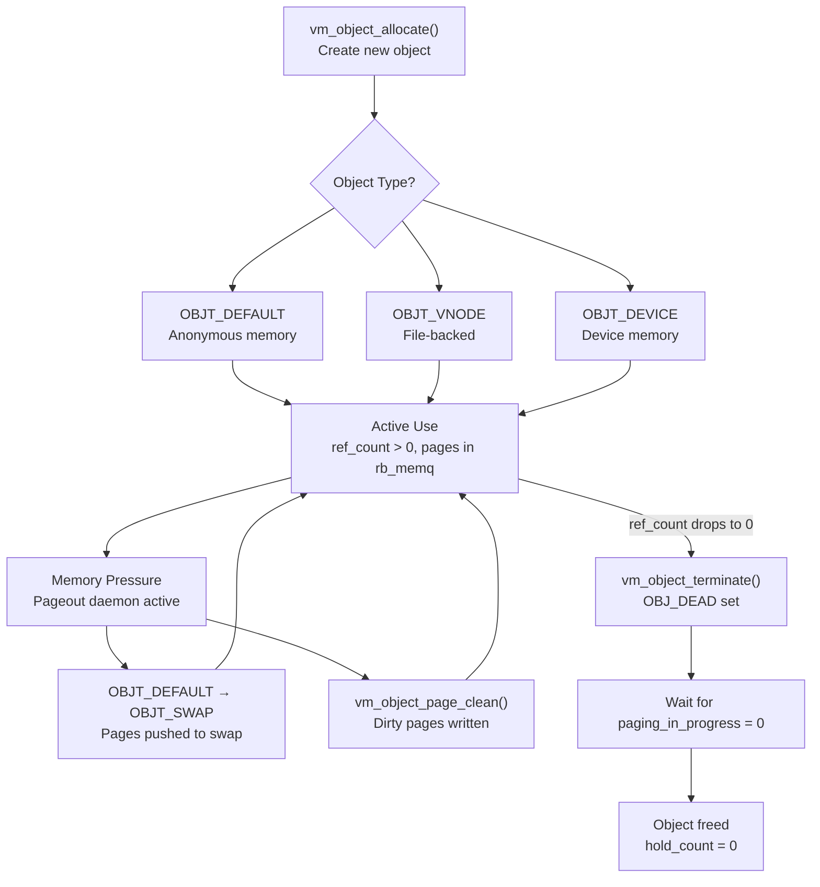
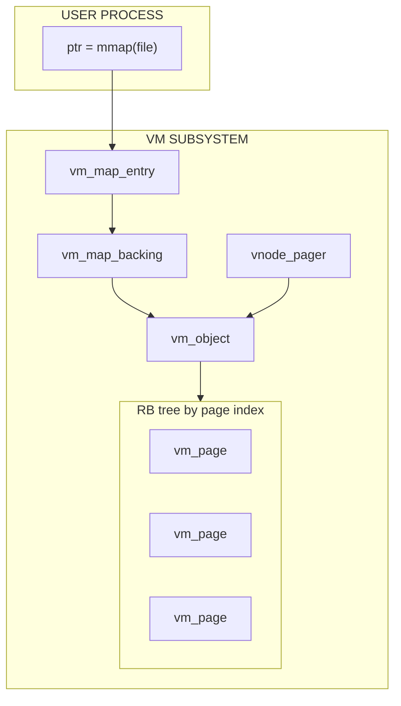

# VM Objects

VM objects are the fundamental abstraction for managing virtual memory contents in DragonFly BSD. Each object represents a contiguous range of virtual memory that can be backed by files, swap space, devices, or anonymous memory.

**Source file:** `sys/vm/vm_object.c` (~2,034 lines)

---

## Why VM Objects Matter

Every byte of virtual memory in the system—whether it's a mapped file, heap allocation, or shared library—is ultimately backed by a VM object. Objects are the kernel's answer to several fundamental questions:

**What happens when two processes map the same file?**

Without a unifying abstraction, each process would have its own copy of the file's pages, wasting memory and creating consistency nightmares. VM objects solve this: a single `OBJT_VNODE` object holds all pages for a file, and multiple processes simply reference the same object. Modify page 5 in one process, and every other mapping sees it immediately.

**How does the kernel know where to get a page's contents?**

When a page fault occurs, the kernel needs to know: is this page in memory? On disk? In a swap file? Part of a device? The VM object knows. Its `type` field determines the *pager*—the mechanism for populating missing pages. Each object type has different rules:

| Object Type | Where Pages Come From | When Used |
|-------------|----------------------|-----------|
| `OBJT_VNODE` | Read from file via vnode | `mmap(file)`, executables, shared libraries |
| `OBJT_SWAP` | Read from swap partition | Heap memory under pressure, `shm_open()` |
| `OBJT_DEFAULT` | Zero-filled on demand | Fresh `malloc()`, new stack pages |
| `OBJT_DEVICE` | Device provides pages | GPU memory, framebuffers |
| `OBJT_MGTDEVICE` | Device manages page lifecycle | Modern GPU drivers |

**How does copy-on-write work efficiently?**

When `fork()` creates a child process, copying all memory would be prohibitively slow. Instead, the child's `vm_map_backing` structures point to the *same* objects as the parent. Pages are marked read-only; only when either process writes does the kernel copy the page. The object is the shared foundation that makes COW possible.

**How does the kernel track dirty pages for writeback?**

The filesystem syncer needs to know which files have modified pages. Rather than scanning all pages in the system, it checks `OBJ_MIGHTBEDIRTY` on vnode objects. Objects aggregate page state, making system-wide operations tractable.

---

## The Life of an Object

Objects transition through different types and states during their lifetime:



**Key transitions:**

1. **DEFAULT → SWAP**: When memory pressure forces an anonymous page to swap, the object silently converts from `OBJT_DEFAULT` to `OBJT_SWAP`. The first `swp_pager_meta_build()` call triggers this.

2. **Active → Dead**: When `ref_count` drops to zero, `vm_object_terminate()` sets `OBJ_DEAD` and begins teardown. The object can't accept new references.

3. **Dead → Freed**: The object waits for `paging_in_progress` to reach zero (no pending I/O), frees all pages, notifies the pager, and finally frees itself when `hold_count` reaches zero.

---

## Key Design Principles

| Problem | Without Objects | DragonFly's Solution |
|---------|----------------|---------------------|
| **Shared file mappings** | Each process has separate pages; no coherence | Single object per vnode; all mappings share pages |
| **Page fault handling** | Fault handler needs to know backing store type | Object's `type` field selects appropriate pager |
| **Copy-on-write** | Full copy on fork (slow, wasteful) | Child references same objects; COW on write |
| **Dirty page tracking** | Scan all pages to find dirty ones | `OBJ_MIGHTBEDIRTY` flag aggregates state |
| **Lock contention** | Single lock for all pages | Per-object LWKT token; operations on different objects don't contend |
| **Reference counting races** | Complex locking for ref count changes | Atomic ops + hold_count pattern for safe access |
| **Page lookup** | Linear scan or hash table | Per-object RB tree; O(log n) by page index |

---

## Where Objects Fit in the VM Hierarchy



**Key insight:** Objects are the *container* for pages. They don't manage address spaces (that's `vm_map`) or physical allocation (that's `vm_page`). They manage:

- Which pages belong together logically
- How to populate missing pages (via pager)
- Sharing between processes (file-backed)

## Common Scenarios

| Scenario | Object Type | What Happens |
|----------|-------------|--------------|
| `malloc(large)` | OBJT_DEFAULT→OBJT_SWAP | Anonymous object created, pages added on fault, swapped under pressure |
| `mmap(file)` | OBJT_VNODE | Object tied to vnode, pages loaded from file on fault |
| `fork()` | Parent's objects | Child gets new vm_map_backing pointing to same objects (COW) |
| GPU memory | OBJT_MGTDEVICE | Device manages pages, object tracks mappings |
| `shm_open()` | OBJT_SWAP | Swap-backed object shared between processes |

---

## Overview

A VM object maintains:

- A red-black tree of resident physical pages (`rb_memq`)
- Reference count for lifetime management
- Type-specific backing store (file, swap, device)
- A list of `vm_map_backing` structures that reference this object

Objects are the bridge between address space mappings (`vm_map_entry`) and physical pages (`vm_page`). A single page exists within exactly one object at any given time.

## Object Types

```c
enum obj_type {
    OBJT_DEFAULT,    /* Anonymous memory, initially no backing */
    OBJT_SWAP,       /* Backed by swap blocks */
    OBJT_VNODE,      /* Backed by file (vnode) */
    OBJT_DEVICE,     /* Device-backed pages */
    OBJT_MGTDEVICE,  /* Managed device pager */
    OBJT_PHYS,       /* Physical pages (no paging) */
    OBJT_DEAD,       /* Being destroyed */
    OBJT_MARKER,     /* List iteration marker */
};
```

### Type Characteristics

| Type | Backing Store | Pages in rb_memq | Swappable |
|------|---------------|------------------|-----------|
| OBJT_DEFAULT | None initially | Yes | Converts to SWAP |
| OBJT_SWAP | Swap blocks | Yes | Yes |
| OBJT_VNODE | File | Yes | Via file I/O |
| OBJT_DEVICE | Device memory | No (typically) | No |
| OBJT_MGTDEVICE | Managed device | Via backing_list | No |

## Data Structures

### struct vm_object

```c
struct vm_object {
    struct lwkt_token token;           /* Soft-lock for object */
    struct lock backing_lk;            /* Lock for backing_list only */
    struct vm_page_rb_tree rb_memq;    /* Resident pages (RB tree) */
    TAILQ_HEAD(,vm_map_backing) backing_list;  /* Who references us */
    
    vm_pindex_t size;                  /* Size in pages */
    int ref_count;                     /* Reference count */
    int hold_count;                    /* Destruction prevention */
    u_int paging_in_progress;          /* Active I/O operations */
    
    objtype_t type;                    /* OBJT_* type */
    u_short flags;                     /* OBJ_* flags */
    vm_memattr_t memattr;              /* Memory attributes (PAT) */
    u_short pg_color;                  /* Base page color */
    
    void *handle;                      /* Type-specific (vnode, dev) */
    long resident_page_count;          /* Cached page count */
    int generation;                    /* Modification counter */
    
    /* Swap support */
    struct swblock_rb_tree swblock_root;
    long swblock_count;
};
```

### Object Flags

| Flag | Description |
|------|-------------|
| `OBJ_ACTIVE` | Object is active |
| `OBJ_DEAD` | Being destroyed |
| `OBJ_NOSPLIT` | Don't split this object |
| `OBJ_ONEMAPPING` | Each page maps to at most one vm_map_entry |
| `OBJ_WRITEABLE` | Has been made writeable |
| `OBJ_MIGHTBEDIRTY` | May have dirty pages |
| `OBJ_CLEANING` | Page cleaning in progress |
| `OBJ_DEADWNT` | Waiter for object death |

### Global Hash Table

Objects are tracked in a 256-bucket hash table for global enumeration:

```c
struct vm_object_hash vm_object_hash[VMOBJ_HSIZE];  /* VMOBJ_HSIZE = 256 */
```

Each bucket contains a TAILQ list protected by an LWKT token. The hash function uses two large primes for distribution.

## Locking Model

DragonFly uses LWKT tokens (soft-locks) for VM objects, allowing blocking while held:

| Function | Description |
|----------|-------------|
| `vm_object_hold(obj)` | Acquire hold + exclusive token |
| `vm_object_hold_shared(obj)` | Acquire hold + shared token |
| `vm_object_hold_try(obj)` | Non-blocking hold attempt |
| `vm_object_drop(obj)` | Release hold + token |

### Hold Count vs Reference Count

- **ref_count**: Logical references (from mappings, etc.)
- **hold_count**: Prevents object from being freed while working with it

The hold/drop pattern is critical:

```c
/* Must increment hold_count BEFORE blocking on token */
refcount_acquire(&obj->hold_count);  /* Makes object stable */
vm_object_lock(obj);                 /* May block */
/* ... work with object ... */
vm_object_unlock(obj);
if (refcount_release(&obj->hold_count)) {
    if (obj->ref_count == 0 && (obj->flags & OBJ_DEAD))
        kfree_obj(obj, M_VM_OBJECT);  /* Final free */
}
```

## Object Lifecycle

### Allocation

```c
/* Returns unheld object */
vm_object_t vm_object_allocate(objtype_t type, vm_pindex_t size);

/* Returns held object for atomic initialization */
vm_object_t vm_object_allocate_hold(objtype_t type, vm_pindex_t size);
```

Initialization (`_vm_object_allocate()`) performs:

1. Initialize page RB tree and token
2. Initialize `backing_list` and `backing_lk`
3. Set type, size, ref_count=1
4. For DEFAULT/SWAP: set `OBJ_ONEMAPPING`
5. Assign random page color via `vm_quickcolor()`
6. Initialize swap block tree
7. Insert into global hash table

### Reference Counting

**Adding references:**

```c
/* Must hold object token */
void vm_object_reference_locked(vm_object_t object);

/* Safe without token when object is deterministically referenced */
void vm_object_reference_quick(vm_object_t object);
```

For `OBJT_VNODE` objects, these also call `vref()` on the vnode.

**Releasing references:**

```c
void vm_object_deallocate(vm_object_t object);
```

The deallocation path optimizes for the common case:

- **Fast path** (ref_count > 3): Atomic decrement without locking
- **Slow path** (ref_count <= 3): Hold object, handle termination

This avoids exclusive lock contention on highly-shared binaries during exec/exit.

### Termination

When ref_count reaches zero, `vm_object_terminate()` is called:

1. Set `OBJ_DEAD` flag
2. Wait for `paging_in_progress` to reach 0
3. For `OBJT_VNODE`:
   - `vinvalbuf()` - flush buffers
   - `vm_object_page_clean()` - write dirty pages
   - `vinvalbuf()` again (TMPFS special case)
4. Free all resident pages via callback
5. `vm_pager_deallocate()` - notify pager
6. Remove from hash table
7. Object freed when hold_count reaches 0

## Page Management

### Page Cleaning

`vm_object_page_clean()` writes dirty pages to backing store:

```c
void vm_object_page_clean(vm_object_t object, 
                          vm_pindex_t start, 
                          vm_pindex_t end,
                          int flags);
```

**Flags:**

| Flag | Description |
|------|-------------|
| `OBJPC_SYNC` | Synchronous I/O |
| `OBJPC_INVAL` | Invalidate after cleaning |
| `OBJPC_NOSYNC` | Skip PG_NOSYNC pages |
| `OBJPC_CLUSTER_OK` | Allow I/O clustering |

**Two-pass algorithm:**

1. **Pass 1**: Mark all pages read-only (`vm_page_protect(VM_PROT_READ)`)
   - Sets `PG_CLEANCHK` flag on each page
   - If entire object cleaned: clears `OBJ_WRITEABLE|OBJ_MIGHTBEDIRTY`

2. **Pass 2**: Write dirty pages
   - Skips pages without `PG_CLEANCHK` (inserted after pass 1)
   - Clusters adjacent dirty pages for efficient I/O
   - Repeats if object's generation changes

### Page Removal

```c
void vm_object_page_remove(vm_object_t object,
                           vm_pindex_t start,
                           vm_pindex_t end,
                           boolean_t clean_only);
```

This function:

1. Scans `backing_list` to remove pmap mappings (important for MGTDEVICE)
2. Scans `rb_memq` to free pages
3. Frees related swap blocks

The `clean_only` flag preserves dirty pages.

### madvise Support

```c
void vm_object_madvise(vm_object_t object,
                       vm_pindex_t pindex,
                       vm_pindex_t count,
                       int advise);
```

| Advise | Action |
|--------|--------|
| `MADV_WILLNEED` | Activate pages (move to active queue) |
| `MADV_DONTNEED` | Deactivate pages (candidate for reclaim) |
| `MADV_FREE` | Mark clean + deactivate + free swap |

`MADV_FREE` is restricted to `OBJT_DEFAULT`/`OBJT_SWAP` objects with `OBJ_ONEMAPPING`.

## Object Coalescing

```c
boolean_t vm_object_coalesce(vm_object_t prev_object,
                             vm_pindex_t prev_pindex,
                             vm_size_t prev_size,
                             vm_size_t next_size);
```

Extends an object into adjacent virtual memory:

- Only for `OBJT_DEFAULT`/`OBJT_SWAP`
- Requires single reference (or extending into new space)
- Removes any existing pages in the new region
- Updates `object->size`

## Vnode Object Handling

`OBJT_VNODE` objects have special handling:

- **Reference counting**: `vref()`/`vrele()` called alongside object refs
- **VTEXT flag**: Cleared on last reference (executable text)
- **Dirty tracking**: `VOBJDIRTY` flag on vnode for syncer
- **Page cleaning**: Double `vinvalbuf()` for TMPFS compatibility

The `vm_object_vndeallocate()` function handles the complex 1->0 transition:

```c
/* Atomically handle ref_count with retry loop */
if (count == 1) {
    vm_object_upgrade(object);      /* Need exclusive for VTEXT */
    if (atomic_fcmpset_int(&object->ref_count, &count, 0)) {
        vclrflags(vp, VTEXT);
        break;
    }
}
```

## Dirty Flag Management

```c
void vm_object_set_writeable_dirty(vm_object_t object);
```

Called from the fault path when a page becomes writeable:

1. Sets `OBJ_WRITEABLE | OBJ_MIGHTBEDIRTY` on object
2. For `OBJT_VNODE`: sets `VOBJDIRTY` on vnode
   - Uses `vsetobjdirty()` for `MNTK_THR_SYNC` mounts
   - Uses `vsetflags()` for traditional mounts

The flags check before atomic operation avoids contention in the fault path.

## DragonFly-Specific Features

### LWKT Token Locking

Unlike traditional BSD mutexes, LWKT tokens allow:

- Blocking while held
- Other threads to "squeeze in" work
- Shared/exclusive modes
- Token swapping for lock ordering

### backing_list

Each object maintains a list of `vm_map_backing` structures:

```c
TAILQ_HEAD(, vm_map_backing) backing_list;
struct lock backing_lk;  /* Separate lock for this list */
```

This enables:

- Efficient pmap removal during page removal
- Support for `OBJT_MGTDEVICE` (pages not in rb_memq)
- Tracking all mappings of an object

### Page Coloring

`vm_quickcolor()` provides semi-random initial page colors:

```c
int vm_quickcolor(void) {
    globaldata_t gd = mycpu;
    int pg_color = (int)(intptr_t)gd->gd_curthread >> 10;
    pg_color += gd->gd_quick_color;
    gd->gd_quick_color += PQ_PRIME2;
    return pg_color;
}
```

This spreads page allocations across queues for SMP scalability.

## Debugging

DDB commands for object inspection:

| Command | Description |
|---------|-------------|
| `show vmochk` | Verify internal objects are mapped |
| `show object <addr>` | Print object details and pages |
| `show vmopag` | Print page runs for all objects |

---

## Common Usage Patterns

### Pattern 1: Allocating an Anonymous Object

When kernel code needs a private, anonymous memory region (e.g., for a new process's stack):

```c
vm_object_t object;

/* Allocate a 16-page anonymous object */
object = vm_object_allocate(OBJT_DEFAULT, 16);

/* Object starts with ref_count=1, no pages yet */
/* Pages will be zero-filled on first fault */

/* Later, when done: */
vm_object_deallocate(object);
```

### Pattern 2: Working with an Object Safely

The hold/drop pattern ensures an object won't disappear while you're using it:

```c
vm_object_t object = /* obtained from somewhere */;

/* Acquire hold + exclusive token (may block) */
vm_object_hold(object);

/* Safe to access object fields and pages */
if (object->resident_page_count > 0) {
    vm_page_t p;
    /* Iterate pages in RB tree */
    RB_FOREACH(p, vm_page_rb_tree, &object->rb_memq) {
        /* Process page */
    }
}

/* Release hold + token */
vm_object_drop(object);
```

### Pattern 3: Cleaning Dirty Pages Before Unmount

Filesystems call this to flush modified pages back to disk:

```c
vm_object_t object = vp->v_object;

if (object != NULL) {
    vm_object_hold(object);
    
    /* Synchronously clean all pages, invalidate after */
    vm_object_page_clean(object, 
                         0,                  /* start page index */
                         object->size,       /* end page index */
                         OBJPC_SYNC | OBJPC_INVAL);
    
    vm_object_drop(object);
}
```

### Pattern 4: Looking Up a Page in an Object

Finding a specific page by its index within an object:

```c
vm_object_hold(object);

vm_page_t page = vm_page_lookup(object, pindex);
if (page != NULL) {
    /* Page exists in object's rb_memq */
    if (page->valid == VM_PAGE_BITS_ALL) {
        /* Page is fully valid, can be used */
    }
} else {
    /* Page not resident - would need fault or explicit alloc */
}

vm_object_drop(object);
```

### Pattern 5: Handling Object Type Transitions

Anonymous objects silently convert to swap-backed when pages are pushed out:

```c
/* Initially OBJT_DEFAULT */
object = vm_object_allocate(OBJT_DEFAULT, size);

/* ... pages faulted in, memory pressure occurs ... */

/* Swap pager converts type when storing first page */
/* In swap_pager.c: */
if (object->type == OBJT_DEFAULT) {
    object->type = OBJT_SWAP;
    object->un_pager.swp.swp_blks = NULL;
}

/* Code should handle both types for anonymous memory */
if (object->type == OBJT_DEFAULT || object->type == OBJT_SWAP) {
    /* Anonymous memory handling */
}
```

---

## Further Reading

- **"The Design and Implementation of the 4.4BSD Operating System"** (McKusick et al.) - Chapter 5 covers the VM system design that DragonFly inherited and evolved
- **"Design elements of the FreeBSD VM system"** - [FreeBSD Architecture Handbook](https://docs.freebsd.org/en/books/arch-handbook/vm/) - DragonFly's VM has diverged but shares heritage
- **DragonFly commit history for vm_object.c** - Shows evolution of LWKT tokens, backing_list, and other DragonFly-specific changes
- [vm_page.md](vm_page.md) - Physical page management, closely related to object page operations
- [vm_fault.md](vm_fault.md) - How page faults interact with objects to populate pages

---

## See Also

- [VM Subsystem Overview](index.md) - Architecture overview
- [Physical Page Management](vm_page.md) - Page allocation and queues
