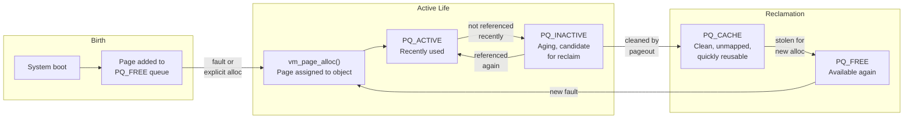
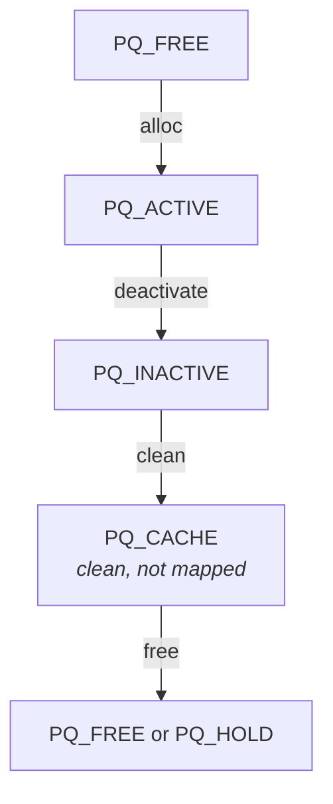

# Physical Page Management

This document describes DragonFly BSD's physical page management subsystem, implemented in `sys/vm/vm_page.c`. The subsystem manages all physical memory pages in the system, including allocation, freeing, queue management, and state transitions.

**Source file:** `sys/vm/vm_page.c` (~4,200 lines)

---

## Why Physical Page Management Matters

Physical memory is a finite resource that every process, the kernel, and the filesystem cache compete for. The page management subsystem is the arbiter of this competition—it decides which processes get memory, which pages stay resident, and which get evicted to disk.

Without sophisticated page management:

- **Lock contention** would serialize all memory operations on multi-core systems
- **Memory fragmentation** would prevent allocation of contiguous regions for DMA
- **Unfair allocation** would let memory-hungry processes starve others
- **Poor locality** would cause cache misses as CPUs access remote NUMA memory

DragonFly's page management addresses these with 1024-way queue coloring (reducing lock contention), NUMA-aware allocation (improving locality), and nice-aware paging thresholds (ensuring fairness).

---

## The Life of a Page

Before diving into data structures, it helps to understand the typical journey of a physical page:



**1. Birth (Boot):** During system startup, `vm_page_startup()` creates a `struct vm_page` for every physical page and places them on `PQ_FREE` queues.

**2. Allocation:** When a page fault occurs or the kernel needs memory, `vm_page_alloc()` pulls a page from `PQ_FREE`, associates it with a `vm_object`, and marks it busy while I/O loads its contents.

**3. Active Use:** The page lives on `PQ_ACTIVE` while processes access it. Each access refreshes its "activity count," keeping it resident.

**4. Aging:** If a page isn't accessed for a while, the pageout daemon moves it to `PQ_INACTIVE`. This is a "second chance"—if accessed again, it returns to `PQ_ACTIVE`.

**5. Cleaning:** If the page remains inactive and is dirty, the pageout daemon writes it to its backing store (swap or file). Now clean, it moves to `PQ_CACHE`.

**6. Reclamation:** `PQ_CACHE` pages are still valid but unmapped. If memory pressure rises, they're the first victims—instantly reusable without I/O. Otherwise, they may be reactivated if faulted again.

**7. Rebirth:** Eventually the page returns to `PQ_FREE`, ready for a new allocation.

---

## When You Need This

| Scenario | Key Functions | Section |
|----------|---------------|---------|
| Allocating a page during fault handling | `vm_page_alloc()`, `vm_page_grab()` | [Page Allocation](#page-allocation) |
| Understanding why a page can't be freed | Wire count, hold count, busy state | [Wire/Unwire](#wireunwire), [Hold](#holdunhold), [Busy State](#busy-state-management) |
| Implementing a new pager | `vm_page_set_valid()`, `vm_page_dirty()` | [Valid/Dirty Bits](#validdirty-bit-management) |
| Debugging memory pressure issues | Page queues, vmstats | [Page Queues](#page-queues), [Memory Pressure](#memory-pressure-handling) |
| Writing DMA-capable driver code | `vm_page_alloc_contig()` | [Contiguous Allocation](#contiguous-allocation) |
| Understanding pageout victim selection | Queue transitions | [Page State Transitions](#page-state-transitions) |

---

## Overview

Every physical page in the system is represented by a `struct vm_page` (128 bytes). These structures are stored in a global array (`vm_page_array`) and indexed by physical page number. The VM system organizes pages into multiple queues based on their state and uses sophisticated coloring and NUMA-aware algorithms to optimize memory locality.

### Key Design Principles

| Principle | Problem Solved | DragonFly's Solution |
|-----------|----------------|----------------------|
| **Page coloring** | Lock contention on page queues | 1024 sub-queues per queue type; each CPU typically hits different queues |
| **NUMA awareness** | Cross-socket memory latency | Color calculation incorporates socket/core topology |
| **Atomic busy state** | Lock overhead for page access | Busy counts instead of locks; soft-busy for shared access |
| **Per-CPU statistics** | Cache-line bouncing on global counters | Each CPU caches vmstats locally; periodic rollup to global |

### Why Five Queues?

The five page queues implement a **multi-stage replacement policy** that balances responsiveness with efficiency:

| Queue | Purpose | Why It Exists |
|-------|---------|---------------|
| `PQ_FREE` | Immediately allocatable | Fast allocation without any cleanup needed |
| `PQ_ACTIVE` | Recently used pages | Protects working set from premature eviction |
| `PQ_INACTIVE` | Second-chance candidates | Gives pages time to be re-referenced before eviction |
| `PQ_CACHE` | Clean, valid, unmapped | Zero-cost reuse if same data needed; instant free otherwise |
| `PQ_HOLD` | Temporarily pinned | Prevents race conditions during sensitive operations |

This design avoids the pathological behavior of simpler schemes:
- Pure LRU would evict pages that happen to be accessed in large sequential scans
- Pure FIFO would evict frequently-used pages just because they're old
- The active/inactive split approximates LRU while the cache queue enables instant reclamation of clean pages

## DragonFly-Specific Design Choices

This section explains *why* DragonFly's page management differs from traditional BSD.

### 1024-Color Page Queues

Traditional BSD systems use a single lock per queue type. On a 64-core system, this becomes a severe bottleneck—every page allocation/free contends on the same lock.

DragonFly divides each queue type into 1024 sub-queues ("colors"). The page color is derived from its physical address and CPU topology, so:

- CPUs on different sockets naturally hit different queue subsets
- Even CPUs on the same socket distribute across colors
- Lock contention drops by ~1000x compared to single-queue designs

The 1024 value balances granularity (more = less contention) against memory overhead (each queue has its own spinlock and list head).

### Atomic Busy Counts vs. Locks

Traditional BSD uses `lockmgr` locks on pages. DragonFly replaces this with atomic busy counts:

```
busy_count field:
  [31]    PBUSY_LOCKED   - Hard busy (exclusive)
  [30]    PBUSY_WANTED   - Someone waiting
  [29]    PBUSY_SWAPINPROG - Swap I/O active
  [28:0]  Soft-busy count (shared)
```

Benefits:
- **No lock structure overhead** per page
- **Soft-busy allows concurrency**: Multiple readers can soft-busy a page simultaneously
- **Atomic operations** are faster than lock acquire/release cycles
- **Integrates with LWKT**: Waiters use `tsleep()`/`wakeup()` patterns

### Per-CPU Statistics

Global `vmstats` would cause cache-line bouncing on every alloc/free. DragonFly caches adjustments per-CPU:

```c
mycpu->gd_vmstats_adj.v_free_count += delta;  // Fast, local
// Periodically or when threshold exceeded:
atomic_add(&vmstats.v_free_count, accumulated_delta);  // Slow, global
```

This reduces cross-CPU cache invalidations from O(allocations) to O(sync_intervals).

### NUMA-Aware Coloring

On NUMA systems, accessing memory on a remote socket incurs 2-3x latency. DragonFly's `vm_get_pg_color()` encodes CPU topology into the color:

```
Color bits: [socket_id][core_id][ht_id][set_associativity]
```

Result: A CPU naturally allocates pages from queues that contain pages physically close to it.

### Nice-Aware Paging Thresholds

When memory is low, all processes compete to allocate. Traditional systems give equal priority to all. DragonFly adjusts paging thresholds based on process nice value:

- Nice 0 process: blocks at `v_free_min`
- Nice +10 process: blocks earlier (at higher free count)
- Nice -10 process: blocks later (can dig deeper into reserves)

This prevents a `nice +19` background job from consuming memory needed by interactive processes.

---

## Data Structures

### Page Array

```c
vm_page_t vm_page_array;           // Global array of all vm_page structures
vm_pindex_t vm_page_array_size;    // Number of entries
vm_pindex_t first_page;            // First physical page index
```

The macro `PHYS_TO_VM_PAGE(pa)` converts a physical address to its corresponding `vm_page` pointer.

### Page Queues

```c
struct vpgqueues vm_page_queues[PQ_COUNT];
```

Five queue types, each with 1024 color variants (`PQ_L2_SIZE`):

| Queue Type | Purpose |
|------------|---------|
| `PQ_FREE` | Available for allocation |
| `PQ_CACHE` | Clean pages, immediately reusable |
| `PQ_INACTIVE` | Low activity, candidates for reclamation |
| `PQ_ACTIVE` | Recently referenced pages |
| `PQ_HOLD` | Temporarily held (prevents freeing) |

Each `struct vpgqueues` contains:
- `spin` - Per-queue spinlock
- `pl` - Page list (TAILQ)
- `lcnt` - Local count
- `lastq` - Heuristic for skipping empty queues

### Page Hash Table

A lockless heuristic cache for fast page lookups:

```c
struct vm_page_hash_elm {
    vm_page_t   m;
    vm_object_t object;   // Cached for fast comparison
    vm_pindex_t pindex;   // Cached for fast comparison
    int         ticks;    // LRU timestamp
};
```

- 4-way set associative (`VM_PAGE_HASH_SET`)
- Maximum 8 million entries
- Only caches pages with `PG_MAPPEDMULTI` flag

---

## Boot-Time Initialization

### `vm_page_startup()`

Called early in boot to initialize the page management subsystem:

1. **Aligns physical memory ranges** - Rounds `phys_avail[]` to page boundaries
2. **Initializes page queues** - Creates 5120 queue structures (5 types × 1024 colors)
3. **Allocates minidump bitmap** - For crash dump support
4. **Allocates vm_page_array** - One `struct vm_page` per physical page
5. **Initializes page structures** - Sets up spinlocks and physical addresses
6. **Populates free queues** - Adds pages in ascending physical order

### Page Color Calculation

During boot, page colors are calculated with CPU locality twisting:

```c
m->pc = (pa >> PAGE_SHIFT);
m->pc ^= ((pa >> PAGE_SHIFT) / PQ_L2_SIZE);
m->pc ^= ((pa >> PAGE_SHIFT) / (PQ_L2_SIZE * PQ_L2_SIZE));
m->pc &= PQ_L2_MASK;
```

This distributes pages across queues while maintaining locality.

### NUMA Organization

`vm_numa_organize()` reorganizes page colors based on physical socket ID:

```c
socket_mod = PQ_L2_SIZE / cpu_topology_phys_ids;
socket_value = (physid % cpu_topology_phys_ids) * socket_mod;
```

`vm_numa_organize_finalize()` then balances queues to prevent empty queues that would force cross-socket borrowing.

### DMA Reserve

Low physical memory is reserved for DMA operations:

- **`vm_low_phys_reserved`**: Threshold for DMA reserve (default 65536 pages)
- **`vm_dma_reserved`**: Tunable amount to keep reserved (default 128MB on 2G+ systems)
- Pages in this range are marked `PG_FICTITIOUS | PG_UNQUEUED` and managed by `vm_contig_alist`

---

## Page Allocation

### `vm_page_alloc()`

The primary page allocation function.

```c
vm_page_t vm_page_alloc(vm_object_t object, vm_pindex_t pindex, int page_req);
```

**Allocation flags:**

| Flag | Description |
|------|-------------|
| `VM_ALLOC_NORMAL` | Can use cache pages |
| `VM_ALLOC_QUICK` | Free queue only, skip cache |
| `VM_ALLOC_SYSTEM` | Can exhaust most of free list |
| `VM_ALLOC_INTERRUPT` | Can exhaust entire free list |
| `VM_ALLOC_CPU(n)` | CPU localization hint |
| `VM_ALLOC_ZERO` | Zero page if allocated |
| `VM_ALLOC_NULL_OK` | Return NULL on collision |

**Algorithm:**

1. Calculate page color via `vm_get_pg_color(cpuid, object, pindex)`
2. Check free count against thresholds
3. Search free queue (and optionally cache queue)
4. If using cache page, free it first then retry
5. Insert into object if provided
6. Return BUSY page

### CPU-Localized Color Selection

`vm_get_pg_color()` calculates colors considering CPU topology:

```c
// General format: [phys_id][core_id][cpuid][set-associativity]
physcale = PQ_L2_SIZE / cpu_topology_phys_ids;
grpscale = physcale / cpu_topology_core_ids;
cpuscale = grpscale / cpu_topology_ht_ids;

pg_color = phys_id * physcale;
pg_color += core_id * grpscale;
pg_color += ht_id * cpuscale;
pg_color += (pindex + object_pg_color) % cpuscale;
```

### Queue Search Algorithm

`_vm_page_list_find()` searches for pages with widening locality:

1. Try exact color queue first
2. Widen search: 16 → 32 → 64 → 128 → ... → 1024 queues
3. Track `lastq` to skip known-empty queues
4. Return spinlocked page removed from queue

### Contiguous Allocation

For DMA and device drivers requiring physically contiguous memory:

```c
vm_page_t vm_page_alloc_contig(vm_paddr_t low, vm_paddr_t high,
                               unsigned long alignment,
                               unsigned long boundary,
                               unsigned long size,
                               vm_memattr_t memattr);
```

Uses the `vm_contig_alist` allocator for low-memory DMA pages.

### Other Allocation Functions

| Function | Description |
|----------|-------------|
| `vm_page_alloczwq()` | Allocate without object, returns wired page |
| `vm_page_grab()` | Lookup-or-allocate with object |

---

## Page Freeing

### `vm_page_free_toq()`

The main page freeing function:

1. Assert page not mapped (calls `pmap_mapped_sync()` if needed)
2. Remove from object via `vm_page_remove()`
3. For fictitious pages: just wakeup and return
4. Remove from current queue
5. Clear valid/dirty bits
6. Place on appropriate queue:
   - `PQ_HOLD` if `hold_count != 0`
   - `PQ_FREE` otherwise (at head for cache-hot)
7. Wake up page waiters
8. Wake memory-waiting threads via `vm_page_free_wakeup()`

### Free Wakeup Logic

`vm_page_free_wakeup()` signals:
- **Pageout daemon**: If it needs pages and threshold met
- **Memory-waiting processes**: If above hysteresis threshold

---

## Page State Transitions



### Activation

`vm_page_activate()` moves a page to `PQ_ACTIVE`:
- Sets `act_count` to at least `ACT_INIT`
- Wakes pagedaemon if page was on cache/free queue

### Deactivation

`vm_page_deactivate()` moves a page to `PQ_INACTIVE`:
- Clears `PG_WINATCFLS` flag
- Optional `athead` for pseudo-cache behavior (MADV_DONTNEED)

### Caching

`vm_page_cache()` moves a clean page to `PQ_CACHE`:
- Removes all pmap mappings first
- Dirty pages are deactivated instead

---

## Busy State Management

DragonFly uses atomic busy counts instead of traditional locks.

### Hard Busy (`PBUSY_LOCKED`)

Exclusive access to the page.

```c
void vm_page_busy_wait(vm_page_t m, int also_m_busy, const char *msg);
int  vm_page_busy_try(vm_page_t m, int also_m_busy);
void vm_page_wakeup(vm_page_t m);
```

- `vm_page_busy_wait()`: Blocks until page not busy
- `vm_page_busy_try()`: Non-blocking attempt, returns TRUE on failure
- `vm_page_wakeup()`: Clears busy and wakes waiters

### Soft Busy (`PBUSY_MASK`)

Shared access for compatible operations (e.g., read-only mapping during write).

```c
void vm_page_io_start(vm_page_t m);   // Increment soft-busy (requires hard-busy)
void vm_page_io_finish(vm_page_t m);  // Decrement soft-busy
int  vm_page_sbusy_try(vm_page_t m);  // Non-blocking soft-busy acquire
```

### Waiting

`vm_page_sleep_busy()` sleeps until page not busy without acquiring it.

---

## Wire/Unwire

Wiring prevents a page from being paged out.

```c
void vm_page_wire(vm_page_t m);
void vm_page_unwire(vm_page_t m, int activate);
```

- `vm_page_wire()`: Increments `wire_count`, adjusts vmstats on 0→1
- `vm_page_unwire()`: Decrements `wire_count`, activates or deactivates on 1→0
- Fictitious pages ignore wire operations

---

## Hold/Unhold

Holding prevents page reuse but not disassociation from object.

```c
void vm_page_hold(vm_page_t m);
void vm_page_unhold(vm_page_t m);
```

On last unhold, if page is on `PQ_HOLD`, it moves to `PQ_FREE`.

---

## Page Lookup

### Standard Lookup

```c
vm_page_t vm_page_lookup(vm_object_t object, vm_pindex_t pindex);
```

Requires object token held. Does RB-tree lookup and populates hash cache.

### Lookup + Busy

```c
// Blocking
vm_page_t vm_page_lookup_busy_wait(vm_object_t object, vm_pindex_t pindex,
                                   int also_m_busy, const char *msg);

// Non-blocking
vm_page_t vm_page_lookup_busy_try(vm_object_t object, vm_pindex_t pindex,
                                  int also_m_busy, int *errorp);
```

### Fast Heuristic Lookup

```c
vm_page_t vm_page_hash_get(vm_object_t object, vm_pindex_t pindex);
```

Lockless lookup returning soft-busied page on hit.

---

## Valid/Dirty Bit Management

Each page has 8 valid and 8 dirty bits (one per DEV_BSIZE chunk, typically 512 bytes).

### Functions

| Function | Description |
|----------|-------------|
| `vm_page_bits(base, size)` | Convert range to bit mask |
| `vm_page_set_valid()` | Set valid bits, zero invalid portions |
| `vm_page_set_validclean()` | Set valid, clear dirty |
| `vm_page_set_validdirty()` | Set both valid and dirty |
| `vm_page_clear_dirty()` | Clear dirty bits |
| `vm_page_dirty()` | Set all dirty bits |
| `vm_page_test_dirty()` | Sync dirty from pmap |
| `vm_page_zero_invalid()` | Zero invalid portions before mapping |
| `vm_page_is_valid()` | Check if range is valid |

---

## Memory Pressure Handling

### Waiting Functions

| Function | Description |
|----------|-------------|
| `vm_wait()` | Block until memory available (I/O path) |
| `vm_wait_pfault()` | Block in page fault path (nice-aware) |
| `vm_wait_nominal()` | Block for kernel heavy operations |
| `vm_test_nominal()` | Test if vm_wait_nominal would block |

### Nice-Aware Paging

Process nice value affects paging thresholds:
- Higher nice = earlier blocking
- Prevents nice'd memory hogs from impacting normal processes

### Low Memory Kill

Processes with `P_LOWMEMKILL` flag can break out of wait loops.

---

## madvise Support

### `vm_page_dontneed()`

Implements `MADV_DONTNEED`:
- 3/32 chance: deactivate page
- 28/32 chance: deactivate at head (pseudo-cache)
- Clears `PG_REFERENCED`

---

## Special Page Types

### Fictitious Pages

Pages with `PG_FICTITIOUS` flag:
- Not in normal page array
- Created via `vm_page_initfake()`
- Wire/unwire operations ignored
- Used for device mappings (GPU, etc.)

### Pages Requiring Commit

Pages with `PG_NEED_COMMIT` flag:
- Cannot be reclaimed even if clean
- Used by tmpfs, NFS
- Set via `vm_page_need_commit()`

---

## Locking Rules

### Queue Operations

Locking order: **Page spinlock first, then queue spinlock**

```c
vm_page_spin_lock(m);           // Lock page
_vm_page_queue_spin_lock(m);    // Then lock its queue
// ... manipulate queue ...
_vm_page_queue_spin_unlock(m);  // Unlock queue first
vm_page_spin_unlock(m);         // Then unlock page
```

### Per-CPU Statistics

Queue adjustments update per-CPU vmstats:
- `mycpu->gd_vmstats_adj` - Accumulated adjustments
- `mycpu->gd_vmstats` - Current view
- Synchronized to global `vmstats` periodically or when threshold exceeded

---

## Common Usage Patterns

This section shows how page management functions work together in typical scenarios.

### Pattern 1: Page Fault Allocation

When a process accesses unmapped memory, the fault handler allocates and populates a page:

```c
/* Simplified from vm_fault.c */
vm_object_hold(object);

/* Try to find existing page */
m = vm_page_lookup_busy_wait(object, pindex, TRUE, "fault");
if (m == NULL) {
    /* Allocate new page - returns BUSY */
    m = vm_page_alloc(object, pindex, VM_ALLOC_NORMAL);
    if (m == NULL) {
        vm_wait_pfault(curproc, fault_flags);  /* Block if low memory */
        /* retry... */
    }
    
    /* Page is busy, safe to do I/O */
    error = pager_getpage(object, &m, 1);
    
    /* Mark valid after I/O completes */
    vm_page_set_valid(m, 0, PAGE_SIZE);
}

/* Wire into page table */
pmap_enter(pmap, va, m, prot, wired);

/* Release busy - page now accessible */
vm_page_wakeup(m);
vm_object_drop(object);
```

### Pattern 2: Pageout Daemon Scanning

The pageout daemon reclaims memory by scanning inactive pages:

```c
/* Simplified from vm_pageout.c */
TAILQ_FOREACH(m, &vm_page_queues[PQ_INACTIVE + color].pl, pageq) {
    if (vm_page_busy_try(m, TRUE) != 0)
        continue;  /* Skip busy pages */
    
    if (m->dirty) {
        /* Must clean before freeing */
        vm_pageout_clean(m);  /* Async write to backing store */
        vm_page_deactivate(m);
    } else {
        /* Clean page - move to cache for instant reuse */
        vm_page_cache(m);
    }
    
    vm_page_wakeup(m);
}
```

### Pattern 3: Driver DMA Buffer

Device drivers needing physically contiguous memory:

```c
/* Allocate 64KB contiguous, 16-byte aligned, below 4GB */
m = vm_page_alloc_contig(
    0,                      /* low address */
    0xFFFFFFFFULL,          /* high address (4GB) */
    16,                     /* alignment */
    0,                      /* boundary (0 = none) */
    64 * 1024,              /* size */
    VM_MEMATTR_UNCACHEABLE  /* memory attribute */
);

if (m) {
    phys_addr = VM_PAGE_TO_PHYS(m);
    /* Program DMA controller with phys_addr */
    
    /* Later, when done: */
    vm_page_free_contig(m, 64 * 1024);
}
```

### Pattern 4: Wiring Pages for I/O

Ensuring pages stay resident during I/O operations:

```c
/* Wire range to prevent pageout during I/O */
for (each page m in range) {
    vm_page_wire(m);
}

/* Pages now guaranteed resident */
start_io(buffer, length);
wait_for_io_completion();

/* Unwire when done */
for (each page m in range) {
    vm_page_unwire(m, 0);  /* 0 = deactivate, 1 = keep active */
}
```

---

## Debugging

### DDB Commands

| Command | Description |
|---------|-------------|
| `show page` | Display vmstats counters |
| `show pageq` | Display queue lengths per color |

### Sysctls

| Sysctl | Description |
|--------|-------------|
| `vm.dma_reserved` | Memory reserved for DMA |
| `vm.dma_free_pages` | Available DMA pages |
| `vm.page_hash_vnode_only` | Only hash vnode pages |

---

## Further Reading

### DragonFly Resources

- [VM Concepts](concepts.md) — Foundational VM theory and Mach heritage
- [VM Objects](vm_object.md) — How pages are grouped into objects
- [Page Faults](vm_fault.md) — How faults trigger page allocation
- [Pageout Daemon](vm_pageout.md) — Memory reclamation in detail

### External Resources

- **[The Design and Implementation of the FreeBSD Operating System](https://www.informit.com/store/design-and-implementation-of-the-freebsd-operating-9780321968975)** (McKusick et al.) — Chapter 5 covers BSD VM; DragonFly inherits this design
- **[Operating Systems: Three Easy Pieces](https://pages.cs.wisc.edu/~remzi/OSTEP/)** — Free online textbook; Chapters 18-22 cover paging and replacement
- **[Wikipedia: Page replacement algorithm](https://en.wikipedia.org/wiki/Page_replacement_algorithm)** — Overview of LRU, Clock, and related algorithms
- **[Wikipedia: NUMA](https://en.wikipedia.org/wiki/Non-uniform_memory_access)** — Background on NUMA architecture and why locality matters
- **[LWN: Memory management](https://lwn.net/Kernel/Index/#Memory_management)** — Linux perspective, but concepts transfer

### Source Files

| File | Description |
|------|-------------|
| `sys/vm/vm_page.c` | Implementation (~4,200 lines) |
| `sys/vm/vm_page.h` | `struct vm_page` definition, flags |
| `sys/vm/vm_page2.h` | Inline functions, paging thresholds |
| `sys/vm/vm_pageout.c` | Pageout daemon (consumer of this API) |

---

## See Also

- [VM Architecture Overview](index.md)
- [Memory Allocation](../kern/memory.md) — Kernel memory (kmalloc, objcache)
- [Buffer Cache](../kern/vfs/buffer-cache.md) — Filesystem buffer management
