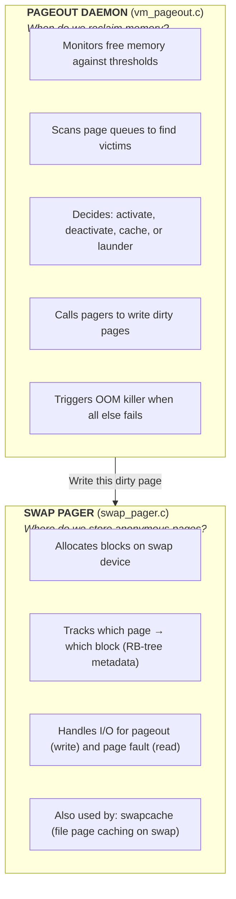

# Pageout and Swap

The pageout daemon manages memory reclamation when physical memory becomes scarce, while the swap pager provides backing store for anonymous memory. DragonFly BSD features dual pageout threads for deadlock recovery, a radix bitmap swap allocator, and aggressive RSS enforcement.

**Source files:** `sys/vm/vm_pageout.c` (~2,895 lines), `sys/vm/swap_pager.c` (~2,600 lines)

## Two Subsystems, One Goal

This document covers **two related but distinct subsystems**:



**When you need to understand:**
- Why the system is low on memory → Pageout daemon (thresholds, scanning)
- Why a process was OOM killed → Pageout daemon (OOM killer)
- Why swap I/O is slow → Swap pager (async limits, clustering)
- Why swap space is exhausted → Swap pager (allocation, hysteresis)

---

## Overview

When free memory falls below critical thresholds, the pageout daemon scans page queues to:

1. **Deactivate** referenced pages from active to inactive queue
2. **Launder** dirty pages by writing to backing store
3. **Free** clean pages to replenish the free pool
4. **Kill** processes when swap is exhausted (OOM)

The swap pager provides block storage for anonymous pages:

1. **Allocate** swap space using a radix bitmap allocator
2. **Track** swap assignments per-object in RB-tree metadata
3. **Page out** dirty pages with clustering and async I/O
4. **Page in** with burst reading for sequential access

## Pageout Daemon (vm_pageout.c)

### Dual Pageout Threads

DragonFly runs two pageout threads for deadlock recovery:

| Thread | Purpose |
|--------|---------|
| `pagedaemon` | Primary pageout daemon for all page types |
| `emergpager` | Emergency pager for swap-only pages when primary deadlocks |

The emergency pager activates when the primary daemon blocks on a vnode lock for more than 2 seconds. It only processes anonymous pages (`OBJT_DEFAULT`, `OBJT_SWAP`) to avoid the vnode deadlock.

### Memory Thresholds

The pageout daemon maintains several free memory thresholds, calculated from `v_free_min` in `vm_pageout_free_page_calc()`:

```
v_interrupt_free_min   Low-level allocation reserve (swap structures)
         ↓
v_pageout_free_min     Pageout daemon allocation reserve
         ↓
v_free_reserved        System allocation reserve
         ↓
v_free_min             Normal allocation minimum
         ↓
v_free_target          Target free pages (2x v_free_min)
         ↓
v_paging_wait          Start blocking allocators (3x v_free_min)
         ↓
v_paging_start         Begin paging to target1 (3.5x v_free_min)
         ↓
v_paging_target1       Aggressive paging target (4x v_free_min)
         ↓
v_paging_target2       Lazy paging target (5x v_free_min)
```

### Paging States

The daemon operates in three states:

| State | Behavior |
|-------|----------|
| `PAGING_IDLE` | No paging needed, daemon sleeps |
| `PAGING_TARGET1` | Aggressive paging toward `v_paging_target1` |
| `PAGING_TARGET2` | Lazy paging toward `v_paging_target2` |

State transitions prevent thrashing while ensuring responsiveness:

```
         shortage detected
IDLE ───────────────────────→ TARGET1
  ↑                              │
  │      target1 reached         ↓
  ←──────────────────────── TARGET2
        target2 reached
```

### Key Sysctls

| Sysctl | Default | Description |
|--------|---------|-------------|
| `vm.anonmem_decline` | ACT_DECLINE | Active→inactive rate for anon pages |
| `vm.filemem_decline` | ACT_DECLINE*2 | Active→inactive rate for file pages |
| `vm.max_launder` | physmem/256+16 | Max dirty pages to flush per pass |
| `vm.emerg_launder` | 100 | Emergency pager minimum launder |
| `vm.pageout_memuse_mode` | 2 | RSS enforcement (0=off, 1=passive, 2=active) |
| `vm.pageout_allow_active` | 1 | Allow scanning active queue |
| `vm.swap_enabled` | 1 | Enable swap pageouts |
| `vm.defer_swapspace_pageouts` | 0 | Prefer keeping dirty pages in memory |
| `vm.disable_swapspace_pageouts` | 0 | Completely disable swap writes |

### Queue Scanning

The daemon scans page queues in order: inactive → active → cache.

#### Inactive Queue Scan

`vm_pageout_scan_inactive()` processes candidates for reclamation:

1. Scan ~1/10 of queue per pass using per-queue markers
2. Calculate `max_launder` budget from `vm_max_launder`
3. For each page, call `vm_pageout_page()` for decision

**Per-page decision in `vm_pageout_page()`:**

```
Page state              Action
──────────────────────  ─────────────────────────────────
Wired                   Remove from queue
Held                    Requeue at tail
Referenced (pmap/flag)  Activate with boosted act_count
Invalid (valid==0)      Free directly
Clean (dirty==0)        Cache via vm_page_cache()
Dirty, first pass       Set PG_WINATCFLS, requeue (double-LRU)
Dirty, second pass      Attempt pageout via vm_pageout_clean_helper()
```

**Double-LRU for Dirty Pages:**

Dirty pages cycle through the inactive queue twice before laundering. The `PG_WINATCFLS` ("win at cache flush") flag tracks the first pass. This reduces unnecessary I/O for pages that may be freed or become clean naturally.

When `vm_pageout_memuse_mode >= 3`, single-LRU mode is used instead.

#### Active Queue Scan

`vm_pageout_scan_active()` moves pages to the inactive queue:

1. Scan ~1/10 of queue per iteration
2. Check page activity via `pmap_ts_referenced()` and `PG_REFERENCED`
3. Active pages: bump `act_count`, leave in active queue
4. Inactive pages: decrement `act_count`, deactivate when threshold reached

**Activity Decline Rates:**

- Anonymous pages decline at `vm_anonmem_decline` per pass
- File-backed pages decline at `vm_filemem_decline` (2x anon by default)

Faster file page decay implements the "scan resistance" principle—file scans shouldn't evict working set.

#### Cache Queue Scan

`vm_pageout_scan_cache()` frees clean cached pages:

- Uses two rovers (primary and emergency) to avoid contention
- Frees pages until `v_free_target` reached
- Stops early if target satisfied

### Page Clustering

`vm_pageout_clean_helper()` clusters dirty pages for efficient I/O:

1. Find clusterable neighbors (dirty, not wired/held, inactive or allowed-active)
2. Align cluster to `BLIST_MAX_ALLOC` for swap optimization
3. Set `PG_WINATCFLS` on cluster pages to match primary
4. Call `vm_pageout_flush()` for actual I/O

`vm_pageout_flush()` handles the write:

1. Mark pages read-only via `vm_page_protect()`
2. Clear pmap modified bits
3. Call `vm_pager_put_pages()` for I/O
4. Handle results and update page states

### RSS Enforcement

When `vm_pageout_memuse_mode >= 1`, the daemon enforces process RSS limits:

**`vm_pageout_map_deactivate_pages()`:**

1. Called for processes exceeding `RLIMIT_RSS`
2. Walks address space from `map->pgout_offset`
3. Scans each mapped page via `pmap_pgscan()`
4. Removes unreferenced pages from pmap
5. Deactivates unmapped pages, optionally launders dirty ones
6. Continues until RSS below limit

**RSS enforcement modes:**

| Mode | Behavior |
|------|----------|
| 0 | Disabled |
| 1 | Passive—enforce during memory pressure |
| 2 | Active—enforce proactively (default) |
| 3 | Active + single-LRU for dirty pages |

### OOM Killer

When swap exhausts and pages cannot be reclaimed:

1. Rate-limited to once per second
2. Scan all processes via `allproc_scan()`
3. Select victim with largest memory footprint
4. Skip: system processes, init (pid 1), low-pid processes with swap
5. Set `P_LOWMEMKILL` flag and call `killproc()`

**Victim size calculation:**
```c
size = vmspace_anonymous_count(vm) + vmspace_swap_count(vm)
```

### Main Loop

`vm_pageout_thread()` main loop:

```
Initialize markers, thresholds, swap pager

while (TRUE) {
    1. Sleep until vm_pages_needed or timeout
    2. Calculate avail_shortage from targets
    3. vm_pageout_scan_inactive() - launder/free pages
    4. Calculate inactive_shortage
    5. vm_pageout_scan_active() - feed inactive queue
    6. vm_pageout_scan_cache() - free cached pages
    7. Determine next state (IDLE/TARGET1/TARGET2)
    8. Wakeup memory waiters if appropriate
}
```

**Emergency pager differences:**

- Sleeps on `&vm_pagedaemon_uptime` instead of `&vm_pages_needed`
- Activates if primary hasn't updated uptime for 2+ seconds
- Only processes anonymous/swap pages
- Iterates queues in reverse direction

## Swap Pager (swap_pager.c)

### Architecture

The swap pager provides block storage for anonymous memory:

```
                     vm_object
                         │
                         ↓
              ┌──────────────────┐
              │   swblock_root   │  RB-tree of swap metadata
              │    (RB-tree)     │
              └────────┬─────────┘
                       │
         ┌─────────────┼─────────────┐
         ↓             ↓             ↓
    ┌─────────┐   ┌─────────┐   ┌─────────┐
    │ swblock │   │ swblock │   │ swblock │
    │ (16 pgs)│   │ (16 pgs)│   │ (16 pgs)│
    └────┬────┘   └────┬────┘   └────┬────┘
         │             │             │
         ↓             ↓             ↓
    ┌─────────────────────────────────────┐
    │          swapblist (blist)          │  Radix bitmap allocator
    │       Swap block allocation         │
    └─────────────────────────────────────┘
                       │
                       ↓
    ┌─────────────────────────────────────┐
    │         Swap devices (disks)        │
    └─────────────────────────────────────┘
```

### Key Data Structures

**struct swblock** - Swap metadata per 16-page range:

```c
struct swblock {
    RB_ENTRY(swblock) swb_entry;         /* RB-tree linkage */
    vm_pindex_t       swb_index;         /* Base page index (aligned) */
    int               swb_count;         /* Valid entries */
    swblk_t           swb_pages[SWAP_META_PAGES];  /* Block numbers (16) */
};
```

**Global state:**

```c
struct blist *swapblist;      /* Radix bitmap allocator */
int swap_pager_full;          /* Swap exhausted flag (triggers OOM) */
int swap_pager_almost_full;   /* Near exhaustion (with hysteresis) */
swblk_t vm_swap_anon_use;     /* Swap used for anonymous pages */
swblk_t vm_swap_cache_use;    /* Swap used for swapcache */
```

### Swap Space Allocation

**Radix bitmap (blist) allocator:**

The blist provides O(log n) allocation and deallocation with efficient fragmentation handling. Swap is allocated in contiguous runs when possible.

**`swp_pager_getswapspace(npages, object_type)`:**

1. Try `blist_allocat()` with iterator hint
2. Fall back to start of swap if hint fails
3. Update `vm_swap_anon_use` or `vm_swap_cache_use`
4. Set `swap_pager_full=2` on allocation failure

**Hysteresis thresholds:**

- `nswap_lowat` = 4% of total swap (minimum 128 pages)
- `nswap_hiwat` = 6% of total swap (minimum 512 pages)
- `swap_pager_almost_full` set when below lowat
- Cleared when above hiwat

### Swap I/O Limits

```c
nsw_rcount         = nswbuf_kva / 2   /* Read buffer limit */
nsw_wcount_sync    = nswbuf_kva / 4   /* Sync write limit */
nsw_wcount_async   = swap_async_max   /* Async write limit (default 4) */
nsw_cluster_max    = MAXPHYS / PAGE_SIZE  /* Max cluster size */
```

### Page-In (swap_pager_getpage)

**Burst reading for sequential access:**

1. If page already valid, switch to read-ahead only mode
2. Scan for contiguous swap blocks on same stripe
3. Allocate pages for burst (up to `swap_burst_read`)
4. Set `PG_RAM` on last page for pipeline continuation
5. Issue I/O and wait for `PBUSY_SWAPINPROG` to clear

**Read process:**

```
1. Verify object match
2. Look up swap block for requested page
3. Scan for contiguous swap blocks (same stripe)
4. Allocate pages for burst read
5. Map pages to KVA, issue I/O
6. Wait for completion
7. Return VM_PAGER_OK or VM_PAGER_ERROR
```

### Page-Out (swap_pager_putpages)

**Object conversion:**

First pageout converts `OBJT_DEFAULT` to `OBJT_SWAP`.

**Write process:**

1. Allocate swap blocks (fall back to smaller chunks on failure)
2. Validate stripe boundary, adjust if crossing
3. Build swap metadata entries
4. Issue I/O (async or sync based on flags)
5. For sync: wait and call completion handler directly

**Async throttling:**

- `nsw_wcount_async_max` controlled by `vm.swap_async_max`
- Prevents swap I/O from starving other disk I/O
- Non-pageout threads forced sync unless `swap_user_async=1`

### I/O Completion (swp_pager_async_iodone)

**Read success:**

1. Set `m->valid = VM_PAGE_BITS_ALL`
2. Clear dirty bits
3. Set `PG_SWAPPED` flag
4. Deactivate non-requested pages

**Read error:**

1. Set `m->valid = 0`
2. Deactivate non-requested pages
3. Leave requested page busy for caller

**Write success:**

1. Clear dirty bits (OBJT_SWAP only)
2. Set `PG_SWAPPED` flag
3. Deactivate if `vm_paging_severe()`
4. Try to cache if `SWBIO_TTC` flag

**Write error:**

1. Remove swap assignment
2. Re-dirty OBJT_SWAP pages (no other backing)
3. Activate page to prevent data loss
4. Don't dirty non-OBJT_SWAP (has vnode backing)

### Swap Metadata Management

**RB-tree operations:**

| Function | Purpose |
|----------|---------|
| `swp_pager_lookup()` | Find swblock by page index |
| `swp_pager_meta_build()` | Add/update swap entry |
| `swp_pager_meta_free()` | Free range of entries |
| `swp_pager_meta_free_all()` | Destroy all metadata |
| `swp_pager_meta_ctl()` | Control (free/pop) single entry |

**Metadata control flags:**

| Flag | Action |
|------|--------|
| `SWM_FREE` | Remove and free swap block |
| `SWM_POP` | Remove but keep block (for transfer) |

### Swapoff Support

`swap_pager_swapoff()` removes a device from use:

1. Scan all `OBJT_SWAP` and `OBJT_VNODE` objects
2. Skip `OBJ_NOPAGEIN` objects
3. Page in all blocks on target device
4. Return 1 if blocks remain (partial success)

### Key Sysctls

| Sysctl | Default | Description |
|--------|---------|-------------|
| `vm.swap_async_max` | 4 | Max concurrent async writes |
| `vm.swap_burst_read` | 16 | Pages to read-ahead on swap-in |
| `vm.swap_user_async` | 0 | Allow user async swap writes |

## DragonFly-Specific Features

### Dual Pageout Threads

The emergency pager (`emergpager`) provides deadlock recovery:

- Activates when primary daemon blocks on vnode for 2+ seconds
- Only processes anonymous pages to avoid the deadlock source
- Enables memory reclamation even during filesystem stalls

### Queue Distribution

Pageout work is distributed across 1024 sub-queues per major queue type:

- Each sub-queue has its own marker for incremental scanning
- `PQAVERAGE()` distributes work across queues
- Reduces lock contention on SMP systems

### Three-State Paging

The IDLE → TARGET1 → TARGET2 state machine:

- Prevents thrashing between paging and normal operation
- TARGET1 aggressive paging ensures quick recovery
- TARGET2 lazy paging maintains headroom without wasting I/O

### Radix Bitmap Allocator

The blist provides:

- O(log n) allocation and deallocation
- Efficient handling of fragmentation
- Scalability to arbitrary swap sizes
- Per-device stripe awareness

### RB-Tree Swap Metadata

Per-object swap tracking via RB-tree:

- 16 pages per swblock entry reduces overhead
- Efficient range operations for large frees
- Separate anon vs cache accounting

### KVABIO Support

Swap I/O uses KVABIO to avoid pmap synchronization:

- `pmap_qenter_noinval()` for mapping
- Reduces IPI overhead on SMP

### Stripe-Aware Clustering

I/O operations respect device stripe boundaries:

- `SWB_DMMASK` for boundary detection
- Prevents I/O from crossing stripes
- Optimizes disk access patterns

## Function Reference

### Pageout Daemon

| Function | Description |
|----------|-------------|
| `vm_pageout_thread()` | Main daemon loop |
| `vm_pageout_scan_inactive()` | Scan inactive queue |
| `vm_pageout_scan_active()` | Scan active queue |
| `vm_pageout_scan_cache()` | Scan cache queue |
| `vm_pageout_page()` | Per-page decision |
| `vm_pageout_clean_helper()` | Cluster and flush dirty pages |
| `vm_pageout_flush()` | Write pages to backing store |
| `vm_pageout_map_deactivate_pages()` | RSS enforcement |
| `pagedaemon_wakeup()` | Wake pageout daemon |

### Swap Pager

| Function | Description |
|----------|-------------|
| `swap_pager_getpage()` | Page in from swap |
| `swap_pager_putpages()` | Page out to swap |
| `swap_pager_haspage()` | Check for swap backing |
| `swap_pager_unswapped()` | Remove swap when dirtied |
| `swap_pager_freespace()` | Free swap range |
| `swap_pager_reserve()` | Pre-allocate swap |
| `swap_pager_copy()` | Transfer swap metadata |
| `swap_pager_swapoff()` | Remove device from use |
| `swp_pager_async_iodone()` | I/O completion handler |

## See Also

- [Physical Pages](vm_page.md) - Page allocation and queue management
- [VM Objects](vm_object.md) - Object lifecycle and page containers
- [Page Faults](vm_fault.md) - Fault handling and COW
- [Memory Management](../kern/memory.md) - kmalloc/objcache
